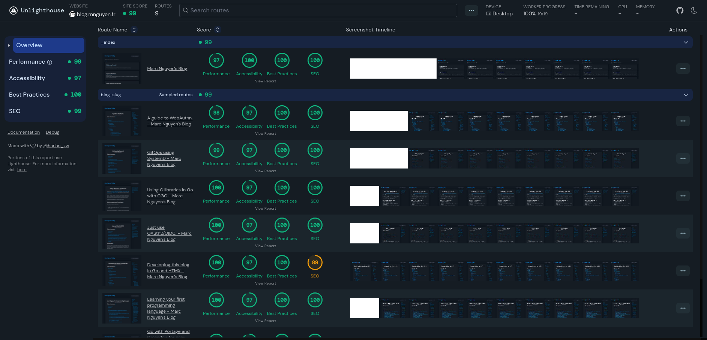
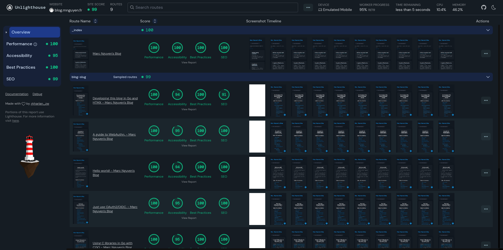

# A compile-time blog in Go and HTMX

A very simple example efficient blog in Go and HTMX.

## Features

- Code first, libraries second, framework nope.
- Server-side rendering with HTMX. Loads faster than these static websites (looking at you Hugo).
- Compile-time embedded assets and one binary (looking at you SSR frameworks, which does almost everything like a over-engineered fullstack application).
- PicoCSS cause I don't f- care about [style](https://motherfuckingwebsite.com).

## Lighthouse

Desktop:

Mobile:

## License

Under [Apache License](./LICENSE).
