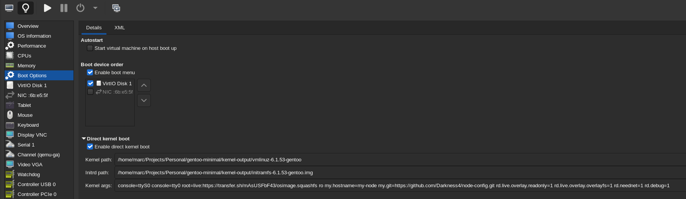

## Table of contents

<div class="toc">

\\{\\{ $.TOC }}

</div>

## Introduction

Imagine this scenario: you have hardware for which you are not authorized to use virtualization or containerization, as in the case of a Raspberry Pi cluster or an HPC (High-Performance Computing) cluster, because you want to use the full "bare-metal" performance.

No hypervisor like [Proxmox](https://www.proxmox.com/) to manage virtual machines and no container runtime like [containerd](https://containerd.io) to manage containers are allowed.

As a DevOps engineer, this might cause a small problem to your "Infrastructure as Code" (IaC), dear to your heart.

One solution would be to use a PXE server and Ansible to configure the infrastructure:

- The PXE server would provision the OS via network boot.
- Ansible would configure the state of the machine "postboot".

This would respect the IaC by making the infrastructure declarative, where the Ansible Playbook indicates the state of the infrastructure. Re-executing the Ansible playbook should reflect its state on the machine.

However, this approach has major drawbacks:

- If the server is **stateful** (the operating system is installed on a disk after network boot) and **side effects** such as "corrupted files" occur, a reboot will **not** clean up the server. The state of the server is therefore **dirty** and the only way to remedy it is to access the server via SSH, or to boot on a rescue operating system if SSH doesn't work. It's simply **unacceptable** as a DevOps to let such side-effects occur in an infrastructure. **Restarting a server should return it to an expected state.**
- If the server is **stateless** (the provisioned OS is a live OS) and **side effects** like "corrupted files" occur, a restart would clean up the server, but Ansible **must be manually re-executed**. This is simply **unmaintainable** and shows how Ansible and other push-based configuration software are not suitable for configuring bare-metal servers (and dare I say, even VMs).

These last years, "pull-based" IaC has shown a lot of benefits:

- Automatic bootstraping.
- Easy to scale.
- Credentials stored on the infrastructure side, and not on the developer side, enabling a zero-trust infrastructure.

Combined "pull-based" IaC with a Git repository, and we get **GitOps**.

So how do we achieve that? The answer: with stateless images and post-boot scripts.

This article will show and discuss from scratch, how to build, test, deploy a stateless OS image to a server.

## About the Linux boot process

Before delving into the process of creating a stateless OS image using SquashFS and booting it with a custom-built initramfs and kernel, it's essential to understand the fundamental Linux boot process.

When you power on a Linux-based system, the boot sequence initiates a defined series of steps:

1. **BIOS/UEFI Initialization**:
   - The system's BIOS or UEFI firmware performs hardware initialization and basic tests.
2. **Bootloader Execution**:
   - The bootloader (e.g., GRUB or iPXE) loads the Linux kernel into memory from the designated boot device.
3. **Kernel Initialization with Initramfs**:
   - The Linux kernel takes control and starts initializing critical system components.
   - If specified in the bootloader configuration, the kernel loads the initramfs into memory as an initial root filesystem.
   - **Initramfs Operations**:
     - Kernel executes scripts and commands from the initramfs to perform tasks like loading necessary kernel modules, configuring devices, or setting up encryption.
     - This temporary root filesystem provides a minimal environment to address complexities before transitioning to the real root filesystem.
     - **This is where we can download a stateless image from the network and mount it as root file-system using OverlayFS.**
4. **Root Filesystem Initalization**:
   - The init process (e.g, OpenRC or SystemD) is executed, becoming the parent of all user-space processes.
   - With the init process running, the system is fully functional and ready for user interaction.
   - Users can log in, start applications, and perform various tasks on the operational Linux operating system.

To summarize:

- We need to build a stateless image that can be used by the initramfs.
- We need to customize the initramfs, which may implies to customize the kernel to fetch kernel modules.

## Stateless images

There are a lot of ways to achieve a stateless image. I want to talk about the easiest method, which is by using a squashfs root filesystem image and by using dracut.

### OverlayFS

The idea is very similar to a Docker image. At runtime, the server is mounting two layers:

- The base image, also known as the "lower" file-system, which is read-only.
- The scratch file-system, also known as the "upper" file-system, which is writable. This layer is often non-persistent and is actually stored in the RAM.

Using [OverlayFS](https://wiki.archlinux.org/title/Overlay_filesystem), these two filesystems can be merged into one:

```shell
mount -t overlay overlay -olowerdir=/lower,upperdir=/upper /merged
```

In fact, this technology is used by [every container runtime](https://docs.docker.com/storage/storagedriver/overlayfs-driver/) to achieve replicable container.

To persist data, volumes are mounted at runtime using `fstab`.

### Building the SquashFS image

#### Install packages

First of all, to build an OS image, we can use any good package manager that allow different root destination ([`dnf`](https://dnf.readthedocs.io/en/latest/command_ref.html#:~:text=%2D%2Dinstallroot%3D%3Cpath%3E), [`debootstrap`](https://linux.die.net/man/8/debootstrap), portage...).

Let's say we want to create an optimized OS image with Portage, but we do not want any build dependencies. This is how we would do it:

```shell
# Create the destination directory
mkdir -p gentoo-minimal/
mkdir -p squash-output/
mkdir -p kernel-output/

# Use docker to make sure that it is not using the host OS.
# Beaware of the UIDs mapping when running rootless. It's better to run docker as root here.
sudo docker run --rm -it \
  -v "$(pwd)/gentoo-minimal/:/gentoo-minimal/" \
  -v "$(pwd)/squash-output/:/squash-output/" \
  -v "$(pwd)/kernel-output/:/kernel-output/" \
  docker.io/gentoo/stage3:amd64-openrc

```

```shell
## Inside the container, interactive mode
emerge --sync

# Install the packages. Note that @world indicates the packages in the container.
MAKEOPTS="-j12" \
CFLAGS="-O2 -pipe" \
CXXFLAGS="-O2 -pipe" \
FCFLAGS="-O2 -pipe" \
FFLAGS="-O2 -pipe" \
LDFLAGS="-Wl,--as-needed" \
ACCEPT_LICENSE="linux-fw-redistributable" \
ROOT="/gentoo-minimal" \
emerge \
  --with-bdeps=n \
  --exclude="sys-devel/*" \
  -v \
  app-admin/sudo \
  app-arch/zstd \
  app-shells/bash \
  dev-vcs/git \
  net-misc/dhcp \
  sys-apps/openrc \
  sys-apps/shadow \
  sys-apps/util-linux \
  sys-kernel/linux-firmware \
  @world
```

We can also use Packer, customize a virtual machine, and extract the root file-system in a directory from the QCOW disk by using `qemu-nbd`. However, I prefer to use the docker as it is more lightweight.

#### Add root password

While it may not be necessary to set a root password since we are using a post-boot script, it's better to hard-code a recovery root password that can be deleted by a postscript instead of doing the inverse.

```shell
chroot /gentoo-minimal

passwd
# Enter new password:
# Re-type new password:
# passwd: password updated successfully

exit
```

#### Post-boot script

After the OS is built, we want to customize the OS further to do a pull-based configuration. To do that, we can either install [cloud-init](https://cloudinit.readthedocs.io/en/latest/), or we can simply make an init service which pull the configuration:

**/gentoo-minimal/sbin/pull-config**

```shell
#!/bin/bash

# Set hostname based on the cmdline parameters
HOSTNAME="$(sed -E 's/^.*my.hostname=([^ ]*).*$/\1/' /proc/cmdline)"
echo "${HOSTNAME}" > /etc/hostname

# Pull configuration
GIT_REPO="$(sed -E '"'"'s/^.*my.git=([^ ]*).*$/\1/'"'"' /proc/cmdline)"
git clone "${GIT_REPO}" /node-config

# Run configuration
chmod +x /node-config/run.sh
/node-config/run.sh
```

**/gentoo-minimal/etc/init.d/pull-config**

```shell
#!/sbin/openrc-run
depend() {
    need net
}

command="/sbin/pull-config"
```

Don't forget to `chmod 700 /gentoo-minimal/sbin/pull-config && chmod +x /gentoo-minimal/etc/init.d/pull-config`.

Add the post-boot script to the boot services:

```shell
ln -sf /etc/init.d/pull-config /gentoo-minimal/etc/runlevels/default/pull-config
```

This postscript assumes two things:

1. We set the hostname by putting a custom parameter in the kernel cmdline parameters: `my.hostname=my-node`

2. We set the git repository URL by putting a custom parameter in the kernel cmdline parameters: `my.git=https://github.com/Darkness4/node-config.git`

3. The post-boot script inside the git repository is named `run.sh`. For the sake of the example, let's say the postscript is simply running:

   ```shell
   #!/bin/sh

   cat << EOF > /etc/motd
   ------------------------
   My super light OS.
   Hostname: $(hostname)
   ------------------------
   EOF
   ```

   We won't configure the `/etc/fstab` because we won't mount any volume.

   We won't configure the network because it's DHCP by default. In fact, DHCP is needed for network booting, as it is used to pass PXE server information to the PXE firmware of the server.

#### Building the kernel, install kernel modules, packing the kernel

Normally, we would install the kernel sources inside the image, compile it and install the kernel modules. However, to make the image light, we will compile the kernel outside the root file-system.

If we were to use `dnf` and `debootstrap`, we just have to install the `kernel` packages inside the root file-system and grab the kernel from the `/boot` directory.

Basically, if we want our OS image to be fully optimized, we have to compile the kernel manually:

```shell
## Still in the container in interactive mode
MAKEOPTS="-j12" \
CFLAGS="-O2 -pipe" \
CXXFLAGS="-O2 -pipe" \
FCFLAGS="-O2 -pipe" \
FFLAGS="-O2 -pipe" \
LDFLAGS="-Wl,--as-needed" \
USE="zstd" \
emerge -v \
  sys-fs/squashfs-tools \
  app-arch/zstd \
  sys-kernel/gentoo-sources

ln -sf /usr/src/linux-* /usr/src/linux

cd /usr/src/linux

make menuconfig
```

We will need to enable these kernel features for dracut:

```shell
-> File systems
  -> Overlay filesystem support (OVERLAY_FS [=m]) # <---
  -> Miscellaneous filesystems (MISC_FILESYSTEMS [=y])
    -> SquashFS 4.0 - Squashed file system support (SQUASHFS [=m]) # <---
      -> Include support for ZSTD compressed file systems (SQUASHFS_ZSTD [=y]) # <---
      -> Squashfs XATTR support (SQUASHFS_XATTR [=y]) # <---
```

(If it's your first time using `make menuconfig`, use `/` to search the keyword like `SQUASH`, and then press the number indicated in parentheses. `(1) -> SquashFS` means press <kbd>1</kbd>)

You can use [Fedora Kernel config](https://raw.githubusercontent.com/projg2/fedora-kernel-config-for-gentoo/6.5.2-gentoo/kernel-x86_64-fedora.config) to set sane defaults and use the [Gentoo handbook](https://wiki.gentoo.org/wiki/Handbook:AMD64/Installation/Kernel) to get the minimum configuration.

My [kernel config is available on GitHub](https://gist.github.com/Darkness4/d8e009bedd7c04db2a213c7913b5831e).

```shell
# make menuconfig # Configure the kernel manually
make -j$(nproc)
# After compiling the kernel, we need to install the kernel modules to `./gentoo-minimal/lib/modules/<kernel_release>`.
INSTALL_MOD_PATH="/gentoo-minimal" make modules_install
# Install kernel modules inside our container too
make modules_install
INSTALL_PATH="/kernel-output" make install
```

If everything goes well, the `./kernel-output` should contain the `vmlinuz-<kernel-ver>-gentoo` file, which is the kernel that will be used for network booting.

The `./gentoo-minimal/lib/modules/<kernel-ver>` should also be populated as well.

#### Packing the image with mksquashfs

Let's pack our OS image.

Let's make a squashfs. For the image to be compliant, we need to create the missing directories before squashing:

```shell
mkdir -p /gentoo-minimal/proc /gentoo-minimal/sys /gentoo-minimal/dev /gentoo-minimal/root
mksquashfs /gentoo-minimal /squash-output/osimage.squashfs -comp zstd -xattrs
```

Look at how light it is:

```shell
0accf79b9413 / # ls -lah /squash-output/
total 639M
drwxr-xr-x 2 root root   30 Sep 15 21:05 .
dr-xr-xr-x 1 root root  149 Sep 15 20:47 ..
-rw-r--r-- 1 root root 639M Sep 15 21:05 osimage.squashfs
```

### Building the initramfs with Dracut

[Dracut](https://wiki.gentoo.org/wiki/Dracut) is a tool used for creating the initial ramdisk (initramfs). The initramfs is a file system that is invoked during the early stage of the Linux boot process to load essential drivers, modules and tools to mount the root file system and complete the boot procedure.

With dracut, one of its key capabilities is the dmsquash-live dracut module, which allows the integration of compressed squashfs file systems into initramfs images. Combined with the livenet dracut module, it is possible to boot an OS by fetching the squashfs file system from the network, via HTTP, HTTPS, FTP, Torrent, or TFTP.

Let's install dracut and the dependencies of the dracut modules in out container first:

```shell
emerge -v sys-kernel/dracut net-misc/dhcp sys-fs/lvm2
```

Then we generate our initramfs:

```shell
for kv in /lib/modules/*; do
  kver=$(basename "${kv}")

  dracut \
    --compress zstd \
    --no-hostonly \
    --add "base dmsquash-live livenet kernel-modules" \
    --force "/kernel-output/initramfs-$kver.img" \
    "$kver"
done
```

If there are errors, read the logs carefully. It often indicates which executable or kernel module is missing to build an initramfs.

To use the initramfs, we must add these kernel parameters:

```shell
console=ttyS0 console=tty0 root=live:http://<my-http-server>.squashfs my.hostname=my-node my.git=https://github.com/Darkness4/node-config.git rd.live.overlay.readonly=1 rd.live.overlay.readonly=1 rd.live.overlay.overlayfs=1 rd.neednet=1 rd.debug=1
```

- `console=ttyS0` and `console=tty0`:
  - `console=ttyS0`: Specifies that the system should output console messages to the serial port (`ttyS0`).
  - `console=tty0`: Specifies that console messages should also be sent to the primary virtual terminal (`tty0`), typically the main monitor.
- `root=live:http://<my-http-server>.squashfs`:
  - `root=live`: Informs the kernel that the root file system is to be loaded from a special source, in this case, a live file system.
  - `http://<my-http-server>.squashfs`: Specifies the location of the root file system as an HTTP URL (`http://<my-http-server>.squashfs`). It suggests that the root file system is obtained via HTTP from the given server.
- `my.hostname=my-node`: Sets the hostname of the system to "my-node." This parameter allows to assign a custom hostname to the system during boot, as said earlier.
- `my.git=https://github.com/Darkness4/node-config.git rd.live.overlay.readonly=1 `: Sets the git repository for the post-boot script to execute.
- `rd.live.overlay.readonly=1`: Indicates that the live overlay (base image) should be mounted in read-only mode.
- `rd.live.overlay.overlayfs=1`: Specifies that the OverlayFS should be used for the live overlay, which allows for layered file system modifications in a live environment.
- `rd.neednet=1`: Indicates that the system requires network connectivity during the boot process. This is often used in live environments that rely on network resources.
- `rd.debug=1`: Specifies that the dracut process inside the initramfs should be more verbose.
- If we want to statically configure the network, we can add: `ip=<client-IP>:[<peer>]:<gateway-IP>:<netmask>:<client_hostname>:<interface>:{none|off|dhcp|on|any|dhcp6|auto6|ibft}[:[<dns1>][:<dns2>]]`. More info [about Dracut on the man pages](https://man7.org/linux/man-pages/man7/dracut.cmdline.7.html#:~:text=ip%3D%3Cclient%2DIP%3E%3A%5B%3Cpeer%3E%5D%3A%3Cgateway%2DIP%3E%3A%3Cnetmask%3E%3A%3Cclient_hostname%3E%3A%3Cinterface%3E%3A%7Bnone%7Coff%7Cdhcp%7Con%7Cany%7Cdhcp6%7Cauto6%7Cibft%7D%5B%3A%5B%3Cdns1%3E%5D%5B%3A%3Cdns2%3E%5D%5D).

### Testing Locally

To test locally, we can use a VM that is configured with [virt-manager](https://virt-manager.org) by using the direct kernel boot feature.



Aaand that's it! The VM is actually stateless. Each reboot will redownload the image, making the OS stateless.

For a better experience, it's better to have an HTTP server in the same network.

If you call `mount`, we can see:

```shell
mount
# /dev/loop0 on /run/rootfsbase type squashfs (ro,relatime,errors=continue)
# LiveOS_rootfs on / type overlay (rw,relatime,lowerdir=/run/rootfsbase,upperdir=/run/overlayfs,workdir=/run/ovlwork)
```

Which confirm that we are running on a live image!

Running `df -h`, we can see:

```shell
df -h
# Filesystem      Size  Used Avail Use% Mounted on
# devtmpfs         10M     0   10M   0% /dev
# tmpfs           980M     0  980M   0% /dev/shm
# tmpfs           980M  848K  979M   1% /run
# /dev/loop0      662M  662M     0 100% /run/rootfsbase
# LiveOS_rootfs   980M  848K  979M   1% /
# cgroup_root      10M     0   10M   0% /sys/fs/cgroup
```

We have 1G of memory reserved for the writable layer.

## Booting the OS with PXE

From this point on, this is standard network booting. We need to set up a DHCP, PXE and TFTP server to server our kernel, initrd and kernel cmdline parameters.

I will NOT describe in details how to do it, but this is the big steps:

- Configure the DHCP server to serve a PXE firmware. For example with dnsmasq and [iPXE](https://ipxe.org/download):

  ```shell
  #/etc/dnsmasq.conf
  #...

  # Enable the DHCP server
  dhcp-range=192.168.1.100,192.168.1.200,12h

  # Set the DHCP option to specify the boot filename (Here's iPXE as firmware)
  dhcp-boot=undionly.kpxe
  ```

- Configure the tftp server. For example with dnsmasq:

  ```shell
  #/etc/dnsmasq.conf
  #...

  # Enable TFTP and specify the root directory for TFTP
  enable-tftp
  tftp-root=/tftpboot
  ```

- Configure the PXE settings to send which kernel, initd and kernel arguments:

  ```shell
  #/tftpboot/pxelinux.cfg/default
  DEFAULT linux
  LABEL linux
      KERNEL vmlinuz-<kernel-ver>
      APPEND initrd=initramfs-<kernel-ver>.img console=ttyS0 console=tty0 root=live:http://<my-http-server>.squashfs my.hostname=my-node my.git=my.git=https://github.com/Darkness4/node-config.git rd.live.overlay.readonly=1 rd.live.overlay.overlayfs=1 rd.neednet=1 rd.debug=1

  ```

## Limitations

### OverlayFS limitations

Because we are already running on an OverlayFS, applications using OverlayFS like Podman/Docker won't be able to use the `overlay2` driver.

To solve this issue, either mount a volume or use another driver.

### NVIDIA drivers

If we have to install NVIDIA drivers, we need to compile the kernel inside the root file-system, then we can `emerge --with-bdeps=n nvidia-drivers`.

To lighten the image, make sure to not include `/boot` and `/usr/src/`.

### Privileges and host kernel

When building with docker, it is possible that the installation of the software depends on the host kernel/privileges. When this happens, I do not encourage to continue the installation of the software as this means the software tries to escape the sandbox.

If there is no other way, then you can do whatever you want with docker to solve the issue (mounting `cgroups`, `--privileges`, etc.).

## Conclusion

This is how I did it at my company to be able to serve stateless image to an HPC cluster. We used Rockylinux, Kickstart and Packer to build my squashfs OS image, built an initramfs with Dracut with `livenet` and `dmsquash-live` capabilities, and used [Grendel](https://github.com/deepsquare-io/grendel), an all-in-one tftp, dhcp and pxe server to provision our cluster.

To manage the servers, each server has a IPMI controller, and if one server has a dirty state, we only need to reboot the server to clean it.

Not only it is easier to manage, but it is replicable. We can use the same squashfs file for our entire infrastructure, then use Git to customize the infrastructure.

By separating the immutable OS components from user-specific data, we can achieve greater efficiency, security, and scalability in our systems.
