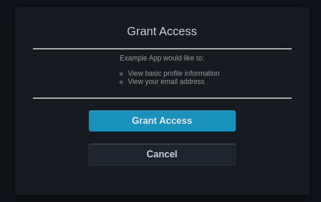

## Table of contents

<div class="toc">

\\{\\{ $.TOC }}

</div>

## Introduction

This article is about criticizing people reinventing the wheel, i.e., people who store user information in a database, built their own authentication flow, and make it hard to extend it. I will explain and show examples of OAuth2/OIDC implementations in details (step-by-step).

In 2020, I began to work on a project that I inherited it. It was a project about rendering a 3D map, which has user authentication (for some unknown reason decided by the client). My project was to make a mobile version with Unity and Android. I needed to:

1. Create a login page on Android.
2. Contact the API with the token to fetch data.

While this looked very simple, the project was using Symphony as the main web framework and, of course, the user authentication was "hand"-made and there was no public API. Now let me talk about what is Symphony (and similar frameworks) and what issues I encountered.

## A critique about "users in database" and example of monolithic

Symphony, Django, NestJS and similar frameworks are server-side web frameworks that simplify the development of MVC (model-view-controller) applications, or in other words, applications that use a database and user interactions (some frameworks also include an administration dashboard!).

You might say, "Hey, these are frameworks that already include ways of implementing user authentication, what's the problem?". Well, there are several:

1. **Coupled** as hell: That's right. Even though the framework is said to have weak coupling, user authentication is already coupled in the framework. Just look at the documentation ([Django](https://docs.djangoproject.com/en/latest/topics/auth/), [Symphony](https://symfony.com/doc/current/security.html), [NestJS](https://docs.nestjs.com/security/authentication)), why is "creating a user in the database" the first thing suggested?! What about using an identity provider? Do you think engineers can maintain a user database for that long? What happens if they need to extend the connection to a mobile app? What if someone wants to use the user database in another project? You guessed it: **Do it yourself**.
2. **Security**: CSRF? XSS protection ? SQL injection? Remember why PHP is notorious for being hacked? Why should **we** implement these models when the identity provider is the one responsible for this situation?
3. **Non-standard**: None of the three given framework implements authentication the same way. And I'm not even talking about two-factor authentication.

To me, these three points are indicative of future bad decisions. Because it is coupled, it isn't easy to extend. Because the security must be manually implemented, it's not maintainable. Because it's not standard, your skills are not exportable.

Sure, a good Django engineer may implement everything easily and rapidly. But what if the framework where to die? What if the framework was full of security hole? These frameworks **force** an engineer to **over-specialize**. You basically become a **framework** engineer, not a **software** engineer. You become "vendor"-locked.

Well you may say again: "It's easier to implement the user in the database, after all, it's just next to the data.". And that's simply not, let me show you.

## The existing standards for authentication

In 2006, some people said: "It sucks to have so many authentication services for each website. Hey, what if we were to implement a solution that delegate the authentication to one service?". Boom, [OAuth](https://oauth.net/about/introduction/). Of course, the road was much more complicated, but the reasoning was that. You can read more in the linked article.

Basically, for each website, you need to store your credentials and make sure that they do not expose the credentials to anyone else. Of course, that promise was certainly not [respected](https://haveibeenpwned.com).

There was also the issue of using third-party services: if someone were to create a service using a public API (for example Twitter), you would give your Twitter credentials to the third-party (which is an obvious no-no).

Overall, everything was resumed to one point: **Separation of Concerns**. The application needed to be separated from the authentication/authorization logic.

So what if we were to dedicate authentication to a service? Well, let's talk about the authorization logic.

<center>

```d2
shape: sequence_diagram
    OAuth2 Application -> Authorization Server -> User: 1. Ask for authorization.
    User -> OAuth2 Application: 2. Authorize application (code is given with specific URL). (/callback)
    OAuth2 Application -> Authorization Server: 3. Check code.
    Authorization Server -> OAuth2 Application: 4. Returns Access Token.
    OAuth2 Application -> API: 5. Authenticated request.
```

</center>

And, the authentication flow with OAuth2 is the following:

1. The **application** (front-end/oauth2 client/user's browser) requests authorization to access resources from the **user** (also known as resource owner). (The authorization page is hosted on the OAuth2 Authorization Server, but it is the user that initiates the grant).

   <center>

   

   _(example with Dex, an OAuth2 provider)_

   </center>

2. After granting, the **application** redirects the user to the **Authorization Server** (OAuth 2.0).

3. The **Authorization Server** performs user authentication (by checking a code, token,etc.), and if successful, it issues an **access token** (OAuth 2.0).

4. The **application** receives the token and use it to make authenticated requests by the user.

5. The **application** can use the access token to access protected resources on the **Resource Server** (APIs).

With this architecture, we can delegate the access to a service like GitHub Auth, or Google Auth (the famous "Login with ..."). But that's not enough too, some APIs may need the _identity_ of a user. Some services like GitHub publishes an API endpoint to fetches the user's information (`/user`), but it would be better if the OAuth2 provider could also give basic information of the user (like user ID, username, email, ...). To solve this issue, the OpenID Connect protocol, a.k.a. OIDC, was developed.

OpenID Connect is a protocol on top of OAuth2 which standardize fetching user information, allowing **authentication** and **authorization** at the same time by adding an ID token in the authentication flow.

If we take the OAuth2 flow and were to add OIDC capabilities, the step 3, 4 and 5 would be modified:

3. The **Authorization Server** performs user authentication (by checking a code, token, etc.), and if successful, it issues an **access token** (OAuth 2.0) and **ID** token.
4. The **application** receives the token and use the ID token to authenticate the user and retrieve basic profile information.
5. The **application** can use the access token to access protected resources on the **Resource Server** (APIs).

"Seems more complex than implementing your own authentication service with a framework"? Well, the flow certainly is. But there are already solutions that have implemented **everything** for you.

From a managed solution like [Okta](https://www.okta.com), [Auth0](https://auth0.com) or [Firebase Auth](https://firebase.google.com/docs/auth), to a self-hosted solution like [Dex](https://github.com/dexidp/dex), [Keycloak](https://www.keycloak.org), [Zitadel](https://zitadel.com), they've managed to implement user federations, multiple third-party Identity Provider, and most importantly, a login page with the full flow implemented. That's called **Single-Sign On (SSO)**, baby!

## Hands-on example: One OIDC provider with Google Auth+OIDC with Go

To better convince you to NOT implement your own authentication service when you can use one existing service, let me show you how to implements OIDC. Remember why we are doing this: **we do not want our app to store the user credentials. We delegate the user credentials to another service.**

This example represents the type of services that are public (accessible to all), i.e. customers-facing.

As an example, let's use Google Auth with OIDC! An [official guide on OIDC is available on Google](https://developers.google.com/identity/openid-connect/openid-connect).

To develop an OAuth2 application, you need a client ID, a client secret and information about the authorization endpoints. Since we use OIDC, we can use the [discovery document](https://accounts.google.com/.well-known/openid-configuration) to gather the information about the authorization endpoints.

1. Start by [creating a Google Project](https://console.cloud.google.com/projectcreate). OAuth2 is free of charge and does not apply for the [Identity Platform pricing](https://cloud.google.com/identity-platform/pricing) (which is a different [product](https://cloud.google.com/identity-platform) similar to Firebase Auth or Dex, i.e, this is a managed service for multiple OIDC providers).

2. Go to the [credentials](https://console.developers.google.com/apis/credentials) page and create an OAuth2 credential.

   1. You will need to configure the OAuth authorization grant page. Just set to **external** and your email address.

   2. For the app, the most important part is to add a redirect URL. **This is the callback URL of your application.** Since we work locally, we set it to `http://localhost:3000/callback`. In production, this is the public endpoint accessible by the users, e.g, `https://example.com/callback`.

   3. After creating the app, store the OIDC Issuer, client ID and secret in a `.env`:

      ```shell
      CLIENT_SECRET=GOCSPX-0123456789abcdefghijklmnopqr
      CLIENT_ID=123456789012-0123456789abcdefghijklmnopqrstuv.apps.googleusercontent.com
      OIDC_ISSUER=https://accounts.google.com
      # Points to: https://accounts.google.com/.well-known/openid-configuration
      ```

3. Let's do our simple server. We will use the `github.com/coreos/go-oidc` package which parses the discovery document and already integrates a `Verify` function to check the ID token. For best practices, we also need to verify a CSRF token.

   Let's load the environment variables and run a simple server with CSRF protection:

   ```go
   package main

   import (
   	"context"
   	"encoding/json"
   	"fmt"
   	"log"
   	"log/slog"
   	"net/http"
   	"net/url"
   	"os"
   	"time"

   	"github.com/coreos/go-oidc/v3/oidc"
   	"github.com/golang-jwt/jwt/v5"
   	"github.com/gorilla/csrf"
   	"github.com/joho/godotenv"
   	"golang.org/x/oauth2"
   )

   func main() {
   	_ = godotenv.Load()
   	ctx := context.Background()
   	redirectURL := "http://localhost:3000/callback"
   	listenAddress := ":3000"
   	oidcIssuerURL := os.Getenv("OIDC_ISSUER")
   	clientSecret := os.Getenv("CLIENT_SECRET")
   	clientID := os.Getenv("CLIENT_ID")

       // TODO: load OIDC and OAuth2

   	csrfKey := []byte("random-secret")
   	slog.Info("listening", slog.String("address", listenAddress))
   	if err := http.ListenAndServe(listenAddress, csrf.Protect(csrfKey)(http.DefaultServeMux)); err != nil {
   		log.Fatal(err)
   	}
   }
   ```

4. Load the OIDC and OAuth2 configuration:

   ```go
   	// ... env loading
   	// Fetch and parse the discovery document
   	provider, err := oidc.NewProvider(ctx, oidcIssuerURL)
   	if err != nil {
   		panic(err)
   	}

   	// Initialize OAuth2
   	oauth2Config := oauth2.Config{
   		ClientID:     clientID,
   		ClientSecret: clientSecret,
   		RedirectURL:  redirectURL,

   		// Discovery returns the OAuth2 endpoints.
   		Endpoint: provider.Endpoint(),

   		// "openid" is a required scope for OpenID Connect flows.
   		Scopes: []string{oidc.ScopeOpenID, "profile", "email"},
   	}

   	// TODO: write handlers

   	// server serve
   ```

5. Let's write the `/login` handlers which redirects to the OAuth2 login page:

   ```go
   	// Login page
   	http.HandleFunc("/login", func(w http.ResponseWriter, r *http.Request) {
   		// Fetch csrf
   		token := csrf.Token(r)
   		cookie := &http.Cookie{
   			Name:     "csrf_token",
   			Value:    token,
   			Expires:  time.Now().Add(1 * time.Minute), // Set expiration time as needed
   			HttpOnly: true,
   		}
   		http.SetCookie(w, cookie)

   		// Redirect to authorization grant page
   		http.Redirect(w, r, oauth2Config.AuthCodeURL(token), http.StatusFound)
   	})

   	// TODO: /callback handler
   ```

6. Let's now write the `/callback` handler, which happens after the user grant our OAuth2 application to access to user information:

   ```go
   package main

   import (
   	"context"
   	"encoding/json"
   	"fmt"
   	"log"
   	"log/slog"
   	"net/http"
   	"net/url"
   	"os"
   	"time"

   	"github.com/coreos/go-oidc/v3/oidc"
   	"github.com/golang-jwt/jwt/v5"
   	"github.com/gorilla/csrf"
   	"github.com/joho/godotenv"
   	"golang.org/x/oauth2"
   )

   type OIDCClaims struct {
   	jwt.RegisteredClaims
   	Name  string `json:"name"`
   	Email string `json:"email"`
   }

   func main() {
       // ...
   	// Callback: check code with OAuth2 authorization server
   	http.HandleFunc("/callback", func(w http.ResponseWriter, r *http.Request) {
   		// Fetch code
   		val, err := url.ParseQuery(r.URL.RawQuery)
   		if err != nil {
   			http.Error(w, err.Error(), http.StatusInternalServerError)
   			return
   		}
   		code := val.Get("code")

   		// Check CSRF
   		csrfToken := val.Get("state")
   		expectedCSRF, err := r.Cookie("csrf_token")
   		if err == http.ErrNoCookie {
   			http.Error(w, "no csrf cookie error", http.StatusUnauthorized)
   			return
   		}
   		if csrfToken != expectedCSRF.Value {
   			http.Error(w, "csrf error", http.StatusUnauthorized)
   			return
   		}

   		// Fetch accessToken
   		oauth2Token, err := oauth2Config.Exchange(r.Context(), code)
   		if err != nil {
   			http.Error(w, err.Error(), http.StatusUnauthorized)
   			return
   		}

   		// Fetch id token and authenticate
   		rawIDToken, ok := oauth2Token.Extra("id_token").(string)
   		if !ok {
   			http.Error(w, "missing ID token", http.StatusUnauthorized)
   			return
   		}

   		idToken, err := provider.VerifierContext(
   			r.Context(),
   			&oidc.Config{
   				ClientID: clientID,
   			}).Verify(ctx, rawIDToken)
   		if err != nil {
   			http.Error(w, err.Error(), http.StatusUnauthorized)
   			return
   		}

   		claims := OIDCClaims{}
   		if err := idToken.Claims(&claims); err != nil {
   			http.Error(w, err.Error(), http.StatusUnauthorized)
   			return
   		}

   		// Do something with access token and id token (store as session cookie, make API calls, redirect to user profile...). Your user is now authenticated.
   		idTokenJSON, _ := json.MarshalIndent(claims, "", "  ")
   		fmt.Fprintf(
   			w,
   			"Access Token: %s\nDecoded ID Token: %s\n",
   			oauth2Token.AccessToken,
   			idTokenJSON,
   		)
   	})
       // ...
   ```

And that's should be it! We've used a library, but we can also do it with bare HTTP requests. For now, let's just use the `go-oidc` package. Similar libraries already exist for OIDC ([Auth.js](https://authjs.dev), [AppAuth-Android](https://github.com/openid/AppAuth-Android), ...) though I prefer to implements manually since everything is standard.

Run the server (`go run ./main.go`) and go to the login page ([http://localhost:3000/login](http://localhost:3000/login)) and see the Google OAuth2 grant page!

Now that we have an example running, there is one issue: we support only one authentication service. What if the user what to log in with GitHub instead of Google? Sure we can try to add a list of providers, but GitHub doesn't support OIDC! We cannot handle every edge case of every identity providers. **We have to use an OIDC provider that connects to multiple providers.**

That's why Firebase Auth, Google Identity Platform, Auth0, Okta, Dex and Keycloak exists. They are services that allow multiple identity providers and aggregate them into one unique endpoint.

## Second example: Multiple providers in one with Dex+OIDC with Go

This time, to truly delegate the authentication part, we have to self-host a federated identity provider like Keycloak, Zitadel or Dex. We can also use a managed solution, like Firebase Auth.

Let's use Dex, a free, open source, lightweight solution to federated identity provider. Dex is an OIDC provider that facilitates authentication and identity management for applications by acting as an identity broker and supporting various authentication backends.

That's right, with OIDC, you can make proxies. After all, OIDC is all about delegation. So you can delegate authentication to a proxy that delegates to another OIDC provider.

Let's use Dex, our OIDC provider, which will delegate authentication to Google or GitHub, depending on the user's choice:

1. Create a configuration file `dex/config.yaml` with:

   ```yaml
   ## This is us! The dex server!
   issuer: http://localhost:5556

   ## Endpoints configuration
   web:
     http: 0.0.0.0:5556

   telemetry:
     http: 0.0.0.0:5558

   grpc:
     addr: 0.0.0.0:5557

   ## Dex state, contains the users' login state.
   storage:
     type: memory

   frontend:
     theme: dark

   ## Our go application. This is a whitelist basically.
   staticClients:
     - id: example-app # client ID
       redirectURIs:
         - 'http://localhost:3000/callback'
       name: 'Example App'
       secret: ZXhhbXBsZS1hcHAtc2VjcmV0 # client Secret
       #secretEnv: SECRET_ENV_NAME # Use 'secretEnv' instead of 'secret' to read environment variable instead of hard-coding.

   ## The connectors!
   connectors:
     - type: oidc
       id: google
       name: Google
       config:
         # URL to the OIDC Issuer
         issuer: https://accounts.google.com
         # Connector config values starting with a "$" will read from the environment.
         clientID: $GOOGLE_CLIENT_ID
         clientSecret: $GOOGLE_CLIENT_SECRET
         # Dex's issuer URL + "/callback"
         redirectURI: http://localhost:5556/callback
     - type: github
       id: github
       name: GitHub
       config:
         # Connector config values starting with a "$" will read from the environment.
         clientID: $GITHUB_CLIENT_ID
         clientSecret: $GITHUB_CLIENT_SECRET
         # Dex's issuer URL + "/callback"
         redirectURI: http://localhost:5556/callback

   ## Enable self-hosted users. We've disabled that since our database is in-memory.
   enablePasswordDB: false
   ```

2. Create an [OAuth2 application](https://docs.github.com/en/apps/oauth-apps/building-oauth-apps/creating-an-oauth-app) on GitHub, set the redirect URI to `http://localhost:5556/callback`, and fetch the client ID and client Secret.

3. Edit the OAuth2 application on Google and add the redirect URI to `http://localhost:5556/callback`.

4. Create a `dex/.env` file which will be used for Dex:

   ```shell
   GOOGLE_CLIENT_SECRET=GOCSPX-0123456789abcdefghijklmnopqr
   GOOGLE_CLIENT_ID=123456789012-0123456789abcdefghijklmnopqrstuv.apps.googleusercontent.com
   GITHUB_CLIENT_ID=01234567890123456789
   GITHUB_CLIENT_SECRET=0123456789abcdefghijklmnopqrstuv
   ```

5. Create a `dex/run.sh` file with:

   ```shell
   #!/bin/sh

   docker run --rm -it \
     --env-file "$(pwd)/.env" \
     -p 5556:5556 \
     -p 5557:5557 \
     -p 5558:5558 \
     --user 1000:1000 \
     -v "$(pwd)/config.yaml:/config/config.yaml:ro" \
     --name dex \
     ghcr.io/dexidp/dex:v2.37.0-distroless \
     dex serve /config/config.yaml
   ```

   Run it (`chmod +x run.sh && ./run.sh`).

Now let's modify the `.env` of the previous example:

```shell
#.env
CLIENT_ID=example-app
CLIENT_SECRET=ZXhhbXBsZS1hcHAtc2VjcmV0
OIDC_ISSUER=http://localhost:5556
```

And re-run the example `go run ./main.go`. And go to the login page: [http://localhost:3000/login](http://localhost:3000/login). You should be redirected to `http://localhost:5556/auth`, which is our OIDC provider.

<center>


</center>

And now, you can log in to multiple providers! The login page is also delegated, so we've barely changed anything!

Dex is almost stateless compared to the others solutions like Keycloak. This is why it is quite lightweight (20 MB only!). It doesn't really have a dedicated user store. If we want to store a user, we have to use an LDAP server (I recommend 389ds) or enable `enablePasswordDB` which I wouldn't recommend because you would couple a OIDC portal with a user store.

## Third example: Fully self-hosted with 389ds+Dex+OIDC with Go

**Note: Dex does NOT offer a sign-up (self-registration) page for LDAP. Use Keycloak or maybe Zitadel as an alternative.**

If you work in a company, most of the time, you want to self-host your own user store. The "best" user store is often an Active Directory (AD) because of its flexibility to be able to plug onto anything like being able to synchronize Linux/Windows users from the AD.

There are a **lot** of solution to host an active directory. But I recommend only one: **389ds**. Before I explain, let me explain LDAP.

Lightweight Directory Access Protocol is a protocol to store/find/manage users information. It's a **very** old protocol used for telecommunication. The latest version, LDAPv3, was published in 1998! To host an LDAP server, there is OpenLDAP, but managing it is a hellish experience. Example of usage:

```shell
cat << 'EOF' >> user.ldif
dn: uid=johndoe,ou=people,dc=example,dc=com
objectClass: top
objectClass: person
objectClass: organizationalPerson
objectClass: inetOrgPerson
uid: johndoe
cn: John Doe
sn: Doe
givenName: John
mail: johndoe@example.com
userPassword: {SSHA}hashed_password
EOF

ldapadd -x -D "cn=admin,dc=example,dc=com" -W -f user.ldif
```

This is quite complicated for nothing and you need to read the documentation often to be able to write LDIF files, which sucks when an incident occurs. Instead of using OpenLDAP, I recommend **389ds** because it includes a CLI which allows quick commands. Example:

```shell
dsidm create user --container "ou=people,dc=example,dc=com" --uid johndoe --cn "John Doe" --sn Doe --givenName John --mail johndoe@example.com --userPassword secretPassword
```

There is also FreeIPA, but it is a full-blown solution which also contains a DNS server, and is therefore difficult to containerize and maintain.

Let's just use 389ds for now:

1. Create a `389ds/.env`:

   ```shell
   DS_DM_PASSWORD=rootpassword
   DS_SUFFIX_NAME=dc=example,dc=com
   DS_ERRORLOG_LEVEL=256
   DS_MEMORY_PERCENTAGE=25
   DS_REINDEX=False
   ```

   The suffix represents the main directory. Users will be stored at `ou=people,<suffix>`.

2. Create a `389ds/run.sh`:

   ```shell
   #!/bin/sh

   # Create volume for data
   docker volume create 389ds_data

   docker run --rm -it \
     --env-file "$(pwd)/.env" \
     -p 3389:3389 \
     -v "389ds_data:/data" \
     --name 389ds \
     docker.io/389ds/dirsrv:latest

   ```

3. Run the script: `chmod +x run.sh && ./run.sh`.

4. Enter the shell:

   ```shell
   docker exec -it 389ds bash
   ```

5. And run the initialization commands:

   ```shell
   dsconf localhost backend create --suffix dc=example,dc=com --be-name example_backend # Create a backend (a backend is literally a database)
   dsidm localhost initialise # Creates examples
   # Create a user
   dsidm -b "dc=example,dc=com" localhost user create \
     --uid example-user \
     --cn example-user \
     --displayName example-user \
     --homeDirectory "/dev/shm" \
     --uidNumber -1 \
     --gidNumber -1
   # Set a user password:
   dsidm -b "dc=example,dc=com" localhost user modify \
     example-user add:userPassword:"...."
   dsidm -b "dc=example,dc=com" localhost user modify \
     example-user add:mail:example-user@example.com
   ```

6. Test with [ApacheDirectoryStudio](https://directory.apache.org/studio/) or with the LDAP tools:

   ```shell
   ldapsearch -x -H ldap://localhost:3389 -b "ou=people,dc=example,dc=com"
   # -x: Simple authentication
   # -H: LDAP URL
   # -b: Search base
   ```

   For groups:

   ```shell
   ldapsearch -x -H ldap://localhost:3389 -b "ou=groups,dc=example,dc=com"
   ```

Now, let's reconfigure Dex to supports our LDAP server:

```yaml
#config.yaml
#...
connectors:
  - type: ldap
    id: ldap
    name: LDAP
    config:
      host: <your-host-IP>:3389 # EDIT THIS. If you use docker-compose with root, you can set a domain name.
      insecureNoSSL: true
      userSearch:
        baseDN: ou=people,dc=example,dc=com
        username: uid
        idAttr: uid
        emailAttr: mail
        nameAttr: cn
        preferredUsernameAttr: uid
      groupSearch:
        baseDN: ou=groups,dc=example,dc=com
        userMatchers:
          - userAttr: uid
            groupAttr: member
        nameAttr: cn
```

Now let's login at [http://localhost:3000/login](http://localhost:3000/login):

<center>


</center>

And you can enter the `example-user` credentials. Do note that Dex does not offer a Sign-Up (self-registration) page, the only way to add a user is to do what we did earlier:

```shell
docker exec -it 389ds bash
# In the container:
# Create a user
dsidm -b "dc=example,dc=com" localhost user create \
  --uid example-user \
  --cn example-user \
  --displayName example-user \
  --homeDirectory "/dev/shm" \
  --uidNumber -1 \
  --gidNumber 1600
# Set a user password:
dsidm -b "dc=example,dc=com" localhost user modify \
  example-user add:userPassword:"...."
dsidm -b "dc=example,dc=com" localhost user modify \
  example-user add:mail:example-user@example.com
```

You can use [Keycloak](https://www.keycloak.org/docs/latest/server_admin/#_user-storage-federation) or [Zitadel](https://zitadel.com/docs/guides/integrate/identity-providers/ldap) which are solutions that are waaayyy larger but offer self-registration.

## Conclusion

Remember my project? Well, for two months I built my own OAuth2 server when I could have simply exported the authentication layer to Firebase Auth. But the client was _"Don't use another service, just use the one given"_, which I did. I developed the Android app with a working authentication page. Everything was homemade, including all protections (CSRF, XSS, user input validation, password validation, ...), except for modern protections (2FA, password-less, biometrics, ...). Not my f- job.

The project lasted only 6 months (fixed-term contract) and was abandoned 2 months later, probably because nobody could maintain such a project (not only because of the authentication layer, but also other technical aspects of the projects that I won't talk about). I really hated this project, with a stupid client who only had short-term vision and obsolete technical knowledge. You should **NEVER** develop software based solely on what you know, you should always compare **new technologies** with existing technologies, especially if the new technology becomes the norm. There's a difference between working in an innovative environment like 3D, where you can allow yourself the use of cutting-edge technologies like VR, versus an established environment like authentication, where OAuth2 may be young but became a standard.

**Never ignore young technologies that spread like fire.**

_(OAuth2 is not even that young.)_

I can do another article explaining why migrating/refactoring to new technologies is vital to the maintainability of a project, but not in this one. (There are a lot of reasons, but I would say the main reason is job opportunities.)

In conclusion, just use OAuth2 and OpenID Connect. Throw away the "home-made" solution, especially if implementing OAuth2 is just implementing two handlers and handling an access token. Use Firebase Auth if you can't self-host an LDAP with Keycloak, there is even [libraries for it](https://firebase.google.com/docs/auth).

Next step is OAuth2.1 with PKCE, by the way. Don't miss it.

Bonus: If you are also asking: "Yeah, but it's harder to handle roles, now", maybe you forgot that Role-Based Access Control (RBAC) is simply about matching a user ID with a Role. Relationship is Many-to-Many, deal with it.
