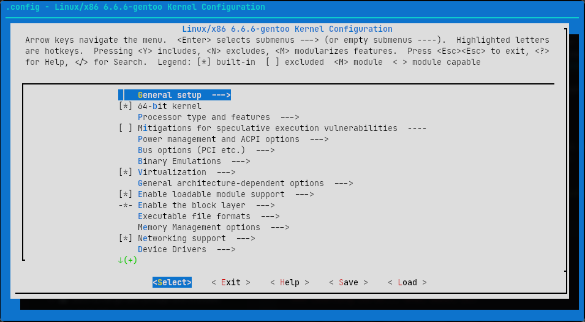
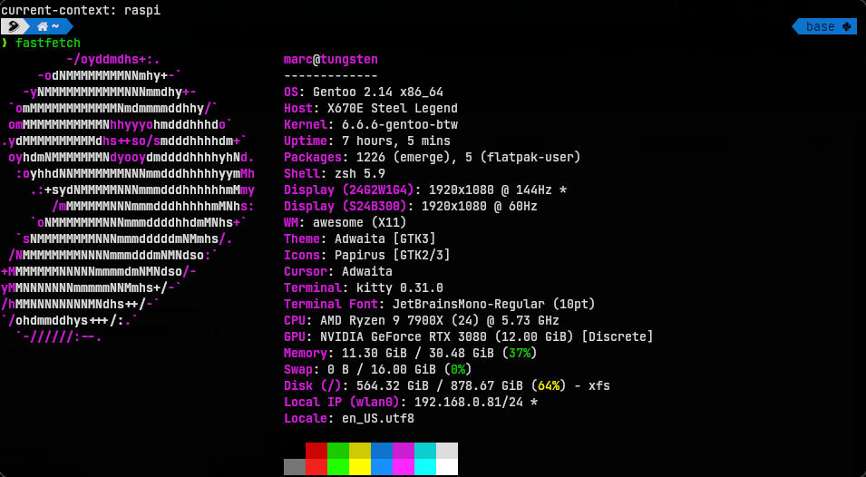

## Table of contents

<div class="toc">

\\{\\{ $.TOC }}

</div>

<hr>

## Introduction

Since this is a review, let me share my Linux experience before talking about Gentoo Linux.

In the following order, I tried:

- [Ubuntu](https://ubuntu.com/), as my first OS installed by my big brother. Used frequently in 2012. Didn't know anything about the "insides" of Linux. I just installed Linux games through the Ubuntu software center and played flash games. Switched to Windows two years after that. Was a great experience, but couldn't play good games on Linux at the time (even with Wine).
- [Kali Linux](https://www.kali.org) in 2018, installed by myself as a script kiddy (literally) on my new gaming desktop. Worked surprisingly well and learn some stuff about hacking and programming. Still didn't learn the internals of Linux (kernel, bootloader, etc...). Used at school.
- [MX Linux](https://mxlinux.org) in 2020. Was great, but feels off, like the system was bloated (even if Kali was even more bloated).
- [Debian](https://www.debian.org) in the same year, cleaned everything, started learning Linux seriously. Since it was my first year at engineering school, I've learned C programming (with syscalls and stuff), which means I understood what a software is, and what a library is. It was the OS I used the most, but I had to switch to the unstable branch of Debian.
- [Fedora](https://fedoraproject.org) in 2023 on my new gaming/work desktop which was a computer built by myself. The experience was reaaaally smooth and the best, especially since I've had an NVIDIA card and proprietary drivers for Wi-Fi and Ethernet. It's probably the first OS that I would recommend for new users.

Let's talk about Fedora, the last operating system I used and the context in which I find myself in 2023. In 2023, I've started remote working for a startup. I'm doing Software Development for Web3, HPC and DevOps, which means this includes:

- Programming from low level to high level for work.
- Forking projects and installing it to test it locally.
- Lot of windows with lots of SSH connections and documentation alongside.
- Self-hosted Kubernetes.

Outside of work, that includes:

- Gaming.
- Testing open-source projects and contributing to it.
- Recreational programming from hackathon to simply start new projects.
- Youtube, movies and anime. A bit of streaming for a remote cinema between friends (via Secure Reliable Transport, yo!).

Which adds constraints:

- Difficult dependency management with the libraries: always the latest, no instability allowed, full customization and easy repair.
- Have to install a lot of software inside `/usr/local`.
- Having to compile everything by hand.

Which leads me to switch to Gentoo in the same year. This is all so that I can do programming and troubleshooting **in peace**: having full control over what is installed and what is running. F- SystemD (why the f- do you handle DNS?!). F- Debian for pushing patches too slowly (even on unstable).

At the same time, to be able to compare Gentoo Linux with a rolling release binary OS, I've installed Void Linux on my laptop.

## A small review of Void Linux, a SystemD-less binary OS

I used Void Linux for a very short time, but it was enough to tell me it is not good.

I know some people may say that the packing ecosystem of Void Linux is more "healthy", but the packaging software sucks hard.

One reason: `xbps-src`. If you need a package that is restricted like the Vivaldi web browser, you have to bootstrap yourself. This is simply not a great UX. I mean, what if you forget about it? I'm having trash installed all over the place! This is like my old polluted `Projects/BuildZone` folder that I've had on my old OS, what the hell.

Could be great for Raspberry Pi, but not for a development and gaming desktop.

## The review of Gentoo Linux

### Installation Review

You've come to read my propaganda, great. Let's start with the installation.

The [Gentoo Handbook](https://wiki.gentoo.org/wiki/Handbook:AMD64) tells everything a person need to know to install Gentoo Linux. And none of these steps has caused major issues. I've used the binary kernel the first time, and trimmed it [later](#about-kernel-configuration).

You can also use any bootable Linux OS to install Gentoo Linux. I've personally used the Void Linux installation ISO since it's only ~600MB, and it has a package manager so that I can install missing tools. (Like I said, Void is still great for small devices, thanks to its small rootfs).

To summarize my installation:

- Used `cfdisk` to partition my disk and `mkfs.xfs` for the file-system.
- Installed Stage3 OpenRC with Multilib by extracting the `starge3-[...].tar.gz`.
- Configured my `/etc/portage/make.conf`. This is my actual `make.conf`:

  ```shell
  CC="gcc"
  CXX="g++"

  AR="${CHOST}-ar"
  NM="${CHOST}-nm"
  RANLIB="${CHOST}-ranlib"

  COMMON_FLAGS="-march=native -O2 -pipe"
  CFLAGS="${COMMON_FLAGS}"
  CXXFLAGS="${COMMON_FLAGS}"
  FCFLAGS="${COMMON_FLAGS}"
  FFLAGS="${COMMON_FLAGS}"
  LDFLAGS="-Wl,--as-needed"
  RUSTFLAGS="-C target-cpu=native"

  LC_MESSAGES=C
  MAKEOPTS="-j12"

  USE="-telemetry -networkmanager -oss -qt5 -kde -systemd -networkmanager -wayland qt6 bluetooth gtk X pulseaudio dbus pipewire gles gles2 elogind proprietary-codecs pam xorg truetype udisks jpeg png zstd qemu vnc midi alsa appindicator nvenc cuda vulkan x264 x265 srt openssl -webengine mtp ffmpeg openexr -debug vdpau nvidia spell fontconfig theora opus vaapi cups -nls"
  INPUT_DEVICES="libinput"
  VIDEO_CARDS="nvidia"
  ACCEPT_LICENSE="*"
  #GENTOO_MIRRORS="https://mirrors.ircam.fr/pub/gentoo-distfiles/"
  QEMU_SOFTMMU_TARGETS="x86_64 aarch64 s390x ppc64 riscv64"
  QEMU_USER_TARGETS="x86_64 aarch64 s390x ppc64 riscv64"
  L10N="en en-US"
  ```

  Finding the "right" USE flags is quite complicated, it's better to search for examples. Beware of the `-nls` (Native Language Support) which removes translations.

- Installed the binary kernel and built the initramfs (initial ram-based file system, used to boot the OS and load the kernel) with Dracut.
- Installed `iwd` standalone without `netifrc` and `dhcpcd`.
- Installed `sysklogd` `chrony`, rEFInd as bootloader, kicked grub from my old Fedora installation.

You WILL end up with a running Gentoo Linux, no matter what. But, one big issue that I've had: "Now that I have Gentoo Linux running, where the f- is my desktop environment? Where is my display manager?"

You guessed it, time to go outside the handbook, section [Display Manager](https://wiki.gentoo.org/wiki/Display_manager) and [Desktop Environment](https://wiki.gentoo.org/wiki/Desktop_environment).

"Wait... but that's experiential knowledge! How can a new user knows that we need to install a DM, or a DE?! What the f- is X11, or X.org, or even Wayland?!"

That's right, you Google-it: "How to install Desktop Gentoo". Then, [Desktop Environment](https://wiki.gentoo.org/wiki/Desktop_environment), then [GNOME/Guide](https://wiki.gentoo.org/wiki/GNOME/Guide), then [Display Manager](https://wiki.gentoo.org/wiki/Display_manager). You know you won't finish the installation in one day because you forgot about Audio, Screenshot software, Network, Multimedia..., so you switch to Windows for the time being. See the [Recommended applications page](https://wiki.gentoo.org/wiki/Recommended_applications).

Even if the installation of Gentoo Linux is pretty smooth, some steps are somewhat implicit. I wouldn't say it's particularly hard, but I would say it takes more time to install everything that is needed. And, I haven't talked about the USE flags.

### Package Management Review

Most operating systems are often judged by the package manager. Some people will switch from Ubuntu to Arch Linux or Fedora simply because `apt` is slow.

So let's talk about Gentoo's package manager: Portage. Portage is a source-based package manager, which also combines a build system.

Portage uses `rsync` or `git` to synchronize `ebuild` repositories, `ebuild` being the recipe for a package. Portage is capable of resolving build dependencies, runtime dependencies and post-dependencies, allowing unused dependencies to be cleaned up.

Portage uses `USE` flags to customize a package, and `USE` flags can also change the dependencies of the package, meaning you can trim a package to the minimum (for example, `ffmpeg` with only `x264` and no other encoders).

Portage can also use third-party repositories through Overlays, which can also includes your own overlay. You can change a recipe and install it directly without any extra steps. It's great for Open Source and early testers.

Since we are compiling all the applications, you can customize the compilation flags inside the `/etc/portage/make.conf` and add `-march=native` to optimize for the CPU. You can also optimize with Link-Time Optimization (LTO) and Profile Guided Optimization (PGO), though PGO takes too much time to compile.

Even if Portage is a source-based package manager, it is also able to install binaries, especially for software without any dependencies (Firefox, Vivaldi, the Linux kernel...). If the package cannot be found, there is still flatpak.

Lastly, there are no runtime/linking issues due to the fact it is checked during installation time, i.e., no more `missing *.so` or `undefined reference`.

When using Portage with a good computer, installing packages are not that long. I've never had to wait at night for everything to compile. And when everything breaks, it is possible to rollback packages and/or debug the compilation steps since the packages are being compiled in the `/var/tmp/portage` directory. But that's even rare, even on the unstable branch `~amd64`. And, worst case scenario: `emerge -e @world`, rebuild everything.

There is one major drawback (for non-programmers), build dependencies are kept on the computer to avoid multiple re-downloads, making the operating system bloated with toolchains. However, since I'm a software developer for HPC and Web3, I'm using these toolchains anyway. C, C++, Go, Python, Rust... you name it.

Overall, Portage is probably one of the greatest package manager of all time.

### About Kernel Configuration

After 6 months of usage, I wanted to optimize my kernel and kernel modules. I configured my Kernel to use a `zstd`-compressed `linux-firmware` and `zstd`-compressed kernel modules.

Then, I've removed everything through the `make menuconfig` of the kernel. I did everything legit without `genkernel`.



Tricks I used:

- Use <kbd>H</kbd> to show the description of the kernel feature.
- Use <kbd>/</kbd> to search for a kernel feature and its reverse dependencies. Use <kbd>0</kbd> through <kbd>9</kbd> to go to the right page.

Most importantly, I've removed anything related to embedded systems and enterprise-class systems. I've removed unused audio, file-system, Wi-Fi and Ethernet drivers. If I have to use one, I can compile it later and `modprobe` it.

Overall, it takes a full day to check every setting. Starting from scratch is very dangerous, so I recommend using the kernel config of Fedora, which is the [kernel config of Gentoo used for the binary kernel](https://github.com/projg2/fedora-kernel-config-for-gentoo). You can also use [snippets shared by the community](https://codeberg.org/ranguli/gentoo-popcorn-kernel/). I've managed to reduce the size from 200 MB to 87 MB of kernel modules, the heaviest being NVIDIA (44 MB).

### Stability/Maintenance Review

It's been one year, and nothing happened. Literally. There was a major version change with Python (3.10 to 3.11) and a PipeWire breaking change, but nothing really happened. Most breaking changes are notified through the news:

```shell
eselect news read
```

Besides that, everything has been stable.

### For other stuff review

**Gaming**

~~Let's talk about gaming with x11. Installing and playing is super-easy through Steam or Wine. However, there is a clear performance drop on Linux compared to Windows (probably because of NVIDIA).~~

~~It's playable, but not as comfy as on Windows.~~

EDIT: I said nothing. It's fast as f-. Basically add `CLUTTER_DEFAULT_FPS=144` and `__GL_SYNC_DISPLAY_DEVICE=<screen with highest refresh rate>` (reported by `xrandr --listmonitors`) to `/etc/environment`, and set `unredir-if-possible = true` to Picom (or simply kill the compositor when gaming).

But I guess the plug-and-play experience of Windows is still better. Anyway, I've installed Gentoo, it's not like I'm looking for plug-and-play.

**Programming**

It's heaven. You can fork dependencies easily, install any version of a library thanks to Gentoo Overlays. And you can use [Portage with Crossdev for easy cross-compilation](2023-11-08-go-with-portage-and-crossdev).

You can install the latest version of your toolchain (Go, Rust, GCC, ...) without worrying if it's the latest version. Everything is checked at installation time, so you know everything is working.

You can install **everything** at the **latest version** knowing **why it's not compiling or working**. You can install **non-free** stuff (like the NVIDIA drivers) and have **USE flags** to customize it, 'cause why the -f not.

The **best development environment ever.**

**Web browsing**

Yes.

**MIDI and Audio**

The documentation is a quite short. Just don't forget the MIDI driver inside the kernel and ALSA. It works quite well, and I was able to use MuseScore with my MIDI piano (Kawai ES920). Used `fluidsynth -a pulseaudio -m alsa_seq -r 48000 /usr/share/sounds/sf2/MuseScore_General.sf3` to synthesize audio.

I've installed PipeWire and has no issues. I could "re-wire" using [Helvum](https://gitlab.freedesktop.org/pipewire/helvum), a GUI for PipeWire. Overall, I had no major issue.

**The init system: OpenRC**

It's fast, it's easy to add our own service. Example with the `iwd`:

```shell
#!/sbin/openrc-run
# Copyright 1999-2020 Gentoo Authors
# Distributed under the terms of the GNU General Public License v2

pidfile="/run/iwd.pid"
command="/usr/libexec/iwd"
command_background="yes"

depend() {
    need dbus
    after bootmisc modules
    before dns dhcpcd net
    keyword -shutdown
}
```

What can I say? It's an init system, I don't have to do anything particular with it. I didn't have to kill `systemd-resolved`, that's already handled by `/etc/resolv.conf`. I don't have to guess `service` vs `sysctl`, it's just `rc-service <name> <cmd>`.

**Movies**

I used `mpv` with `ffmpeg`. My USE flags are `fdk libass x264 x265 chromium nvenc vaapi vpx theora opus abi_x86_32`, which was added depending on my needs, or added automatically through `dispatch-conf`.

### Learning curve... what's about it?

Truth to be told, the learning curve is not that hard. Not as hard as compiling the kernel anyway.

The [Gentoo Handbook](https://wiki.gentoo.org/wiki/Handbook:AMD64) tells everything that we need to set up a Gentoo Linux OS. You can even use the binary kernel, which is the same kernel as Fedora, and have a fully-featured OS.

The installation steps are easy to follow, and the wiki is filled with enough description and troubleshooting to avoid any errors. Even maintenance-wise, I haven't seen any disastrous breaking change.

This is certainly not an OS for newbie, i.e, non-C programmers, but this is also certainly not an OS for hardcore Linux users living in their basement with programming socks. This OS is much closer to Fedora than Arch Linux.

Actually, if you can install Arch Linux, there is no reason not to try Gentoo Linux, especially if your computer has a beefy CPU.

## Tackling the myths about Gentoo Linux

### "It takes time to compile, and you compile every day."

Simply false. On a good computer, it takes maximum one hour to everything (`emerge -e @world`). We are in 2023, and no, you don't need to compile the whole dependency tree every time, unless you WANT it.

This:

```shell
emerge --sync

emerge --ask --verbose --update --deep --newuse @world

emerge --ask --verbose --depclean

dispatch-conf
```

Updates only what is needed, and version constraints are indicated inside the ebuild, i.e., package recipe. Example with Podman (container manager):

```shell
RDEPEND="
	app-crypt/gpgme:=
	>=app-containers/conmon-2.0.0
	>=app-containers/containers-common-0.56.0
	dev-libs/libassuan:=
	dev-libs/libgpg-error:=
	cni? ( >=app-containers/cni-plugins-0.8.6 )
	netavark? ( app-containers/netavark app-containers/aardvark-dns )
	sys-apps/shadow:=

	apparmor? ( sys-libs/libapparmor )
	btrfs? ( sys-fs/btrfs-progs )
	cgroup-hybrid? ( >=app-containers/runc-1.0.0_rc6  )
	!cgroup-hybrid? ( app-containers/crun )
	wrapper? ( !app-containers/docker-cli )
	fuse? ( sys-fs/fuse-overlayfs )
	init? ( app-containers/catatonit )
	rootless? ( app-containers/slirp4netns )
	seccomp? ( sys-libs/libseccomp:= )
	selinux? ( sec-policy/selinux-podman sys-libs/libselinux:= )
	systemd? ( sys-apps/systemd:= )
"
DEPEND="${RDEPEND}"
BDEPEND="
	dev-go/go-md2man
"
```

You can see the USE flags at work and version constraints: `systemd? ( sys-apps/systemd:= )` means if USE `systemd`, then add `sys-apps/systemd` to the runtime dependency list. No need to install weak dependencies.

### "It's unmaintainable if you forget about it for one month. It's unstable."

What a stupid myth. It's the most stable operating system **because** it's source-based. Think about it. Many applications depend on shared libraries, which adds strict version constraints. Every time there's a change upstream, it takes time to update downstream. There **is** a period of time during which binaries are poorly linked, and there are undefined references. What happens if glibc is updated? How long does it take for all downstream dependencies to be updated? Do you think it's easy to jump from Ubuntu 12 to Ubuntu 18?

Of course, C programmers tend to protect backward compatibility, but until when?

On Gentoo Linux, these "undefined references" cannot occur because they are checked at installation time. Of course, it may not compile because the author of a project has not updated its source code, but these problems are quickly reported. And anyway, if it doesn't install, your operating system is **still** functional since **nothing has changed**, compared to binary operating systems, rolling release or not, where an update can be fatal.

Errors **happen at install time**, not at **runtime**. There are less **side effects** than a binary OS.

**Gentoo Linux is so stable that it's possible to tinker with it.**

And look, I did go on vacation for a month, and nothing broke. What a lazy excuse.

### "It's bloated with dev dependencies."

As a programmer, this is non-issue. Compared with other binary operating systems, Arch Linux is bloated by SystemD, which is much worse since it's not respecting the Single Responsibility Principle **at all** (handles the journal, the dns, the login, ...). Void Linux is not bloated, but its package manager sucks (tell me the GCC version vs Gentoo or Arch). And I haven't talked about how the kernel is bloated on binary OSes. There are so many useless kernel modules that we don't need.

Heck, I bet it's not even portable on "extravagant" machines.

### "It's for expert."

There is documentation, and everything is explained, RTFM. It's not for non-C programmer, but come on, it's not like a Linux amateur can't install it and use it every day.

### "It's optimized as hell."

That's the last point which is not in favor for Gentoo. Binaries offered by binary OSes are often more optimized thanks to PGO. PGO takes too much time on Gentoo Linux, therefore it's not worth it to enable it on Gentoo.

On Gentoo, there is only one optimization that Gentoo users benefit, which is `-march=native` which allows optimization by using optimized CPU instructions. That optimization is often used on HPC.

But to say it's "optimized as hell" is a generalization. All I can say is that OpenRC is way faster than SystemD.

You can also install optimized binaries on Gentoo. The best of both world.

### "Compiling my browser takes 100 hours."

Just use [`www-client/firefox-bin`](https://packages.gentoo.org/packages/www-client/firefox-bin) and shut the f- up. But I guess being retarded and not being able to Google doesn't help.

You also have [flatpak](https://flathub.org/apps/org.mozilla.firefox) you f-ing retarded piece of dung.

Just RTFM.

## Conclusion

Obligatory `fastfetch`:



That's my review for Gentoo Linux. Just sharing my love for it.

Gentoo Linux give the user full control on what is installed and what is running, without ruining the experience. It's actually addicting how stable it is. And when it crashes, you know it's your fault: either you messed up with the initramfs or kernel (or maybe it's NVIDIA's fault, which I understand). And when it's not your fault, you can patch it, install it through Portage and share a pull request on GitHub.

Installing and using Gentoo Linux makes you understand what's behind a Linux distribution, and you understand what is bloat. You understand that what you've installed are not spyware (vs [Ubuntu](https://www.omgubuntu.co.uk/2018/05/this-is-the-data-ubuntu-collects-about-your-system) and [Fedora](https://fedoraproject.org/wiki/Changes/Telemetry)). Just run `htop`, and you are able to tell which application does what, compared to other binary OSes.

It's the **best OS for desktop that has ever existed**.

If you are reading this article and hesitating of installing it: just do it. You will gain experience and zen. You will **STOP** distro hopping.
