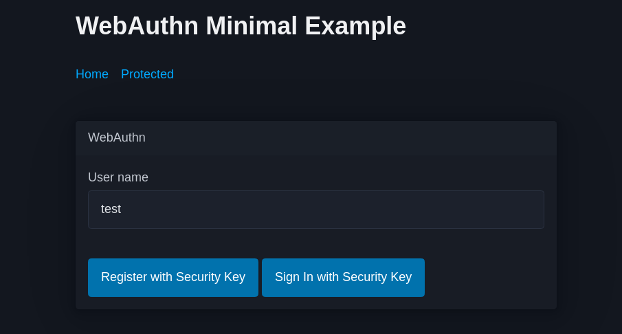
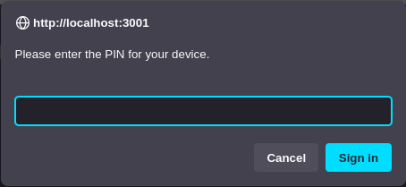
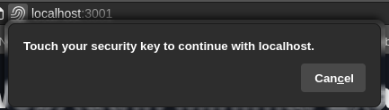
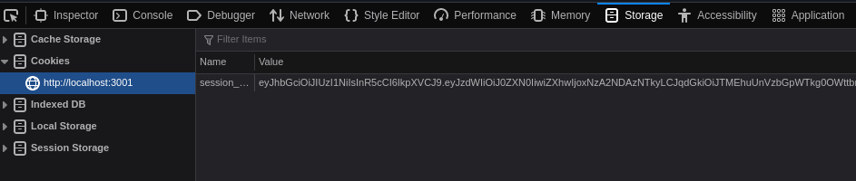
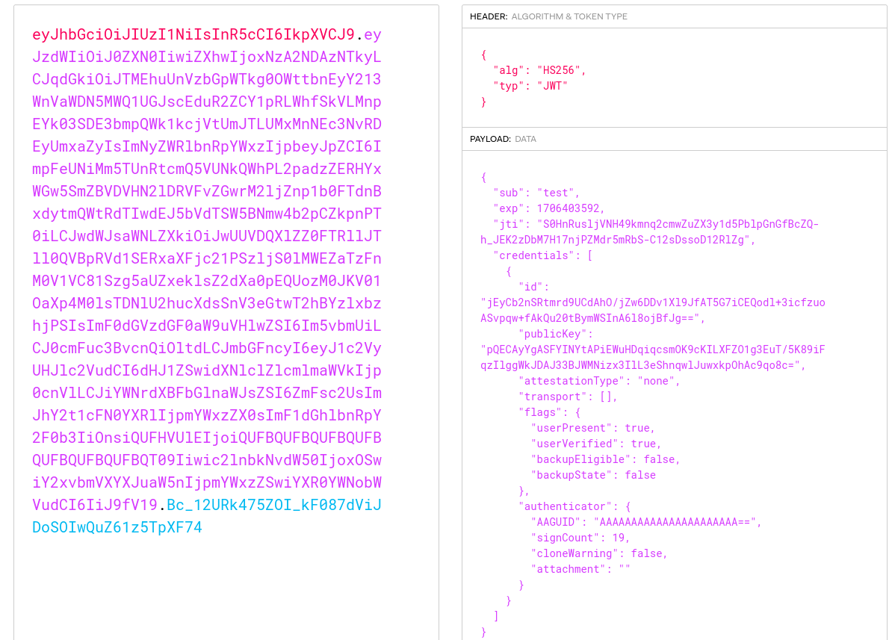

## Table of contents

\\{\\{ $.TOC }}

## Introduction

TL;DR: The article is quite long. [Source Code](https://github.com/Darkness4/webauthn-minimal). [Demo](https://auth-htmx.mnguyen.fr).

This guide will describe how to implement WebAuthn in Go, and how to use it in a web application.

The motivation of this guide is because there is only few working implementations of WebAuthn with Go, and only few guides. While I've already talked about why it's preferable to [**not** implement your own authentication and identity servers](/blog/2023-10-09-understanding-authentication), it still exists use cases where implementing your own is the only option. For examples, if you want direct connection to a client without delegation, or if self-hosting authentication services is out-of-the-question, because the service is lacking in features, or because it's too heavy.

Taking account these possible use cases, I decided to write this article. More precisely, this guide describes:

- The WebAuthn protocol, and how it works.
- The backend implementation in Go with a WebAuthn.
- The frontend implementation in pure JavaScript with a WebAuthn.
- The difficulties and the caveats of the protocol.

Note that this guide is in response to a feature request that I received in my [Auth HTMX project](https://github.com/Darkness4/auth-htmx/issues/16). The development of this feature was more difficult than expected (for a simple protocol like WebAuthn). So let's start.

## Quick remainder about authentication, identity and session

Authentication is about **finding if the user is allowed** to send commands. Think of it like a door with a guard in front of it. The guard can ask many things: a challenge, you ID card... Authentication is designed to verify these factors. An authentication service may not need a Identity Provider, but Webauthn needs one.

The Identity Provider (IdP) is about fetching the rights and data of the user. We are going to implement **username-based self-registration**, but, you should know that you can choose any solution for IdP. Some services may only allows email registration, which depends on a domain name. Others fetch from an API like LDAP, or simply, GitHub API. **Webauthn is not an identity provider and, therefore, does not care about how you implement your identity provider, Webauthn only need to fetch from it.** Also, we will store the public keys on the identity database too.

For my project, I decided to continue my Auth HTMX project. My project used OAuth2 as IdP to identify and authenticate users. Logged users are attributed a JWT session token. A session token describes:

- The expiration date of a user session.
- The authenticity of the user session via a signature from a server private key.
- The identity of the user. More precisely, a unique user ID.
- And custom data.

**Webauthn does not handle sessions.** It's up to us to implement a session or not. You could very well not use any session at all and authenticate the users at every "sensitive" operation.

However, since I'm continuing my project, we will use JWT-based sessions.

## What is WebAuthn?

### Quick definition

WebAuthn is a protocol published by the World Wide Web Consortium (W3C). It's a protocol that tries to standardize the interface for authenticating users via public-key cryptography, ensuring direct connection between the service and the authenticator. With this protocol, a good deal of hardware authenticator was developed to allow "password-less" authentication (FIDO for example). The standard is available on the [W3C website](https://www.w3.org/TR/webauthn-2/), but it's better to read the [guide by MDN](https://developer.mozilla.org/en-US/docs/Web/API/Web_Authentication_API).

While it is used primarily as a "two-factor authentication" solution, we can actually use password-less authentication as the _main_ authentication factor.

The benefits of such authentication solution is immediate:

- Customers do not need to remember for a password.
- Enterprises do not need to "further" maintain their user database and add complex layers of security. Everything is standardized, and key exchange protocols have proven to be very secure.
- Since there are less complex layers of security, it's quicker to implement and easier to deploy.

### The authentication flow

Like any authentication system, there is a flow. And the aim of the flow of any public-key-based authentication systems is to securely exchange the public key and ensuring the identity of the public key.

First and foremost, there are two main flows: the **device registration flow** and **the login flow**.

However, since we are solely using WebAuhn as main authentication service, we will have to implement **two device registrations flows**:

- **The initial device and user registration flow**
- **The additional device registration flow for existing users**

**Initial Device Registration Flow**

<center>

```d2
shape: sequence_diagram
  User/Authenticator -> WebAuthn Application -> WebAuthn Server: 1. Ask for device registration.
  WebAuthn Server -> User/Authenticator: 2. Send a challenge, the server domain name and the generated user info.
  User/Authenticator -> User/Authenticator: 3. Ask for user consent.
  User/Authenticator."At this point, the authenticator has stored the private key and the public key,\n and has allowed the server to store the public key."
  User/Authenticator -> WebAuthn Server: 4. Generate a private key and send the signed challenge with the credential ID and public key.
  WebAuthn Server."Remember that a signed message is the result of the mathematical operation with the private key.\nThe digital signature authenticity is verified with the public key."
  WebAuthn Server -> WebAuthn Server: 5. Verify the signed challenge and register the user and device.

```

</center>

As you can see, this is a typical key exchange protocol. The server sends a challenge, the client signs it, and the server verifies the signature. The server then stores the public key and the user info.

We haven't talked about the credential ID because it's specific to WebAuthn. Basically, it is used to identify the credential stored in the authenticator. After all, the authenticator can store many private keys.

(Well, there are more intrinsic steps, like adding a nonce, but this is the main idea.)

Do also note that, since we are using WebAuthn as main authentication service, you generate the user info only if the user does not exist. And if the user exists, you have to check if there is a public key associated with the user. If there is, the registration flow is cancelled, and the user is asked to log in with the login flow.

**This is the main difference with many available guides on WebAuthn where they implement WebAuthn only as a 2FA.**

Anyway, now that the user is authenticated, the user is given a session token. To add a new device, the user will have to authenticate again, but this time, the server check if the JWT session token is valid instead of generating user info.

**Additional Device Registration Flow**

<center>

```d2
shape: sequence_diagram
  Logged User/Authenticator -> WebAuthn Application -> WebAuthn Server: 1. Ask for new device registration.
  WebAuthn Server."Note: The JWT token is given in the request via cookie."
  WebAuthn Server -> Logged User/Authenticator: 2. Check JWT and send a challenge with the server domain name and the existing user info.
  Logged User/Authenticator -> Logged User/Authenticator: 3. Ask for user consent.
  Logged User/Authenticator -> WebAuthn Server: 4. Generate a private key and send the signed challenge with the credential ID and public key.
  WebAuthn Server -> WebAuthn Server: 5. Verify the signed challenge and register the new device to the existing user.

```

</center>

As you can see, the flow is similar to the initial device registration flow, except that the user is already authenticated. The server checks if the JWT token is valid, and if it is, the server sends a challenge with the existing user info.

**Login Flow**

<center>

```d2
shape: sequence_diagram
  User/Authenticator -> WebAuthn Application -> WebAuthn Server: 1. Ask for login.
  WebAuthn Server -> User/Authenticator: 2. Send a challenge, the server domain name and the existing user info.
  User/Authenticator -> User/Authenticator: 3. Ask for user consent.
  User/Authenticator -> WebAuthn Server: 4. Send the signed challenge.
  WebAuthn Server -> WebAuthn Server: 5. Verify the signed challenge and log the user in.

```

</center>

The login flow is similar to the additional device registration flow, except that the server does not register the user, but log the user in. We also don't need to send the credential ID and public key, since the server already has them.

If you remember about public-key authentication, we can extrapolate a public key from the signed challenge and compare it with the public key stored in the database (+compare with the nonce). If they match, then the user is authenticated.

**"Wait, what the hell is a nonce? You've talked about it non-stop!"**

A nonce is unique data generated by the server (can simply be a counter). It's used to prevent replay attacks. It's a common practice in public-key cryptography.

Basically, an attacker could intercept the signed challenge. Naturally, the main user would log in first. But, the attacker can also log in after the main user. The attacker would send the **same** signed challenge to the server. This is why it is called _replay_ attack.

To prevent this, the server generates unique data, and sends it to the client. The client signs the challenge with the private key, and sends the signed challenge with the nonce. The server then verifies the signature, and checks if the nonce from the database is the same as the one sent. If it is, then the server logs the user in and generates a new nonce in the database.

TL;DR: **The nonce assures that the signed challenge cannot be reused.**

You will see in the implementation that we update the nonce at every login.

## Implementation

### The backend

#### The user

Note that this will be a full-stack Go implementation.

We won't need to implement everything from scratch. We will use the [Go WebAuthn library](https://github.com/go-webauthn/webauthn). To be honest, the fact that we need a library to implement the flow is a bit disappointing (compared to OAuth2), but implementing WebAuthn correctly would be quite challenging too. Encryption, signing, device compatibility, etc... That's a lot of challenges.

Anyway, let's start with the backend.

Like any good software architect, we start with the most immutable object: the user. Go WebAuthn is asking us to implement [this interface](https://github.com/go-webauthn/webauthn/blob/5d22cc2d868a0221ad640f980e892e71853517b7/webauthn/types.go#L171-L203):

```go
// User is an interface with the Relying Party's User entry and provides the fields and methods needed for WebAuthn
// registration operations.
type User interface {
	// WebAuthnID provides the user handle of the user account. A user handle is an opaque byte sequence with a maximum
	// size of 64 bytes, and is not meant to be displayed to the user.
	//
	// To ensure secure operation, authentication and authorization decisions MUST be made on the basis of this id
	// member, not the displayName nor name members. See Section 6.1 of [RFC8266].
	//
	// It's recommended this value is completely random and uses the entire 64 bytes.
	//
	// Specification: §5.4.3. User Account Parameters for Credential Generation (https://w3c.github.io/webauthn/#dom-publickeycredentialuserentity-id)
	WebAuthnID() []byte

	// WebAuthnName provides the name attribute of the user account during registration and is a human-palatable name for the user
	// account, intended only for display. For example, "Alex Müller" or "田中倫". The Relying Party SHOULD let the user
	// choose this, and SHOULD NOT restrict the choice more than necessary.
	//
	// Specification: §5.4.3. User Account Parameters for Credential Generation (https://w3c.github.io/webauthn/#dictdef-publickeycredentialuserentity)
	WebAuthnName() string

	// WebAuthnDisplayName provides the name attribute of the user account during registration and is a human-palatable
	// name for the user account, intended only for display. For example, "Alex Müller" or "田中倫". The Relying Party
	// SHOULD let the user choose this, and SHOULD NOT restrict the choice more than necessary.
	//
	// Specification: §5.4.3. User Account Parameters for Credential Generation (https://www.w3.org/TR/webauthn/#dom-publickeycredentialuserentity-displayname)
	WebAuthnDisplayName() string

	// WebAuthnCredentials provides the list of Credential objects owned by the user.
	WebAuthnCredentials() []Credential

	// WebAuthnIcon is a deprecated option.
	// Deprecated: this has been removed from the specification recommendation. Suggest a blank string.
	WebAuthnIcon() string
}
```

We will follow the recommendation and use the whole 64 bytes of user ID. We will also use the `WebAuthnName` and `WebAuthnDisplayName` to store the username. For the sake of this example, we won't put any constraint with the username.

```go
// database/user/user.go
// Users lives in a database, so I'm putting it in the database directory.

// Package user handle the database users.
package user

import (
	"github.com/go-webauthn/webauthn/protocol"
	"github.com/go-webauthn/webauthn/webauthn"
)

type User struct {
	ID          []byte
	Name        string
	DisplayName string
	Credentials []webauthn.Credential
}

func (u *User) WebAuthnID() []byte {
	return u.ID
}

func (u *User) WebAuthnName() string {
	return u.Name
}

func (u *User) WebAuthnDisplayName() string {
	return u.DisplayName
}

func (u *User) WebAuthnCredentials() []webauthn.Credential {
	return u.Credentials
}

func (u *User) WebAuthnIcon() string {
	return ""
}

// ExcludeCredentialDescriptorList provides a list of credentials already registered.
// This is an extension to WebAuthn.
//
// Specification: §5.4.3. User Account Parameters for Credential Generation (https://w3c.github.io/webauthn/#sctn-op-make-cred)
func (u *User) ExcludeCredentialDescriptorList() []protocol.CredentialDescriptor {
	credentialExcludeList := []protocol.CredentialDescriptor{}
	for _, cred := range u.Credentials {
		descriptor := protocol.CredentialDescriptor{
			Type:         protocol.PublicKeyCredentialType,
			CredentialID: cred.ID,
		}
		credentialExcludeList = append(credentialExcludeList, descriptor)
	}

	return credentialExcludeList
}
```

I have implemented the `ExcludeCredentialDescriptorList` method. This is an extension to WebAuthn to exclude the credentials already registered.

We have to store the user in a database. Let's do it in SQL. I'm going to use [`sqlc`](https://sqlc.dev) with [`golang-migrate`](https://github.com/golang-migrate/migrate).

`sqlc` generates type-safe Go code from SQL. It's a very useful tool to avoid SQL injection and to have a better code completion. `golang-migrate` is a tool to migrate SQL databases. It's a very useful tool to avoid manual migration.

Honestly, I choose `golang-migrate` because it's the tool I am the most familiar, and because I have already programmed an auto-migrator with `golang-migrate`.

**The migration**:

```sql
-- database/migrations/000001_add_users.up.sql
BEGIN TRANSACTION;
-- https://github.com/go-webauthn/webauthn/blob/5d22cc2d868a0221ad640f980e892e71853517b7/webauthn/types.go#L171
CREATE TABLE IF NOT EXISTS users (
  id BLOB NOT NULL PRIMARY KEY,
  name VARCHAR(255) NOT NULL UNIQUE,
  display_name VARCHAR(255) NOT NULL
);
-- https://github.com/go-webauthn/webauthn/blob/5d22cc2d868a0221ad640f980e892e71853517b7/webauthn/credential.go
CREATE TABLE IF NOT EXISTS credentials (
  id BLOB NOT NULL,
  public_key BLOB NOT NULL,
  attestation_type TEXT NOT NULL,
  transport BLOB NOT NULL, --JSON
  flags BLOB NOT NULL, --JSON
  authenticator BLOB NOT NULL, --JSON
  user_id BLOB NOT NULL, -- Relationship is One User to Many credentials
  PRIMARY KEY(id, user_id),
  FOREIGN KEY(user_id) REFERENCES users(id)
);
COMMIT;
```

```sql
-- database/migrations/000001_add_users.down.sql
BEGIN TRANSACTION;
DROP TABLE IF EXISTS credentials;
DROP TABLE IF EXISTS users;
COMMIT;
```

Pretty straightforward. You may want to use a TEXT instead of a BLOB for the JSON fields. Honestly, I prefer to store raw information, i.e. JSON bytes.

The `id` are blobs as per the recommendation of the WebAuthn specification. We won't use any UUID or any other ID generator. We will use the `crypto/rand` package to generate random bytes.

To migrate, install `golang-migrate` and execute:

```sh
migrate -path database/migrations -database sqlite3://db.sqlite3?x-no-tx-wrap=true up
```

Better yet, put this in a Makefile:

```makefile
# ./Makefile

migrate := $(shell which migrate)
ifeq ($(migrate),)
migrate := $(shell go env GOPATH)/bin/migrate
endif

.PHONY: migration
migration: $(migrate)
	$(migrate) create -seq -ext sql -dir database/migrations $(MIGRATION_NAME)

.PHONY: up
up: $(MIGRATIONS) $(migrate)
	$(migrate) -path database/migrations -database sqlite3://db.sqlite3?x-no-tx-wrap=true up

.PHONY: drop
drop: $(migrate)
	$(migrate) -path database/migrations -database sqlite3://db.sqlite3?x-no-tx-wrap=true drop -f

$(migrate):
	go install -tags 'sqlite3' github.com/golang-migrate/migrate/v4/cmd/migrate
```

And execute, `make up`.

Now, for **the queries**:

```sql
-- database/queries.sql
-- name: GetUser :one
SELECT * FROM users WHERE id = ? LIMIT 1;

-- name: GetUserByName :one
SELECT * FROM users WHERE name = ? LIMIT 1;

-- name: CreateUser :one
INSERT INTO users (id, name, display_name) VALUES (?, ?, ?) RETURNING *;

-- name: CreateCredential :exec
INSERT INTO credentials (id, public_key, attestation_type, transport, flags, authenticator, user_id) VALUES (?, ?, ?, ?, ?, ?, ?);

-- name: UpdateCredential :exec
UPDATE credentials
SET public_key = ?,
attestation_type = ?,
transport = ?,
flags = ?,
authenticator = ?
WHERE id = sqlc.arg(by_id);

-- name: DeleteCredential :exec
DELETE FROM credentials WHERE id = ? AND user_id = ?;

-- name: GetCredentialsByUser :many
SELECT * FROM credentials WHERE user_id = ?;
```

You'll have to trust me for the choice of the queries ;). I'm joking, I won't just dump code like the other guides.

First, the `Get-` queries. The reasons are immediate, we need them for the flow to check if the user exists, and to fetch the user info. We need a `GetUser(ByID)` because we use JWT, and JWT stores a user ID.

Second, the `Create-` queries. Still obvious. We need them to create the user and the credentials.

Third, the `UpdateCredential` is needed to update the nonce after a login. We will see that later.

Finally, the `DeleteCredential` is needed to remove a credential from the database. This is because a user could potentially lose their authenticator, and he would need to remove that credential from the database.

The `sqlc` configuration:

```yaml
version: '2'
sql:
  - engine: 'sqlite'
    queries: 'database/queries.sql'
    schema: 'database/migrations'
    database:
      uri: 'sqlite3://db.sqlite3'
    gen:
      go:
        package: 'database'
        out: 'database'
```

To generate the Go code, execute:

```sh
sqlc generate
```

Or better yet, put this in a Makefile:

```makefile
# ./Makefile
sqlc := $(shell which sqlc)
ifeq ($(sqlc),)
sqlc := $(shell go env GOPATH)/bin/sqlc
endif

.PHONY: sql
sql: $(sqlc)
	$(sqlc) generate

$(sqlc):
	go install github.com/sqlc-dev/sqlc/cmd/sqlc
```

Now, just execute `make sql`. `sqlc` is able to read `golang-migrate`'s migrations. Isn't cool?

Now, let's implement the user mappers (we have to map the database user to the WebAuthn user):

```go
// database/user/user_mapper.go
package user

import (
	"encoding/json"

	"example-project/database"

	"github.com/go-webauthn/webauthn/protocol"
	"github.com/go-webauthn/webauthn/webauthn"
)

func credentialFromModel(credential *database.Credential) webauthn.Credential {
	var transport []protocol.AuthenticatorTransport
	if err := json.Unmarshal(credential.Transport, &transport); err != nil {
		panic(err)
	}
	var flags webauthn.CredentialFlags
	if err := json.Unmarshal(credential.Flags, &flags); err != nil {
		panic(err)
	}
	var authenticator webauthn.Authenticator
	if err := json.Unmarshal(credential.Authenticator, &authenticator); err != nil {
		panic(err)
	}
	return webauthn.Credential{
		ID:              credential.ID,
		PublicKey:       credential.PublicKey,
		AttestationType: credential.AttestationType,
		Transport:       transport,
		Flags:           flags,
		Authenticator:   authenticator,
	}
}

func fromModel(u *database.User, credentials []webauthn.Credential) *User {
	return &User{
		ID:          u.ID,
		Name:        u.Name,
		DisplayName: u.DisplayName,
		Credentials: credentials,
	}
}
```

These mappers are used internally in the package. We will implement a user repository which will expose usable data types.

**The user repository**:

```go
// database/user/user_repository.go

package user

import (
	"context"
	"crypto/rand"
	"database/sql"
	"encoding/json"
	"errors"

	"example-project/database"
	"github.com/go-webauthn/webauthn/protocol"
	"github.com/go-webauthn/webauthn/webauthn"
)

// Repository defines the user methods.
type Repository interface {
	GetOrCreateByName(ctx context.Context, name string) (*User, error)
	GetByName(ctx context.Context, name string) (*User, error)
	Get(ctx context.Context, id []byte) (*User, error)
	Create(ctx context.Context, name string, displayName string) (*User, error)
	AddCredential(ctx context.Context, id []byte, credential *webauthn.Credential) error
	UpdateCredential(ctx context.Context, credential *webauthn.Credential) error
	RemoveCredential(ctx context.Context, id []byte, credentialID []byte) error
}

// NewRepository wraps around a SQL database to execute the counter methods.
func NewRepository(db *sql.DB) Repository {
	return &repository{
		Queries: database.New(db),
	}
}

type repository struct {
	*database.Queries
}


var (
	// ErrUserNotFound happens when the user if not found in the database.
	ErrUserNotFound = errors.New("user not found")
	// ErrCredentialNotFound happens when the credential if not found in the database.
	ErrCredentialNotFound = errors.New("credential not found")
)

// AddCredential to a user from the database.
func (r *repository) AddCredential(
	ctx context.Context,
	id []byte,
	credential *webauthn.Credential,
) error {
	if credential.Transport == nil {
		credential.Transport = []protocol.AuthenticatorTransport{}
	}
	transport, err := json.Marshal(credential.Transport)
	if err != nil {
		return err
	}
	flags, err := json.Marshal(credential.Flags)
	if err != nil {
		return err
	}
	authenticator, err := json.Marshal(credential.Authenticator)
	if err != nil {
		return err
	}

	return r.Queries.CreateCredential(ctx, database.CreateCredentialParams{
		ID:              credential.ID,
		PublicKey:       credential.PublicKey,
		AttestationType: credential.AttestationType,
		Transport:       transport,
		Flags:           flags,
		Authenticator:   authenticator,
		UserID:          id,
	})
}

// UpdateCredential of a user from the database.
func (r *repository) UpdateCredential(ctx context.Context, credential *webauthn.Credential) error {
	if credential.Transport == nil {
		credential.Transport = []protocol.AuthenticatorTransport{}
	}
	transport, err := json.Marshal(credential.Transport)
	if err != nil {
		return err
	}
	flags, err := json.Marshal(credential.Flags)
	if err != nil {
		return err
	}
	authenticator, err := json.Marshal(credential.Authenticator)
	if err != nil {
		return err
	}

	return r.Queries.UpdateCredential(ctx, database.UpdateCredentialParams{
		PublicKey:       credential.PublicKey,
		AttestationType: credential.AttestationType,
		Transport:       transport,
		Flags:           flags,
		Authenticator:   authenticator,

		ByID: credential.ID,
	})
}

// Create a user in the database.
//
// The user ID is completely randomized.
func (r *repository) Create(ctx context.Context, name string, displayName string) (*User, error) {
	id := make([]byte, 64)
	if _, err := rand.Read(id); err != nil {
		return nil, err
	}

	u, err := r.Queries.CreateUser(ctx, database.CreateUserParams{
		ID:          id,
		Name:        name,
		DisplayName: displayName,
	})
	if err != nil {
		return nil, err
	}

	return fromModel(&u, []webauthn.Credential{}), nil
}

// GetOrCreateByName a user from the databse.
func (r *repository) GetOrCreateByName(ctx context.Context, name string) (*User, error) {
	u, err := r.GetByName(ctx, name)
	if errors.Is(err, ErrUserNotFound) {
		u, err = r.Create(ctx, name, name)
		if err != nil {
			return nil, err
		}
	} else if err != nil {
		return nil, err
	}

	return u, nil
}

// Gea user from the database.
func (r *repository) Get(ctx context.Context, id []byte) (*User, error) {
	u, err := r.Queries.GetUser(ctx, id)
	if errors.Is(err, sql.ErrNoRows) {
		return nil, ErrUserNotFound
	} else if err != nil {
		return nil, err
	}

	credentials, err := r.getCredentialsByUser(ctx, u.ID)
	if err != nil {
		return nil, err
	}

	return fromModel(&u, credentials), nil
}

// GetByName a user from the database.
func (r *repository) GetByName(ctx context.Context, name string) (*User, error) {
	u, err := r.Queries.GetUserByName(ctx, name)
	if errors.Is(err, sql.ErrNoRows) {
		return nil, ErrUserNotFound
	} else if err != nil {
		return nil, err
	}

	credentials, err := r.getCredentialsByUser(ctx, u.ID)
	if err != nil {
		return nil, err
	}

	return fromModel(&u, credentials), nil
}

func (r *repository) getCredentialsByUser(
	ctx context.Context,
	id []byte,
) ([]webauthn.Credential, error) {
	cc, err := r.Queries.GetCredentialsByUser(ctx, id)
	if errors.Is(err, sql.ErrNoRows) {
		return nil, ErrCredentialNotFound
	} else if err != nil {
		return nil, err
	}

	credentials := make([]webauthn.Credential, 0, len(cc))
	for _, c := range cc {
		credentials = append(credentials, credentialFromModel(&c))
	}
	return credentials, nil
}

// RemoveCredential of a user from the database.
func (r *repository) RemoveCredential(
	ctx context.Context,
	id []byte,
	credentialID []byte,
) error {
	return r.Queries.DeleteCredential(ctx, database.DeleteCredentialParams{
		ID:     credentialID,
		UserID: id,
	})
}
```

Big code dump, but it's quite obvious to implement. The user repository serves the User object, and does not expose the database objects:

<center>

```d2
database -> user_repository: map database.User to user.User.
```

</center>

The only thing to not miss is:

```go
// AddCredential/UpdateCredential
if credential.Transport == nil {
  credential.Transport = []protocol.AuthenticatorTransport{}
}
```

Because `credential.Transport` is nullable, and therefore, when JSON Marshaling, it would result into a `null` **string** value. And, we don't want that in the database.

Now that we have the user repository, we can implement the second most immutable object: the login/register session store.

!!!info INFO

If you think this is a useless abstraction to implement a User repository (seems too OOP), you should remember that the database implementation could vary. This is why there is an interface: to define the contract of the repository.

We must depend on interfaces, not implementations.

You could make smaller interfaces (like `UserGetter`) which would conform to Effective Go.

!!!

Lastly, let's write a database auto-migrator. This is probably bad practice in production, but it's very useful for development.

```go
// database/migrate.go
package database

import (
	"database/sql"
	"embed"
	"fmt"
	"log/slog"

	"github.com/golang-migrate/migrate/v4"
	"github.com/golang-migrate/migrate/v4/database/sqlite"
	"github.com/golang-migrate/migrate/v4/source/iofs"
)

//go:embed migrations/*.sql
var migrations embed.FS

// InitialMigration migrate a sqlite3 database if necessary.
func InitialMigration(db *sql.DB) error {
	dbDriver, err := sqlite.WithInstance(db, &sqlite.Config{
		NoTxWrap: true,
	})
	if err != nil {
		slog.Error("db failed", slog.String("err", err.Error()))
		return err
	}
	iofsDriver, err := iofs.New(migrations, "migrations")
	if err != nil {
		slog.Error("db failed", slog.String("err", err.Error()))
		return err
	}
	defer iofsDriver.Close()
	m, err := migrate.NewWithInstance(
		"iofs",
		iofsDriver,
		"sqlite",
		dbDriver,
	)
	if err != nil {
		slog.Error("db failed", slog.String("err", err.Error()))
		return err
	}
	if version, dirty, err := m.Version(); err == migrate.ErrNilVersion {
		slog.Warn("no migrations detected", slog.String("err", err.Error()))
		if err = m.Up(); err != nil {
			panic(fmt.Errorf("failed to migrate db: %w", err))
		}
		slog.Info("db migrated")
	} else if dirty {
		panic("db is in dirty state.")
	} else if err != nil {
		panic(fmt.Errorf("failed to fetch DB version: %w", err))
	} else {
		slog.Info("db version detected", slog.Uint64("version", uint64(version)))
		if newVersion, err := iofsDriver.Next(version); err != nil {
			slog.Info("latest DB version", slog.Uint64("version", uint64(version)))
		} else {
			slog.Info("new DB version detected", slog.Uint64("actual", uint64(version)), slog.Uint64("new", uint64(newVersion)))
			if err = m.Up(); err != nil {
				panic(fmt.Errorf("failed to migrate db: %w", err))
			}
			slog.Info("db migrated")
		}
	}
	return nil
}

```

#### The login/register session store

**This is not the JWT session store, this is because we have to store the WebAuthn challenge and the user ID.** See [SessionData for more information.](https://github.com/go-webauthn/webauthn/blob/45438bf44d105bf35be63245dfeba6c71c0972fe/webauthn/types.go#L205-L216)

To implement the session store, you can use any key-value database. Since this is an example, we will use a simple map.

```go
// webauthn/session/session.go

// Package session handles the login/register sessions of webauthn.
package session

import (
	"context"
	"errors"

	"github.com/go-webauthn/webauthn/webauthn"
)

// Store stores the login/registration session.
type Store interface {
	Save(ctx context.Context, session *webauthn.SessionData) error
	Get(ctx context.Context, userID []byte) (*webauthn.SessionData, error)
}

// ErrNotFound happens when the session is not found in the store.
var ErrNotFound = errors.New("not found in session store")

// StoreInMemory stores the login/registration session in-memory.
//
// In production, you should use a Redis or ETCD, or any distributed Key-Value database.
// Because of this, you cannot create replicas.
type StoreInMemory struct {
	store map[string]*webauthn.SessionData
}

// NewInMemory instanciates a session store in memory.
func NewInMemory() Store {
	return &StoreInMemory{
		store: make(map[string]*webauthn.SessionData),
	}
}

// Get the login or registration session.
func (s *StoreInMemory) Get(_ context.Context, userID []byte) (*webauthn.SessionData, error) {
	if v, ok := s.store[string(userID)]; ok {
		return v, nil
	}
	return nil, ErrNotFound
}

// Save the login or registration session.
func (s *StoreInMemory) Save(_ context.Context, session *webauthn.SessionData) error {
	s.store[string(session.UserID)] = session
	return nil
}
```

Nothing special here. We store the `webauthn.SessionData` type from the `go-webauthn` library.

Now, let's implement the actual JWT session "store".

#### The JWT session generator and validator

Generating JWTs is simply encoding the claims into a JSON string, and signing it with a private key. The private key is used to sign the JWT, and the public key is used to verify the signature.

```go
// jwt/jwt.go

// Package jwt defines all the methods for JWT manipulation.
package jwt

import (
	"fmt"
	"time"

	"github.com/go-webauthn/webauthn/webauthn"
	"github.com/golang-jwt/jwt/v5"
)

// ExpiresDuration is the duration when a user session expires.
const ExpiresDuration = 24 * time.Hour

// Claims are the fields stored in a JWT.
type Claims struct {
	jwt.RegisteredClaims
	Credentials []webauthn.Credential `json:"credentials"`
}

// Secret is a HMAC JWT secret used for signing.
type Secret []byte

// GenerateToken creates a JWT session token which stores the user identity.
//
// The returned token is signed with the JWT secret, meaning it cannot be falsified.
func (s Secret) GenerateToken(
	userID string,
	userName string,
	credentials []webauthn.Credential,
) (string, error) {
	// Create the token claims
	claims := &Claims{
		RegisteredClaims: jwt.RegisteredClaims{
			ID:        userID,
			Subject:   userName,
			ExpiresAt: jwt.NewNumericDate(time.Now().Add(ExpiresDuration)),
		},
		Credentials: credentials,
	}

	// Create the token object
	token := jwt.NewWithClaims(jwt.SigningMethodHS256, claims)

	// Sign the token with the secret key
	tokenString, err := token.SignedString([]byte(s))
	if err != nil {
		return "", err
	}

	return tokenString, nil
}

// VerifyToken checks if the token signature is valid compared to the JWT secret.
func (s Secret) VerifyToken(tokenString string) (*Claims, error) {
	// Parse the token
	var claims Claims
	token, err := jwt.ParseWithClaims(
		tokenString,
		&claims,
		func(t *jwt.Token) (interface{}, error) {
			// Make sure the signing method is HMAC
			if _, ok := t.Method.(*jwt.SigningMethodHMAC); !ok {
				return nil, fmt.Errorf("unexpected signing method: %v", t.Header["alg"])
			}

			// Return the secret key for validation
			return []byte(s), nil
		},
	)
	if err != nil {
		return nil, err
	}

	// Verify and return the claims
	if token.Valid {
		return &claims, nil
	}

	return nil, fmt.Errorf("invalid token")
}

```

We will need to pass a JWT secret. You can use any strings.

We plan to store the JWT in a cookie. Therefore, let's add create an HTTP Guard middleware that fetch the cookie and inject in the request context:

```go
// jwt/jwt_middleware.go
package jwt

import (
	"context"
	"net/http"
)

const (
	// TokenCookieKey is the key of the cookie stored in the context.
	TokenCookieKey = "session_token"
)

type claimsContextKey struct{}

// Middleware is a middleware that inject the JWT in the context for HTTP servers.
func (jwt Secret) Middleware(next http.Handler) http.Handler {
	return http.HandlerFunc(func(w http.ResponseWriter, r *http.Request) {
		// Get the JWT token from the request header
		cookie, err := r.Cookie(TokenCookieKey)
		if err != nil {
			next.ServeHTTP(w, r)
			return
		}

		// Verify the JWT token
		claims, err := jwt.VerifyToken(cookie.Value)
		if err != nil {
			next.ServeHTTP(w, r)
			return
		}

		// Store the claims in the request context for further use
		ctx := context.WithValue(r.Context(), claimsContextKey{}, *claims)
		next.ServeHTTP(w, r.WithContext(ctx))
	})
}

// Deny is an authentication guard for HTTP servers.
func Deny(next http.Handler) http.Handler {
	return http.HandlerFunc(func(w http.ResponseWriter, r *http.Request) {
		_, ok := GetClaimsFromRequest(r)
		if !ok {
			http.Error(w, "Unauthorized", http.StatusUnauthorized)
			return
		}

		next.ServeHTTP(w, r)
	})
}

// GetClaimsFromRequest is a helper function to fetch the JWT session token from an HTTP request.
func GetClaimsFromRequest(r *http.Request) (claims Claims, ok bool) {
	claims, ok = r.Context().Value(claimsContextKey{}).(Claims)
	return claims, ok
}

```

To use the guard, apply the middleware to every protected routes.

#### The HTTP handlers for WebAuthn

Time to implement the flows! First, for the sake of dependency injection:

```go
// webauthn/webauthn.go
// Package webauthn handles WebAuthn related functionalities.
package webauthn

import (
	"encoding/base64"
	"encoding/json"
	"log/slog"
	"net/http"
	"time"

	"example-project/database/user"
	"example-project/jwt"
	"example-project/webauthn/session"

	"github.com/go-webauthn/webauthn/protocol"
	"github.com/go-webauthn/webauthn/webauthn"
)

// Service prepares WebAuthn handlers.
type Service struct {
	webAuthn  *webauthn.WebAuthn
	jwtSecret jwt.Secret
	users     user.Repository
	store     session.Store
}

// New instanciates a Webauthn Service.
func New(
	webAuthn *webauthn.WebAuthn,
	users user.Repository,
	store session.Store,
	jwtSecret jwt.Secret,
) *Service {
	if webAuthn == nil {
		panic("webAuthn is nil")
	}
	if users == nil {
		panic("users is nil")
	}
	if store == nil {
		panic("store is nil")
	}
	return &Service{
		webAuthn:  webAuthn,
		users:     users,
		store:     store,
		jwtSecret: jwtSecret,
	}
}

```

Now, let's implement the handlers.

**The Initial Device Registration Flow**

```go

// BeginRegistration beings the webauthn flow.
//
// Based on the user identity, webauthn will generate options for the authenticator.
// We send the options over JSON.
func (s *Service) BeginRegistration() http.HandlerFunc {
	return func(w http.ResponseWriter, r *http.Request) {
		name := r.URL.Query().Get("name")
		if name == "" {
			http.Error(w, "empty user name", http.StatusBadRequest)
			return
		}
		user, err := s.users.GetOrCreateByName(r.Context(), name) // Find or create the new user
		if err != nil {
			slog.Error(
				"failed to fetch user",
				slog.String("err", err.Error()),
				slog.String("username", name),
			)
			http.Error(w, err.Error(), http.StatusInternalServerError)
			return
		}

		if len(user.Credentials) > 0 {
			// The user has already been registered. We must login.
			http.Error(w, "the user is already registered", http.StatusForbidden)
			return
		}
		registerOptions := func(credCreationOpts *protocol.PublicKeyCredentialCreationOptions) {
			credCreationOpts.CredentialExcludeList = user.ExcludeCredentialDescriptorList()
		}
		options, session, err := s.webAuthn.BeginRegistration(user, registerOptions)
		if err != nil {
			slog.Error(
				"user failed to begin registration",
				slog.String("err", err.Error()),
				slog.Any("user", user),
			)
			http.Error(w, err.Error(), http.StatusInternalServerError)
			return
		}

		// store the session values
		if err := s.store.Save(r.Context(), session); err != nil {
			// Maybe a Fatal or Panic should be user here.
			slog.Error(
				"failed to save session in store",
				slog.String("err", err.Error()),
				slog.Any("user", user),
			)
			http.Error(w, err.Error(), http.StatusInternalServerError)
			return
		}

		o, err := json.Marshal(options)
		if err != nil {
			panic(err)
		}
		w.Header().Set("Content-Type", "application/json")
		_, _ = w.Write(o)
	}
}

// FinishRegistration finishes the webauthn flow.
//
// The user has created options based on the options. We fetch the registration
// session from the session store.
// We complete the registration.
func (s *Service) FinishRegistration() http.HandlerFunc {
	return func(w http.ResponseWriter, r *http.Request) {
		name := r.URL.Query().Get("name")
		if name == "" {
			http.Error(w, "empty user name", http.StatusBadRequest)
			return
		}
		user, err := s.users.GetByName(r.Context(), name)
		if err != nil {
			slog.Error(
				"failed to fetch user",
				slog.String("err", err.Error()),
				slog.String("username", name),
			)
			http.Error(w, err.Error(), http.StatusInternalServerError)
			return
		}

		// Get the session data stored from the function above
		session, err := s.store.Get(r.Context(), user.ID)
		if err != nil {
			// Maybe a Fatal or Panic should be user here.
			slog.Error(
				"failed to save session in store",
				slog.String("err", err.Error()),
				slog.Any("user", user),
			)
			http.Error(w, err.Error(), http.StatusInternalServerError)
			return
		}

		credential, err := s.webAuthn.FinishRegistration(user, *session, r)
		if err != nil {
			slog.Error(
				"user failed to finish registration",
				slog.String("err", err.Error()),
				slog.Any("user", user),
			)
			http.Error(w, err.Error(), http.StatusInternalServerError)
			return
		}

		// If creation was successful, store the credential object
		if err := s.users.AddCredential(r.Context(), user.ID, credential); err != nil {
			slog.Error(
				"user failed to add credential during registration",
				slog.String("err", err.Error()),
				slog.Any("user", user),
			)
			http.Error(w, err.Error(), http.StatusInternalServerError)
			return
		}

		// Re-fetch
		user, err = s.users.Get(r.Context(), user.ID)
		if err != nil {
			slog.Error(
				"failed to fetch user",
				slog.String("err", err.Error()),
				slog.String("username", name),
			)
			http.Error(w, err.Error(), http.StatusInternalServerError)
			return
		}

		slog.Info("user registered", slog.Any("credential", credential), slog.Any("user", user))

		// Identity is now verified
		token, err := s.jwtSecret.GenerateToken(
			base64.RawURLEncoding.EncodeToString(user.ID),
			user.Name,
			user.Credentials,
		)
		if err != nil {
			http.Error(w, err.Error(), http.StatusInternalServerError)
			return
		}

		cookie := &http.Cookie{
			Name:     jwt.TokenCookieKey,
			Value:    token,
			Path:     "/",
			Expires:  time.Now().Add(jwt.ExpiresDuration),
			HttpOnly: true,
		}
		http.SetCookie(w, cookie)
		http.Redirect(w, r, "/", http.StatusFound)
	}
}

```

To begin the registration, we:

1. Expect the user to GET `/register/begin?name=USERNAME`
2. Generate the user ID with `GetOrCreateByName`.
3. Check if the user has already registered. If so, we return an error. Otherwise, we generate the options with `BeginRegistration`.
4. Store the new registration session in the session store
5. Send the options to the client.

To finish the registration, we:

1. Expect the authenticator to generate a credential (private key and public key) and POST to `/register/finish?name=USERNAME` with the credential and signed challenge as post-data.
2. Fetch the registration session from the session store, and we complete the registration with `FinishRegistration`.
3. Store the credential in the database.
4. Store the JWT in a cookie, and we redirect the user to the home page.

**The Additional Device Registration Flow**

This time, we check if the user has already registered. If so, we add the credential to the database.

```go
// BeginAddDevice beings the webauthn registration flow.
//
// Based on the user identity, webauthn will generate options for the authenticator.
// We send the options over JSON (not very htmx).
//
// Compared to BeginRegistration, BeginAddDevice uses the JWT to allow the registration.
func (s *Service) BeginAddDevice() http.HandlerFunc {
	return func(w http.ResponseWriter, r *http.Request) {
		claims, ok := jwt.GetClaimsFromRequest(r)
		if !ok {
			http.Error(w, "session not found", http.StatusForbidden)
			return
		}

		userID, err := base64.RawURLEncoding.DecodeString(claims.ID)
		if err != nil {
			slog.Error(
				"failed to parse claims",
				slog.String("err", err.Error()),
				slog.Any("claims", claims),
			)
			http.Error(w, err.Error(), http.StatusInternalServerError)
			return
		}

		user, err := s.users.Get(r.Context(), userID) // Find or create the new user
		if err != nil {
			slog.Error(
				"failed to fetch user",
				slog.String("err", err.Error()),
				slog.String("userid", string(userID)),
			)
			http.Error(w, err.Error(), http.StatusInternalServerError)
			return
		}

		registerOptions := func(credCreationOpts *protocol.PublicKeyCredentialCreationOptions) {
			credCreationOpts.CredentialExcludeList = user.ExcludeCredentialDescriptorList()
		}
		options, session, err := s.webAuthn.BeginRegistration(user, registerOptions)
		if err != nil {
			slog.Error(
				"user failed to begin new device registration",
				slog.String("err", err.Error()),
				slog.Any("user", user),
			)
			http.Error(w, err.Error(), http.StatusInternalServerError)
			return
		}

		// store the session values
		if err := s.store.Save(r.Context(), session); err != nil {
			// Maybe a Fatal or Panic should be user here.
			slog.Error(
				"failed to save session in store",
				slog.String("err", err.Error()),
				slog.Any("user", user),
			)
			http.Error(w, err.Error(), http.StatusInternalServerError)
			return
		}

		o, err := json.Marshal(options)
		if err != nil {
			panic(err)
		}

		w.Header().Set("Content-Type", "application/json")
		_, _ = w.Write(o)
	}
}


// FinishAddDevice finishes the webauthn registration flow.
//
// The user has created options based on the options. We fetch the registration
// session from the session store.
// We complete the registration.
func (s *Service) FinishAddDevice() http.HandlerFunc {
	return func(w http.ResponseWriter, r *http.Request) {
		claims, ok := jwt.GetClaimsFromRequest(r)
		if !ok {
			http.Error(w, "session not found", http.StatusForbidden)
			return
		}

		userID, err := base64.RawURLEncoding.DecodeString(claims.ID)
		if err != nil {
			slog.Error(
				"failed to parse claims",
				slog.String("err", err.Error()),
				slog.Any("claims", claims),
			)
			http.Error(w, err.Error(), http.StatusInternalServerError)
			return
		}

		user, err := s.users.Get(r.Context(), userID) // Find or create the new user
		if err != nil {
			slog.Error(
				"failed to fetch user",
				slog.String("err", err.Error()),
				slog.String("userid", string(userID)),
			)
			http.Error(w, err.Error(), http.StatusInternalServerError)
			return
		}

		// Get the session data stored from the function above
		session, err := s.store.Get(r.Context(), user.ID)
		if err != nil {
			// Maybe a Fatal or Panic should be user here.
			slog.Error(
				"failed to save session in store",
				slog.String("err", err.Error()),
				slog.Any("user", user),
			)
			http.Error(w, err.Error(), http.StatusInternalServerError)
			return
		}

		credential, err := s.webAuthn.FinishRegistration(user, *session, r)
		if err != nil {
			slog.Error(
				"user failed to finish registration",
				slog.String("err", err.Error()),
				slog.Any("user", user),
			)
			http.Error(w, err.Error(), http.StatusInternalServerError)
			return
		}

		// If creation was successful, store the credential object
		if err := s.users.AddCredential(r.Context(), user.ID, credential); err != nil {
			slog.Error(
				"user failed to add credential during registration",
				slog.String("err", err.Error()),
				slog.Any("user", user),
			)
			http.Error(w, err.Error(), http.StatusInternalServerError)
			return
		}

		// Re-fetch
		user, err = s.users.Get(r.Context(), user.ID)
		if err != nil {
			slog.Error(
				"failed to fetch user",
				slog.String("err", err.Error()),
				slog.String("userid", string(userID)),
			)
			http.Error(w, err.Error(), http.StatusInternalServerError)
			return
		}

		slog.Error("device added", slog.Any("credential", credential), slog.Any("user", user))

		// Identity is now verified
		token, err := s.jwtSecret.GenerateToken(
			base64.RawURLEncoding.EncodeToString(user.ID),
			user.Name,
			user.Credentials,
		)
		if err != nil {
			http.Error(w, err.Error(), http.StatusInternalServerError)
			return
		}

		cookie := &http.Cookie{
			Name:     jwt.TokenCookieKey,
			Value:    token,
			Path:     "/",
			Expires:  time.Now().Add(jwt.ExpiresDuration),
			HttpOnly: true,
		}
		http.SetCookie(w, cookie)
		http.Redirect(w, r, "/", http.StatusFound)
	}
}

```

Same flow, except we check if the user has already registered via JWT. If so, we add the credential to the database. Endpoints should be `/add-device/begin` and `/add-device/finish`. No need for the `name` query parameter since we have the cookie.

**The Login Flow**

```go
// BeginLogin is the handler called to generate options for the user's authenticator.
func (s *Service) BeginLogin() http.HandlerFunc {
	return func(w http.ResponseWriter, r *http.Request) {
		name := r.URL.Query().Get("name")
		if name == "" {
			http.Error(w, "empty user name", http.StatusBadRequest)
			return
		}
		user, err := s.users.GetByName(r.Context(), name)
		if err != nil {
			slog.Error(
				"failed to fetch user",
				slog.String("err", err.Error()),
				slog.String("username", name),
			)
			http.Error(w, err.Error(), http.StatusInternalServerError)
			return
		}

		options, session, err := s.webAuthn.BeginLogin(user)
		if err != nil {
			slog.Error(
				"user failed to begin login",
				slog.String("err", err.Error()),
				slog.Any("user", user),
			)
			http.Error(w, err.Error(), http.StatusInternalServerError)
			return
		}

		// store the session values
		if err := s.store.Save(r.Context(), session); err != nil {
			// Maybe a Fatal or Panic should be user here.
			slog.Error(
				"failed to save session in store",
				slog.String("err", err.Error()),
				slog.Any("user", user),
			)
			http.Error(w, err.Error(), http.StatusInternalServerError)
			return
		}

		o, err := json.Marshal(options)
		if err != nil {
			slog.Error("failed to respond", slog.String("err", err.Error()), slog.Any("user", user))
			http.Error(w, err.Error(), http.StatusInternalServerError)
			return
		}
		w.Header().Set("Content-Type", "application/json")
		_, _ = w.Write(o)
	}
}

// FinishLogin is the handler called after the user's authenticator sent its payload.
func (s *Service) FinishLogin() http.HandlerFunc {
	return func(w http.ResponseWriter, r *http.Request) {
		name := r.URL.Query().Get("name")
		if name == "" {
			http.Error(w, "empty user name", http.StatusBadRequest)
			return
		}
		user, err := s.users.GetByName(r.Context(), name)
		if err != nil {
			slog.Error(
				"failed to fetch user",
				slog.String("err", err.Error()),
				slog.String("username", name),
			)
			http.Error(w, err.Error(), http.StatusInternalServerError)
			return
		}

		// Get the session data stored from the function above
		session, err := s.store.Get(r.Context(), user.ID)
		if err != nil {
			// Maybe a Fatal or Panic should be user here.
			slog.Error(
				"failed to save session in store",
				slog.String("err", err.Error()),
				slog.Any("user", user),
			)
			http.Error(w, err.Error(), http.StatusInternalServerError)
			return
		}

		credential, err := s.webAuthn.FinishLogin(user, *session, r)
		if err != nil {
			slog.Error(
				"user failed to finish login",
				slog.String("err", err.Error()),
				slog.Any("user", user),
			)
			http.Error(w, err.Error(), http.StatusInternalServerError)
			return
		}

		// At this point, we've confirmed the correct authenticator has been
		// provided and it passed the challenge we gave it. We now need to make
		// sure that the sign counter is higher than what we have stored to help
		// give assurance that this credential wasn't cloned.
		if credential.Authenticator.CloneWarning {
			slog.Error("credential appears to be cloned", slog.Any("credential", credential))
			http.Error(w, err.Error(), http.StatusForbidden)
			return
		}

		// If login was successful, update the credential object
		if err := s.users.UpdateCredential(r.Context(), credential); err != nil {
			slog.Error(
				"user failed to update credential during finish login",
				slog.String("err", err.Error()),
				slog.Any("user", user),
			)
			http.Error(w, err.Error(), http.StatusInternalServerError)
			return
		}

		// Re-fetch
		user, err = s.users.Get(r.Context(), user.ID)
		if err != nil {
			slog.Error(
				"failed to fetch user",
				slog.String("err", err.Error()),
				slog.String("username", name),
			)
			http.Error(w, err.Error(), http.StatusInternalServerError)
			return
		}

		slog.Info("user logged", slog.Any("credential", credential), slog.Any("user", user))

		// Identity is now verified
		token, err := s.jwtSecret.GenerateToken(
			base64.RawURLEncoding.EncodeToString(user.ID),
			user.Name,
			user.Credentials,
		)
		if err != nil {
			http.Error(w, err.Error(), http.StatusInternalServerError)
			return
		}

		cookie := &http.Cookie{
			Name:     jwt.TokenCookieKey,
			Value:    token,
			Path:     "/",
			Expires:  time.Now().Add(jwt.ExpiresDuration),
			HttpOnly: true,
		}
		http.SetCookie(w, cookie)
		http.Redirect(w, r, "/", http.StatusFound)
	}
}
```

Again, almost the same flow. Except we don't need to store the credential in the database, we just need to update the credential because of the nonce.

You can also add a logout handler:

```go
// Logout removes session cookies and redirect to home.
func Logout(w http.ResponseWriter, r *http.Request) {
	cookie, err := r.Cookie(jwt.TokenCookieKey)
	if err != nil {
		// Ignore error. Cookie doesn't exists.
		http.Redirect(w, r, "/", http.StatusSeeOther)
		return
	}
	cookie.Value = ""
	cookie.Path = "/"
	cookie.Expires = time.Now().Add(-1 * time.Hour)
	http.SetCookie(w, cookie)
	http.Redirect(w, r, "/", http.StatusSeeOther)
}

```

#### Set up the HTTP server

Now that we have the handlers, we have everything we need to set up the HTTP server. Let's assemble everything:

```go
// main.go
package main

import (
	"database/sql"
	"embed"
	"example-project/database"
	"example-project/database/user"
	"example-project/jwt"
	internalwebauthn "example-project/webauthn"
	"example-project/webauthn/session"
	"flag"
	"io/fs"
	"log/slog"
	"net/http"
	"net/url"
	"os"

	"github.com/go-chi/chi/v5"
	"github.com/go-webauthn/webauthn/webauthn"
)

var (
	//go:embed pages/*
	pages embed.FS
)

var (
	jwtSecretFlag = flag.String("jwt.secret", "", "JWT secret used for signing")
	httpAddrFlag  = flag.String("http.addr", ":3000", "HTTP server address")
	publicURLFlag = flag.String(
		"public.url",
		"http://localhost:3000",
		"Public URL of the HTTP server",
	)
	dbPathFlag = flag.String("db.path", "db.sqlite3", "Path to the SQLite database")
)

func main() {
	flag.Parse()

	if *jwtSecretFlag == "" {
		slog.Error("missing jwt.secret flag")
		os.Exit(1)
	}

	// DB
	d, err := sql.Open("sqlite", *dbPathFlag)
	if err != nil {
		slog.Error("db failed", slog.String("err", err.Error()))
		os.Exit(1)
	}

	if err := database.InitialMigration(d); err != nil {
		slog.Error("db migration failed", slog.String("err", err.Error()))
		os.Exit(1)
	}

	// Create the JWT secret
	jwtSecret := jwt.Secret(*jwtSecretFlag)

	// WebAuthn
	u, err := url.Parse(*publicURLFlag)
	if err != nil {
		slog.Error("failed to parse public URL", slog.String("err", err.Error()))
		os.Exit(1)
	}

	webAuthn, err := webauthn.New(&webauthn.Config{
		RPDisplayName: "WebAuthn Demo",    // Display Name for your site
		RPID:          u.Hostname(),   // Generally the domain name for your site
		RPOrigin:      *publicURLFlag, // The origin URL for WebAuthn requests
	})
	if err != nil {
		panic(err)
	}

	webauthnS := internalwebauthn.New(
		webAuthn,
		user.NewRepository(d),
		session.NewInMemory(),
		jwt.Secret(jwtSecret),
	)

	// Router
	r := chi.NewRouter()
	r.Use(jwtSecret.Middleware)
	r.Get("/logout", internalwebauthn.Logout)
	r.Route("/login", func(r chi.Router) {
		r.Get("/begin", webauthnS.BeginLogin())
		r.Post("/finish", webauthnS.FinishLogin())
	})
	r.Route("/register", func(r chi.Router) {
		r.Get("/begin", webauthnS.BeginRegistration())
		r.Post("/finish", webauthnS.FinishRegistration())
	})
	r.Route("/add-device", func(r chi.Router) {
		r.Get("/begin", webauthnS.BeginAddDevice())
		r.Post("/finish", webauthnS.FinishAddDevice())
	})
	r.Post("/delete-device", webauthnS.DeleteDevice())

	pages, err := fs.Sub(pages, "pages")
	if err != nil {
		panic(err)
	}
	r.With(jwt.Deny).Handle("/protected.html", http.FileServer(http.FS(pages)))
	r.Handle("/*", http.FileServer(http.FS(pages)))

	slog.Info("http server started", slog.String("addr", *httpAddrFlag))
	if err := http.ListenAndServe(*httpAddrFlag, r); err != nil {
		slog.Error("http server failed", slog.String("err", err.Error()))
		os.Exit(1)
	}
}

```

You can complete the Makefile to run the server.

```makefile
# Makefile

# Put this at the top of the Makefile.
.PHONY: bin/webauthn
bin/webauthn: $(GO_SRCS)
	go build -trimpath -ldflags "-s -w" -o "$@" ./main.go

.PHONY: clean
clean:
	rm bin/*
```

### The frontend

#### Preface

Time for a hellish implementation. You see, WebAuthn uses bytes for IDs. And, JavaScript does not very well handle bytes. So, we will have to use base64 encoding. And you know what? The base64 encoding is not the same in Go and JavaScript.

[JavaScript has a hard time converting UTF-8 to bytes when converting to base64](https://developer.mozilla.org/en-US/docs/Glossary/Base64#the_unicode_problem). That's right, F- JavaScript.

Anyway, we need two pages: the login/register page and the protected page. After all, we need to test the session too.

#### The login/register page

Before, I code dump, this is the design of the page:

- 2 buttons: register and login.
- Import a ["valid" base64 library](https://github.com/dankogai/js-base64).

Simple:

**pages/index.html**

```html
<!DOCTYPE html>
<html lang="en">
  <head>
    <meta charset="UTF-8" />
    <meta name="viewport" content="width=device-width, initial-scale=1.0" />
    <title>WebAuthn Minimal Example</title>
    <link
      rel="stylesheet"
      href="https://cdn.jsdelivr.net/npm/@picocss/pico@next/css/pico.classless.min.css"
    />
    <!-- This base64 script is important for encoding correctly. -->
    <script src="https://cdn.jsdelivr.net/npm/js-base64@3.7.6/base64.min.js"></script>

    <script>
      async function register(name) {
        if (!window.PublicKeyCredential) {
          alert('Error: this browser does not support WebAuthn.');
          return;
        }

        let resp = await fetch(`/register/begin?name=${name}`);

        if (!resp.ok) {
          throw new Error(await resp.text());
        }

        const options = await resp.json();

        // go-webauthn returns base64 encoded values.
        options.publicKey.challenge = Base64.toUint8Array(
          options.publicKey.challenge
        );
        options.publicKey.user.id = Base64.toUint8Array(
          options.publicKey.user.id
        );
        if (options.publicKey.excludeCredentials) {
          options.publicKey.excludeCredentials.forEach(function (listItem) {
            listItem.id = Base64.toUint8Array(listItem.id);
          });
        }

        const credential = await navigator.credentials.create(options);

        resp = await fetch(`/register/finish?name=${name}`, {
          method: 'POST',
          headers: {
            'Content-Type': 'application/json',
          },
          body: JSON.stringify({
            id: credential.id,
            rawId: Base64.fromUint8Array(
              new Uint8Array(credential.rawId),
              true
            ),
            type: credential.type,
            response: {
              attestationObject: Base64.fromUint8Array(
                new Uint8Array(credential.response.attestationObject),
                true
              ),
              clientDataJSON: Base64.fromUint8Array(
                new Uint8Array(credential.response.clientDataJSON),
                true
              ),
            },
          }),
        });

        if (!resp.ok) {
          throw new Error(await resp.text());
        }

        window.location.href = '/protected.html';
      }

      // Login executes the WebAuthn flow.
      async function login(name) {
        if (!window.PublicKeyCredential) {
          alert('Error: this browser does not support WebAuthn');
          return;
        }

        let resp = await fetch(`/login/begin?name=${name}`);

        if (!resp.ok) {
          throw new Error(await resp.text());
        }

        const options = await resp.json();

        options.publicKey.challenge = Base64.toUint8Array(
          options.publicKey.challenge
        );
        options.publicKey.allowCredentials.forEach(function (listItem) {
          listItem.id = Base64.toUint8Array(listItem.id);
        });

        const assertion = await navigator.credentials.get(options);

        resp = await fetch(`/login/finish?name=${name}`, {
          method: 'POST',
          headers: {
            'Content-Type': 'application/json',
          },
          body: JSON.stringify({
            id: assertion.id,
            rawId: Base64.fromUint8Array(new Uint8Array(assertion.rawId), true),
            type: assertion.type,
            response: {
              authenticatorData: Base64.fromUint8Array(
                new Uint8Array(assertion.response.authenticatorData),
                true
              ),
              clientDataJSON: Base64.fromUint8Array(
                new Uint8Array(assertion.response.clientDataJSON),
                true
              ),
              signature: Base64.fromUint8Array(
                new Uint8Array(assertion.response.signature),
                true
              ),
              userHandle: Base64.fromUint8Array(
                new Uint8Array(assertion.response.userHandle),
                true
              ),
            },
          }),
        });

        if (!resp.ok) {
          throw new Error(await resp.text());
        }

        window.location.href = '/protected.html';
      }

      window.addEventListener('DOMContentLoaded', () => {
        document
          .getElementById('webauthn-register')
          .addEventListener('click', async () => {
            try {
              await register(document.getElementById('name').value);
            } catch (err) {
              alert(err);
            }
          });

        document
          .getElementById('webauthn-sign-in')
          .addEventListener('click', async () => {
            try {
              await login(document.getElementById('name').value);
            } catch (err) {
              alert(err);
            }
          });
      });
    </script>
  </head>
  <body>
    <header>
      <h1>WebAuthn Minimal Example</h1>
      <nav>
        <ul>
          <li><a href="/">Home</a></li>
          <li><a href="/protected.html">Protected</a></li>
        </ul>
      </nav>
    </header>
    <main>
      <article>
        <header>WebAuthn</header>
        <main>
          <form onsubmit="event.preventDefault();">
            <fieldset>
              <label>
                User name
                <input
                  type="text"
                  id="name"
                  autocomplete="username webauthn"
                  placeholder="User name"
                />
              </label>
            </fieldset>
            <button id="webauthn-register">Register with Security Key</button>
            <button id="webauthn-sign-in">Sign In with Security Key</button>
          </form>
        </main>
      </article>
    </main>
  </body>
</html>
```

**"Wait!!! The hell is the code that long?!?!"**

Well, like I said earlier, JavaScript doesn't handle well Uint8Array to Base64 encoding and vice-versa. We had to manually convert the values using the [`js-base64` library](https://www.npmjs.com/package/js-base64).

I'm not proud of myself since this increases the attack surface. But, I don't see any other way to do it.

And, about which fields to convert, I had to look at the go-webauthn source code ([options/registration begin object](https://github.com/go-webauthn/webauthn/blob/45438bf44d105bf35be63245dfeba6c71c0972fe/protocol/options.go#L15-L33), [attestation/registration finish object](https://github.com/go-webauthn/webauthn/blob/45438bf44d105bf35be63245dfeba6c71c0972fe/protocol/attestation.go#L15-L37), [options/login begin object](https://github.com/go-webauthn/webauthn/blob/45438bf44d105bf35be63245dfeba6c71c0972fe/protocol/options.go#L35-L49) and [assertion/login finish object](https://github.com/go-webauthn/webauthn/blob/45438bf44d105bf35be63245dfeba6c71c0972fe/protocol/assertion.go#L29-L36)).

Every `URLEncodedBase64` must be decoded/encoded via the `js-base64` library.

!!!info INFO

`Base64.fromUint8Array(..., true)` encodes to base64 with URL-safe encoding.

!!!

#### The protected page

We will use a template later. For now, let's just create the page.

**pages/protected.html**

```html
<!DOCTYPE html>
<html lang="en">
  <head>
    <meta charset="UTF-8" />
    <meta name="viewport" content="width=device-width, initial-scale=1.0" />
    <title>Protected</title>
    <link
      rel="stylesheet"
      href="https://cdn.jsdelivr.net/npm/@picocss/pico@next/css/pico.classless.min.css"
    />
  </head>
  <body>
    <header><h1>This is protected.</h1></header>
  </body>
</html>
```

### Testing

Launch the server:

```shell
make bin/webauthn
./bin/webauthn \
  --jwt.secret="example" \
  --http.addr=":3001" \
  public.url="http://localhost:3001"
```



BitWarden is triggered by the fact that localhost is not HTTPS. Good for him, but bad for us. Luckily, I have my own hardware security key.

<center>



_Firefox is asking for my FIDO PIN._



_Firefox is now asking to touch the security key._


_We are now redirected to the protected page. It's working!_



_The cookie is here._



_[Decoding the JWT](https://jwt.io/) gave us good results!_

</center>

From now, the minimum viable product is done. However, there are still critical things to do:

- CSRF protection
- Templates (we need to pass user data to the template, after all)
- Adding/Deleting device for registered users

### CSRF and Templates

#### Initial setup for templates

We will use the [Go `text/template` engine](https://pkg.go.dev/text/template) for the templates.

Add a `base.html` template, so that we don't have to add the `<head>` and `<body>` tags every time:

_base.html_

```html
{{ define "base" }}
<!DOCTYPE html>
<html lang="en">
  <head>
    <meta charset="UTF-8" />
    <meta name="viewport" content="width=device-width, initial-scale=1.0" />
    <link
      rel="stylesheet"
      href="https://cdn.jsdelivr.net/npm/@picocss/pico@next/css/pico.classless.min.css"
    />
    {{ template "head" . }}
  </head>
  <body>
    {{ template "body" . }}
  </body>
</html>
{{ end }}
```

Edit the other pages to define the templates `head` and `body`:

**pages/index.html**

```html
{{- define "head" }}
<title>WebAuthn Minimal Example</title>
<!-- This base64 script is important for encoding correctly. -->
<script src="https://cdn.jsdelivr.net/npm/js-base64@3.7.6/base64.min.js"></script>

<script>
  async function register(name) {
    ...
  });
</script>
{{- end }}
<!-- --->
{{- define "body" }}
<header>
  <h1>WebAuthn Minimal Example</h1>
  <nav>...</nav>
</header>
<main>
  <article>...</article>
</main>
{{- end }}
```

**pages/protected.html**

```html
{{- define "head" }}
<title>Protected</title>
{{- end }} {{- define "body" }}
<header><h1>This is protected.</h1></header>
<main>
  <article>
    <h2>Hello {{ .UserName }}!</h2>
  </article>
</main>
{{- end }}
```

Edit the `main.go`. Remove the way we've handled the pages:

```diff
-	pages, err := fs.Sub(pages, "pages")
-	if err != nil {
-		panic(err)
-	}
-	r.With(jwt.Deny).Handle("/protected.html", http.FileServer(http.FS(pages)))
-	r.Handle("/*", http.FileServer(http.FS(pages)))
```

And add a `renderFn` function to render the templates:

```go
	renderFn := func(w http.ResponseWriter, r *http.Request) {
		path := filepath.Clean(r.URL.Path)
		if path == "/" || path == "." {
			path = "index"
		}
		path = strings.TrimSuffix(strings.TrimPrefix(path, "/"), "/")
		path = fmt.Sprintf("pages/%s.html", path)

		t, err := template.ParseFS(pages, "base.html", path)
		if err != nil {
			if strings.Contains(err.Error(), "no files") {
				http.Error(w, "not found", http.StatusNotFound)
			} else {
				slog.Error("template error", slog.String("err", err.Error()))
				panic(err)
			}
			return
		}

		claims, _ := jwt.GetClaimsFromRequest(r)
		if err := t.ExecuteTemplate(w, "base", struct {
			UserName  string
		}{
			UserName:  claims.Subject,
		}); err != nil {
			slog.Error("template error", slog.String("err", err.Error()))
			panic(err)
		}
	}

	r.Route("/protected", func(r chi.Router) {
		r.Use(jwt.Deny)
		r.Get("/", renderFn)
	})
	r.Get("/*", renderFn)
```

Let me explain a little, in the templates we've defined `base`, `body` and `head`. The `renderFn` fetches the path from the URL, and tries to find the right templates:

- `base.html` is the `base` template.
- `path` (`pages/%s.html`) contains the `head` and `body` templates.

`t.ExecuteTemplate(w, "base", ...)` renders the `base` template, and injects the `head` and `body` templates.

Now, that we've replaced the pages by templates, we can add the CSRF protection.

!!!note NOTE

Feel free to replace the struct in the `renderFn`, or even add path-specific data.

!!!

#### CSRF protection

CSRF is **vital** for any website using cookies. If you don't know what CSRF is, you should read [this article](https://cheatsheetseries.owasp.org/cheatsheets/Cross-Site_Request_Forgery_Prevention_Cheat_Sheet.html).

We will use [gorilla/csrf](https://github.com/gorilla/csrf), which is a CSRF middleware for Go. It will give a special CSRF cookie for the user, and for each HTML form, we will add a hidden input with the CSRF token.

If the CSRF token of the page, the secret key of the website and the cookie match, then the request is valid.

I'm not going to explain how to use it, the documentation is already pretty good. RTFM.

```diff
 	jwtSecretFlag  = flag.String("jwt.secret", "", "JWT secret used for signing")
+	csrfSecretFlag = flag.String("csrf.secret", "", "CSRF secret used for signing")

...
-	if err := http.ListenAndServe(*httpAddrFlag, r); err != nil {
+	if err := http.ListenAndServe(*httpAddrFlag, csrf.Protect([]byte(*csrfSecretFlag))(r)); err != nil {
```

Now, let's write the template. We need to use a template to inject the CSRF token in the form.

Let's edit the form for the Go template engine. Add `'X-CSRF-Token': '{{ .CSRFToken }}` to every `POST`:

```diff
           method: 'POST',
           headers: {
+            'X-CSRF-Token': '{{ .CSRFToken }}',
             'Content-Type': 'application/json',
           },
```

Now, let's change the `main.go` to inject the token. Our server is no more a file server. We need to add a template engine and render the right page based on the template location:

```diff
 		if err := t.ExecuteTemplate(w, "base", struct {
+			CSRFToken string
 			UserName  string
 		}{
+			CSRFToken: csrf.Token(r),
 			UserName:  claims.Subject,
 		}); err != nil {
 			slog.Error("template error", slog.String("err", err.Error()))
 			panic(err)
 		}
```

Aaaand, we are done. CSRF is now handled.

### Adding/deleting devices for logged users

From now on, there are multiple strategies you could implement:

- Ask for the old key to add a new one
- Ask for a recovery code to add a new one
- Ask no key to add a new one
- Etc...

I do not have the experience to tell which one is the best.

Since security keys can be lost, and we are not handling passwords, let's implement the third strategy.

Let's edit the protected page. We need to:

- List every credential.
- For each credential, add a delete button.
- Add a button to add a new credential.

**main.go**

```diff
 		claims, _ := jwt.GetClaimsFromRequest(r)
+		creds := make([]string, 0, len(claims.Credentials))
+		for _, c := range claims.Credentials {
+			creds = append(creds, base64.RawURLEncoding.EncodeToString(c.ID))
+		}
 		if err := t.ExecuteTemplate(w, "base", struct {
 			CSRFToken   string
 			UserName    string
+			Credentials []string
 		}{
 			CSRFToken:   csrf.Token(r),
 			UserName:    claims.Subject,
+			Credentials: creds,
 		}); err != nil {
 			slog.Error("template error", slog.String("err", err.Error()))
 			panic(err)
 		}
```

**pages/protected.html**

```html
{{- define "head" }}
<title>Protected</title>

<link
  rel="stylesheet"
  href="https://cdnjs.cloudflare.com/ajax/libs/flexboxgrid/6.3.1/flexboxgrid.min.css"
  integrity="sha512-YHuwZabI2zi0k7c9vtg8dK/63QB0hLvD4thw44dFo/TfBFVVQOqEG9WpviaEpbyvgOIYLXF1n7xDUfU3GDs0sw=="
  crossorigin="anonymous"
/>
<!-- This base64 script is important for encoding correctly. -->
<script src="https://cdn.jsdelivr.net/npm/js-base64@3.7.6/base64.min.js"></script>

<script>
  async function addSecurityKey() {
    if (!window.PublicKeyCredential) {
      alert('Error: this browser does not support WebAuthn.');
      return;
    }

    let resp = await fetch(`/add-device/begin`);

    if (!resp.ok) {
      throw new Error(await resp.text());
    }

    const options = await resp.json();

    // go-webauthn returns base64 encoded values.
    options.publicKey.challenge = Base64.toUint8Array(
      options.publicKey.challenge
    );
    options.publicKey.user.id = Base64.toUint8Array(options.publicKey.user.id);
    if (options.publicKey.excludeCredentials) {
      options.publicKey.excludeCredentials.forEach(function (listItem) {
        listItem.id = Base64.toUint8Array(listItem.id);
      });
    }

    const credential = await navigator.credentials.create(options);

    resp = await fetch(`/add-device/finish`, {
      method: 'POST',
      headers: {
        'X-CSRF-Token': '{{ .CSRFToken }}',
        'Content-Type': 'application/json',
      },
      body: JSON.stringify({
        // go-webauthn only accepts base64 encoded values.
        // We cannot pass credential because it's a class, not an object.
        id: credential.id,
        rawId: Base64.fromUint8Array(new Uint8Array(credential.rawId), true),
        type: credential.type,
        response: {
          attestationObject: Base64.fromUint8Array(
            new Uint8Array(credential.response.attestationObject),
            true
          ),
          clientDataJSON: Base64.fromUint8Array(
            new Uint8Array(credential.response.clientDataJSON),
            true
          ),
        },
      }),
    });

    if (!resp.ok) {
      throw new Error(await resp.text());
    }

    window.location.reload();
  }

  async function logOut() {
    const resp = await fetch(`/logout`);
    if (!resp.ok) {
      throw new Error(await resp.text());
    }

    window.location.href = '/';
  }

  async function deleteDevice(credentialID) {
    const resp = await fetch(`/delete-device?credential=${credentialID}`, {
      method: 'POST',
      headers: {
        'X-CSRF-Token': '{{ .CSRFToken }}',
      },
    });

    if (!resp.ok) {
      throw new Error(await resp.text());
    }

    window.location.reload();
  }

  window.addEventListener('DOMContentLoaded', () => {
    document
      .getElementById('webauthn-add-security-key')
      .addEventListener('click', async () => {
        try {
          await addSecurityKey();
        } catch (e) {
          alert(e);
        }
      });

    document
      .getElementById('webauthn-logout')
      .addEventListener('click', async () => {
        try {
          await logOut();
        } catch (e) {
          alert(e);
        }
      });

    document
      .getElementById('credentials')
      .addEventListener('click', async (e) => {
        if (e.target.nodeName === 'BUTTON') {
          try {
            await deleteDevice(e.target.dataset.id);
          } catch (e) {
            alert(e);
          }
        }
      });
  });
</script>
{{- end }}
<!---->
{{- define "body" }}
<header><h1>This is protected.</h1></header>
<main>
  <article>
    <main>
      <h2>Hello {{ .UserName }}!</h2>
    </main>

    <footer>
      <button id="webauthn-add-security-key">
        Add Additional Security Key
      </button>
      <button id="webauthn-logout">Log out</button>
    </footer>
  </article>
</main>

<footer>
  <h4>Security Keys</h4>

  <div class="row" id="credentials">
    {{- range $credentialID := .Credentials }}
    <div class="col-xs-12 col-lg-4">
      <article class="box">
        <main>
          <h6>{{ $credentialID }}</h6>
        </main>

        <footer>
          <button class="secondary" data-id="{{ $credentialID }}">
            Delete
          </button>
        </footer>
      </article>
    </div>
    {{- end }}
  </div>
</footer>
{{- end }}
```

As you can see, to add a new device, I didn't have to send any name. My cookie already contains the name.

For log out, you can see it is quite trivial. We could have used a client-side function that cleans the cookies.

For the deletion, I stored the `credentialID` in the `data-id` attribute of the button. Then, I listened to the click event on the `#credentials` container. If the target is a button, then I send a request to the server to delete the device.

## Conclusion and thoughts

As you can see, WebAuthn is not that hard to implement. JavaScript may "hinders" us, but let's say this is a problem that everyone has, and therefore, we can suffer together.

WebAuthn offers quite a comfortable authentication experience. It's not perfect, but it's a good step forward. It would have been great if WebAuthn didn't use base64 encoding or didn't recommend 64 random bytes, but I guess we can't have everything.

Other issues I have with WebAuthn: "What if a person loses their security key? How can they recover their account?". In the end, WebAuthn still depends on recovery passwords.

I hope that this guide will help you implement WebAuthn in your projects.

By the way, ignore [webauthn.io](https://webauthn.io) and [webauthn.guide](https://webauthn.guide), they are simply outdated. However, you can trust [the guide by Okta](https://webauthn.me/introduction). [Their demo is pretty cool.](https://webauthn.me).

[Source Code of the whole project](https://github.com/Darkness4/webauthn-minimal).
