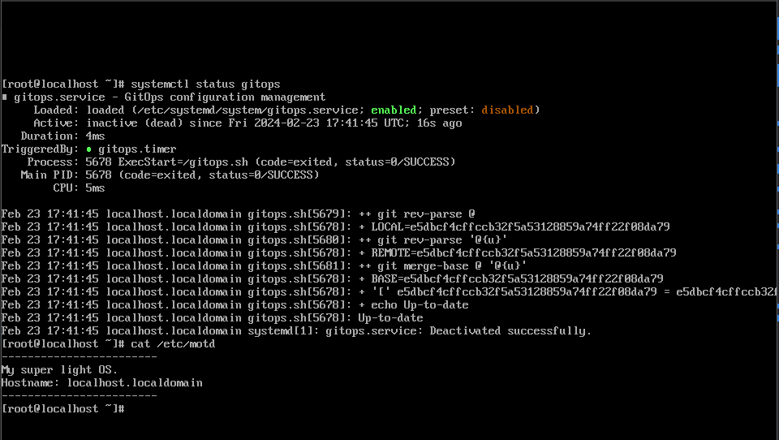
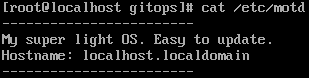
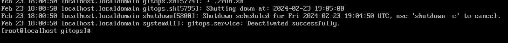
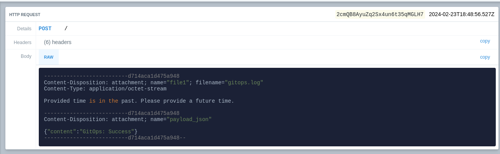

## Table of contents

<div class="toc">

\\{\\{ $.TOC }}

</div>

## Introduction

Zero-trust infrastructure is the golden objective of any security-conscious organization. The fact that you let no one and nothing inside your infrastructure without proper verification is the ultimate goal.

Pull-based GitOps helps to achieve this by prioritizing automated infrastructure management over manual "push" commands by using Git as the source of truth. Permissions are handled at the Git level, and the infrastructure is automatically updated based on the changes in the Git repository. No need to access the infrastructure directly to make changes.

In this article, I will present how to set up a SystemD service (or with any other init system) to achieve pull-based GitOps on VMs without the need to use Ansible.

## The recipe for pull-based GitOps

Let's take ArgoCD as an example. ArgoCD is a pull-based GitOps tool that automatically updates the applications deployed on Kubernetes based on the changes in the Git repository.

ArgoCD achieves this by:

- Watching the Git repository for changes using a polling strategy. (Or open a public endpoint for webhooks.)
- Pulling the changes from the Git repository and comparing the old manifests with the new one, called the `Refresh` action.
- Applying the changes to the Kubernetes cluster, called the `Sync` action on ArgoCD.

These steps are quite easy to implement, and we will see that later. However, for the developer experience, we also need:

- A way to get feedback about the state and the logs of the deployment.
- For VM, a way to reboot remotely by Git.

To get feedback about the state and the logs of the deployment, we need, from the node, to push the information to a central location. We can use any webhooks for this, so let's simply use a Discord Webhook.

To reboot a VM, we must avoid creating a boot loop and compare "boot" states. Basically, simply create timestamps to schedule reboot(s).

Now, that we have the recipe, let's see how to implement it.

## Understanding the init system and service management

Do you remember how a Linux system boots? It starts in this order:

1. The BIOS/UEFI. The BIOS/UEFI is the first thing that is started when the computer is powered on. It is responsible for initializing the hardware and starting the bootloader.
2. The bootloader which is often GRUB. Clusters tend to use iPXE or PXE for network booting. The bootloader loads the kernel and the initramfs. The configuration stored in `/boot` often look like this:

   ```shell
   menuentry "Arch Linux" {
       # Label of the disk to find the loader and inird.
       volume   "Arch Linux"
       # Kernel
       loader   /boot/vmlinuz-linux
       # Init RAM disk file
       initrd   /boot/initramfs-linux.img
       # Linux boot cmd. `root` indicates to mount the following volume as the root file system.
       options  "root=UUID=5f96cafa-e0a7-4057-b18f-fa709db5b837 rw"
   }
   ```

3. The initramfs and kernel stored in `/boot`. The initramfs is a temporary file system that is loaded into memory and used to mount the root file system. The kernel is the core of the operating system and is responsible for managing the hardware and starting the init system.
4. The init system. The init system is the first process that is started by the kernel and is responsible for starting all other processes. Most of the time, the first executable is `/sbin/init` or `/usr/lib/systemd/systemd`. Since this is the first process, it has the process ID 1.

SystemD is quite complex and supports many features (so many that it is called "bloated", but let's ignore that). It is the default init system on most Linux distributions, including Ubuntu, Fedora, Red Hat, CentOS, and Debian. Some distributions, like Alpine Linux, use simpler and easy to explain init system OpenRC or Runit.

SystemD is able to handle services, sockets, timers, and targets ("boot stages"), which makes it a good candidate for our GitOps implementation:

- To watch the Git repository for changes, we can use a timer, which is a unit that activates and deactivates other units based on time.
- We use targets to make sure the VM is in a good state before applying the changes. We want to boot after the ready is fully ready, so after the [`network-online.target` is reached](https://www.freedesktop.org/wiki/Software/systemd/NetworkTarget/).
- We use services to supervisor the process and avoid zombie or duplicate processes.

Note that SystemD is able to handle a complex dependency graph. We will see later how to configure the service with its dependencies. For now, let's implement the boot script/program used to pull the changes from the Git repository, compare them and apply them.

## Implementing the script

We will use a simple shell script to pull the changes from the Git repository, compare them, and apply them.

**server-side script: /gitops.sh**

```shell
#!/bin/bash

# REPO_URL must be set as an environment variable.

# x: debug
# e: exit on error
# u: exit on undefined variable
# o pipefail: exit on error in pipe
set -eux -o pipefail

REPO_URL=${REPO_URL:-'https://github.com/Darkness4/node-config.git'}
OUTPUT_DIR=/gitops

# Make nothing is world-readable.
umask 077

if [ ! -d "$OUTPUT_DIR" ]; then
  git clone "$REPO_URL" "$OUTPUT_DIR"
  cd "$OUTPUT_DIR"
  ./run.sh # We assume the entrypoint.sh is the script to apply the changes.
else
  cd "$OUTPUT_DIR"

  git fetch

  # Compare changes
  LOCAL=$(git rev-parse @)
  REMOTE=$(git rev-parse '@{u}')
  BASE=$(git merge-base @ '@{u}')

  if [ $LOCAL = $REMOTE ]; then
    echo "Up-to-date"
  elif [ $LOCAL = $BASE ]; then # Local is not remote, but the commit is in the history of the remote.
    echo "Need to pull"
    git pull
    ./run.sh
  elif [ $REMOTE = $BASE ]; then # Local is not remote, but the commit is not in the history of the remote (but still mergeable).
    echo "Need to push"
    exit 1
  else # The commit is not in the history of the remote and not mergeable.
    echo "Diverged"
    exit 1
  fi
fi
```

!!!note NOTE

It is very possible that you need to use a private/deploy key to pull the configuration. You've got at least three solutions:

- At build time, inject the private key in the OS image. This is the least flexible solution and not very secure if you plan to share that OS image.
- At run time, prepare the private key in a volume and mount it in the VM. This is the most flexible solution, but needs a two-step setup.
- At run time, use the SSH Host Key to log in to the Git repository. This is the most secure solution, but you need to enter to the VM to fetch the public key of all the hosts. This also doesn't work for stateless VMs.

To summarize, you need to have a private key and secure it using Linux permissions (`chmod 600`). The third method is the safest because you can whitelist per-node. The second method is the most flexible since you manage only one key for all the nodes.

If you opt for any method, add the following line to the script:

```shell
# ...

REPO_URL=${REPO_URL:-'https://github.com/Darkness4/node-config.git'}
OUTPUT_DIR=/gitops
# Use /path/to/key for the first and second method.
# Use /etc/ssh/ssh_host_ed25519_key for the third method. Export the public key /etc/ssh/ssh_host_ed25519_key.pub to the Git repository.
export GIT_SSH_COMMAND='ssh -i </path/to/key> -o IdentitiesOnly=yes -o StrictHostKeyChecking=no -o UserKnownHostsFile=/dev/null'

# ...
```

Remember to `chmod 600` the key file.

!!!

To avoid configuring that script for each, I recommend injecting the script directly in the OS image (we'll see that later). If your nodes are stateful, you can push the script using Ansible, or simply with parallel SSH since we are trying to avoid using Ansible. If you use cloud-init, you can use the `write_files` directive to inject the script.

Let's create a simple post boot script inside a Git repository:

**run.sh**

```shell
#!/bin/sh

cat <<EOF >/etc/motd
------------------------
My super light OS.
Hostname: $(hostname)
------------------------
EOF
```

Example: [github.com/Darkness4/node-config](https://github.com/Darkness4/node-config).

That's should be enough, with this simple entry point, we will be able to update the node remotely without having to access it directly. We will create a script to reboot if necessary. Let's configure the SystemD service.

## Configuring the SystemD service

Let's create the service:

**server-side: /etc/systemd/system/gitops.service**

```shell
[Unit]
Description=GitOps configuration management
Wants=network-online.target
After=network-online.target

[Service]
User=root
ExecStart=/gitops.sh
Type=simple

[Install]
WantedBy=multi-user.target
```

Either add the service to your OS image (we'll see that later), or use Ansible or parallel SSH to push the service to the nodes.

Now, let's create the timer:

**server-side: /etc/systemd/system/gitops.timer**

```shell
[Unit]
Description=Run GitOps every 5 minutes

[Timer]
OnBootSec=5min
OnUnitActiveSec=5min
Unit=gitops.service

[Install]
WantedBy=timers.target
```

If you are not using SystemD, replace the timer by a cron job:

```shell
*/5 * * * * root rc-service gitops start # Or systemctl start gitops.service, anything that start the service.
```

Add the service to your OS image (we'll see that later), or use Ansible or parallel SSH to push the service to the nodes.

Now, let's enable and start the timer:

```shell
# Enable the timer
systemctl enable gitops.timer
# Start on boot
systemctl enable gitops.service
```

!!!note NOTE

If you are building an OS image, it is very possible that you are not able to run `systemctl`, therefore, create the symlink manually:

```shell
ln -s /etc/systemd/system/gitops.timer /etc/systemd/system/timers.target.wants/gitops.timer
ln -s /etc/systemd/system/gitops.service /etc/systemd/system/multi-user.target.wants/gitops.service
```

!!!

## Building the OS image

In one of [my previous article](/blog/2023-09-16-road-to-replicable-infrastructure#building-the-squashfs-image), I described how to build an OS image from scratch using Docker and the `gentoo/stage3` container. While this method allow the creation of OSes without any bloat, it is not the most user-friendly method. I also want to take account that most of the readers want to use specifically binary OSes to avoid compiling on the nodes

!!!note NOTE

Technically, you can use the [Gentoo Binary Host](https://wiki.gentoo.org/wiki/Gentoo_Binary_Host_Quickstart) if you want to [deploy your own binary software](https://wiki.gentoo.org/wiki/Binary_package_guide) on Gentoo.

This will permit you to create you own custom OS and binary repository. Basically, a way to fully avoid supply chain attacks. Isn't that cool?

!!!

For this article, we will use Packer and Rocky Linux to build the OS image. Packer automates the creation of OS images by using a VM. It is a good tool to use when you want to create OS images for different cloud providers.

It is also possible to "chain" Packer and Terraform, but we won't do that in this article. Everything will be done locally:

1. Install [Packer](https://www.packer.io).

2. Create a directory for the Packer configuration:

   ```shell
   mkdir -p ubuntu-gitops
   cd ubuntu-gitops
   ```

3. Let's configure the template. We'll use QEMU to build our image. You can use VirtualBox or VMware if you prefer.

   **ubuntu-gitops/template.pkr.hcl**

   ```hcl
   packer {
     required_plugins {
       qemu = {
         source  = "github.com/hashicorp/qemu"
         version = "~> 1"
       }
     }
   }

   variable "boot_wait" {
     type    = string
     default = "3s"
   }

   variable "disk_size" {
     type    = string
     default = "50G"
   }

   variable "iso_checksum" {
     type    = string
     default = "eb096f0518e310f722d5ebd4c69f0322df4fc152c6189f93c5c797dc25f3d2e1"
   }

   variable "iso_url" {
     type    = string
     default = "https://download.rockylinux.org/pub/rocky/9/isos/x86_64/Rocky-9.3-x86_64-boot.iso"
   }

   variable "memsize" {
     type    = string
     default = "2048"
   }

   variable "numvcpus" {
     type    = string
     default = "4"
   }

   source "qemu" "compute" {
     accelerator      = "kvm"
     boot_command     = ["<up><tab><bs><bs><bs><bs><bs> inst.ks=http://{{ .HTTPIP }}:{{ .HTTPPort }}/ks.cfg inst.cmdline<enter><wait>"]
     boot_wait        = "${var.boot_wait}"
     communicator     = "none"
     cpus             = "${var.numvcpus}"
     disk_size        = "${var.disk_size}"
     headless         = true
     http_directory   = "http"
     iso_checksum     = "${var.iso_checksum}"
     iso_url          = "${var.iso_url}"
     memory           = "${var.memsize}"
     cpu_model        = "host"
     qemuargs         = [["-serial", "stdio"]]
     shutdown_timeout = "3h"
     vnc_bind_address = "0.0.0.0"
   }

   build {
     sources = ["source.qemu.compute"]
   }
   ```

   If this is your first time using Packer, let me explain the configuration:

   - `boot_wait` is the time to wait for the boot to complete. More precisely, it is the time to wait for the UEFI boot to complete before sending the boot command to the bootloader.
   - `boot_command` is command and key presses to send after the boot. Since Rocky Linux uses GRUB, we ask GRUD to delete `quiet` (5 backspaces) and replace it with a custom one. We also ask GRUB to use a kickstart file to install the OS. The kickstart file is a file that contains the installation instructions for the OS. We will create it later.
   - `http_directory` is the directory to serve the kickstart file. We will create it later.

   The rest of the configuration is self-explanatory. Packer uses VNC, so you could use [Remmina](https://remmina.org) to debug the installation.

   Run the following command to install the `qemu` plugin:

   ```shell
   packer init .
   ```

   You should also install `qemu` by the way. I'll let you Google for it.

   4. Create the kickstart file inside the `http` directory (you have to create it):

   **ubuntu-gitops/http/ks.cfg**

   ```shell
   url --url="https://dl.rockylinux.org/pub/rocky/9.3/BaseOS/x86_64/os/"
   # License agreement
   eula --agreed
   # Disable Initial Setup on first boot
   firstboot --disable
   # Poweroff after the install is finished
   poweroff
   # Firewall
   firewall --disable
   ignoredisk --only-use=vda
   # System language
   lang en_US.UTF-8
   # Keyboard layout
   keyboard us
   # Network information
   network --bootproto=dhcp --device=eth0
   # SELinux configuration
   selinux --disabled
   # System timezone
   timezone UTC --utc
   # System bootloader configuration
   bootloader --location=mbr --driveorder="vda" --timeout=1
   # Root password
   # WARNING: Change the root password or remove this line. You can set the SSH public keu in the %post section.
   rootpw --plaintext changeme
   # System services
   services --enabled="chronyd"

   repo --name="AppStream" --baseurl=https://dl.rockylinux.org/pub/rocky/9.3/AppStream/x86_64/os/
   #repo --name="Extras" --baseurl=https://dl.rockylinux.org/pub/rocky/9.3/extras/x86_64/os/
   #repo --name="CRB" --baseurl=https://dl.rockylinux.org/pub/rocky/9.3/CRB/x86_64/os/
   #repo --name="epel" --baseurl=https://mirror.init7.net/fedora/epel/9/Everything/x86_64/
   #repo --name="elrepo" --baseurl=http://elrepo.org/linux/elrepo/el9/x86_64/

   # Clear the Master Boot Record
   zerombr
   # Remove partitions
   clearpart --all --initlabel
   # Automatically create partition
   part / --size=1 --grow --asprimary --fstype=xfs

   # Postinstall
   %post --erroronfail
   cat << 'EOF' > /gitops.sh
   #!/bin/bash

   # REPO_URL must be set as an environment variable.
   mkdir -m0700 /root/.ssh/

   cat <<EOF >/root/.ssh/authorized_keys
   ssh-ed25519 AAAAC3NzaC1lZDI1NTE5AAAAIDUnXMBGq6bV6H+c7P5QjDn1soeB6vkodi6OswcZsMwH marc
   EOF

   chmod 0600 /root/.ssh/authorized_keys

   # x: debug
   # e: exit on error
   # u: exit on undefined variable
   # o pipefail: exit on error in pipe
   set -eux -o pipefail

   # Make nothing is world-readable.
   umask 077

   REPO_URL=${REPO_URL:-'https://github.com/Darkness4/node-config.git'}
   OUTPUT_DIR=/gitops

   if [ ! -d "$OUTPUT_DIR" ]; then
     git clone "$REPO_URL" "$OUTPUT_DIR"
     cd "$OUTPUT_DIR"
     ./run.sh # We assume the entrypoint.sh is the script to apply the changes.
   else
     cd "$OUTPUT_DIR"

     git fetch

     # Compare changes
     LOCAL=$(git rev-parse @)
     REMOTE=$(git rev-parse '@{u}')
     BASE=$(git merge-base @ '@{u}')

     if [ $LOCAL = $REMOTE ]; then
       echo "Up-to-date"
     elif [ $LOCAL = $BASE ]; then # Local is not remote, but the commit is in the history of the remote.
       echo "Need to pull"
       git pull
       ./run.sh
     elif [ $REMOTE = $BASE ]; then # Local is not remote, but the commit is not in the history of the remote (but still mergeable).
       echo "Need to push"
       exit 1
     else # The commit is not in the history of the remote and not mergeable.
       echo "Diverged"
       exit 1
     fi
   fi
   EOF
   chmod +x /gitops.sh
   cat << 'EOF' > /etc/systemd/system/gitops.service
   [Unit]
   Description=GitOps configuration management
   Wants=network-online.target
   After=network-online.target

   [Service]
   User=root
   ExecStart=/gitops.sh
   Type=simple

   [Install]
   WantedBy=multi-user.target
   EOF
   ln -s /etc/systemd/system/gitops.service /etc/systemd/system/multi-user.target.wants/gitops.service

   cat << 'EOF' > /etc/systemd/system/gitops.timer
   [Unit]
   Description=Run GitOps every 5 minutes

   [Timer]
   OnBootSec=5min
   OnUnitActiveSec=5min
   Unit=gitops.service

   [Install]
   WantedBy=timers.target
   EOF
   ln -s /etc/systemd/system/gitops.timer /etc/systemd/system/timers.target.wants/gitops.timer
   %end

   %packages --excludedocs
   @minimal-environment
   git

   -plymouth
   # Remove Intel wireless firmware
   -i*-firmware
   %end

   ```

   5. Run the following command to build the OS image:

   ```shell
   packer build .
   ```

## Testing

Let's launch the OS image using QEMU. I'm going to use `virt-manager`:

1. Import existing disk image. Forward.
2. "Browse...". Select the OS image (`/path/to/output-compute/packer-compute`). Select `Rocky Linux 9 (rocky9)`. Forward.
3. Select your memory and CPUs. Forward.
4. Create a disk. Forward.
5. Name. Network: NAT. Finish.

Start the VM. And hey it works:



Let's change the postscript to:

```shell
#!/bin/sh

cat <<EOF >/etc/motd
------------------------
My super light OS. Easy to update.
Hostname: $(hostname)
------------------------
EOF
```

And wait 5 minutes...:



We've finally GitOps set up!

## (Optional) Make the node reboot

The best way to make the node reboot and avoid a boot loop is by using the time. You can also use the fact that your node is stateful and create a file to indicate that the node has rebooted.

**server-side: run.sh**

```shell
# ...

schedule_reboot() {
  # Format is "YYYY-MM-DD HH:MM:SS"
  datetime=$1

  # Convert input to epoch time
  epoch_time=$(date -d "$datetime" +%s)

  # Current epoch time
  current_time=$(date +%s)

  # Calculate time difference in seconds
  time_diff=$((epoch_time - current_time))

  # Check if the provided time is in the past
  if [ $time_diff -le 0 ]; then
    echo "Provided time is in the past. Please provide a future time."
    return
  fi

  # Schedule reboot
  echo "Reboot at: $datetime"
  shutdown -r +$((time_diff / 60))
}

schedule_reboot "2024-02-23 19:05:00"
```

Commit & push.

If we wait and look at the journal or status `journalctl status gitops.service`:



## (Optional) Fetch the status and logs

Basically, we need to fetch the logs and the return code of the script and push them to the Webhook:

1. [Create a Discord Webhook](https://support.discord.com/hc/en-us/articles/228383668-Intro-to-Webhooks).

2. In the Git repository, copy the `run.sh` script to `post.sh`.

3. Edit the `run.sh` script and replace everything with:

   ```shell
   #!/bin/sh

   chmod +x ./post.sh
   if ./post.sh | tee /var/log/gitops.log; then
     curl -F "file1=@/var/log/gitops.log" -F 'payload_json={"content":"GitOps: Success"}' <webhook>
   else
     curl -F "file1=@/var/log/gitops.log" -F 'payload_json={"content":"GitOps: Failure"}' <webhook>
   fi
   ```

**Be aware that the webhook is a secret. Make your post scripts Git repository private.** For the sake of the example, I will be using a request bin.

Result:



## (Optional) Using a webhook to trigger the service

While this is contrary to "pull-based" GitOps, you sometime want to force the update of the node. You can use a webhook to trigger the service.

The objective is to create a simple HTTP server that listens for a POST request and triggers the service. The best way is to use a python script:

**server-side: /gitops.py**

```python
from http.server import BaseHTTPRequestHandler, HTTPServer
import subprocess

class RequestHandler(BaseHTTPRequestHandler):
    def do_POST(self):
        self.send_response(200)
        self.end_headers()
        # Trigger systemctl restart gitops.service
        subprocess.run(['systemctl', 'restart', 'gitops.service'])

def run(server_class=HTTPServer, handler_class=RequestHandler, port=8000):
    server_address = ('', port)
    httpd = server_class(server_address, handler_class)
    print(f"Starting server on port {port}")
    httpd.serve_forever()

if __name__ == "__main__":
    port = int(os.environ.get('PORT', 8000))
    run(port=port)
```

This server will trigger `systemctl restart gitops.service` when a POST request is received.

You can install that script via `run.sh` or install it directly in the OS image. Just don't forget to run it as a service:

```shell
[Unit]
Description=GitOps Webhook
After=network-online.target

[Service]
User=root
ExecStart=/usr/bin/python3 /gitops.py
Type=simple

[Install]
WantedBy=multi-user.target
```

Enable the service:

```shell
systectl enable gitops-webhook
# Or:
ln -s /etc/systemd/system/gitops-webhook.service /etc/systemd/system/multi-user.target.wants/gitops-webhook.service
```

You will need to expose this server to the internet. Either use an NGINX or Traefik to route properly the request to the server.

## Conclusion and Discussion

As you can see, with a pull-based GitOps, we avoid interacting with the infrastructure directly. We also don't need a management
server to push the changes to the infrastructure. The only part that is quite "ugly" is the manner we are handling the private
key to pull the configuration.

`cloud-init` suffer from the same disadvantage, but some cloud providers have a way to inject the private key in the VM using a disk.
Other cloud providers tries to obfuscate the HTTP server that serves the cloud-init configuration, but it is still possible to fetch the
configuration. The best method is still the third one: using the SSH Host Key to log in to the Git repository as they are generated.

This method could also work for Ansible by making a "GitOps" Ansible server where the timer executes the playbook.

Lastly, let's compare with other tools:

- Ansible and Puppet Bolt: Ansible and Puppet Bolt are push-based tools. Playbooks can be stored inside a Git repository, but the changes are pushed to the infrastructure using SSH. While it is close to GitOps, it doesn't allow a Zero-Trust infrastructure. Using SystemD, you might be able to achieve zero-trust by tracking the playbook changes on a Git repository.
- Puppet: Puppet is a pull-based tool, and it requires a Puppet server and agents to configure the servers, and the agents pull the instructions from the Puppet server. It's quite heavy and uses Ruby/Puppet DSL as configuration language. I'm not experienced enough to tell if Puppet is able to achieve zero-trust infrastructure, but what I'm certain is it is quite complex, and it's not entirely Open Source.
- Chef: Chef is a pull-based tool, and it requires a Chef server and agents to configure the servers, and the agents pull the instructions from the Chef server. And, same as Puppet, it's quite heavy and uses Ruby as configuration language. I'm not experienced enough to tell if Chef is able to achieve zero-trust infrastructure, but what I'm certain is it is quite complex, and it's not entirely Open Source.
- SaltStack: SaltStack is a pull-based tool, and it requires a SaltStack server and agents to configure the servers, and the agents pull the instructions from the SaltStack server. It's quite heavy and uses Python as configuration language. I'm not experienced enough to tell if SaltStack is able to achieve zero-trust infrastructure, but what I'm certain is it is quite complex, and it's not entirely Open Source.

As you can see, I'm not very experienced with Chef, Puppet, and SaltStack. And the reason is simple, they are not newbie friendly and certainly doesn't try to be "Zero-Trust" first.

However, for all of these tools, something is very clear:

- They are not designed to be "Zero-Trust" first.
- They wrap their modules around tools, which means they are sensitive to breaking change. I'm not even sure if they work on Gentoo Linux.
- Some of them are not entirely Open Source.

In these recent years, supply chain attacks have been more and more common. Every non-Open Source, non-standard tool is a potential threat. This is why I'm trying to avoid using them. SystemD is stable, and git is stable. They are no reason to not use them.

**"What about state recovery and inventory? For example, I want to deploy a Ceph infrastructure."**

Quite the question. About state recovery, using my method, you'll have to do it yourself. Compared to existing tool like Ansible, they have already made modules about state recovery. One option is to combine Ansible and SystemD like I said earlier. You would use a service to pull the Ansible playbook and execute it. Honestly, the best way is to [set up a stateless OS with minimal tooling](/blog/2023-09-16-road-to-replicable-infrastructure) to reduce dramatically the attack surface. The second option is to back up the OS before pushing a Git config (which no one will do). The third option is to configure a "teardown" stage in the `gitops.sh` script. If you want to think more like the "Kubernetes"-way, the fourth option is to configure a "reconcilement" stage in the `gitops.sh` script.

!!!note NOTE

On Kubernetes, there are controllers that are able to "reconcile" the state of the cluster. The most famous one is the [Deployment](https://kubernetes.io/docs/concepts/workloads/controllers/deployment/). The Deployment controller is able to reconcile the state of the cluster by comparing the desired state with the actual state. If the actual state is different from the desired state, the Deployment controller will apply the changes to the cluster.

Developing a controller is often to implement two things:

1. The specification of the resource. The specification is the desired state of the resource.
2. The reconciliation loop. The reconciliation loop is the process of comparing the actual state of the resource with the desired state and applying the changes to the resource if necessary.

This is very common, especially when developing an Operator. An Operator is a Kubernetes controller that is able to manage a custom resource. Software DevOps/Platform engineers often develop an Operator to manage a custom resource that is specific to their application (a smart-contract from the Ethereum blockchain for example).

If we were to develop this "reconcilement" stage, we would need to develop the specification first. This could become very complex, so it's better to develop in another programming language. Ansible uses an "inquiring" strategy to compare the desired state with the actual state. Whether it's a good idea to use Ansible for this is another question.

!!!

About inventory, you can use `hostname` in the scripts to create node specific configuration. If you want to work with "tags", just do some Bash programming. After all, Ansible is just some Python programming.

And about Ceph, well... Ceph does not recommend Ansible anymore, and they recommend [Cephadm](https://docs.ceph.com/en/reef/cephadm/install/#cephadm-deploying-new-cluster) and [Rook](https://rook.io). I recommend using Rook too since I've used it personally, and it's quite stable. Using [ArgoCD](https://argoproj.github.io/cd/) or [Flux](https://fluxcd.io), you could do GitOps with Rook.

In reality, if I'm starting an infrastructure from scratch, I would deploy a Kubernetes cluster with [K0s](https://k0sproject.io) since their configuration is declarative, which allows push-based GitOps (but we configure our Kubernetes only when deploying or upgrading it, it's not that frequent and that requires admin privileges). Then, I would use ArgoCD or Flux to deploy my application, Rook to deploy Ceph, [KubeVirt](https://kubevirt.io) to deploy VMs, [MetalLB](https://metallb.universe.tf) to deploy a LoadBalancer, ... You name it.

By the way, did you know that is blog is deployed using GitOps? I don't have to access my Kubernetes server to deploy a new version of this blog. Also, since GitOps is too heavy, I'm simply using a CronJob with a Kubernetes Service Account to refresh my Deployment. Isn't that cool?

Anyway, I hope you enjoyed this article. If you have any questions, feel free to email me.
