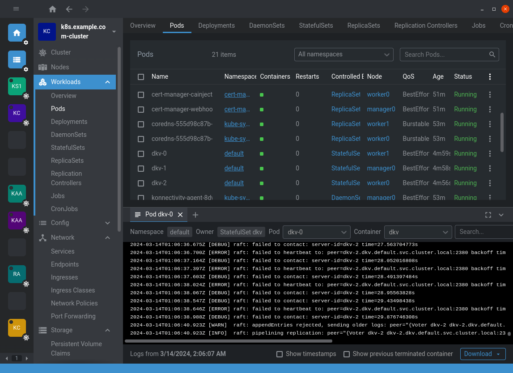

## Table of contents

<div class="toc">

\\{\\{ $.TOC }}

</div>

<hr>

## Introduction

I've just read the book by Travis Jeffery, ["Distributed Services with Go"](https://www.google.com/search?q=978-1680507607) and I wanted to share a simple example of a distributed system in Go.

In his book, Travis Jeffery doesn't really define what a distributed system is, but focuses on implementing a "reliable, scalable, and maintainable system" as per the subtitle of the book, which is a fine and practical approach if you wish to really learn a production-ready example. However, he doesn't explain his choice of tools and libraries, which is a bit frustrating when it's a book about "implementing".

Thus, he creates a Go service with gRPC, OpenTelemetry, LB, and other tools to create a reliable distributed system.

The objective of this article is to create a **simple** example of distributed system and focus on the distributed aspect of the system. Whether you implement gRPC as transport or OpenTelemetry for observability is up to you. I made the choice to use different technologies than Travis Jeffery to give you a different perspective.

**Before starting, a few words about what has changed since the writing of Travis Jeffery's book:**

- Go 1.22 is out. Many standard libraries have deprecated/moved some functions: [`ioutil` has been deprecated](https://pkg.go.dev/io/ioutil), [`boltdb` is less efficient than `pebble`](https://github.com/kevburnsjr/badger-bench/blob/shards/results.txt), etc...
- The book uses some libraries that are simply non-standard like `go-mmap`, while he could have used the `syscall` library.
- He forked `hashicorp/raft-boltdb` to use `etcd-io/bbolt` instead of `boltdb/bolt`.

This article will try to stick to the standard library as much as possible, though I cannot guarantee that it will be deprecated in the future.

We will also fork `hashicorp/raft` to implement a custom RPC and fix the network layer to allow mutual TLS (which, by the way, Travis Jeffery didn't do). Forking this library is almost necessary since `hashicorp/raft` is "too" close to the paper and didn't think about possible extensions.

Let's start with a few definitions.

## What is a distributed system?

A distributed system is a system whose components are located on different networked computers, which communicate and coordinate their actions by passing messages to one another to achieve a common goal.

One style of distributed system is called "fault-tolerant distributed system", or basically replicated services which communicate with each other to ensure that the system is always available and that the data is always consistent.

As you may know, you have two type of services:

- **Stateless services**: They don't store any state alongside the process. They are easy to scale and are fault-tolerant by design. They are also easy to implement and maintain.

  ```d2
  user: User {
   shape: person
  }
  lb: Load Balancers {
    grid-columns: 1
    lb1 <-> lb2
  }
  services: Services {
    grid-columns: 1
    service1
    service2
  }
  db: Databases {
    grid-columns: 1
    db1 <-> db2
  }
  services.service1 -> db.db1
  services.service2 -> db.db2
  lb.lb1 -> services.service1
  lb.lb2 -> services.service2
  user -> lb.lb1
  user -> lb.lb2
  ```

  Stateless services don't really need to communicate with each other. They can use their "already" distributed database or event broker to communicate with each other.

  Often, this is the architecture you want to follow when you can delegate the state to a database, or the commands to an event broker.

- **Stateful services**: The service has some kind of state, like a persistent storage.

  ```d2
  user: User {
   shape: person
  }
  lb: Load Balancers {
    grid-columns: 1
    lb1 <-> lb2
  }
  services: Services {
    grid-columns: 1
    service1 <-> service2
  }
  lb.lb1 -> services.service1
  lb.lb2 -> services.service2
  user -> lb.lb1
  user -> lb.lb2
  ```

  This time, the services need to communicate with each other to ensure that the state is consistent across the cluster.

  This architecture is used when your "state" is a lot more complex and cannot be delegated to a database or an event broker. There could also be because of latency issues with the database or the event broker.

The article aims to implement a simple example of distributed stateful service. There are already plentiful guides (and even architecture) about creating distributed stateless services with an event broker or a distributed database/lock.

Instead, let's look examples of already existing distributed systems.

## Examples of stateful distributed systems

### ETCD

Let's start with [etcd](https://etcd.io), a distributed key-value store. ETCD is often the "base" of many distributed systems like Kubernetes, ArgoCD, etc... because, as a key-value store, it is observable, scalable, and fault-tolerant. It serves as a good distributed lock and a good distributed configuration store.

In distributed systems, replication is a key feature to scale up. Being able to automatically scale up a stateful system is one of the main objectives to any Site-Reliability Engineer. If you look at MySQL or PostgreSQL, it is very easy to deploy "read-only" replicas. However, it's a lot more complex to deploy "write" replicas. MySQL and PostgreSQL have a "source" and "replicas" architecture, where the "source" is the only one that can write and the "replicas" can only read. The problem with this architecture is that if the "source" goes down, the "replicas" cannot write, and you will need to manually promote a "replica" into a new "source".

However, instead of using a "source-replicas" architecture, ETCD uses a "leader-elected" architecture through the Raft consensus algorithm. A consensus algorithm elects a "leader" that can write, and the "followers" can only read. If the "leader" goes down, a new "leader" is elected through some kind of voting. This is an automated process and doesn't require any manual intervention.

References:

- [etcd - Raft](https://github.com/etcd-io/raft)

### Bitcoin

Bitcoin is a decentralized cryptocurrency, though I want to talk about its blockchain. If you don't already know, a blockchain is simply a linked list (or a queue) of blocks. A block contains diverse data like the hash of the previous block, or the list of transactions.

What's the most interesting is how the blockchain is replicated across the network. The blockchain is **very** similar to etcd, but instead of replicating a key-value store, it replicates a linked list. The blockchain also uses a different consensus algorithm called "Proof of Work" (PoW) to elect a "leader" that can write a new block. This algorithm doesn't elect through voting, but via some kind of competition: the first one to solve a complex mathematical problem can write a new block.

There is also additional major difference with Bitcoin and etcd: its node discovery strategy. Because Bitcoin is a public cryptocurrency, Bitcoin uses hard-coded bootstrap nodes to discover new "actual" nodes. Comparatively, ETCD is either configured statically or through a discovery service.

!!!note NOTE

[`goquorum`](https://github.com/Consensys/quorum), a fork of `go-ethereum`, uses the same consensus algorithm as etcd for private blockchains. As you can see, `etcd` is quite similar to a blockchain.

!!!

References:

- [etcd - Clustering Guide](https://etcd.io/docs/v3.5/op-guide/clustering/)
- [Bitcoin's P2P Network](https://nakamoto.com/bitcoins-p2p-network/)

### IPFS

The [InterPlanetary File System (IPFS)](https://ipfs.tech) is a content delivery network (CDN) built to distribute data around the world. IPFS is a lot more complex than etcd and Bitcoin:

- Because it is a distributed file system, the node discovery is a different and not all nodes are equal. IPFS store files in block with ID. Each IPFS node uses "Want lists" to exchange data with other nodes. The "Want list" is a list of blocks that the node wants to retrieve from other nodes. The "Want list" is also used to discover new nodes. This is called the "BitSwap" protocol.
- IPFS uses a distributed hash table (DHT) containing keys mapped to values. There are 3 types of keys: One to search for blocks. One to resolve identities/names. One to search for peers that may be reached. As said in the article: "it's a catalog and a navigation system to search for blocks". Bitcoin and etcd don't have this kind of system. To spread information, Bitcoin uses the "gossip" protocol and etcd uses RPCs of the "Raft" consensus algorithm.

Overall, IPFS is drastically different from etcd and Bitcoin. IPFS aims to distribute files across partially the network and follows an approach similar to BitTorrent. P2P and BitSwap is used to exchange data, while DHT is used to routes the data. No consensus algorithm is used since the "writer" is not replicated, as we do not care about fault-tolerance on the writer.

However, if you want to replicate the writer, you can use [IPFS Cluster](https://ipfscluster.io) which can uses CRDT (Conflict-free Replicated Data Types) or Raft (log-based replication) as consensus algorithm.

References:

- [IPFS - BitSwap](https://docs.ipfs.io/concepts/bitswap/)
- [IPFS - DHT](https://docs.ipfs.io/concepts/dht/)
- [IPFS Cluster - Architecture Overview](https://ipfscluster.io/documentation/deployment/architecture/)
- [Bitcoin's P2P Network - Network Level Privacy](https://nakamoto.com/bitcoins-p2p-network/#network-level-privacy)
- [etcd - Raft RPCs](https://github.com/etcd-io/raft/blob/main/raftpb/raft.proto)
- [etcd - Raft Paper Page 4](https://raft.github.io/raft.pdf)

### Summary

As you can see, the "distributed" aspect of the fault-tolerant system can be summarized in three points:

- **Node discovery**: How do nodes discover each other? Are all nodes equal? How do they exchange data?
- **Consensus algorithm/Writer election**: How do nodes elect a leader? How do they ensure that the data is consistent?
- **Data exchange/spreading**: How do nodes exchange data? How do they ensure that the data is consistent?

This article will simply focus on Raft and its paper. We will answer each of these questions while implementing the example.

## The example: A distributed key-value store with Raft

### The objective

The objective of the example is to create a simple distributed key-value store with Raft. Not only this is the most popular example, but it also answers the three questions (node discovery, writer election, data exchange).

Before even starting, I want to say that Raft solves the very issue of "replicated state machines", systems that are stateful because they have a [**finite state** machine](https://en.wikipedia.org/wiki/Finite-state_machine). If you are looking to "distribute" a service with a nondeterministic state machine, I suggest you to stop reading this article and look for a different solution.

### Understanding Raft at its core

Please, do read [the paper](https://raft.github.io/raft.pdf) (part 5) and visit the [official website](https://raft.github.io/) to understand the consensus algorithm. Still, I will try to summarize the paper in a few words. Though, this article doesn't aim to implement Raft from scratch, but to use it as a library.

A stateful service could be defined as a state machine. A state machine is a system that can be in a finite number of states and can change from one state to another. A state machine can be deterministic or nondeterministic. A deterministic state machine is a state machine that can only be in one state at a time and can only change to one state at a time. A nondeterministic state machine is a state machine that can be in multiple states at a time and can change to multiple states at a time.

Replicating deterministic state machines results in fault-tolerance since the replication of the "deterministic" aspect permits the "rebuilding" of the state simply by running the same commands.

### Logs and state machines

Replicated state machines uses logs (an ordered list of commands) which each state machines executes. State machine can be replicated efficiently across the network by simply replicating and running the logs.

Example: If a node goes down, the logs can be used to "replay" the state machine and bring the node back to the same state as the other nodes just by executing the commands written in the logs.

Benefits are immediate. I cite:

> - They ensure _safety_ (never returning an incorrect result) under all non-Byzantine conditions, including
>   network delays, partitions, and packet loss, duplication, and reordering.
> - They are fully functional (_available_) as long as any
>   majority of the servers are operational and can communicate with each other and with clients. Thus, a
>   typical cluster of five servers can tolerate the failure
>   of any two servers. Servers are assumed to fail by
>   stopping; they may later recover from state on stable
>   storage and rejoin the cluster.
> - They do not depend on timing to ensure the consistency of the logs: faulty clocks and extreme message
>   delays can, at worst, cause availability problems.
> - In the common case, a command can complete as
>   soon as a majority of the cluster has responded to a
>   single round of remote procedure calls; a minority of
>   slow servers need not impact overall system performance.

!!!note NOTE

By the way, I hated the fact that Travis Jeffery's book uses logs as an example, which makes things more confusing... He even reused his "homemade" store as the logs store of Raft. I'd prefer he would use something other than the same data structure as Raft's as an example. Here, we will use a simple key-value store instead of a logs store.

!!!

Logs are already implemented in the Raft library, but we still need to define our state machine.

**But!** Before of that, let's start by bootstrapping the project. We will come back to the state machine later.

### Bootstrapping the project

Git clone the following repository:

```shell
git clone -b bootstrap https://github.com/Darkness4/distributed-kv.git
```

The repository is already setup for:

- GitHub Actions.
- Main functions stored in `cmd/dkv` and `cmd/dkvctl`.
- A simple Makefile. (Please read it to understand the commands.)
- A Dockerfile.
- Tools that will be used later.

Commands available are:

- `make all`: compiles the client and server.
- `make unit`: runs unit tests.
- `make integration`: runs integration tests.
- `make lint`: lint the code.
- `make fmt`: formats the code.
- `make protos`: compiles the protocol buffers into generated Go code.
- `make certs`: generates the certificates for the server, client and CA.
- `make clean`: cleans the project.

Now, let's implement the key-value store.

### Implementing the key-value store

#### The state machine

A state machine is defined by state and commands. To define the state machine, start thinking about the commands that can mutate a state. In our case, the commands are:

- `SET(value)`: Set a key to a value.
- `DELETE`: Delete a key.

The state machine of the KV store is actually a composition of state machines, where a key has its own state machine. The state is the value of the key. The state of the KV store is the state of all the keys.

```d2
start {
  shape: circle
}
start -> empty
empty -> empty: DELETE
empty -> set(value): SET(value)
set(value) -> empty: DELETE
set(value) -> set(value): SET(value)
```

#### The implementation

We will use [`pebble`](https://github.com/cockroachdb/pebble) as the persisted KV-store. Feel free to use SQLite or something else. Since we will be also using `pebble` to store the data (the logs of the state machines) of Raft, we kill two birds with one stone.

Create the file `internal/store/persisted/store.go`:

```go
package persisted

import (
  "path/filepath"

  "github.com/cockroachdb/pebble"
)

type Store struct {
  *pebble.DB
}

func New(path string) *Store {
  path = filepath.Join(path, "pebble")
  db, err := pebble.Open(path, &pebble.Options{})
  if err != nil {
    panic(err)
  }
  return &Store{db}
}

func (s *Store) Get(key string) (string, error) {
  v, closer, err := s.DB.Get([]byte(key))
  if err != nil {
    return "", err
  }
  defer closer.Close()
  return string(v), nil
}

func (s *Store) Set(key string, value string) error {
  return s.DB.Set([]byte(key), []byte(value), pebble.Sync)
}

func (s *Store) Delete(key string) error {
  return s.DB.Delete([]byte(key), pebble.Sync)
}

func (s *Store) Close() error {
  return s.DB.Close()
}

```

Write the tests if you want to. [Tests are stored in the repository](https://github.com/Darkness4/distributed-kv/blob/main/internal/store/persisted/store_test.go).

### Using Raft to distribute commands

#### Understanding Raft's lifecycle

Now that we've implemented the store, we need to use Raft to distribute the commands across the network. As we said in the past sections, Raft uses elections to elect a leader that can write to the logs (list of commands). In raft, nodes can be in three states:

- **Follower**: The node is waiting for a leader to send commands.
- **Candidate**: The node is trying to become a leader.
- **Leader**: The node can send commands to the followers.

At the very beginning, all nodes are followers. Only after a timeout (`ElectionTimeout`) without receiving `AppendEntries` RPC that followers become candidates. The candidate sends a `RequestVote` RPC to the other nodes while voting for himself. If the candidate receives a majority of votes, it becomes a leader. If the candidate doesn't receive a majority of votes, it becomes a follower again.

Upon election, leaders will send `AppendEntries` RPCs (hearbeats) to the followers to prevent the election timeout.

```d2
start {
  shape: circle
}
start -> follower
follower -> candidate: ElectionTimeout
candidate -> leader: Majority of votes

candidate -> follower: Discovers current leader or new term
candidate -> candidate: RequestVote
leader -> follower: Discovers server with higher term
```

#### Understanding Raft's RPCs and Term

At its core, Raft has only 2 RPCs:

- `RequestVote`: Sent by candidates to gather votes.
- `AppendEntries`: Sent by leaders to replicate logs. It is also used to send heartbeats.

Since we won't be implementing the internals of Raft (we will use `hashicorp/raft`), I recommend the read the **Figure 2** of the paper to see the parameters and results of each RPC.

The "term" is a number that is incremented every time a new leader is elected. It is used to prevent "old" leaders to send commands to the followers.

Do also note that `hashicorp/raft` implements other RPCs to optimize the consensus algorithm. `hashicorp/raft` also implements the `InstallSnapshot` RPC to compact the logs and restore the logs after a crash, as per the paper.

#### Implementing the Finite State Machine for Raft

##### Define commands for Raft

We will use protocol buffers to define commands for Raft. **Do note that these are the commands for peer-to-peer replication, not the commands for server-to-client.** Transport is already handled by Raft, so you don't need to write a `service`. Heck, you can either use JSON or prefixing a byte to indicate different commands (Travis Jeffery' Method, which is simply too ambiguous 🤦).

1. Create the file `protos/dkv/v1/dkv.proto`:

   ```protobuf
   syntax = "proto3";

   package dkv.v1;

   // Command is a message used in Raft to replicate log entries.
   message Command {
     oneof command {
       Set set = 1;
       Delete delete = 2;
     }
   }

   message Set {
     string key = 1;
     string value = 2;
   }

   message Delete { string key = 1; }

   ```

2. We use [Buf](https://buf.build/) to standardize the protocol buffers layout. Create this file `protos/buf.yaml` to standardize the layout:

   ```yaml
   version: v1
   breaking:
     use:
       - FILE
   lint:
     use:
       - DEFAULT
     service_suffix: API
   ```

3. Now, simply run:

   ```shell
   make protos
   ```

   The directory `gen` should be created. It contains the generated Go code. Feel free to look its implementation as it shows how data is packed and unpacked.

##### Implementing the Finite State Machine

We will use `hashicorp/raft` and not `etcd-io/raft`, because it is more modular and easier to use. `hashicorp/raft` requires us to implement the `raft.FSM` interface.

1. Create the file `internal/store/distributed/fsm.go`:

   ```go
   package distributed

   import (
     dkvv1 "distributed-kv/gen/dkv/v1"
     "encoding/csv"
     "errors"
     "io"

     "github.com/hashicorp/raft"
     "google.golang.org/protobuf/proto"
   )

   var _ raft.FSM = (*FSM)(nil)

   type Storer interface {
     Delete(key string) error
     Set(key, value string) error
     Get(key string) (string, error)
   }

   type FSM struct {
     storer Storer
   }

   func NewFSM(storer Storer) *FSM {
     return &FSM{storer: storer}
   }

   // Apply execute the command from the Raft log entry.
   func (f *FSM) Apply(l *raft.Log) interface{} {
     panic("unimplemented")
   }

   // Restore restores the state of the FSM from a snapshot.
   func (f *FSM) Restore(snapshot io.ReadCloser) error {
     panic("unimplemented")
   }

   // Snapshot dumps the state of the FSM to a snapshot.
   func (f *FSM) Snapshot() (raft.FSMSnapshot, error) {
     panic("unimplemented")
   }
   ```

   We must implement the `raft.FSM` interface. Let's just implement the `Apply` method for now, as this is the most important method.

2. Implement the `Apply` method:

   ```go
   // Apply execute the command from the Raft log entry.
   func (f *FSM) Apply(l *raft.Log) interface{} {
     // Unpack the data
     var cmd dkvv1.Command
     if err := proto.Unmarshal(l.Data, &cmd); err != nil {
       return err
     }

     // Apply the command
     switch c := cmd.Command.(type) {
     case *dkvv1.Command_Set:
       return f.storer.Set(c.Set.Key, c.Set.Value)
     case *dkvv1.Command_Delete:
       return f.storer.Delete(c.Delete.Key)
     }

     return errors.New("unknown command")
   }
   ```

   As you can see, using Protocol Buffers is not only efficient, but also readable.

   Feel free to implement tests for the `Apply` method. [The repository contains the tests and mocks.](https://github.com/Darkness4/distributed-kv/blob/main/internal/store/distributed/store_test.go)

#### The "crash" recovery: snapshots and restoring logs

Raft can use an additional store to compact the logs and restore the logs after a crash. The store is called the file snapshot store (`fss`).

Snapshots are used to quickly restore logs before fetching the rest of the logs from peers after a crash. It is used to compact the logs. Snapshots are taken when the logs reach a certain size.

Internally, this adds another RPC called `InstallSnapshot`. For us, we simply have to implement the `Snapshot`, `Restore` methods of the FSM and define the `raft.FSMSnapshot` interface. `Snapshot` and `Restore` requires us to use `io.ReadCloser` and `io.WriteCloser` (`raft.SnapshotSink`) to read and write the snapshots. To optimize reading and writing the snapshot, we will extend the `Store` to allow an instant "dump" and "restore" of the store.

1. Extend the interface to "dump" the store:

   ```go
   type Storer interface {
     Delete(key string) error
     Set(key, value string) error
     Get(key string) (string, error)
     Dump() map[string]string
     Clear()
   }
   ```

2. Implement the `Snapshot` and `Restore` methods of the FSM. We will use the `csv` library to pack the snapshot since:

   - Our data is a list of strings (basically)
   - It's easy to read and write sequentially, especially for key-value stores.
   - It's faster than JSON and protocol buffers.
   - `csv.Writer` and `csv.Reader` implements `io.Writer` and `io.Reader`, which is required by `raft.SnapshotSink` and `io.ReadCloser`.

   ```go
   // Restore restores the state of the FSM from a snapshot.
   func (f *FSM) Restore(snapshot io.ReadCloser) error {
     f.storer.Clear()
     r := csv.NewReader(snapshot)
     for {
       record, err := r.Read()
       if err == io.EOF {
         break
       }
       if err != nil {
         return err
       }
       if err := f.storer.Set(record[0], record[1]); err != nil {
         return err
       }
     }
     return nil
   }

   // Snapshot dumps the state of the FSM to a snapshot.
   //
   // nolint: ireturn
   func (f *FSM) Snapshot() (raft.FSMSnapshot, error) {
     return &fsmSnapshot{store: f.storer.Dump()}, nil
   }

   var _ raft.FSMSnapshot = (*fsmSnapshot)(nil)

   type fsmSnapshot struct {
     store map[string]string
   }

   // Persist should dump all necessary state to the WriteCloser 'sink',
   // and call sink.Close() when finished or call sink.Cancel() on error.
   func (f *fsmSnapshot) Persist(sink raft.SnapshotSink) error {
     err := func() error {
       csvWriter := csv.NewWriter(sink)
       for k, v := range f.store {
         if err := csvWriter.Write([]string{k, v}); err != nil {
           return err
         }
       }
       csvWriter.Flush()
       if err := csvWriter.Error(); err != nil {
         return err
       }
       return sink.Close()
     }()

     if err != nil {
       if err = sink.Cancel(); err != nil {
         panic(err)
       }
     }

     return err
   }

   // Release is invoked when we are finished with the snapshot.
   func (f *fsmSnapshot) Release() {}
   ```

   Feel free to implement tests for the `Snapshot` and `Restore` methods. [The Git repository contains the tests and mocks](https://github.com/Darkness4/distributed-kv/blob/main/internal/store/distributed/fsm_test.go).

3. Extend the `Store` struct from `internal/store/persisted` to implement the `Storer` interface:

   ```go
   func (s *Store) Dump() map[string]string {
     s.mu.RLock()
     defer s.mu.RUnlock()
     data := make(map[string]string, len(s.data))
     for k, v := range s.data {
       data[k] = v
     }
     return data
   }

   func (s *Store) Clear() {
     s.mu.Lock()
     defer s.mu.Unlock()
     s.data = make(map[string]string)
   }
   ```

#### Preparing the storage for Raft

Raft uses two stores to store logs: the Logs store (`ldb`) and the Stable store (`sdb`). `hashicorp/raft` normally uses `hashicorp/raft-boltdb` to store the logs. However, `boltdb` has fallen out of favor for `pebble` (especially in the blockchain ecosystem) and therefore, it is more appropriate to use `pebble` instead of `boltdb`.

However, we still need to implement the `raft.LogStore` and `raft.StableStore` interfaces for `pebble`. You can use [`weedge`'s `pebble` library](https://github.com/weedge/raft-pebble/tree/main/hashicorp-raft) to implement the interfaces, but, it is preferable to copy the files instead of importing the library to fix breaking changes between `pebble` versions. [You can also copy my implementation from the repository](https://github.com/Darkness4/distributed-kv/tree/main/internal/raftpebble). You could also fork `weedge`'s `pebble` library and fix the breaking changes.

1. Import the "raftpebble" files in the `internal/raftpebble` directory.

2. Create a file `internal/store/distributed/store.go`:

   ```go
   package distributed

   import "github.com/hashicorp/raft"

   const (
     retainSnapshotCount = 2
   )

   type Store struct {
     // RaftDir is the directory where the Stable and Logs data is stored.
     RaftDir string
     // RaftBind is the address to bind the Raft server.
     RaftBind string
     // RaftID is the ID of the local node.
     RaftID string
     // RaftAdvertisedAddr is the address other nodes should use to communicate with this node.
     RaftAdvertisedAddr raft.ServerAddress

     fsm  *FSM
     raft *raft.Raft
   }

   func NewStore(
     raftDir, raftBind, raftID string,
     raftAdvertisedAddr raft.ServerAddress,
     storer Storer,
   ) *Store {
     return &Store{
       RaftDir:            raftDir,
       RaftBind:           raftBind,
       RaftID:             raftID,
       RaftAdvertisedAddr: raftAdvertisedAddr,
       fsm:                NewFSM(storer),
     }
   }

   ```

3. Add the `Open` method, which is used to open the store and the Raft consensus communication:

   ```go
   // ...

   func (s *Store) Open(bootstrap bool) error {
     // Setup Raft configuration.
     config := raft.DefaultConfig()
     config.LocalID = raft.ServerID(s.RaftID)

     // Setup Raft communication.
     addr, err := net.ResolveTCPAddr("tcp", s.RaftBind)
     if err != nil {
       return err
     }
     // Create the snapshot store. This allows the Raft to truncate the log.
     fss, err := raft.NewFileSnapshotStore(s.RaftDir, retainSnapshotCount, os.Stderr)
     if err != nil {
       return fmt.Errorf("file snapshot store: %s", err)
     }

     // Create the log store and stable store.
     ldb, err := raftpebble.New(raftpebble.WithDbDirPath(filepath.Join(s.RaftDir, "logs.dat")))
     if err != nil {
       return fmt.Errorf("new pebble: %s", err)
     }
     sdb, err := raftpebble.New(raftpebble.WithDbDirPath(filepath.Join(s.RaftDir, "stable.dat")))
     if err != nil {
       return fmt.Errorf("new pebble: %s", err)
     }

     // Instantiate the transport.
     transport, err := raft.NewTCPTransport(s.RaftBind, addr, 3, 10*time.Second, os.Stderr)
     if err != nil {
       return err
     }

     // Instantiate the Raft systems.
     ra, err := raft.NewRaft(config, s.fsm, ldb, sdb, fss, transport)
     if err != nil {
       return fmt.Errorf("new raft: %s", err)
     }
     s.raft = ra

     // Check if there is an existing state, if not bootstrap.
     hasState, err := raft.HasExistingState(
       ldb,
       sdb,
       fss,
     )
     if err != nil {
       return err
     }
     if bootstrap && !hasState {
       slog.Info(
         "bootstrapping new raft node",
         "id",
         config.LocalID,
         "addr",
         transport.LocalAddr(),
       )
       config := raft.Configuration{
         Servers: []raft.Server{
           {
             ID:      config.LocalID,
             Address: transport.LocalAddr(),
           },
         },
       }
       err = s.raft.BootstrapCluster(config).Error()
     }
     return err
   }
   ```

   Feel free to implement tests for the `Open` method. [The Git repository contains the tests](https://github.com/Darkness4/distributed-kv/blob/main/internal/store/distributed/store_test.go).

   If you read the code, there isn't anything special, but we haven't talked about the network layer of `hashicorp/raft`. Right now, we are using an insecure "raw" network layer: just ye olde TCP. In Travis Jeffery's book, he replaced the `StreamLayer` of `hashicorp/raft` and added TLS for peer-to-peer communication. Since this is best practice, we will do the same.

#### Replacing the network layer with a mutual TLS transport

Mutual TLS is based on one private CA that signs peer certificates. Since TLS uses asymmetric cryptography, the private key of the CA is used to sign the peer certificates. Peers use the public key of the CA (the certificate of the CA contains the public key) to verify the peer certificates.

This is called "public key cryptography". The public key is used to verify the signature of the peer certificate. The private key is used to sign the peer certificate.

```d2
Signing: {
  Certificate (Request) -> Signed Certificate: CA's Private Key
}
Verification: {
  Signed Certificate -> Verified Certificate: CA's Public Key
}
```

Peers verifies the membership simply by checking the signature of the peer certificate. If the signature is valid, the peer is a member of the network. If the signature is invalid, the peer is not a member of the network.

To implement this, the idea is to "upgrade" the TCP connection to a TLS connection. The `tls` standard library contains the `tls.Server` and `tls.Client` functions to do that. The `tls.Server` and `tls.Client` functions are used to create a `tls.Conn` from a `net.Conn`.

1. Create a file `internal/store/distributed/stream_layer.go` and implement the `raft.StreamLayer` interface:

   ```go
   package distributed

   import (
     "crypto/tls"
     "net"
     "time"

     "github.com/hashicorp/raft"
   )

   var _ raft.StreamLayer = (*TLSStreamLayer)(nil)

   type TLSStreamLayer struct {
     net.Listener
     AdvertizedAddress raft.ServerAddress
     ServerTLSConfig   *tls.Config
     ClientTLSConfig   *tls.Config
   }

   func (s *TLSStreamLayer) Accept() (net.Conn, error) {
     conn, err := s.Listener.Accept()
     if err != nil {
       return nil, err
     }
     if s.ServerTLSConfig != nil {
       return tls.Server(conn, s.ServerTLSConfig), nil
     }
     return conn, nil
   }

   func (s *TLSStreamLayer) PublicAddress() raft.ServerAddress {
     return s.AdvertizedAddress
   }

   func (s *TLSStreamLayer) Dial(address raft.ServerAddress, timeout time.Duration) (net.Conn, error) {
     dialer := &net.Dialer{Timeout: timeout}
     conn, err := dialer.Dial("tcp", string(address))
     if s.ClientTLSConfig != nil {
       serverName, _, serr := net.SplitHostPort(string(address))
       if serr != nil {
         serverName = string(address)
       }
       tlsConfig := s.ClientTLSConfig.Clone()
       tlsConfig.ServerName = serverName
       return tls.Client(conn, tlsConfig), err
     }
     return conn, err
   }

   ```

   !!!warning WARNING

   Since we are using mutual TLS, we need to set the `ServerName` of the `tls.Config` to the address of the peer. The `ServerName` is used to verify the certificate of the peer.

   However, there is an issue with the transport using an IP instead of the address. This is because the listener resolve the address and only store the IP.

   The implementation in `hashicorp/raft` wrongfully uses `listener.Addr()` as the advertised address, which outputs an IP instead of an address. Instead, please use the fork `darkness4/raft` which adds the method `PublicAddress()` to the stream layer. This fork is reverse compatible with `hashicorp/raft`.

   Just use the following in your `go.mod`:

   ```mod
   replace github.com/hashicorp/raft => github.com/darkness4/raft v1.6.3
   ```

   If you fear about being non-standard, feel free to fork `hashicorp/raft` and implement your own network layer. `hashicorp/raft` is mostly a minimal implement of Raft based on the paper.

   We'll fork anyway `hashicorp/raft` to implement an RPC to forward `Apply` requests to the leader.

   !!!

2. Now replace the `raft.NewTCPTransport` with `raft.NewNetworkTransport` and extend the `Store` to accept the TLS configurations. We use the optional function pattern:

   ```diff
    type Store struct {
      // RaftDir is the directory where the Stable and Logs data is stored.
      RaftDir string
      // RaftBind is the address to bind the Raft server.
      RaftBind string
      // RaftID is the ID of the local node.
      RaftID string
      // RaftAdvertisedAddr is the address other nodes should use to communicate with this node.
      RaftAdvertisedAddr raft.ServerAddress

      fsm  *FSM
      raft *raft.Raft
   +
   +  StoreOptions
   +}
   +
   +type StoreOptions struct {
   +  serverTLSConfig *tls.Config
   +  clientTLSConfig *tls.Config
   +}
   +
   +type StoreOption func(*StoreOptions)
   +
   +func WithServerTLSConfig(config *tls.Config) StoreOption {
   +  return func(o *StoreOptions) {
   +    o.serverTLSConfig = config
   +  }
   +}
   +
   +func WithClientTLSConfig(config *tls.Config) StoreOption {
   +  return func(o *StoreOptions) {
   +    o.clientTLSConfig = config
   +  }
   +}
   +
   +func applyStoreOptions(opts []StoreOption) StoreOptions {
   +  var options StoreOptions
   +  for _, o := range opts {
   +    o(&options)
   +  }
   +  return options
    }

    func NewStore(
      raftDir, raftBind, raftID string,
      raftAdvertisedAddr raft.ServerAddress,
      storer Storer,
   +  opts ...StoreOption,
    ) *Store {
   +  o := applyStoreOptions(opts)
      return &Store{
        RaftDir:            raftDir,
        RaftBind:           raftBind,
        RaftID:             raftID,
        RaftAdvertisedAddr: raftAdvertisedAddr,
        fsm:                NewFSM(storer),
   +    StoreOptions: o,
      }
    }


    func (s *Store) Open(localID string, bootstrap bool) error {
      // Setup Raft configuration.
      config := raft.DefaultConfig()
      config.LocalID = raft.ServerID(localID)

   -  // Setup Raft communication.
   -  addr, err := net.ResolveTCPAddr("tcp", s.RaftBind)
   -  if err != nil {
   -    return err
   -  }
      // Create the snapshot store. This allows the Raft to truncate the log.
      fss, err := raft.NewFileSnapshotStore(s.RaftDir, retainSnapshotCount, os.Stderr)
      if err != nil {
        return fmt.Errorf("file snapshot store: %s", err)
      }

      // ...

      // Instantiate the transport.
   -  transport, err := raft.NewTCPTransport(s.RaftBind, addr, 3, 10*time.Second, os.Stderr)
   +  lis, err := net.Listen("tcp", s.RaftBind)
      if err != nil {
        return err
      }
   +  transport := raft.NewNetworkTransport(&TLSStreamLayer{
   +    Listener:          lis,
   +    AdvertizedAddress: raft.ServerAddress(s.RaftAdvertisedAddr),
   +    ServerTLSConfig:   s.serverTLSConfig,
   +    ClientTLSConfig:   s.clientTLSConfig,
   +  }, 3, 10*time.Second, os.Stderr)

   ```

   !!!note NOTE

   The lifecycle of the listener `lis` is handled by the `NetworkTransport`. Calling `s.raft.Shutdown` will close the listener. Therefore, there is no need to close the listener manually.

   !!!

#### Adding the "Join" and "Leave" methods

Right now, our store only works in single node mode. We need to add the "Join" and "Leave" methods to request a node to join or leave the cluster.

These methods are pretty standard and can be found in many examples, so I'm also just copying it:

```go
func (s *Store) Join(id raft.ServerID, addr raft.ServerAddress) error {
  slog.Info("request node to join", "id", id, "addr", addr)

  configFuture := s.raft.GetConfiguration()
  if err := configFuture.Error(); err != nil {
    slog.Error("failed to get raft configuration", "error", err)
    return err
  }
  // Check if the server has already joined
  for _, srv := range configFuture.Configuration().Servers {
    // If a node already exists with either the joining node's ID or address,
    // that node may need to be removed from the config first.
    if srv.ID == id || srv.Address == addr {
      // However if *both* the ID and the address are the same, then nothing -- not even
      // a join operation -- is needed.
      if srv.Address == addr && srv.ID == id {
        slog.Info(
          "node already member of cluster, ignoring join request",
          "id",
          id,
          "addr",
          addr,
        )
        return nil
      }

      if err := s.raft.RemoveServer(id, 0, 0).Error(); err != nil {
        return fmt.Errorf("error removing existing node %s at %s: %s", id, addr, err)
      }
    }
  }

  // Add the new server
  return s.raft.AddVoter(id, addr, 0, 0).Error()
}

func (s *Store) Leave(id raft.ServerID) error {
  slog.Info("request node to leave", "id", id)
  return s.raft.RemoveServer(id, 0, 0).Error()
}
```

!!!note NOTE

As you can see, Raft uses futures to make asynchronous operations. When calling `.Error()`, it waits for the operation to complete.

!!!

We can also add a "Shutdown", "WaitForLeader", "GetLeader" and "GetServers" method to help us with the tests and main function:

```go
type Store struct {
  // ...

  shutdownCh chan struct{}
}

func NewStore(raftDir, raftBind, raftID string, storer Storer, opts ...StoreOption) *Store {
  o := applyStoreOptions(opts)
  return &Store{
    // ...
    shutdownCh:   make(chan struct{}),
  }
}

func (s *Store) WaitForLeader(timeout time.Duration) (raft.ServerID, error) {
  slog.Info("waiting for leader", "timeout", timeout)
  timeoutCh := time.After(timeout)
  ticker := time.NewTicker(time.Second)
  defer ticker.Stop()
  for {
    select {
    case <-s.shutdownCh:
      return "", errors.New("shutdown")
    case <-timeoutCh:
      return "", errors.New("timed out waiting for leader")
    case <-ticker.C:
      addr, id := s.raft.LeaderWithID()
      if addr != "" {
        slog.Info("leader found", "addr", addr, "id", id)
        return id, nil
      }
    }
  }
}

func (s *Store) Shutdown() error {
  slog.Warn("shutting down store")
  select {
  case s.shutdownCh <- struct{}{}:
  default:
  }
  if s.raft != nil {
    if err := s.raft.Shutdown().Error(); err != nil {
      return err
    }
    s.raft = nil
  }
  s.fsm.storer.Clear()
  return nil
}

func (s *Store) ShutdownCh() <-chan struct{} {
  return s.shutdownCh
}

func (s *Store) GetLeader() (raft.ServerAddress, raft.ServerID) {
  return s.raft.LeaderWithID()
}

func (s *Store) GetServers() ([]raft.Server, error) {
  configFuture := s.raft.GetConfiguration()
  if err := configFuture.Error(); err != nil {
    return nil, err
  }
  return configFuture.Configuration().Servers, nil
}
```

I **highly recommend** implementing tests for the `Join` and `Leave` methods to test the consensus. We are almost done. The Git repository contains the tests.

#### Sending commands

We are finally at the last step: sending commands to the Raft cluster. Our cluster is already able to replicate logs, but we still need to mutate the state of the store (otherwise, we wouldn't be able to play with it).

We can do this by sending commands using `raft.Apply`. Add the following methods to the `Store` struct:

```go
func (s *Store) apply(req *dkvv1.Command) (any, error) {
  b, err := proto.Marshal(req)
  if err != nil {
    return nil, err
  }
  timeout := 10 * time.Second
  future := s.raft.Apply(b, timeout)
  if err := future.Error(); err != nil {
    return nil, err
  }
  res := future.Response()
  if err, ok := res.(error); ok {
    return nil, err
  }
  return res, nil
}

func (s *Store) Set(key string, value string) error {
  _, err := s.apply(&dkvv1.Command{
    Command: &dkvv1.Command_Set{
      Set: &dkvv1.Set{
        Key:   key,
        Value: value,
      },
    },
  })
  return err
}

func (s *Store) Delete(key string) error {
  _, err := s.apply(&dkvv1.Command{
    Command: &dkvv1.Command_Delete{
      Delete: &dkvv1.Delete{
        Key: key,
      },
    },
  })
  return err
}

```

As you can see, Protobuf makes things explicit and type-safe. Let's also add the getter:

```go
func (s *Store) Get(key string) (string, error) {
  return s.fsm.storer.Get(key)
}
```

Please add the tests for the `Set`, `Delete` and `Get` methods. [See the Git repository for the tests](https://github.com/Darkness4/distributed-kv/blob/main/internal/store/distributed/store_test.go).

We are done! We now have a fully functional fault-tolerant distributed key-value store. We've implemented:

- The consensus/writer election using Raft.
- The data exchange/spreading using the logs and RPCs of Raft.

Now, we need to actually implement an API to interact with the store. We also need to think about the node discovery, load-balancing and the client-to-server communication.

### Adding an API for interactivity

We are going to use [ConnectRPC](https://connectrpc.com), a slight alternative to gRPC. ConnectRPC allows JSON and gRPC clients, and is more modular than gRPC, much closer to the standard library `net/http`.

This allows to use the API without having to deploy a gRPC Gateway or use an Envoy proxy for Web clients.

1. Edit the `protos/dkv/v1/dkv.proto` and add a service:

   ```protobuf
   // ...

   service DkvAPI {
     rpc Get(GetRequest) returns (GetResponse);
     rpc Set(SetRequest) returns (SetResponse);
     rpc Delete(DeleteRequest) returns (DeleteResponse);
   }

   message GetRequest { string key = 1; }
   message GetResponse { string value = 1; }

   message SetRequest { string key = 1; string value = 2; }
   message SetResponse {}

   message DeleteRequest { string key = 1; }
   message DeleteResponse {}
   ```

   To avoid repeating the same messages, rename the `Set` and `Delete` messages to `SetRequest` and `DeleteRequest`. Apply the refactor accordingly across the code.

   When running `make protos`, the generated code will use ConnectRPC to translate the service into a stub for the server, and a client to interact with the server:

   ```go
   // Extract of gen/dkv/v1/dkvv1connect/dkv.connect.go
   // NewDkvAPIClient constructs a client for the dkv.v1.DkvAPI service. By default, it uses the
   // Connect protocol with the binary Protobuf Codec, asks for gzipped responses, and sends
   // uncompressed requests. To use the gRPC or gRPC-Web protocols, supply the connect.WithGRPC() or
   // connect.WithGRPCWeb() options.
   //
   // The URL supplied here should be the base URL for the Connect or gRPC server (for example,
   // http://api.acme.com or https://acme.com/grpc).
   func NewDkvAPIClient(httpClient connect.HTTPClient, baseURL string, opts ...connect.ClientOption) DkvAPIClient {
     baseURL = strings.TrimRight(baseURL, "/")
     return &dkvAPIClient{
       get: connect.NewClient[v1.GetRequest, v1.GetResponse](
         httpClient,
         baseURL+DkvAPIGetProcedure,
         connect.WithSchema(dkvAPIGetMethodDescriptor),
         connect.WithClientOptions(opts...),
       ),
       set: connect.NewClient[v1.SetRequest, v1.SetResponse](
         httpClient,
         baseURL+DkvAPISetProcedure,
         connect.WithSchema(dkvAPISetMethodDescriptor),
         connect.WithClientOptions(opts...),
       ),
       delete: connect.NewClient[v1.DeleteRequest, v1.DeleteResponse](
         httpClient,
         baseURL+DkvAPIDeleteProcedure,
         connect.WithSchema(dkvAPIDeleteMethodDescriptor),
         connect.WithClientOptions(opts...),
       ),
     }
   }


   // NewDkvAPIHandler builds an HTTP handler from the service implementation. It returns the path on
   // which to mount the handler and the handler itself.
   //
   // By default, handlers support the Connect, gRPC, and gRPC-Web protocols with the binary Protobuf
   // and JSON codecs. They also support gzip compression.
   func NewDkvAPIHandler(svc DkvAPIHandler, opts ...connect.HandlerOption) (string, http.Handler) {
     dkvAPIGetHandler := connect.NewUnaryHandler(
       DkvAPIGetProcedure,
       svc.Get,
       connect.WithSchema(dkvAPIGetMethodDescriptor),
       connect.WithHandlerOptions(opts...),
     )
     dkvAPISetHandler := connect.NewUnaryHandler(
       DkvAPISetProcedure,
       svc.Set,
       connect.WithSchema(dkvAPISetMethodDescriptor),
       connect.WithHandlerOptions(opts...),
     )
     dkvAPIDeleteHandler := connect.NewUnaryHandler(
       DkvAPIDeleteProcedure,
       svc.Delete,
       connect.WithSchema(dkvAPIDeleteMethodDescriptor),
       connect.WithHandlerOptions(opts...),
     )
     return "/dkv.v1.DkvAPI/", http.HandlerFunc(func(w http.ResponseWriter, r *http.Request) {
       switch r.URL.Path {
       case DkvAPIGetProcedure:
         dkvAPIGetHandler.ServeHTTP(w, r)
       case DkvAPISetProcedure:
         dkvAPISetHandler.ServeHTTP(w, r)
       case DkvAPIDeleteProcedure:
         dkvAPIDeleteHandler.ServeHTTP(w, r)
       default:
         http.NotFound(w, r)
       }
     })
   }

   // DkvAPIHandler is an implementation of the dkv.v1.DkvAPI service.
   type DkvAPIHandler interface {
     Get(context.Context, *connect.Request[v1.GetRequest]) (*connect.Response[v1.GetResponse], error)
     Set(context.Context, *connect.Request[v1.SetRequest]) (*connect.Response[v1.SetResponse], error)
     Delete(context.Context, *connect.Request[v1.DeleteRequest]) (*connect.Response[v1.DeleteResponse], error)
   }
   ```

2. Let's implement the handler. Create the file `internal/api/dkv_handler.go` and add:

   ```go
   package api

   import (
     "context"
     dkvv1 "distributed-kv/gen/dkv/v1"
     "distributed-kv/gen/dkv/v1/dkvv1connect"
     "distributed-kv/internal/store/distributed"

     "connectrpc.com/connect"
   )

   var _ dkvv1connect.DkvAPIHandler = (*DkvAPIHandler)(nil)

   type DkvAPIHandler struct {
     *distributed.Store
   }

   func (d *DkvAPIHandler) Delete(
     _ context.Context,
     req *connect.Request[dkvv1.DeleteRequest],
   ) (*connect.Response[dkvv1.DeleteResponse], error) {
     return &connect.Response[dkvv1.DeleteResponse]{}, d.Store.Delete(req.Msg.Key)
   }

   func (d *DkvAPIHandler) Get(
     _ context.Context,
     req *connect.Request[dkvv1.GetRequest],
   ) (*connect.Response[dkvv1.GetResponse], error) {
     res, err := d.Store.Get(req.Msg.Key)
     if err != nil {
       return nil, err
     }
     return &connect.Response[dkvv1.GetResponse]{Msg: &dkvv1.GetResponse{Value: res}}, nil
   }

   func (d *DkvAPIHandler) Set(
     _ context.Context,
     req *connect.Request[dkvv1.SetRequest],
   ) (*connect.Response[dkvv1.SetResponse], error) {
     return &connect.Response[dkvv1.SetResponse]{}, d.Store.Set(req.Msg.Key, req.Msg.Value)
   }
   ```

   As you can see, it is pretty immediate. Actually, you could even add a `Store` interface instead of using the `*distributed.Store` to make it more modular.

3. Therefore, let's finally add the `Store` interface to `internal/store/store.go`:

   ```go
   package store

   type Store interface {
     Delete(key string) error
     Set(key, value string) error
     Get(key string) (string, error)
   }
   ```

   And use it in `internal/api/dkv_handler.go` instead of `*distributed.Store`:

   ```go
   type DkvAPIHandler struct {
     store.Store
   }
   ```

   Now, you can add tests for the `DkvAPIHandler`. [The Git repository contains the tests](https://github.com/Darkness4/distributed-kv/blob/main/internal/api/dkv_handler_test.go).

   Since we are using ConnectRPC, we are able to use the `httptest` to implement unit test.

### Implementing the "main" function of the server

#### Usage

Let's think a little about the usage of our server. Let's see how etcd is deployed. We will only use a static discovery strategy.

ETCD is configured by setting:

```shell
# infra0
etcd --name infra0 --initial-advertise-peer-urls http://10.0.1.10:2380 \
  --listen-peer-urls http://10.0.1.10:2380 \
  --listen-client-urls http://10.0.1.10:2379,http://127.0.0.1:2379 \
  --advertise-client-urls http://10.0.1.10:2379 \
  --initial-cluster-token etcd-cluster-1 \
  --initial-cluster infra0=http://10.0.1.10:2380,infra1=http://10.0.1.11:2380,infra2=http://10.0.1.12:2380 \
  --initial-cluster-state new

# infra1
etcd --name infra1 --initial-advertise-peer-urls http://10.0.1.11:2380 \
  --listen-peer-urls http://10.0.1.11:2380 \
  --listen-client-urls http://10.0.1.11:2379,http://127.0.0.1:2379 \
  --advertise-client-urls http://10.0.1.11:2379 \
  --initial-cluster-token etcd-cluster-1 \
  --initial-cluster infra0=http://10.0.1.10:2380,infra1=http://10.0.1.11:2380,infra2=http://10.0.1.12:2380 \
  --initial-cluster-state new

# infra2
etcd --name infra2 --initial-advertise-peer-urls http://10.0.1.12:2380 \
  --listen-peer-urls http://10.0.1.12:2380 \
  --listen-client-urls http://10.0.1.12:2379,http://127.0.0.1:2379 \
  --advertise-client-urls http://10.0.1.12:2379 \
  --initial-cluster-token etcd-cluster-1 \
  --initial-cluster infra0=http://10.0.1.10:2380,infra1=http://10.0.1.11:2380,infra2=http://10.0.1.12:2380 \
  --initial-cluster-state new
```

- Port 2380 is used for the peer-to-peer communication.
- Port 2379 is used for the client-to-server communication.
- The `--initial-cluster` flag is used to statically define the cluster members.
- The `--initial-cluster-state` flag is used to define the state of the cluster. It can be `new` or `existing`.
- The `--initial-cluster-token` flag is used to define the token of the cluster.
- The `--name` flag is used to define the name of the node.
- The `--initial-advertise-peer-urls` flag is used to advertise peers URLs to the rest of the cluster.
- The `--listen-peer-urls` flag is used to define the listen address for Raft.
- The `--listen-client-urls` flag is used to define the listen address for the client.
- The `--advertise-client-urls` flag is used to define to advertise listen addresses for the client, for client-side load-balancing.

We will use a similar strategy, but we won't be handling the "advertisement" of the peers, nor the "initial cluster token". The reason we want this approach instead of manually setting "bootstrap" and "join" flags is because we want the flags to be almost identical so that the replication of services is easy to handle on Kubernetes.

For example, on Kubernetes, one manifest is called `StatefulSet`, and it is used to deploy replicated systems like the one we are developing. However, the "templating" of the manifest is quite limited, and you may need to implement a shell script to handle the templating (which is Travis Jeffery's method).

Taking the etcd approach, we can use the `Pod` (the container hostname) name to pass to the `name` parameter. Kubernetes also automatically handles the DNS resolution of the `Pod` names. Meaning, knowing the number of replicas, we can easily generate the `--initial-cluster` flag.

For example, the command line flags will be on Kubernetes would be:

```shell
etcd --name "$(POD_NAME)" \
  --listen-peer-urls "${PROTOCOL}://0.0.0.0:${PEER_PORT}" \
  --listen-client-urls "${PROTOCOL}://0.0.0.0:${CLIENT_PORT}" \
  --initial-cluster "${INITIAL_CLUSTER}" \
  --initial-cluster-state "${INITIAL_CLUSTER_STATE}"
```

Each variable would be set in a configuration file:

```shell
# .env file
PROTOCOL=https
PEER_PORT=2380
CLIENT_PORT=2379
INITIAL_CLUSTER=infra0=https://infra0.dkv.svc.cluster.local:2380,infra1=https://infra1.dkv.svc.cluster.local:2380,infra2=https://infra2.dkv.svc.cluster.local:2380
INITIAL_CLUSTER_STATE=new
```

Now, about the bootstrapping, it's very simple: we use the first node from the `initial-cluster` flag to bootstrap the cluster. The first node knows he will be bootstrapping since the name matches the first node in the `initial-cluster` flag. The other nodes will join the cluster.

We also need to implement mutual TLS here.

To summarize, these are the flags we will use:

```shell
   --name value                                         Unique name for this node [$DKV_NAME]
   --advertise-nodes value [ --advertise-nodes value ]  List of nodes to advertise [$DKV_ADVERTISE_NODES]
   --listen-peer-address value                          Address to listen on for peer traffic (default: ":2380") [$DKV_LISTEN_PEER_ADDRESS]
   --listen-client-address value                        Address listen on for client traffic (default: ":3000") [$DKV_LISTEN_CLIENT_ADDRESS]
   --initial-cluster value [ --initial-cluster value ]  Initial cluster configuration for bootstrapping [$DKV_INITIAL_CLUSTER]
   --initial-cluster-state value                        Initial cluster state (new, existing) [$DKV_INITIAL_CLUSTER_STATE]
   --peer-cert-file value                               Path to the peer server TLS certificate file [$DKV_PEER_CERT_FILE]
   --peer-key-file value                                Path to the peer server TLS key file [$DKV_PEER_KEY_FILE]
   --peer-trusted-ca-file value                         Path to the peer server TLS trusted CA certificate file [$DKV_PEER_TRUSTED_CA_FILE]
   --cert-file value                                    Path to the client server TLS certificate file [$DKV_CERT_FILE]
   --key-file value                                     Path to the client server TLS key file [$DKV_KEY_FILE]
   --trusted-ca-file value                              Path to the client server TLS trusted CA certificate file [$DKV_TRUSTED_CA_FILE]
   --data-dir value                                     Path to the data directory (default: "data") [$DKV_DATA_DIR]
```

Usage would be:

```shell
# No mutual TLS
dkv --name dkv-0 \
  --initial-cluster=dkv-0=dkv-0.dkv.default.svc.cluster.local:2380,dkv-1=dkv-1.dkv.default.svc.cluster.local:2380,dkv-2=dkv-2.dkv.default.svc.cluster.local:2380 \
  --initial-cluster-state=new \
  --data-dir=/var/lib/dkv
```

#### Implementing the bootstrap function

In `cmd/dkv/main.go`, we will use `urfave/cli` to implement the command line flags. Add the following code:

```go
package main

import (
  "context"
  "crypto/tls"
  "distributed-kv/gen/dkv/v1/dkvv1connect"
  "distributed-kv/internal/api"
  "distributed-kv/internal/store/distributed"
  "distributed-kv/internal/store/persisted"
  internaltls "distributed-kv/internal/tls"
  "fmt"
  "log"
  "log/slog"
  "net"
  "net/http"
  "os"
  "strings"
  "time"

  "github.com/hashicorp/raft"
  "github.com/joho/godotenv"
  "github.com/urfave/cli/v2"
  "golang.org/x/net/http2"
  "golang.org/x/net/http2/h2c"
)

var (
  version string

  name                string
  listenPeerAddress   string
  listenClientAddress string
  initialCluster      cli.StringSlice
  initialClusterState string
  advertiseNodes      cli.StringSlice

  peerCertFile      string
  peerKeyFile       string
  peerTrustedCAFile string

  certFile      string
  keyFile       string
  trustedCAFile string

  dataDir string
)

var app = &cli.App{
  Name:                 "dkv",
  Version:              version,
  Usage:                "Distributed Key-Value Store",
  Suggest:              true,
  EnableBashCompletion: true,
  Flags: []cli.Flag{
    &cli.StringFlag{
      Name:        "name",
      Usage:       "Unique name for this node",
      EnvVars:     []string{"DKV_NAME"},
      Destination: &name,
      Required:    true,
    },
    &cli.StringSliceFlag{
      Name:        "advertise-nodes",
      Usage:       "List of nodes to advertise",
      EnvVars:     []string{"DKV_ADVERTISE_NODES"},
      Destination: &advertiseNodes,
    },
    &cli.StringFlag{
      Name:        "listen-peer-address",
      Usage:       "Address to listen on for peer traffic",
      EnvVars:     []string{"DKV_LISTEN_PEER_ADDRESS"},
      Value:       ":2380",
      Destination: &listenPeerAddress,
    },
    &cli.StringFlag{
      Name:        "listen-client-address",
      Usage:       "Address listen on for client traffic",
      EnvVars:     []string{"DKV_LISTEN_CLIENT_ADDRESS"},
      Value:       ":3000",
      Destination: &listenClientAddress,
    },
    &cli.StringSliceFlag{
      Name:        "initial-cluster",
      Usage:       "Initial cluster configuration for bootstrapping",
      EnvVars:     []string{"DKV_INITIAL_CLUSTER"},
      Required:    true,
      Destination: &initialCluster,
    },
    &cli.StringFlag{
      Name:        "initial-cluster-state",
      Usage:       "Initial cluster state (new, existing)",
      EnvVars:     []string{"DKV_INITIAL_CLUSTER_STATE"},
      Required:    true,
      Destination: &initialClusterState,
    },
    &cli.StringFlag{
      Name:        "peer-cert-file",
      Usage:       "Path to the peer server TLS certificate file",
      EnvVars:     []string{"DKV_PEER_CERT_FILE"},
      Destination: &peerCertFile,
    },
    &cli.StringFlag{
      Name:        "peer-key-file",
      Usage:       "Path to the peer server TLS key file",
      EnvVars:     []string{"DKV_PEER_KEY_FILE"},
      Destination: &peerKeyFile,
    },
    &cli.StringFlag{
      Name:        "peer-trusted-ca-file",
      Usage:       "Path to the peer server TLS trusted CA certificate file",
      EnvVars:     []string{"DKV_PEER_TRUSTED_CA_FILE"},
      Destination: &peerTrustedCAFile,
    },
    &cli.StringFlag{
      Name:        "cert-file",
      Usage:       "Path to the client server TLS certificate file",
      EnvVars:     []string{"DKV_CERT_FILE"},
      Destination: &certFile,
    },
    &cli.StringFlag{
      Name:        "key-file",
      Usage:       "Path to the client server TLS key file",
      EnvVars:     []string{"DKV_KEY_FILE"},
      Destination: &keyFile,
    },
    &cli.StringFlag{
      Name:        "trusted-ca-file",
      Usage:       "Path to the client server TLS trusted CA certificate file",
      EnvVars:     []string{"DKV_TRUSTED_CA_FILE"},
      Destination: &trustedCAFile,
    },
    &cli.StringFlag{
      Name:        "data-dir",
      Usage:       "Path to the data directory",
      EnvVars:     []string{"DKV_DATA_DIR"},
      Value:       "data",
      Destination: &dataDir,
    },
  },
  Action: func(c *cli.Context) error {
    ctx := c.Context
    // TODO
    return nil
  },
}

func main() {
  _ = godotenv.Load(".env.local")
  _ = godotenv.Load(".env")
  if err := app.Run(os.Args); err != nil {
    log.Fatal(err)
  }
}
```

Now, let's add the `bootstrap` function:

```go
func bootstrapDStore(
  storer distributed.Storer,
  storeOpts []distributed.StoreOption,
) (dstore *distributed.Store, err error) {
  // Bootstrap
  nodes := initialCluster.Value()
  if len(nodes) == 0 {
    return nil, fmt.Errorf("invalid initial cluster configuration (no nodes): %s", nodes)
  }
  bootstrapNode, _, ok := strings.Cut(nodes[0], "=")
  if !ok {
    return nil, fmt.Errorf("invalid initial cluster configuration: %s", nodes)
  }
  advertizedPeers := make(map[raft.ServerID]raft.ServerAddress)
  for _, node := range nodes {
    id, addr, ok := strings.Cut(node, "=")
    if !ok {
      return nil, fmt.Errorf("invalid initial cluster configuration: %s", node)
    }
    advertizedPeers[raft.ServerID(id)] = raft.ServerAddress(addr)
  }

  dstore = distributed.NewStore(
    dataDir,
    listenPeerAddress,
    name,
    advertizedPeers[raft.ServerID(name)],
    storer,
    storeOpts...,
  )

  bootstrap := initialClusterState == "new" && bootstrapNode == name
  if err := dstore.Open(bootstrap); err != nil {
    return nil, err
  }
  // Periodically try to join the peers
  go func() {
    ticker := time.NewTicker(5 * time.Second)
    defer ticker.Stop()
    for {
      select {
      case <-dstore.ShutdownCh():
        slog.Error("stopped joining peers due to store shutdown")
        return
      case <-ticker.C:
        leaderAddr, leaderID := dstore.GetLeader()
        if leaderAddr == "" {
          slog.Error("no leader")
          continue
        }
        // Not leader
        if leaderID != raft.ServerID(name) {
          continue
        }
        members, err := dstore.GetServers()
        if err != nil {
          slog.Error("failed to get servers", "error", err)
          continue
        }
      peers:
        for id, addr := range advertizedPeers {
          // Ignore self
          if id == raft.ServerID(name) {
            continue
          }
          // Ignore if already member
          for _, member := range members {
            if member.ID == id {
              continue peers
            }
          }
          slog.Info("request peer to join", "id", id, "addr", addr)
          if err := dstore.Join(id, addr); err != nil {
            slog.Error("failed to join peer", "id", id, "addr", addr, "error", err)
          }
        }
      }
    }
  }()
  return dstore, nil
}
```

We've added a "join" loop to automatically join the peers. Otherwise, we would need to either use a "membership" service or manually join the peers.

#### Implementing helper functions for TLS

Now, let's add some helper functions to generate the TLS configurations:

```go
func setupServerTLSConfig(crt, key, ca string) (*tls.Config, error) {
  var cfg tls.Config
  if crt != "" && key != "" {
    certificate, err := tls.LoadX509KeyPair(crt, key)
    if err != nil {
      return nil, err
    }
    cfg.Certificates = []tls.Certificate{certificate}
  }
  if ca != "" {
    caCert, err := os.ReadFile(ca)
    if err != nil {
      return nil, err
    }
    cfg.ClientCAs = x509.NewCertPool()
    cfg.ClientCAs.AppendCertsFromPEM(caCert)
    cfg.ClientAuth = tls.RequireAndVerifyClientCert
  }

  return &cfg, nil
}

func setupClientTLSConfig(crt, key, ca string) (*tls.Config, error) {
  var cfg tls.Config
  if crt != "" && key != "" {
    certificate, err := tls.LoadX509KeyPair(crt, key)
    if err != nil {
      return nil, err
    }
    cfg.Certificates = []tls.Certificate{certificate}
  }
  if ca != "" {
    caCert, err := os.ReadFile(ca)
    if err != nil {
      return nil, err
    }
    if cfg.RootCAs == nil {
      cas, err := x509.SystemCertPool()
      if err != nil {
        cfg.RootCAs = x509.NewCertPool()
      }
      cfg.RootCAs = cas
    }
    cfg.RootCAs.AppendCertsFromPEM(caCert)
  }
  return &cfg, nil
}
```

#### Assembling everything

Now, let's assemble everything and complete the `Action` function:

```go
  Action: func(c *cli.Context) (err error) {
    ctx := c.Context
    // TLS configurations
    storeOpts := []distributed.StoreOption{}
    if peerCertFile != "" && peerKeyFile != "" {
      peerTLSConfig, err := setupServerTLSConfig(
        peerCertFile,
        peerKeyFile,
        peerTrustedCAFile,
      )
      if err != nil {
        return err
      }
      storeOpts = append(storeOpts, distributed.WithServerTLSConfig(peerTLSConfig))
    }

    if (peerCertFile != "" && peerKeyFile != "") || peerTrustedCAFile != "" {
      peerClientTLSConfig, err := setupClientTLSConfig(
        peerCertFile,
        peerKeyFile,
        peerTrustedCAFile,
      )
      if err != nil {
        return err
      }
      storeOpts = append(storeOpts, distributed.WithClientTLSConfig(peerClientTLSConfig))
    }

    var tlsConfig *tls.Config
    if certFile != "" && keyFile != "" {
      tlsConfig, err = setupServerTLSConfig(certFile, keyFile, trustedCAFile)
      if err != nil {
        return err
      }
    }

    // Store configuration
    store := persisted.New(dataDir)
    defer func() {
      _ = store.Close()
    }()
    dstore, err := bootstrapDStore(store, storeOpts)
    if err != nil {
      return err
    }
    defer func() {
      err := dstore.Shutdown()
      if err != nil {
        slog.Error("failed to shutdown store", "error", err)
      }
      slog.Warn("store shutdown")
    }()

    // Routes
    r := http.NewServeMux()
    r.Handle(dkvv1connect.NewDkvAPIHandler(&api.DkvAPIHandler{
      Store: dstore,
    }))

    // Start the server
    l, err := net.Listen("tcp", listenClientAddress)
    if err != nil {
      return err
    }
    if tlsConfig != nil {
      l = tls.NewListener(l, tlsConfig)
    }
    slog.Info("server listening", "address", listenClientAddress)
    srv := &http.Server{
      BaseContext: func(_ net.Listener) context.Context { return ctx },
      Handler:     h2c.NewHandler(r, &http2.Server{}),
    }
    defer func() {
      _ = srv.Shutdown(ctx)
      _ = l.Close()
      slog.Warn("server shutdown")
    }()
    return srv.Serve(l)
  },
```

#### Smoke tests with Vagrant and K0s

While we could technically use MiniKube, I prefer to use Vagrant and K0s as it is very close to the production environment. K0s is a lightweight Kubernetes distribution that is very easy to use. It's also very easy to use Vagrant to deploy a cluster of K0s.

1. Install [Vagrant](https://www.vagrantup.com/downloads.html) and [K0sctl](https://github.com/k0sproject/k0sctl/releases).

2. Create a directory `smoke-tests` and generate an SSH key pair for smoke tests:

   ```shell
   mkdir -p smoke-tests
   ssh-keygen -f smoke-tests/id_rsa_smoke_test -N ""
   chmod 600 smoke-tests/id_rsa_smoke_test*
   ```

3. Add a `smoke-tests/Vagrantfile`. As I'm on Linux, I will be using the `libvirt` provider. If you are on Windows or macOS, you can use the `virtualbox` provider.

   ```ruby
   # -*- mode: ruby -*-
   # vi: set ft=ruby :

   hosts = {
     "manager0" => "192.168.77.10",
     "worker0" => "192.168.77.11",
     "worker1" => "192.168.77.12",
   }

   Vagrant.configure("2") do |config|
     config.vm.provider "libvirt"
     ssh_pub_key = File.readlines("./id_rsa_smoke_test.pub").first.strip

     hosts.each do |name, ip|
       config.vm.define name do |machine|
         machine.vm.box = "generic/rocky9"
         machine.vm.network "private_network", ip: ip
         config.vm.provision "shell" do |s|
           s.inline = <<-SHELL
             mkdir -p ~/.ssh && touch authorized_keys
             echo #{ssh_pub_key} >> /home/vagrant/.ssh/authorized_keys
             echo #{ssh_pub_key} >> /root/.ssh/authorized_keys
             systemctl stop firewalld
             systemctl disable firewalld
           SHELL
         end
       end
     end
   end
   ```

   This vagrant file will deploy 3 nodes: 1 manager and 2 workers. The nodes will be accessible via SSH using the `id_rsa_smoke_test` key pair.

4. Run `vagrant up` to deploy the cluster. If something fails, you can run `vagrant destroy -f` to destroy the cluster.

5. Create a `smoke-tests/k0sctl.yaml`:

   ```yaml
   apiVersion: k0sctl.k0sproject.io/v1beta1
   kind: Cluster
   metadata:
     name: k8s.example.com-cluster
   spec:
     hosts:
       - ssh:
           address: 192.168.77.10
           user: root
           port: 22
           keyPath: id_rsa_smoke_test
         role: controller+worker
         hostname: manager0
         noTaints: true
         privateInterface: eth1
         privateAddress: 192.168.77.10
         installFlags:
           - --debug
         hooks:
           apply:
             before:
               # Set SELinux Permissive
               - sh -c 'if [ "$(getenforce)" != "Permissive" ] && [ "$(getenforce)" != "Disabled" ]; then sed -i s/^SELINUX=.*$/SELINUX=permissive/ /etc/selinux/config; fi'
               - sh -c 'if [ "$(getenforce)" != "Permissive" ] && [ "$(getenforce)" != "Disabled" ]; then setenforce 0; fi'

       - ssh:
           address: 192.168.77.11
           user: root
           port: 22
           keyPath: id_rsa_smoke_test
         role: worker
         hostname: worker0
         privateInterface: eth1
         privateAddress: 192.168.77.11
         installFlags:
           - --debug
         hooks:
           apply:
             before:
               # Set SELinux Permissive
               - sh -c 'if [ "$(getenforce)" != "Permissive" ] && [ "$(getenforce)" != "Disabled" ]; then sed -i s/^SELINUX=.*$/SELINUX=permissive/ /etc/selinux/config; fi'
               - sh -c 'if [ "$(getenforce)" != "Permissive" ] && [ "$(getenforce)" != "Disabled" ]; then setenforce 0; fi'

       - ssh:
           address: 192.168.77.12
           user: root
           port: 22
           keyPath: id_rsa_smoke_test
         role: worker
         hostname: worker1
         privateInterface: eth1
         privateAddress: 192.168.77.12
         installFlags:
           - --debug
         hooks:
           apply:
             before:
               # Set SELinux Permissive
               - sh -c 'if [ "$(getenforce)" != "Permissive" ] && [ "$(getenforce)" != "Disabled" ]; then sed -i s/^SELINUX=.*$/SELINUX=permissive/ /etc/selinux/config; fi'
               - sh -c 'if [ "$(getenforce)" != "Permissive" ] && [ "$(getenforce)" != "Disabled" ]; then setenforce 0; fi'

     k0s:
       version: '1.29.2+k0s.0'
       dynamicConfig: false
       config:
         apiVersion: k0s.k0sproject.io/v1beta1
         kind: ClusterConfig
         metadata:
           name: k8s.example.com
         spec:
           api:
             k0sApiPort: 9443
             port: 6443
           installConfig:
             users:
               etcdUser: etcd
               kineUser: kube-apiserver
               konnectivityUser: konnectivity-server
               kubeAPIserverUser: kube-apiserver
               kubeSchedulerUser: kube-scheduler
           konnectivity:
             adminPort: 8133
             agentPort: 8132
           network:
             calico:
               mode: 'vxlan'
               overlay: Always
               mtu: 0
               wireguard: false
             kubeProxy:
               disabled: false
               mode: iptables
             kuberouter:
               autoMTU: true
               mtu: 0
               peerRouterASNs: ''
               peerRouterIPs: ''
             podCIDR: 10.244.0.0/16
             provider: calico
             serviceCIDR: 10.96.0.0/12
           podSecurityPolicy:
             defaultPolicy: 00-k0s-privileged
           storage:
             type: kine
           telemetry:
             enabled: false
   ```

6. Run `k0sctl apply --debug` to deploy K0s.

7. Fetch the `kubeconfig` and load it into the environment:

   ```shell
   # Inside the smoke-tests directory
   k0sctl kubeconfig > kubeconfig
   chmod 600 kubeconfig
   export KUBECONFIG=$(pwd)/kubeconfig
   ```

8. Deploy `cert-manager`:

   ```shell
   kubectl apply -f https://github.com/cert-manager/cert-manager/releases/download/v1.14.4/cert-manager.yaml
   ```

   `cert-manager` permits us to automatically generate TLS certificates for our services.

9. Deploy a self-signed certificate cluster issuer. Create a `smoke-tests/certificates/selfsigned-cluster-issuer.yaml`:

   ```yaml
   apiVersion: cert-manager.io/v1
   kind: ClusterIssuer
   metadata:
     name: selfsigned-cluster-issuer
   spec:
     selfSigned: {}
   ```

   And `kubectl apply -f certificates/selfsigned-cluster-issuer.yaml`.

10. Deploy the CA. Create a `smoke-tests/certificates/root-ca.yaml`:

    ```yaml
    apiVersion: cert-manager.io/v1
    kind: Certificate
    metadata:
      name: root-ca
      namespace: cert-manager
    spec:
      secretName: root-ca-secret
      duration: 2160h # 90d
      renewBefore: 360h # 15d
      subject:
        organizations: [My Awesome Company]
        countries: [FR]
        organizationalUnits: [IT]
        localities: [Paris]
      commonName: My Root CA
      isCA: true
      privateKey:
        algorithm: RSA
        encoding: PKCS1
        size: 2048
      issuerRef:
        name: selfsigned-cluster-issuer
        kind: ClusterIssuer
    ```

    And `kubectl apply -f certificates/root-ca.yaml`.

11. Deploy the CA Cluster Issuer. Create a `smoke-tests/certificates/private-cluster-issuer.yaml`:

    ```yaml
    apiVersion: cert-manager.io/v1
    kind: ClusterIssuer
    metadata:
      name: private-cluster-issuer
    spec:
      ca:
        secretName: root-ca-secret
    ```

    And `kubectl apply -f certificates/private-cluster-issuer.yaml`.

12. Deploy the peer server certificate. Create a `smoke-tests/certificates/peer-certificate.yaml`:

    ```yaml
    apiVersion: cert-manager.io/v1
    kind: Certificate
    metadata:
      name: dkv-peer-cert
      namespace: default
    spec:
      secretName: dkv-peer-cert-secret
      duration: 2160h # 90d
      renewBefore: 360h # 15d
      subject:
        organizations: [My Awesome Company]
        countries: [FR]
        organizationalUnits: [IT]
        localities: [Paris]
      commonName: dkv.default.svc.cluster.local
      dnsNames:
        - dkv.default.svc.cluster.local
        - dkv-0.dkv.default.svc.cluster.local
        - dkv-1.dkv.default.svc.cluster.local
        - dkv-2.dkv.default.svc.cluster.local
      issuerRef:
        name: private-cluster-issuer
        kind: ClusterIssuer
      usages:
        - server auth
        - client auth
        - key encipherment
        - digital signature
    ```

    We will deploy our `StatefulSet` inside the `default` namespace with the headless service `dkv`, thus the name `dkv.default.svc.cluster.local`. The `dkv-0`, `dkv-1` and `dkv-2` are the `StatefulSet` pods (replicas).

    Run `kubectl apply -f certificates/peer-certificate.yaml`.

13. Deploy a local storage provider:

    ```shell
    kubectl apply -f https://raw.githubusercontent.com/rancher/local-path-provisioner/v0.0.26/deploy/local-path-storage.yaml
    ```

    Volumes can be created using the `local-path` storage class. Local path volumes are bound to one node, and are not replicated. Trying to schedule a pod where the volume is not available will result in a `Pending` state.

    To avoid this, our `StatefulSet` will set the `topologySpreadConstraints`. This will ensure that the pods are scheduled on different nodes.

14. (Optional, for local/private development) Either deploy a registry, or use a public registry:

    ```yaml
    # smoke-tests/manifests/registry/deployment.yaml
    apiVersion: apps/v1
    kind: Deployment
    metadata:
      name: registry
    spec:
      selector:
        matchLabels:
          app: registry
      template:
        metadata:
          labels:
            app: registry
        spec:
          containers:
            - name: registry
              image: registry:2
              resources:
                limits:
                  memory: '128Mi'
                  cpu: '500m'
              ports:
                - containerPort: 5000
                  name: http
    ```

    ```yaml
    # smoke-tests/manifests/registry/service.yaml
    apiVersion: v1
    kind: Service
    metadata:
      name: registry
    spec:
      type: NodePort
      selector:
        app: registry
      ports:
        - port: 5000
          nodePort: 30000
          name: http
          targetPort: http
    ```

    ```shell
    kubectl apply -f manifests/registry/
    ```

    We use a `NodePort` service to expose the registry. The registry will be accessible on the port `30000` of the nodes.
    Note that the registry is also using the memory as a storage backend. This is not recommended for production.

15. (Optional) Build the image and push it to the registry:

    ```shell
    # In the project directory, not smoke-tests
    docker build -t 192.168.77.10:30000/library/dkv:v1 .
    docker push 192.168.77.10:30000/library/dkv:v1
    ```

    **Note that you may need to configure your Docker or Podman to allow insecure registries.**

16. Deploy the `StatefulSet` and the headless service:

    ```yaml
    # smoke-tests/manifests/dkv/statefulset.yaml
    apiVersion: apps/v1
    kind: StatefulSet
    metadata:
      name: dkv
    spec:
      selector:
        matchLabels:
          app: dkv
      serviceName: dkv
      replicas: 3
      template:
        metadata:
          labels:
            app: dkv
        spec:
          topologySpreadConstraints:
            - maxSkew: 1
              topologyKey: kubernetes.io/hostname
              labelSelector:
                matchLabels:
                  app: dkv
              whenUnsatisfiable: DoNotSchedule
          securityContext:
            runAsUser: 1000
            runAsGroup: 1000
            fsGroup: 1000
          containers:
            - name: dkv
              # The URL is localhost since the registry is exposed on the nodes.
              image: localhost:30000/library/dkv:latest
              # Use this image if you don't want to build the image and deploy on a local registry.
              # image: ghcr.io/darkness4/dkv:dev
              imagePullPolicy: Always
              securityContext:
                runAsUser: 1000
                runAsGroup: 1000
              ports:
                - containerPort: 2380
                  name: raft
                - containerPort: 3000
                  name: http
              env:
                # DKV_NAME uses the pod name
                - name: DKV_NAME
                  valueFrom:
                    fieldRef:
                      fieldPath: metadata.name
                # DKV_INITIAL_CLUSTER does not need to set the protocols since we are using TCP over TLS
                - name: DKV_INITIAL_CLUSTER
                  value: dkv-0=dkv-0.dkv.default.svc.cluster.local:2380,dkv-1=dkv-1.dkv.default.svc.cluster.local:2380,dkv-2=dkv-2.dkv.default.svc.cluster.local:2380
                # DKV_INITIAL_CLUSTER_STATE is set to new. After deploying successfully, change it to existing.
                - name: DKV_INITIAL_CLUSTER_STATE
                  value: new
                - name: DKV_PEER_CERT_FILE
                  value: /etc/dkv/peer-certs/tls.crt
                - name: DKV_PEER_KEY_FILE
                  value: /etc/dkv/peer-certs/tls.key
                - name: DKV_PEER_TRUSTED_CA_FILE
                  value: /etc/dkv/peer-certs/ca.crt
                # For now, the client-side will be insecure. We will change it later.
                # - name: DKV_CERT_FILE
                #   value: ""
                # - name: DKV_KEY_FILE
                #   value: ""
                # - name: DKV_TRUSTED_CA_FILE
                #   value: ""
                - name: DKV_DATA_DIR
                  value: /data
              volumeMounts:
                - name: data
                  mountPath: /data
                - name: peer-certs
                  mountPath: /etc/dkv/peer-certs
          volumes:
            - name: peer-certs
              secret:
                secretName: dkv-peer-cert-secret
      volumeClaimTemplates: # This adds one volume per pod.
        - metadata:
            name: data
          spec:
            accessModes: ['ReadWriteOnce']
            storageClassName: local-path
            resources:
              requests:
                storage: 1Gi
    ```

    ```yaml
    apiVersion: v1
    kind: Service
    metadata:
      name: dkv
    spec:
      clusterIP: None # This defines that the service is headless
      selector:
        app: dkv
      ports:
        - port: 2380
          name: raft
          targetPort: raft
        - port: 3000
          name: http
          targetPort: http
    ```

    Now run:

    ```shell
    kubectl apply -f manifests/dkv/
    ```

17. Now, our DKV cluster should be running! Look at Lens/K9s/kubectl to see the pods and services.

    

### Implementing the client

#### Usage

Time to do a CLI client. We expect the usage to be something like:

```shell
dkvctl --cert <path> --key <path> --cacert <path> --endpoint <endpoint> get <key>
dkvctl --cert <path> --key <path> --cacert <path> --endpoint <endpoint> set <key> <value>
dkvctl --cert <path> --key <path> --cacert <path> --endpoint <endpoint> delete <key>
```

We can also add Raft management commands:

```shell
dkvctl --cert <path> --key <path> --cacert <path> --endpoint <endpoint> member-join <name> <address>
dkvctl --cert <path> --key <path> --cacert <path> --endpoint <endpoint> member-leave <name>
dkvctl --cert <path> --key <path> --cacert <path> --endpoint <endpoint> member-list
```

Though, we will need to add a new service. For now, let's focus on the `get`, `set` and `delete` commands.

#### About client-side load balancing

Before implementing the client, we need to think about client-side load balancing. Right now, only the leader is able to "write" to the store. The other nodes are only able to "read" from the store. This is because we are using the Raft consensus algorithm, and the leader is the only one able to commit the logs. The other nodes are only able to replicate the logs.

This issue is covered in a [blog article from the gRPC team](https://grpc.io/blog/grpc-load-balancing/). This article presents 3 load balancing strategies:

- Thick client-side load balancing: the client keeps track of the leader and sends the "write" requests to the leader. "read" requests are sent to any node following a load balancing strategy like round-robin.
- Proxy load balancing: the client sends the requests to a proxy, and the proxy forwards the "write" requests to the leader. "read" requests are forwarded to any node following a load balancing strategy like round-robin.
- Look-aside load balancing: the client keeps track of the leader by querying a service discovery system. The client sends the "write" requests to the leader. "read" requests are sent to any node following a load balancing strategy like round-robin.

In Travis's book, he uses the "thick client-side load balancing" strategy: he uses the [pre-integrated load balancing feature in gRPC](https://github.com/grpc/grpc/blob/master/doc/load-balancing.md) by [adding a `loadBalancingConfig` in the `serviceConfig`](https://github.com/grpc/grpc/blob/master/doc/service_config.md). More precisely:

- He creates a custom resolver that resolves the addresses of the nodes using a getter in the gRPC service. (Another method would be to resolve from DNS.)
- He implemented a custom load balancer with a custom picker that picks the leader for "write" requests and any node for "read" requests.

Another solution made by Jillie uses [gRPC health checking to load balance the requests](https://github.com/Jille/raft-grpc-leader-rpc), though, he doesn't implement a custom load balancer.

**So what do we do?**

As you know, I'm using ConnectRPC, which doesn't include these "embedded" features. However, we can still try to implement client-side load balancing by doing something similar to etcd:

1. Nodes can advertize specific nodes using the `--advertise-nodes` flag (with a small modification to include the ID of the node).
2. We retrieve the list of nodes from a node using a gRPC service. This is the list of addresses with their roles. The list may or may not contain the leader.
3. We balance the load of "read" requests on all nodes, either by round-robin, random, or any other strategy. Preferably, we send the "write" request to the leader, otherwise we send it to any node.
4. We implement server-side request forwarding. Followers forward write requests to the leader.

```d2
Client-side load balancing: {
  client
  peer1
  peer2
  peer3

  client -> peer1: ask for the list of nodes
  peer1 -> client: list of nodes
  client -> peer3: read
  client -> peer2: read
  client -> peer1: read
}
```

```d2
Server-Side Forwarding: {
  client
  peer1 (leader)
  peer2
  peer3

  peer2 -> peer1 (leader): forward write
  peer3 -> peer1 (leader): forward write
  client -> peer1 (leader): write (immediate response)
  client -> peer2: write
  client -> peer3: write
}
```

This assures us that the client is able to "write" even if it hits a follower while having a minimum of load-balancing and efficiency.

#### Implementing server-side request forwarding

!!!warning WARNING

This part can be quite complex. The idea is to create a custom RPC which means we need to fork `hashicorp/raft` to handle this RPC. While this looks like bad practice, this is actually common as `hashicorp/raft` is too coupled to the paper implementation.

Actually, [Jillie](https://github.com/Jille/raft-grpc-leader-rpc) or Travis's method might be much simpler. I personally chose to implement server-side request forwarding to have a high-performance load-balancing strategy. You may also be interested into [go-libp2p-raft](https://github.com/libp2p/go-libp2p-raft) which is a fork of `hashicorp/raft` that uses libp2p for the transport layer. This project is also used by IPFS. [`rqlite`](https://github.com/rqlite/rqlite/blob/510ed1ede2a77ce80efe8a3919740175b14cf3b1/cmd/rqlite/query.go#L128) (a distributed SQLite database) forwards via HTTP.

Anyway, this issue is [still open to this day](https://github.com/hashicorp/raft/issues/394). Feel free to follow the discussion.

!!!

`hashicorp/raft` packs its RPCs following this layout:

- 1 `uint8` declaring the RPC type. Right now, the RPC types are:
  - `AppendEntries`: used to replicate logs.
  - `RequestVote`: used to request votes.
  - `InstallSnapshot`: used to install snapshots.
  - `TimeoutNow`: used to request a new election.
- Encoded data using `github.com/hashicorp/go-msgpack/v2/codec`.

Sadly, there is no simple way to inject a new RPC in `hashicorp/raft`. Therefore, we need to fork `hashicorp/raft` and add the new RPC. Technically, we could add a connection multiplexer on the listener of the `StreamLayer` which can decide if the RPC is a Raft RPC or a custom RPC (Travis Jeffery's method). However, this approach is also complex.

Therefore, we won't take this approach, and instead we edit `raft.go`, `transport.go` and `net_transport.go` to support our new RPC. The repository is available at `github.com/Darkness4/raft@v1.6.3`. Inject this repository in your `go.mod` file:

```go
require (
  // ...
)

replace github.com/hashicorp/raft => github.com/darkness4/raft v1.6.3
```

You can compare the difference on [github.com/hashicorp/raft/compare/main...Darkness4:raft:main](https://github.com/hashicorp/raft/compare/main...Darkness4:raft:main) (look for `ForwardApply`).

Now, the `Raft` struct has a new method `ForwardApply`. Use this method in the `apply` method of the `Store`:

```diff
 func (s *Store) apply(req *dkvv1.Command) (any, error) {
   b, err := proto.Marshal(req)
   if err != nil {
     return nil, err
   }
+  addr, id := s.raft.LeaderWithID()
+  if addr == "" || id == "" {
+    return nil, errors.New("no leader")
+  }
   timeout := 10 * time.Second

+  if id != raft.ServerID(s.RaftID) {
+    return nil, s.raft.ForwardApply(id, addr, b, timeout)
+  }

   future := s.raft.Apply(b, timeout)
   if err := future.Error(); err != nil {
     return nil, err
   }
   res := future.Response()
   if err, ok := res.(error); ok {
     return nil, err
   }
   return res, nil
 }
```

Now that we have server-side request forwarding, we can add the discovery service.

#### Implementing the membership service

The membership service will help us manage the membership of the cluster. We will also be able to retrieve the list of nodes and their roles.

Technically, you would also implement RBAC here (using [Casbin](https://casbin.org) for example). RBAC is not the subject of this article though, but Travis Jeffery covers this in his book.

1. In the protobuf file, add the `MembershipAPI` service:

   ```protobuf
   service MembershipAPI {
     rpc GetServers(GetServersRequest) returns (GetServersResponse);
     rpc JoinServer(JoinServerRequest) returns (JoinServerResponse);
     rpc LeaveServer(LeaveServerRequest) returns (LeaveServerResponse);
   }

   message Server {
     string id = 1;
     string raft_address = 2;
     string rpc_address = 3;
     bool is_leader = 4;
   }

   message GetServersRequest {}
   message GetServersResponse { repeated Server servers = 1; }

   message JoinServerRequest {
     string id = 1;
     string address = 2;
   }
   message JoinServerResponse {}

   message LeaveServerRequest { string id = 1; }
   message LeaveServerResponse {}
   ```

   Run `make protos` to generate the Go code.

2. Create a file `internal/api/membership_handler.go`. Remember that we want the service to output the list of nodes based on the `--advertise-nodes` flag.

   ```go
   package api

   import (
     "context"
     dkvv1 "distributed-kv/gen/dkv/v1"
     "distributed-kv/gen/dkv/v1/dkvv1connect"
     "distributed-kv/internal/store/distributed"

     "connectrpc.com/connect"
     "github.com/hashicorp/raft"
   )

   var _ dkvv1connect.MembershipAPIHandler = (*MembershipAPIHandler)(nil)

   type MembershipAPIHandler struct {
     AdvertiseNodes map[raft.ServerID]string
     Store          *distributed.Store
   }

   func (m *MembershipAPIHandler) GetServers(
     context.Context,
     *connect.Request[dkvv1.GetServersRequest],
   ) (*connect.Response[dkvv1.GetServersResponse], error) {
     srvs, err := m.Store.GetServers()
     if err != nil {
       return nil, err
     }
     protoServers := make([]*dkvv1.Server, 0, len(srvs))
     leaderAddr, leaderID := m.Store.GetLeader()
     for _, node := range srvs {
       protoServers = append(protoServers, &dkvv1.Server{
         Id:          string(node.ID),
         RaftAddress: string(node.Address),
         RpcAddress:  m.AdvertiseNodes[node.ID],
         IsLeader:    node.ID == leaderID && node.Address == leaderAddr,
       })
     }

     return &connect.Response[dkvv1.GetServersResponse]{
       Msg: &dkvv1.GetServersResponse{
         Servers: protoServers,
       },
     }, nil
   }

   func (m *MembershipAPIHandler) JoinServer(
     _ context.Context,
     req *connect.Request[dkvv1.JoinServerRequest],
   ) (*connect.Response[dkvv1.JoinServerResponse], error) {
     return &connect.Response[dkvv1.JoinServerResponse]{}, m.Store.Join(
       raft.ServerID(req.Msg.GetId()),
       raft.ServerAddress(req.Msg.GetAddress()),
     )
   }

   func (m *MembershipAPIHandler) LeaveServer(
     _ context.Context,
     req *connect.Request[dkvv1.LeaveServerRequest],
   ) (*connect.Response[dkvv1.LeaveServerResponse], error) {
     return &connect.Response[dkvv1.LeaveServerResponse]{}, m.Store.Leave(
       raft.ServerID(req.Msg.GetId()),
     )
   }
   ```

3. In `cmd/dkv/main.go`, add the `MembershipAPIHandler` to the router:

   ```diff
    var (
   +  advertiseNodes      cli.StringSlice
      // ...
    )

    var app = &cli.App{
      // ...
      Flags: []cli.Flag{
        // ...
   +    &cli.StringSliceFlag{
   +      Name:        "advertise-nodes",
   +      Usage:       "List of nodes to advertise",
   +      EnvVars:     []string{"DKV_ADVERTISE_NODES"},
   +      Required:    true,
   +      Destination: &advertiseNodes,
   +    },
      // ...
      },
      Action: func(c *cli.Context) (err error) {
        // ...
        r := http.NewServeMux()
        r.Handle(dkvv1connect.NewDkvAPIHandler(api.NewDkvAPIHandler(dstore)))

   +    nodes := make(map[raft.ServerID]string)
   +    for _, node := range advertiseNodes.Value() {
   +      id, addr, ok := strings.Cut(node, "=")
   +      if !ok {
   +        slog.Error("invalid initial cluster configuration", "node", node)
   +        continue
   +      }
   +      nodes[raft.ServerID(id)] = addr
   +    }
   +    r.Handle(dkvv1connect.NewMembershipAPIHandler(&api.MembershipAPIHandler{
   +      AdvertiseNodes: nodes,
   +      Store:          dstore,
   +    }))
   ```

#### Implementing the "main" function of the client

Finally! We can implement the "main" function of the client.

Add the following code to `cmd/dkvctl/main.go`:

```go
package main

import (
  "context"
  "crypto/tls"
  "fmt"
  "log"
  "math/rand"
  "net"
  "net/http"
  "os"
  "strconv"

  dkvv1 "distributed-kv/gen/dkv/v1"
  "distributed-kv/gen/dkv/v1/dkvv1connect"

  "connectrpc.com/connect"
  "github.com/joho/godotenv"
  "github.com/urfave/cli/v2"
  "golang.org/x/net/http2"
)

var (
  version string

  certFile      string
  keyFile       string
  trustedCAFile string
  endpoint      string
)

var (
  dkvClient              dkvv1connect.DkvAPIClient
  leaderDkvClient        dkvv1connect.DkvAPIClient
  membershipClient       dkvv1connect.MembershipAPIClient
  leaderMembershipClient dkvv1connect.MembershipAPIClient
)

var app = &cli.App{
  Name:                 "dkvctl",
  Version:              version,
  Usage:                "Distributed Key-Value Store Client",
  Suggest:              true,
  EnableBashCompletion: true,
  Flags: []cli.Flag{
    &cli.StringFlag{
      Name:        "cert",
      Usage:       "Client certificate file",
      EnvVars:     []string{"DKVCTL_CERT"},
      Destination: &certFile,
    },
    &cli.StringFlag{
      Name:        "key",
      Usage:       "Client key file",
      EnvVars:     []string{"DKVCTL_KEY"},
      Destination: &keyFile,
    },
    &cli.StringFlag{
      Name:        "cacert",
      Usage:       "Trusted CA certificate file",
      EnvVars:     []string{"DKVCTL_CACERT"},
      Destination: &trustedCAFile,
    },
    &cli.StringFlag{
      Name:        "endpoint",
      Usage:       "Server endpoint",
      EnvVars:     []string{"DKVCTL_ENDPOINT"},
      Destination: &endpoint,
      Required:    true,
    },
  },
  Before: func(c *cli.Context) (err error) {
    // TLS configuration
    var tlsConfig *tls.Config = nil
    if (certFile != "" && keyFile != "") || trustedCAFile != "" {
      tlsConfig, err = setupClientTLSConfig(certFile, keyFile, trustedCAFile)
      if err != nil {
        return err
      }
    }

    http := &http.Client{
      Transport: &http2.Transport{
        AllowHTTP: true,
        DialTLSContext: func(ctx context.Context, network, addr string, _ *tls.Config) (net.Conn, error) {
          var d net.Dialer
          conn, err := d.DialContext(ctx, network, addr)
          if tlsConfig != nil {
            serverName, _, serr := net.SplitHostPort(addr)
            if serr != nil {
              serverName = addr
            }
            tlsConfig := tlsConfig.Clone()
            tlsConfig.ServerName = serverName
            return tls.Client(conn, tlsConfig), err
          }
          return conn, err
        },
      },
    }
    scheme := "http://"
    if tlsConfig != nil {
      scheme = "https://"
    }
    dkvClient = dkvv1connect.NewDkvAPIClient(http, scheme+endpoint, connect.WithGRPC())
    membershipClient = dkvv1connect.NewMembershipAPIClient(
      http,
      scheme+endpoint,
      connect.WithGRPC(),
    )
    leaderEndpoint := findEndpoint(c.Context)
    if leaderEndpoint == "" {
      leaderEndpoint = endpoint
    }
    leaderDkvClient = dkvv1connect.NewDkvAPIClient(
      http,
      scheme+leaderEndpoint,
      connect.WithGRPC(),
    )
    leaderMembershipClient = dkvv1connect.NewMembershipAPIClient(
      http,
      scheme+leaderEndpoint,
      connect.WithGRPC(),
    )
    return nil
  },
  // get, set, delete, member-join, member-leave, member-list
  Commands: []*cli.Command{
    {
      Name:      "get",
      Usage:     "Get the value of a key",
      ArgsUsage: "KEY",
      Action: func(c *cli.Context) error {
        ctx := c.Context
        key := c.Args().First()
        if key == "" {
          return cli.ShowCommandHelp(c, "get")
        }
        resp, err := dkvClient.Get(ctx, &connect.Request[dkvv1.GetRequest]{
          Msg: &dkvv1.GetRequest{
            Key: key,
          },
        })
        if err != nil {
          return err
        }
        fmt.Println(resp.Msg.GetValue())
        return nil
      },
    },
    {
      Name:      "set",
      Usage:     "Set the value of a key",
      ArgsUsage: "KEY VALUE",
      Action: func(c *cli.Context) error {
        ctx := c.Context
        key := c.Args().Get(0)
        value := c.Args().Get(1)
        if key == "" || value == "" {
          return cli.ShowCommandHelp(c, "set")
        }
        _, err := leaderDkvClient.Set(ctx, &connect.Request[dkvv1.SetRequest]{
          Msg: &dkvv1.SetRequest{
            Key:   key,
            Value: value,
          },
        })
        return err
      },
    },
    {
      Name:      "delete",
      Usage:     "Delete a key",
      ArgsUsage: "KEY",
      Action: func(c *cli.Context) error {
        ctx := c.Context
        key := c.Args().First()
        if key == "" {
          return cli.ShowCommandHelp(c, "delete")
        }
        _, err := leaderDkvClient.Delete(ctx, &connect.Request[dkvv1.DeleteRequest]{
          Msg: &dkvv1.DeleteRequest{
            Key: key,
          },
        })
        return err
      },
    },
    {
      Name:      "member-join",
      Usage:     "Join the cluster",
      ArgsUsage: "ID ADDRESS",
      Action: func(c *cli.Context) error {
        ctx := c.Context
        id := c.Args().Get(0)
        address := c.Args().Get(1)
        if id == "" || address == "" {
          return cli.ShowCommandHelp(c, "member-join")
        }
        _, err := leaderMembershipClient.JoinServer(
          ctx,
          &connect.Request[dkvv1.JoinServerRequest]{
            Msg: &dkvv1.JoinServerRequest{
              Id:      id,
              Address: address,
            },
          },
        )
        return err
      },
    },
    {
      Name:      "member-leave",
      Usage:     "Leave the cluster",
      ArgsUsage: "ID",
      Action: func(c *cli.Context) error {
        ctx := c.Context
        id := c.Args().First()
        if id == "" {
          return cli.ShowCommandHelp(c, "member-leave")
        }
        _, err := leaderMembershipClient.LeaveServer(
          ctx,
          &connect.Request[dkvv1.LeaveServerRequest]{
            Msg: &dkvv1.LeaveServerRequest{
              Id: id,
            },
          },
        )
        return err
      },
    },
    {
      Name:  "member-list",
      Usage: "List the cluster members",
      Action: func(c *cli.Context) error {
        ctx := c.Context
        resp, err := membershipClient.GetServers(
          ctx,
          &connect.Request[dkvv1.GetServersRequest]{
            Msg: &dkvv1.GetServersRequest{},
          },
        )
        if err != nil {
          return err
        }
        fmt.Println("ID\t| Raft Address\t| RPC Address\t| Leader")
        for _, server := range resp.Msg.GetServers() {
          fmt.Printf(
            "%s\t| %s\t| %s\t| %s\n",
            server.GetId(),
            server.GetRaftAddress(),
            server.GetRpcAddress(),
            strconv.FormatBool(server.GetIsLeader()),
          )
        }
        return nil
      },
    },
  },
}

func findEndpoint(ctx context.Context) (addr string) {
  servers, err := membershipClient.GetServers(ctx, &connect.Request[dkvv1.GetServersRequest]{
    Msg: &dkvv1.GetServersRequest{},
  })
  if err != nil {
    return ""
  }
  // No server? Use the RPC that was provided.
  if len(servers.Msg.GetServers()) == 0 {
    return ""
  }
  // Filter the server and only get the servers with RPC address
  advertisedServers := make([]*dkvv1.Server, len(servers.Msg.GetServers()))
  for _, server := range servers.Msg.GetServers() {
    if server.GetRpcAddress() != "" {
      advertisedServers = append(advertisedServers, server)
    }
  }
  // No advertised server? Use the RPC that was provided.
  if len(advertisedServers) == 0 {
    return ""
  }
  // Find the leader
  for _, server := range advertisedServers {
    // Request the first leader.
    if server.GetIsLeader() {
      return server.GetRpcAddress()
    }
  }

  // No leader? Request random server.
  idx := rand.Intn(len(advertisedServers))
  return advertisedServers[idx].GetRpcAddress()
}

func setupClientTLSConfig(crt, key, ca string) (*tls.Config, error) {
  var cfg tls.Config
  if crt != "" && key != "" {
    certificate, err := tls.LoadX509KeyPair(crt, key)
    if err != nil {
      return nil, err
    }
    cfg.Certificates = []tls.Certificate{certificate}
  }
  if ca != "" {
    caCert, err := os.ReadFile(ca)
    if err != nil {
      return nil, err
    }
    if cfg.RootCAs == nil {
      cas, err := x509.SystemCertPool()
      if err != nil {
        cfg.RootCAs = x509.NewCertPool()
      }
      cfg.RootCAs = cas
    }
    cfg.RootCAs.AppendCertsFromPEM(caCert)
  }
  return &cfg, nil
}

func main() {
  _ = godotenv.Load(".env.local")
  _ = godotenv.Load(".env")
  if err := app.Run(os.Args); err != nil {
    log.Fatal(err)
  }
}
```

Code dump. But technically, this is quite simple.

We invoke the `dkvClient` and `leaderDkvClient` to send the requests. We also invoke the `membershipClient` and `leaderMembershipClient` to send the membership requests.

Write commands tries to send the request to the leader. If the leader is not available, the request is sent to any node (`findEndpoint`).

Read commands are immediately sent to the indicated node (`endpoint`).

#### Exposing the nodes to the external network

Edit the `smoke-tests/manifests/dkv/service.yaml` and append:

```yaml
---
apiVersion: v1
kind: Service
metadata:
  name: dkv-nodeport
spec:
  type: NodePort
  selector:
    app: dkv
  ports:
    - port: 3000
      name: http
      nodePort: 30001
      targetPort: http
```

This will make the service available on the port `30001` of the nodes. The service automatically load-balances the requests to the pods using a random strategy.

Run `kubectl apply -f manifests/dkv/service.yaml`.

To healthcheck the cluster, run `dkvctl --endpoint 192.168.77.10:30001 member-list`.

#### Setting mutual TLS on the client-side

**Setting TLS for dkvctl**

Add one more certificate `smoke-tests/certificates/dkvctl-certificate.yaml` for the client:

```yaml
apiVersion: cert-manager.io/v1
kind: Certificate
metadata:
  name: dkvctl-cert
  namespace: default
spec:
  secretName: dkvctl-cert-secret
  duration: 2160h # 90d
  renewBefore: 360h # 15d
  subject:
    organizations: [My Awesome Company]
    countries: [FR]
    organizationalUnits: [IT]
    localities: [Paris]
  commonName: dkvctl
  issuerRef:
    name: private-cluster-issuer
    kind: ClusterIssuer
  usages:
    - client auth
    - key encipherment
    - digital signature
```

And run `kubectl apply -f certificates/dkvctl-certificate.yaml`.

Get the certificates:

```shell
kubectl get secret dkvctl-cert-secret -o jsonpath='{.data.tls\.crt}' | base64 -d > dkvctl.crt
kubectl get secret dkvctl-cert-secret -o jsonpath='{.data.tls\.key}' | base64 -d > dkvctl.key
kubectl get secret dkvctl-cert-secret -o jsonpath='{.data.ca\.crt}' | base64 -d > dkvctl-ca.crt
```

**Setting TLS for the server**

Add one more certificate for the server, client-side `smoke-tests/certificates/public-certificate.yaml`:

```yaml
apiVersion: cert-manager.io/v1
kind: Certificate
metadata:
  name: dkv.example.com-cert
  namespace: default
spec:
  secretName: dkv.example.com-cert-secret
  duration: 2160h # 90d
  renewBefore: 360h # 15d
  subject:
    organizations: [My Awesome Company]
    countries: [FR]
    organizationalUnits: [IT]
    localities: [Paris]
  commonName: dkv.example.com
  dnsNames:
    - dkv.example.com
  issuerRef:
    name: private-cluster-issuer
    kind: ClusterIssuer
  usages:
    - server auth
    - key encipherment
    - digital signature
```

And run `kubectl apply -f certificates/public-certificate.yaml`.

Edit the `smoke-tests/manifests/statefulset.yaml`:

```diff
     - name: dkv
       # ...
       env:
         # ...
+        - name: DKV_CERT_FILE
+          value: /etc/dkv/certs/tls.crt
+        - name: DKV_KEY_FILE
+          value: /etc/dkv/certs/tls.key
+        - name: DKV_TRUSTED_CA_FILE
+          value: /etc/dkv/certs/ca.crt
       volumeMounts:
         # ...
+        - name: certs
+          mountPath: /etc/dkv/certs
   volumes:
     # ...
+    - name: certs
+      secret:
+        secretName: dkv.example.com-cert-secret
```

Run `kubectl apply -f manifests/dkv/statefulset.yaml`.

**Testing the client**

Edit your DNS or your `/etc/hosts` to forward `dkv.example.com` to `192.168.77.10`:

```shell
sudo su
echo "192.168.77.10 dkv.example.com" >> /etc/hosts
```

Now, you can test your cluster simply by running:

```shell
dkvctl --cacert dkvctl-ca.crt --cert dkvctl.crt --key dkvctl.key --endpoint dkv.example.com:30001 set key1 value1
```

### Testing failures

If you try to kill the leader, you will see that the client is still able to write to the store and the leader has changed:

```shell
kubectl delete pod dkv-0
./bin/dkvctl \
  --cacert dkvctl-ca.crt \
  --cert dkvctl.crt \
  --key dkvctl.key \
  --endpoint dkv.example.com:30001 \
  member-list

# ID      | Raft Address  | RPC Address   | Leader
# dkv-0   | dkv-0.dkv.default.svc.cluster.local:2380      |       | false
# dkv-1   | dkv-1.dkv.default.svc.cluster.local:2380      |       | false
# dkv-2   | dkv-2.dkv.default.svc.cluster.local:2380      |       | true
```

If the pod is also killed for a long time, and then restarted, you will see that the state is still the same:

```shell
kubectl scale --replicas=2 statefulset dkv
# member-list doesn't show the health of the node, though, you will see the leader moves
./bin/dkvctl \
  --cacert dkvctl-ca.crt \
  --cert dkvctl.crt \
  --key dkvctl.key \
  --endpoint dkv.example.com:30001 \
  set key2 value2
./bin/dkvctl \
  --cacert dkvctl-ca.crt \
  --cert dkvctl.crt \
  --key dkvctl.key \
  --endpoint dkv.example.com:30001 \
  set key3 value3
# You can verify the values with `get <key> <value>`

kubectl scale --replicas=3 statefulset dkv
./bin/dkvctl \
  --cacert dkvctl-ca.crt \
  --cert dkvctl.crt \
  --key dkvctl.key \
  --endpoint dkv.example.com:30001 \
  get key2
# value2
./bin/dkvctl \
  --cacert dkvctl-ca.crt \
  --cert dkvctl.crt \
  --key dkvctl.key \
  --endpoint dkv.example.com:30001 \
  get key3
# value3
```

Do note that the Kubernetes service automatically load-balances the requests to the pods (random L2 load-balancing). Therefore, try to spam the requests and see there is one node responding badly (probability of 1/3).

Normally, there is no failure.

### About Serf, the service discovery system

As you know, we've implemented "static" service discovery. Travis Jeffery tried to use `hashicorp/serf`, a way to implement a membership service with the gossip protocol. Basically, `hashicorp/serf` would replace the "join" loop inside the `bootstrapDStore` function.

`hashicorp/serf` uses TCP and UDP to discover nodes, handle failures, and handle the membership of the cluster. It also has a built-in event system to handle the membership changes.

In practice, nodes would contact each other using Serf to join the cluster (a different port from Raft). An event would trigger the leader to call the `Join` method of Raft. Moreover, `serf` can be configured to use a shared key to authenticate the nodes.

During my implementation, I have found many issues with `hashicorp/serf`:

- `hashicorp/serf` resolves the domain name of the nodes, and prefer to use IPs. Because of this, when a pod is deleted, `hashicorp/serf` is unable to resolve the new IP address of the pod. A way to fix this is to use a Service per pod, which is a waste of resources.
- `hashicorp/serf` uses additional ports to communicate with the nodes. We already have two ports (RPC and Raft), and adding a third port (TCP and UDP) is simply too much. ETCD don't use that many ports.
- `hashicorp/serf` is redundant with the integrated "membership" system of Raft. Raft already handles failures and membership changes.

This is why, I've decided to scrap `hashicorp/serf` and simply use a "join" loop, which works perfectly.

## Conclusion

This is my longest article to date, as this article is mostly my report on how I implemented a distributed key-value store using Raft and ConnectRPC. It's also a project to review my skills and my understanding of Travis Jeffery's book.

Most of the time, if you need to implement a distributed system, you would either use a distributed key-store like ETCD, or a distributed event-broker like NATS or Kafka. If you need to implement a distributed system from scratch, you probably have a complex state machine to replicate, and you would use Raft.

If you feel lost, maybe it's worth checking Travis Jeffery's book. Thought, there are some point that are ambiguous and some technical choices that can be discussed, it is in fact a great book to build a reliable, fault-tolerant distributed system. I would just recommend to NOT use logs as main "data structure" to replicate and avoid `hashicorp/serf`. Either use a linked-list "à la blockchain"-style, or use a simple state machine (the position of a robot for example).

This article doesn't show how to implement Observability and Role-Based Access Control as the implementation varies a lot depending on the use case. ConnectRPC handles OpenTelemetry differently, and RBAC is simply not the subject of this article.

I've also separated the HTTP API from the Raft API. Travis Jeffery combines both by using a connection multiplexer `cmux`. If I were to implement a production ready distributed system, I would've replaced the whole network layer of Raft with ConnectRPC. This would allow me to use the same network layer for the HTTP API and the Raft API.

## References

- [Project Source Code](https://github.com/Darkness4/distributed-kv)
- [`hashicorp/raft` fork with forward and DNS fixes](https://github.com/Darkness4/raft)
- [`hashicorp/raft`](https://github.com/hashicorp/raft)
- [Raft Consensus Algorithm](https://raft.github.io/)
- [ConnectRPC](https://connectrpc.com)
- ["Distributed Services with Go" by Travis Jeffery](https://pragprog.com/titles/tjgo/distributed-services-with-go/)
