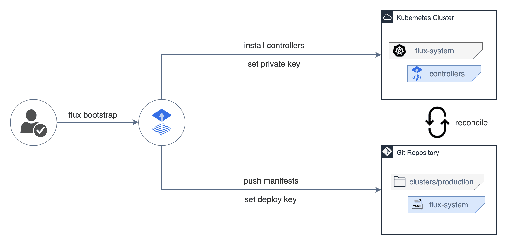

## Table of contents

<div class="toc">

\\{\\{ $.TOC }}

</div>

## Introduction

I have been doing GitOps for a while now, and wanted to share my experience with FluxCD and ArgoCD. My first experience was with ArgoCD, in a professional environment. Then, in my personal projects (my home k8s cluster), I decided to use FluxCD as it looked more lightweight.

In this article, I will share the main differences between FluxCD and ArgoCD, and why I prefer FluxCD for my personal projects.

## What is GitOps?

Without going into too much detail (other articles than mine will certainly go more in-depth), GitOps is a way to manage your infrastructure and applications using Git repositories as the source of truth. The idea is to have a Git repository with all your manifests, and a controller in your Kubernetes cluster that will apply these manifests to your cluster.

By setting Git as source of truth, the authorization is delegated to the Git hosting platform. Your deployments can follow the GitHub flow, opens a PR, and you can easily rollback to a previous state.

There are many advantages to GitOps, but the one I like is the fact that you are in a zero-trust environment. In combination to that, using Renovate, you can automatically update container images and helm charts without having to ever interact with your cluster.

## The comparison

I'm not going to do two parts, and start immediately with the main differences.

Let's start with ArgoCD since it's my first experience, and I'm still using it in a professional environment. ArgoCD is a GitOps solution made by Intuit.

Let's begin with the obvious: ArgoCD has a dashboard, and a nice one on top of that.

### The dashboard


In this dashboard, you have:

- A list of all your applications.
- Quick commands to sync, rollback, or delete an application.
- A way to watch the logs of the application.
- A way to read the values of a deployed Helm chart.
- A diagram showing the deployed resources.
- A diagram showing the network connections.
- A RBAC system to manage who can do what, which can easily be linked to your OIDC provider.
- The possibility to set up applications, clusters and projects in a non-declarative way (using the UI).

In comparison to FluxCD, there is [Capacitor](https://github.com/gimlet-io/capacitor) unofficially maintained by gimlet-io. And, uuhhh...


In this dashboard, you have what you need:

- Quick commands to sync, rollback, or delete an application.
- A way to watch the logs of the application.

And that's it.

The question is: do you need the dashboard?

**ArgoCD offers a better developer experience**. You can easily see what's deployed, what's not, and what's wrong. You can easily rollback to a previous state, and you can easily see the logs of your application. Not only that, but you can also see the network connections, and the resources deployed. This significantly helps the developers to understand and learn Kubernetes without entering into details.

### The setup

Ok, we've talk about the dashboard, but let's be real: we're engineers, and we won't be looking at the dashboard all day long. The main question as the DevOps engineer is: how easy is it to set up?

ArgoCD is "easy" to setup:

- You deploy the ArgoCD helm chart which deploys multiple controllers, the UI and Redis.
- You deploy a special Kubernetes secret (or via the UI) to connect to your Git repository.
- You deploy an Application CRD (or via the UI) to deploy your application.

Yay! ...or not. Actually, there is a small issue: we've just did the opposite of GitOps. We've deployed these resources (Helm chart and CRDs) using kubectl, and not using Git.

"Wait! But that's not a problem! We can just add these resources to our Git repository!"

Remember that GitOps solve this issue, which is the most important: GitOps MUST catch configuration drift. What happens if you forget to add the secret in the Git? Suddenly, your Git repository doesn't reflect your infrastracture anymore!

So, actually, there is one more step to do: App of Apps. You must track your resources with an ArgoCD application which will deploy the ArgoCD resources. This way, your Git repository will actually reflect your infrastructure.

BUT, one flaw: your ArgoCD Helm chart is not tracked by ArgoCD (chicken and egg problem). You probably need to patch or something, it's not really clear.

However, FluxCD follows the GitOps principle. To deploy FluxCD, you need to use their CLI. **Don't worry! The deployment is actually quite "sane"**



The CLI will install the controllers in the `flux-system` namespace, and will create manifests in your Git repository. The manifests actually reflect the FluxCD deployment, and are committed to your Git repository.

**Your Git repository is tracked by default with FluxCD.**

No need for App of Apps, because it is already done by FluxCD. Your whole Git repository (or at least, just a specific directory in the repository) is already tracked by FluxCD.

Thanks to that, you won't need to interact with `kubectl` **at all**.

**Here, FluxCD respects the GitOps principle more than ArgoCD.**

### Resource consumption

ArgoCD is heavy. 7 services are deployed:

- repo-server: the service that will watch the Git repository. ~125MiB of RAM at idle. 250MiB max.
- server: the UI and the API. ~100MiB of RAM at idle and max.
- application-controller: the controller that will deploy the resources. ~350MiB of RAM at idle. 450MiB max.
- applicationset-controller: the controller that generates application CRD. ~100MiB of RAM at idle and max.
- dex-server: an OIDC provider for the UI. ~30MiB of RAM at idle and max.
- redis: the cache. ~100MiB of RAM at idle and max.

Which means: 825MiB of RAM at idle, and 1050MiB of RAM at max, tracking 5 ArgoCD applications and 1 source. Oh, and by the way, this is in a professional environment: the machine running these services is quite powerful.


FluxCD deploys only 1 service (or 2 if you count Capacitor):

- mananger: the service that will watch the Git repository and deploys the services. ~140MiB of RAM at idle. 300MiB max (heck, this is only a spike).
- capacitor: ~50MiB of RAM at idle. 256MiB max (when using the UI).

Which means: 190MiB of RAM at idle, and 556MiB of RAM at max, tracking 53 FluxCD applications and 21 sources.


I think there is a clear winner here.

### Multi-cluster

ArgoCD has a nice feature: multi-cluster. You can deploy an ArgoCD somewhere, and deploy applications on multiple clusters.

While this is quite nice, again, this is not technically "pull-based" CD. Think about it: ArgoCD may "pull" the resources from the Git repository, but the deployment are pushed to the clusters from the external network. Because of that, you need to expose your cluster to the external network and **give the kubeconfig to ArgoCD**.

**ArgoCD may offer a better developer experience, but it is not really a "pull-based" CD.**

For example, a GitHub Action does the same actually: it pulls the resources from the Git repository, and pushes the deployment to the cluster. Obviously, there is a big difference between a GitHub Action and ArgoCD: there is no continuous reconciliation, and the GitHub Action is not a running controller.

In comparison, FluxCD is simpler: 1 FluxCD manager per cluster. You can also use the same Git repository for all your clusters:

```shell
.
└── clusters/
    ├── staging/
    │   ├── apps/
    │   │   └── ...
    │   └── flux-system/
    │       ├── gotk-components.yaml
    │       ├── gotk-sync.yaml
    │       └── kustomization.yaml
    └── prod/
        ├── apps/
        │   └── ...
        └── flux-system/
            ├── gotk-components.yaml
            ├── gotk-sync.yaml
            └── kustomization.yaml
```

Knowing that FluxCD doesn't use a lot of resources, FluxCD set up would not only cost less, but also be more "standard".

### Dynamic applications

**ArgoCD** is not just GitOps, it's more than that and focuses very much in the Continuous Deployment part. Let's talk about the additional features **ApplicationSets and generators**.

You can generate applications based on special generator. Need a development environment during a PR? You have a GitHub PR generator that can generate an application based on the PR (heck, even based on the labels too!).

Multi-cluster? You can generate applications based on the list of clusters.

```yaml
apiVersion: argoproj.io/v1alpha1
kind: ApplicationSet
metadata:
  name: my-app
  namespace: argo-cd
  finalizers:
    - resources-finalizer.argocd.argoproj.io
spec:
  goTemplate: true
  goTemplateOptions: ["missingkey=error"]
  generators:
    - list:
        elements:
          - cluster: local
            url: https://kubernetes.default.svc
          - cluster: prod
            url: https://prod.example.com
  template:
    metadata:
      name: my-app-{{ .cluster | normalize }}
    spec:
      project: my-project
      source:
        repoURL: 'https://github.com/ToucanToco/argo-cd-manifests.git'
        targetRevision: main
        path: charts/my-app
        helm:
          releaseName: my-app

          valueFiles:
            - values-{{ .cluster }}.yaml
      destination:
        server: '{{ .url }}'
        namespace: 'my-namespace'

```

It's very clear what ArgoCD is trying to do: **a complete and flexible CD solution**. Not just GitOps.

### Multi-tenancy

ArgoCD has multi-tenancy built-in and easy to use. RBAC via casbin, OIDC, resources whitelisting and blacklisting.

FluxCD offers multi-tenancy by usin RBAC from Kubernetes: via service accounts, roles and role bindings.

Not much of a difference, but FluxCD feels more "native" to Kubernetes.

### Hooks

ArgoCD has hooks. FluxCD doesn't, you have to use Helm hooks.

FluxCD is more "native" to Kubernetes, while ArgoCD is more "developer-friendly".

### Post-rendering

FluxCD has it built-in. With ArgoCD, you need to configure a plugin:

```yaml
  configManagementPlugins: |
    - name: kustomized-helm
      init:
        command: ["/bin/sh", "-c"]
        args: ["helm dependency build"]
      generate:
        command: [sh, -c]
        args: ["helm template --release-name release-name . > all.yaml && kustomize build"]  # Template first, then kustomize.
```

A small difference, but still a difference.

### Issues

Obviously, no product is perfect. ArgoCD has some issues, as well as FluxCD.

Let's start with ArgoCD:

- Reconciliation loop: sometimes certain "types" are not reconciled correctly. For example, if you deploy a cert-manager's `Certificate` and set up the expiration duration, let's say `24h`, ArgoCD will try to reconcile to `24h0m0hs` which is not what we want.
- Sync can get stuck. If your sync fails (because your manifests cannot be deployed), you need to go on the UI to terminate the sync manually and restart it.

Now about FluxCD:

- FluxCD is not clever about Helm charts: it will deploy the Helm chart each time there is a commit, even if the values didn't change. My hypothesis is that FluxCD doesn't render the Helm chart before applying it, while ArgoCD does. Do note, this is because we've actually set up the Helm chart in the Git repository, instead of a proper Helm registry.
- Capacitor is slow (or my Raspberry Pi is slow).

## Conclusion

ArgoCD is really focused on the CD part, and I would say it answers the DevOps principles more than GitOps. Which means, professionally, ArgoCD is an excellent choice. The developer experience that gives ArgoCD cannot be matched by FluxCD.

FluxCD is more focused on the GitOps part. Everything without exception is tracked by FluxCD. Its implementation is lightweight, and feels "simple". No App of Apps, no ApplicationSet, no multi-tenant, no UI. Just pure GitOps.

So, what is really the best? Should I say "it depends on your needs"? Eeeh, I personally prefer FluxCD. ArgoCD feels bloated. The more bloated a software, the slower it will be developed. Surface attack increases, and the more you have to maintain. Since FluxCD is also lightweight, I can easily migrate to another GitOps solution if needed (or go back to manual deployment). Also, because FluxCD actually follows the GitOps, it "feels" more secure and trustworthy. Lastly, FluxCD is very close to "native" Kubernetes, which means less vendor lock-in.

So, in the end, I would recommend FluxCD nowadays. But, If you reaaaallly need the ArgoCD dashboard and ApplicationSet, then go for ArgoCD.
