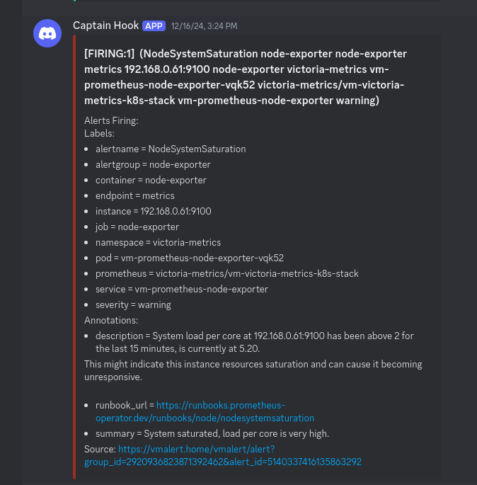

## Table of contents

<div class="toc">

\\{\\{ $.TOC }}

</div>

<hr>

## Introduction

My cluster finally crashed! Let's goooooo! A little of context: I'm running a small k3s cluster with 3 Raspberry Pi 4 with a network storage, and I'm using SQLite as a database for my applications.

In the last two weeks, I've been migrating away from k3os. Reasons are multiple:

- The project is not maintained anymore. However, I could try to maintain it.
- But... many libraries has to be maintained, which I still could try to maintain them.
- Until I found out it was complex to debug when it crashed on my Raspberry Pi... without screen.
- K3os is not purely immutable. It's more of a "read-only" system. Because of this, upgrading the OS (core libraries) and the kernel is a pain.

So what can I do? Well, at the beginning, I wanted to migrate [Talos Linux](https://www.talos.dev) as they actually
[use SquashFS as root filesystem](https://www.talos.dev/v1.9/learn-more/architecture/). But I found the jump too
big, so I did a small step: K3s.

## Migrating from K3os to K3s

### Move PVCs to network storage

First step: Migrating ANY storage to the network storage. At the same time, I've replaced the
volumes using IP addresses to use DNS, which will help when upgrading the storage node.

The way you do this is very simple. Connect to the storage node, and copy the data to the new location. Then, create
new PVs and PVCs, and attach them to the pods. Delete the old PVCs and PVs.

!!!warning WARNING

DO NOT DELETE THE PVCs BEFORE COPYING THE DATA! IF YOU FEAR DATA LOSS, JUST DONT DELETE THE PVCs UNTIL THE VERY END!

!!!

### Migrating workers

Second step: Migrating workers. This was quite simple. I just had to remove the old workers from Kube and add the new ones. But more precisely, these are the steps I've done:

1. Cordon all the nodes to avoid node overload. Downtime is expected. In a pure production environment, a new node should be added to the cluster before draining the old one.

    ```shell
    kubectl cordon <node>
    ```

2. Drain the node.

    ```shell
    kubectl drain <node>
    ```

3. Eject the node from the cluster.

    ```shell
    kubectl delete node <node>
    ```

4. Eject the SD, format, flash RaspiOS Lite and install K3s.

   ```shell
   curl -sfL https://get.k3s.io | K3S_URL=https://myserver:6443 K3S_TOKEN=mynodetoken sh -
   ```

### Migrating the master

WAIT! I recommend taking your time here and do periodic backups of your SQLite database on a long period to have
many backups.

The master migration and backup use the same principle:

1. Backup the SQLite database with WAL (File-based backup). This could cause some issues due to locks,
   but it will be one way to backup the database.

   ```shell
   rsync -av <src>:/var/lib/rancher/k3s/server/db <dest>
   ```

   Normally, the Write-Ahead Logging (WAL) files should avoid data corruption during a backup and restore.

2. Backup the SQLite database with `sqlite3` (Logical backup). This is the best way to backup the database.

   ```shell
   sqlite3 "/var/lib/rancher/k3s/server/db/state.db" ".backup '$BACKUP_SQLITE_FILE'"
   ```

3. Backup the token:

   ```shell
   rsync -av /var/lib/rancher/k3s/server/token <dest>
   ```

TL;DR: Here's a Kubernetes CronJob:


```yaml
apiVersion: batch/v1
kind: CronJob
metadata:
  name: k3s-db-backup
spec:
  schedule: '0 0 * * *' # Runs every day at midnight
  jobTemplate:
    spec:
      template:
        spec:
          priorityClassName: system-cluster-critical
          tolerations:
            - key: 'CriticalAddonsOnly'
              operator: 'Exists'
            - key: 'node-role.kubernetes.io/control-plane'
              operator: 'Exists'
              effect: 'NoSchedule'
            - key: 'node-role.kubernetes.io/master'
              operator: 'Exists'
              effect: 'NoSchedule'
          nodeSelector:
            node-role.kubernetes.io/control-plane: 'true'
          containers:
            - name: k3s-db-backup
              image: alpine:latest
              imagePullPolicy: IfNotPresent
              env:
                - name: AWS_ACCESS_KEY_ID
                  valueFrom:
                    secretKeyRef:
                      name: backup-secret
                      key: access-key-id
                - name: AWS_SECRET_ACCESS_KEY
                  valueFrom:
                    secretKeyRef:
                      name: backup-secret
                      key: secret-access-key
                - name: AWS_DEFAULT_REGION
                  valueFrom:
                    secretKeyRef:
                      key: region
                      name: backup-secret
                - name: AWS_S3_ENDPOINT
                  valueFrom:
                    secretKeyRef:
                      key: s3-endpoint
                      name: backup-secret
                - name: AWS_S3_BUCKET
                  valueFrom:
                    secretKeyRef:
                      key: s3-bucket
                      name: backup-secret
                - name: AWS_S3_PATH
                  valueFrom:
                    secretKeyRef:
                      key: s3-path
                      name: backup-secret
              volumeMounts:
                - name: gpg-passphrase
                  mountPath: /etc/backup
                  readOnly: true
                - name: backup-dir
                  mountPath: /tmp/backups # Directory for temporary backup files
                - name: db-dir
                  mountPath: /host/db # K3s database directory
                  readOnly: true
              command: ['/bin/ash', '-c']
              args:
                - |
                  set -ex

                  # Install dependencies
                  apk add --no-cache zstd gnupg aws-cli sqlite

                  # Define backup file paths
                  BACKUP_DIR="/host/db"
                  SQLITE_DB="$BACKUP_DIR/state.db"
                  TIMESTAMP=$(date +"%Y-%m-%d_%H-%M-%S")
                  BACKUP_FILE="/tmp/backups/k3s_db_$TIMESTAMP.tar.zst"
                  BACKUP_SQLITE_FILE="/tmp/backups/state_$TIMESTAMP.db"
                  ENCRYPTED_FILE="$BACKUP_FILE.gpg"
                  ENCRYPTED_SQLITE_FILE="$BACKUP_SQLITE_FILE.gpg"
                  S3_BUCKET="$AWS_S3_BUCKET"
                  S3_PATH="$AWS_S3_PATH"
                  S3_ENDPOINT="$AWS_S3_ENDPOINT"

                  # Configure AWS CLI with custom endpoint and credentials
                  mkdir -p ~/.aws
                  cat > ~/.aws/config <<EOF
                  [default]
                  region = $AWS_DEFAULT_REGION
                  output = json
                  services = default
                  s3 =
                    max_concurrent_requests = 100
                    max_queue_size = 1000
                    multipart_threshold = 50 MB
                    multipart_chunksize = 10 MB

                  [services default]
                  s3 =
                    endpoint_url = $S3_ENDPOINT
                  EOF

                  cat > ~/.aws/credentials <<EOF
                  [default]
                  aws_access_key_id = $AWS_ACCESS_KEY_ID
                  aws_secret_access_key = $AWS_SECRET_ACCESS_KEY
                  EOF

                  # Compress the database directory (File-based backup)
                  tar -cf - -C "$BACKUP_DIR" . | zstd -q -o "$BACKUP_FILE"

                  # Encrypt with GPG
                  gpg --batch --yes --passphrase-file /etc/backup/gpg-passphrase --cipher-algo AES256 -c -o "$ENCRYPTED_FILE" "$BACKUP_FILE"

                  # Change permissions for the encrypted file
                  chmod 600 "$ENCRYPTED_FILE"

                  # Upload to S3 using custom endpoint
                  aws s3 cp "$ENCRYPTED_FILE" "s3://$S3_BUCKET/$S3_PATH/$(basename $ENCRYPTED_FILE)"

                  # Cleanup (remove the backup, compressed, and encrypted files)
                  rm -f "$BACKUP_FILE" "$ENCRYPTED_FILE"

                  # Do a sqlite3 backup
                  sqlite3 "$SQLITE_DB" ".backup '$BACKUP_SQLITE_FILE'"

                  # Encrypt the sqlite3 backup
                  gpg --batch --yes --passphrase-file /etc/backup/gpg-passphrase --cipher-algo AES256 -c -o "$ENCRYPTED_SQLITE_FILE" "$BACKUP_SQLITE_FILE"

                  # Change permissions for the encrypted sqlite3 file
                  chmod 600 "$ENCRYPTED_SQLITE_FILE"

                  # Upload to S3 using custom endpoint
                  aws s3 cp "$ENCRYPTED_SQLITE_FILE" "s3://$S3_BUCKET/$S3_PATH/$(basename $ENCRYPTED_SQLITE_FILE)"

                  # Cleanup (remove the sqlite3 backup, compressed, and encrypted files)
                  rm -f "$BACKUP_SQLITE_FILE" "$ENCRYPTED_SQLITE_FILE"

          restartPolicy: OnFailure
          volumes:
            - name: gpg-passphrase
              secret:
                secretName: backup-secret
                defaultMode: 0400
                items:
                  - key: gpg-passphrase
                    path: gpg-passphrase
            - name: backup-dir
              emptyDir: {} # Empty directory to hold temporary files like backups
            - name: db-dir
              hostPath:
                path: /var/lib/rancher/k3s/server/db
                type: Directory

```

!!!note NOTE

It does not backup the token.

!!!

After the backup, if you have an SD card laying around, you can flash it with RaspiOS Lite and install K3s. Then, you can restore the database and the token.

```shell
rsync -av <src>/db/ <dst>:/var/lib/rancher/k3s/server/db/
rsync -av <src>/token <dst>:/var/lib/rancher/k3s/server/token
chown -R root:root /var/lib/rancher/k3s/server/db
```

## Post-mortem of the crash

### Summary

First, the crash didn't happen immediately but after two days of a working cluster. The crash was actually almost invisible and was "accumulating" over time.

The crash was caused by a corrupted SQLite database, possibly due to a permission issue (it was `pi:pi`...), or a CPU overload.

### Leadup

The first symptom was that the backups were bigger than usual. 53.89 MB (compressed), then 80.51 MB, then 228.3 MB.

The second symptom was the controller was beginning to be unresponsive. Scheduling was slow and metrics didn't reach
the Prometheus server. At this point, the visibility was beginning to be low.

The third symptom was high CPU usage.

The fourth symptom was the logs having issues with sqlite: "database disk image is malformed". You know you're in trouble when you see this.

### Detection

If you have proper [alerts set up](https://samber.github.io/awesome-prometheus-alerts/rules.html#host-and-hardware), you would have been immediately alerted as the CPU is being overloaded:



The question is: "Is it a simple burst? Or is it really being overloaded?". And so, I checked.

### Recovery

First, Grafana... which shows nothing, weird.

Then, `htop`, which shows `k3s server` taking half of the CPU. *Huh, maybe it's because there too many pods on the controller?*

Finally, I drain and cordon the controller. `k3s server` was still high, and by checking syslogs... **it was weirder**.

So, I did a health check on the SQLite database:

```shell
sqlite3 state.db "PRAGMA integrity_check"
```

which fails: `Error: database disk image is malformed`.

Testing recovering the DB:

```shell
sqlite3 broken.db ".recover" | sqlite3 new.db
# And
sqlite3 mydata.db ".dump" | sqlite3 new.db
```

which fail!

At this point, **I had no choice but to restore a backup of the DB**... which works!

It's at this point I found out that the permissions of the `state.db` were `pi:pi` instead of `root:root`. Was that really the root cause?

## Lesson learned and corrective actions

I learned this:

- Better backup and restore logical backups than SQLite files.
- Migrating and restoring K3s is easy! Just put the backup and BAM, it works! Migrating between K3s distribution is super easy. Maybe it is worth trying [MicroOS](https://get.opensuse.org/microos/)?

Lastly, you are probably wondering why I didn't migrate to ETCD?

As someone who worked on distributed systems, I can easily tell you why:

- SQLite with WAL is VERY performant, [more performant than PostgreSQL](https://www.youtube.com/watch?v=VzQgr-TgBzc).
- I don't have HA nodes. ETCD, through the Raft Consensus algorithm, is able to achieve HA by replicating the WAL across the nodes. You must have 3 HA nodes to make that algorithm works.

Now, for the corrective actions... A new storage node is coming, a Raspberry Pi 5 in fact, and I plan to use it to run databases instead of just running NFS. This avoid overhead and only exposes processed data during communications.

This also means I will need to migrate from CockroachDB to the good ol' PostgreSQL!

At the end of the day, this will reduce CPU loads on the controller and I will be able to apply a [taint](https://kubernetes.io/docs/concepts/scheduling-eviction/taint-and-toleration/) to exclude the controller from running CPU intensive workloads.
