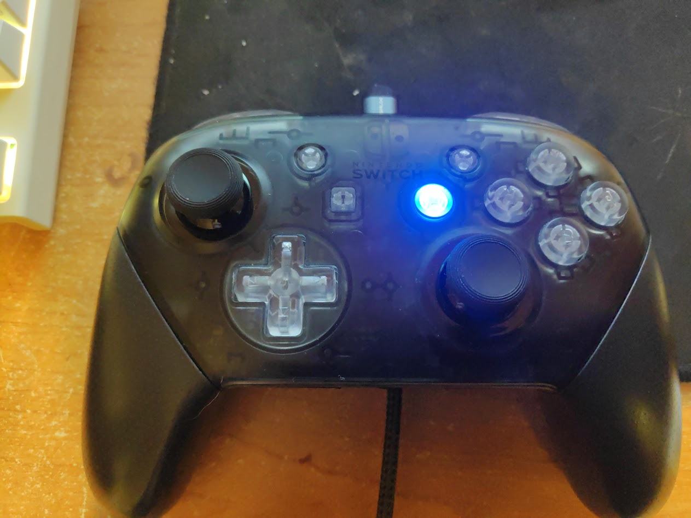
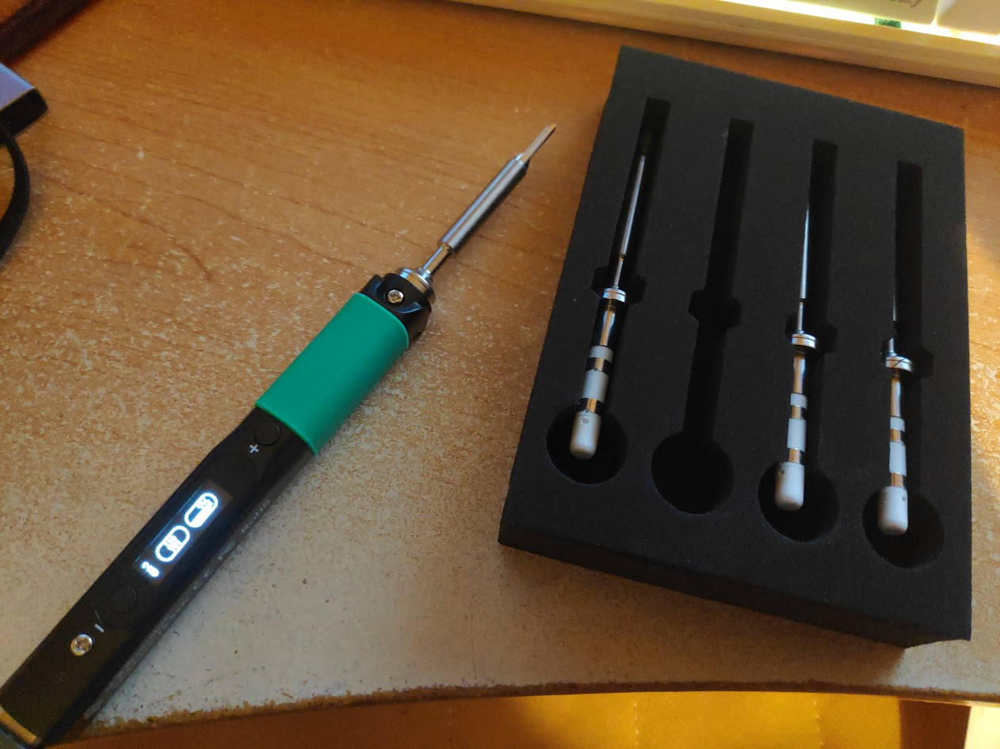
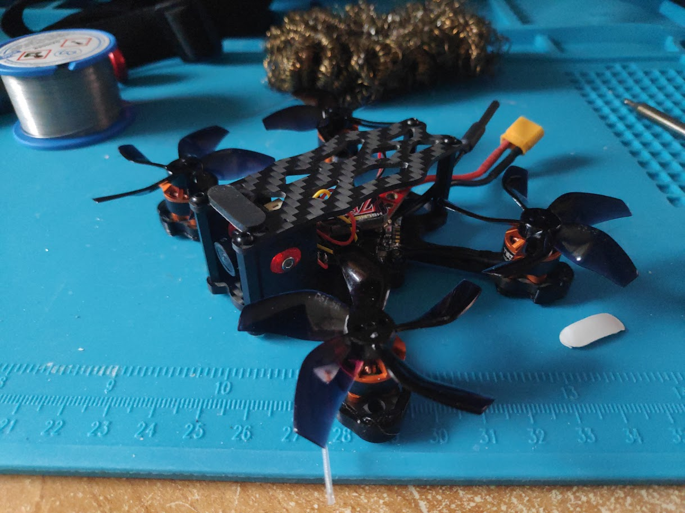
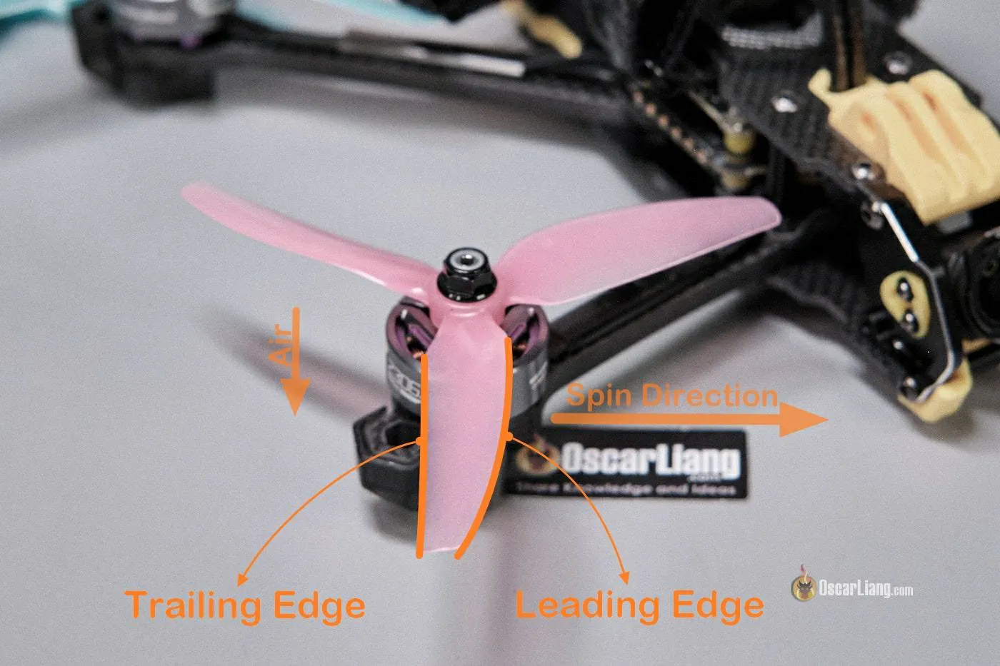
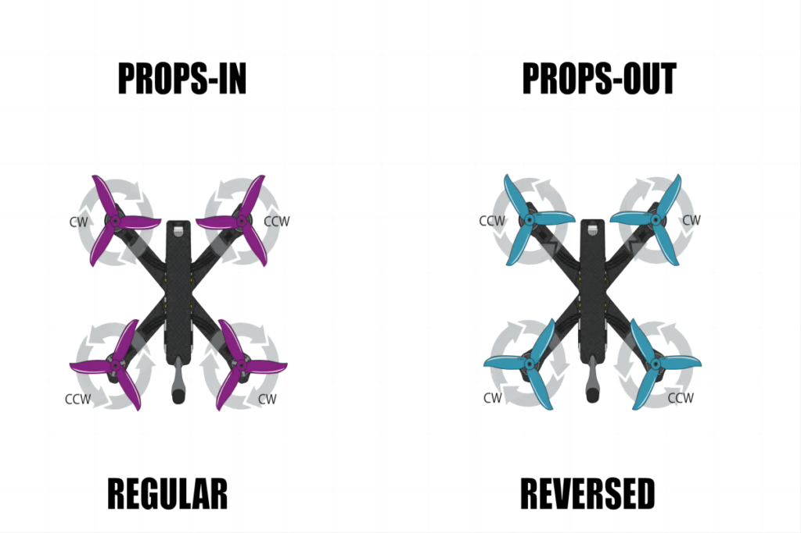

## Table of contents

<div class="toc">

{}

</div>

## Introduction

I've been a bit inactive on this blog for a while... and that's because I've been taking a new hobby: FPV (first person view) drones.

But it didn't really start with this, actually...

## A Bit of My Story

You see... I went to a french engineering school specialized **electronics and IT**. I used my free time to learn **DevOps and programming**. During class, I often already knew the stuff, which gave me plenty of time to get much better at coding. This really helped me out with programming tests and projects.

However, it's not like I'm a model student. In fact, I've been playing a lot of video games since... I guess since I was a kid, but to an unhealthy amount. Other than programming, I used to do the bare-minimum for the other exams. After all, after school, the job should match your skills, there is no reason to invest my free time to other subject. And, when I say "bare minimum," I don't mean aiming for a passing grade; I mean acknowledging a concept exists and leaving it at that. There was no further practice or effort to integrate the subject into my future plans, just a simple "It's good to know.". I obviously practice for the exams, but I forget everything after.

And, let's go back to this unhealthy amount of gaming. This actually made me break a lot of hardware like mouses and game pads!

And so, as engineer in electronics and It and being "eco-friendly", I wanted to repair these.

## From repairing mouses to building drones

### Many failures

Let me be clear: I sucked at repairing stuff with a soldering iron. And more precisely, I sucked a desoldering stuff.

I tried to repair a Steelseries Sensei mouse (swapping a microswitch), then a Mad Catz Xbox Gamepad (replacing a button), the standard stuff... and still failed. So, I simply did what everyone does: buy a new one.

However, in January, I was looking back at my broken stuff, and I noticed how much broken stuff there was: broken gamepads, broken consoles... So, I tried again.

### Repaired a Nintendo DS lite

I managed to repair a Nintendo DS lite:

<center>


_Pokémon Heartgold, many memories..._

</center>

- Replaced the frame (there was cracks).
- Replaced the buttons and pads (the pads were broken).
- Replaced both screens, which requires to desolder the speakers (top screen were flashing, bottom screen had "scratch" damage).
- Replaced the microphone (it didn't work).

(You can tell I abused my NDS lite) And it worked!

[Guides are provided by Ifixit](https://www.ifixit.com/Device/Nintendo_DS_Lite).

Then, I tried to repair the Nintendo Switch Pro Controller.

### Repairing a Nintendo Switch Pro Controller

I had two objectives:

- Replacing the buttons (just the plastic, not the switches).
- Replacing the joystick to remove the el famoso "stick drift".

First objective is easy: tearing down the controller, and replaced the buttons.

Second objective is... drastically more difficult.

You see, if I failed to repair my old gamepad and mouse, that's because, the button and microswitch are known as "through-hole" components:

<center>


_The solder is inside the hole, in contact to the pad and the lead._

</center>

To desolder, you have a lot of techniques, but the cheapest ones are:

- The desoldering wick.

  

- The desoldering manual pump.

  

The desoldering wick absorb the solder thanks to the meshes, and the pump sucks the solder.

And let me tell you this: **you need both, don't try to choose one or the other.**

The manual pump is great to remove a lot of solder, but won't remove all of it depending on the strength of the pump (and since we're doing some cheap-ass desoldering, the pump is not strong enough).

The wick will also remove a lot of soldering if you put so good flux and have a high temperature soldering iron. Needless to say my soldering iron sucked, so the wick was not only useless, it was getting stuck on the PCB.

But hey, this was on my old hardware, which was 5 years ago. Now, I'm a grown ass man, and have my engineering degree, so I know how to desolder... right?

Nope. You see... buttons are the easiest stuff to desolder because it actually only has two legs, and repairing my Nintendo Switch Pro Controller requires to desolder the joystick: a 14 pins component.

<center>


_Credits: Ifixit (the best)_

</center>

Of course, I failed, what did you expect?

So, my friend recommended me these solutions:

- Get a better soldering iron.
- Use solder with lead inside to reduce the melting point.
- Use Chip Quik low temperature soldering paste, which reduce drastically the melting point, but requires to clean up throughly after desoldering to avoid crack when reapplying solder.

I would also recommended:

- Get a real desoldering pump.
- Third-hand sucks.

This is what I now have, and this is what I recommend for any beginners in soldering:

- Brass soldering tip cleaner.
- [Pinecil v2 soldering iron](https://eleshop.eu/pinecil-smart-mini-portable-soldering-iron.html) (alternative may works) + [Tips](https://eleshop.eu/pinecil-short-soldering-tip-set-gross.html)
- [60/40 solder](https://eleshop.eu/premium-soldering-tin-60-40-lead-containing.html) (Lead is hazardous if you swallow it, make sure to clean your hands. The flux is also hazardous, make sure the room is well-ventilated. Don't fear that much though, the solder is pretty small.)
- [ENGINEER SS-03 desoldering pump](https://eleshop.eu/engineer-ss-03-desoldering-pump.html) (highly recommend because the tip doesn't melt)
- [Heated tin extractor](https://eleshop.eu/verwarmde-tinzuiger.html) (**this changed everything, highly recommend**)

That should be enough. I don't recommend wick, they have more chance in damaging the PCB.

So, I didn't tell you how I failed, did I? Basically, think of this:

1. The soldering iron sucked: the temperature is not high enough to apply wick.
2. Apply solder to increase surface.
3. The wick sucked: the temperature is not high enough overall, not all solder is absorbed.
4. Upon contact, the soldering iron's temperature drops. The desoldering wick gets stuck.
5. Repeat.

And the results is a **solder blob**!

Thankfully, this is recoverable:

1. Cut the excess desoldering wick.
2. Apply a lot of 60/40 solder to reduce the melting point. Use the best soldering iron, high temperature, big tip.
3. Use the desoldering pump.
4. Repeat.

Now, everything should be fixed. To remove the solder from the hole, you could use the desoldering pump, but I think this isn't precise nor powerful enough. Instead, use the heated tin extractor to remove the solder. It's also an unregulated temperature soldering iron but it has one big advantage: the soldering tip is the pump, meaning you can be super precise and extract 100% of the solder.

<center>


</center>

Hurrah! Cry of joy! Now, everything should be easy peasy!

By the way, if you've been in desoldering hell like me, you've probably applied a lot of flux, which might be conductive! Make sure to apply some isoprop alcohol to every pads and connectors! I had a short due to flux residue in the joystick connector, which made my joystick go crazy.

<center>



_The repaired and modded Nintendo Switch Pro Controller... I'm gonna be honest: it's not worth its price._

</center>

### Making profitable my soldering hardware

The repairs may not looks like my soldering hardware changed that much the situation, but let me tell you this:

- The blob was pretty big, with not just one but multiple soldering wick stuck.
- This repair lasted two months, with many attempts.

The soldering iron and the heated tin extractor basically repaired the whole situation in less than a day. And, man, the soldering iron is just hot as hell (in every meaning)!

<center>



</center>

Ok, so I wanted to make profitable my soldering hardware, what project then? Do I repair/mod consoles? DIY a mechanical keyboard?

At the same time, I've been watching some CivDiv, a military fpv pilot vlog Youtuber (yes, that's crazy):

<center><iframe width="560" height="315" src="https://www.youtube.com/embed/3D08mEgSgGc?si=ZcFaBMjDUmOEvmO2&amp;controls=0" title="YouTube video player" frameborder="0" allow="accelerometer; autoplay; clipboard-write; encrypted-media; gyroscope; picture-in-picture; web-share" referrerpolicy="strict-origin-when-cross-origin" allowfullscreen></iframe></center>

And something ticked in me:

- I've always wanted to fly.
- He's building many drone like it's nothing.
- I live in France, maybe it's a skill I should have?
- It looks super cool.

But, is it cheap? I remember back then, drones cost a lot... Well, Youtube knows me too well:

<center><iframe width="560" height="315" src="https://www.youtube.com/embed/MxG22nbBNvQ?si=i6dZvwjLHOlUvMPM&amp;controls=0" title="YouTube video player" frameborder="0" allow="accelerometer; autoplay; clipboard-write; encrypted-media; gyroscope; picture-in-picture; web-share" referrerpolicy="strict-origin-when-cross-origin" allowfullscreen></iframe></center>

## Time to build an FPV drone

### Which drone?

Before I build the drone, I did my research too. It's not like I'm going to follow the guide blindly.

In the First Person View (FPV) drone world, you have mainly these types of drone:

- Tinywhoops: very small drones and can fly indoors, pretty good for racing.
- 2in drones: small and silent drones and can fly in small garden and public parks without bothering anyone.
- 3 to 3.5in drones (often linked to the 250g challenge): similar characteristics to 2in drone but bigger battery.
- 5in drones: heavy monsters that can fly smoothly and fast, which is good for cinematics, racing and freestyle.

There are also different video systems:

- Analog: cheap but extremely low latency, also works with long range
- Digital:
  - DJI: Pricey and proprietary, good peneration and range, visible latency.
  - Walksnail: alternative to DJI, but slightly more open.
  - OpenIPC: alternative to Walksnail, Open Source.
  - HDZero protocol: low latency but HD, apparently bad penetration.

Which led me to choose to build an **analog 2in drone** because I can fly in my garden for cheap: I can crash and rebuild it without killing my budget. Also, the battery will be smaller, which means a smaller "fire" in case bad soldering.

### Shopping list

A drone is composed of multiple components:

- The frame.
- The Flight Controller (FC), which is the brain of the drone.
- The Electronic Speed Controller (ESC), which control the speed of the brushless motors.
- The motors.
- The Video Transmitter (VTX), which transmits video to the FPV Goggles, which has a video receiver (VRX).
- The camera.
- The Express LRS receiver (ELRS RX), which receive orders from the radio controller (the "game pad").
- The battery.
- The propellers.

And the operator must have:

- The radio controller
- The FPV goggles
- The battery charger

In which, I bought:

| Component                | Name                                                                                                                                                                                                     | Cost        | Link                                                                                                                                                                                                |
| ------------------------ | -------------------------------------------------------------------------------------------------------------------------------------------------------------------------------------------------------- | ----------- | --------------------------------------------------------------------------------------------------------------------------------------------------------------------------------------------------- |
| Frame                    | APEX 2                                                                                                                                                                                                   | 12,49€      | [Link](https://fr.aliexpress.com/item/1005004324404753.html)                                                                                                                                        |
| FC+ESC+ELRS Rx           | EPRC TAKER F411-12A-E 1-2S AIO                                                                                                                                                                           | 56,85€      | [Link](https://www.banggood.com/fr/25_5x25_5mm-GEPRC-TAKER-F411-12A-E-1-2S-AIO-F4-Flight-Controller-12A-4in1-ESC-for-Darkstar20-Whoop-3-Inch-Toothpick-FPV-RC-Racing-Drone-p-2004806.html)          |
| Motors                   | YSIDO 1104 7500KV<br />I don't recommend these motors personally. As I had two motors failing. I recommend T-motors even if it cost a lot more.                                                          | 22,39€      | [Link](https://fr.aliexpress.com/item/1005005729701162.html)                                                                                                                                        |
| VTX                      | HGLRC Zeus nano VTX                                                                                                                                                                                      | 19,49€      | [Link](https://fr.aliexpress.com/item/1005006739923410.html)                                                                                                                                        |
| VTX Antenna              | (optional but heavily recommended) RUSHFPV CHerry 2 UFL RHCP (RHCP matches the EV800D antennas)                                                                                                          | 10,99€      | [Link](https://fr.aliexpress.com/item/1005006486594293.html)                                                                                                                                        |
| Camera                   | CADDX Baby Ratel 2 Nano<br />I don't recommend the CADDX Ant. In FPV, Camera is everything, and the Baby Ratel 2 Nano offers similar performance of the Ratel 2, which is one of the best analog camera. | 23,16€      | [Link](https://fr.aliexpress.com/item/1005006860312801.html)                                                                                                                                        |
| Battery                  | 2 GNB 2s HV 550mAh<br />You can also buy Tattu batteries (non HV).<br />You probably will only need 2 batteries as a flight will last 6-8 minutes.                                                       | 16,96€      | [Link](https://www.banggood.com/fr/Gaoneng-GNB-2S-7_6V-550mAh-100C-Lipo-Battery-XT30-Plug-for-Happymodel-Mobula-8-GEPRC-TinyGo-Crux3-Cinewhoop-FPV-Drone-RC-Helicopter-p-1998612.htm)               |
| Propellers               | 4pairs GEMFAN D51 2020 2x2x5                                                                                                                                                                             | 3,59€       | [Link](https://fr.aliexpress.com/item/1005005152174402.html)                                                                                                                                        |
|                          |                                                                                                                                                                                                          |             |                                                                                                                                                                                                     |
| Radio controller         | RadioMaster Pocket 2.4GHz 16CH ELRS LBT (or FCC, it doesn't matter, you can reflash)<br />**Heavily recommended for long term usage too.**                                                               | 68,05€      | [Link](https://www.banggood.com/fr/RadioMaster-Pocket-2_4GHz-16CH-ELRS-or-CC2500-Hall-Gimbals-EdgeTX-System-Radio-Controller-Built-in-LED-Lights-Transmitter-for-FPV-RC-Racer-Drone-p-1994795.html) |
| Radio controller battery | 2 18650 Li-ion 3,7V 3200mAh 10A                                                                                                                                                                          | 5.4€        | [Link](https://bestpiles.fr/piles-rechargeables-18650/461-pile-rechargeable-18650-inr18650mh1-li-ion-37v-3200mah-10a-8438493098525.html)                                                            |
| Battery charger          | SKYRC B6 NEO B6NEO                                                                                                                                                                                       | 29,74€      | [Link](https://www.banggood.com/fr/SKYRC-B6-NEO-B6NEO-Smart-Charger-DC-200W-PD-80W-LiPo-Battery-Balance-Charger-Discharger-p-1989673.htm)                                                           |
| FPV Goggles              | Eachine EV800D<br />I'm not sure if I recommend these goggles to be honest. At least this has diversity and antennas.                                                                                    | 101,72€     | [Link](https://www.banggood.com/fr/Eachine-EV800D-5_8G-40CH-Diversity-FPV-Goggles-5-Inch-800+480-Video-Headset-HD-DVR-Build-in-Battery-p-1180354.html)                                              |
|                          |                                                                                                                                                                                                          |             |                                                                                                                                                                                                     |
| M.2 screws               | M.2 screws                                                                                                                                                                                               | 6,89€       | [Link](https://fr.aliexpress.com/item/1005007667778518.html)                                                                                                                                        |
| Spacers                  | M2 H5.6mm spacers ball                                                                                                                                                                                   | 0,99€       | [Link](https://fr.aliexpress.com/item/1005006845821371.html)                                                                                                                                        |
| Glue for screws          | Threadlocker 10ml 243                                                                                                                                                                                    | 2,28€       | [Link](https://fr.aliexpress.com/item/1005007660778638.html)                                                                                                                                        |
|                          |                                                                                                                                                                                                          |             |                                                                                                                                                                                                     |
|                          | **Total Drone Kit Cost**                                                                                                                                                                                 | **165.92€** |                                                                                                                                                                                                     |
|                          | **Total Operator Kit Cost**                                                                                                                                                                              | **215.07€** |                                                                                                                                                                                                     |
|                          | **Total Cost**                                                                                                                                                                                           | **380.99€** |                                                                                                                                                                                                     |

I separated the drone kit cost and the operator kit cost, so you can see the short-mid term investment from the long term investment.

I haven't included other optional hardware, but I recommend buying:

- Proper soldering and desoldering kit.
- Hex Screwdrivers
- Multimeter
- Lipo safe bags. Don't buy the Bat-safe, it's overkill for 2s batteries.
- Wire and wire strippers.

Check out Oscar Liang's blog for [more information](https://oscarliang.com/fpv-tools/).

### Building the drone

Simply follow the Sam Hoarder's video:

1. Screw the camera.
2. Screw the FC.
3. Use the spacers and mount the Nano VTX. Remember to mount the VTX antenna.
4. Screw the motors.
5. Cut and solder the wires. I **heavily recommend** training (watch a proper soldering guide video) in soldering wires before doing directly. I recommend to add some margin.
6. Solder the XT30 connector on the power pads.
7. Solder the capacitor on the power pads.
8. Solder the VTX wires. This should be easier than soldering motors.
9. Mount the frame.

<center>



_It looks so cool._

</center>

### Configuring the firmware

Radio controller configuration:

1. Install the [ELRS configurator](https://github.com/ExpressLRS/ExpressLRS-Configurator/releases) and run it.
   1. Select last release
   2. Select Device category: RadioMaster 2.4 GHz
   3. Select Device: RadioMaster Pocket Internal 2.4GHz TX
   4. Select Flashing Method: EdgeTX Passthrough
   5. Download Lua script
   6. Select 2.4GHz ISM (or LBT if you're living in EU. Honestly, just take ISM.)
   7. Set a binding phrase that you can easily remember.
   8. Power the radio controller. (Flight check: throttle to zero, switches to zero)
   9. Connect Radio controller to computer (top USB-C port), select "USB Serial (VPC)" on the controller (use the scroller to move, push on the scroller to select).
   10. Select Manual serial device selection: `/dev/ttyACM0` (on Linux). If you have issues:
       1. Make sure the user is in the `dialout (20)` group (`sudo usermod -aG dialout <user>`)
       2. Make sure the kernel has ACM support compiled ([`CONFIG_USB_ACM=m`](https://cateee.net/lkddb/web-lkddb/USB_ACM.html))
   11. Flash.
   12. Disconnect and reconnect as "USB Storage".
   13. Copy the `elrsV3.lua` from step 5, and paste it to `./SCRIPTS/TOOLS/elrsV3.lua`.
   14. Disconnect.
2. Configure the drone directly on the radio:
   1. Turn the radio on.
   2. Push the MDL (right side) button
   3. Use the scroller to move and copy the "POCKET" model.
   4. Push the second button on the left side (PAGE>)
   5. On page 2/12 (SETUP), rename the model.
   6. Move to page 6/12 (MIXES):
      1. Select CH9
      2. Source "SE" (you can push the SE button to autocomplete)
   7. Move to page 10/12 (SPECIAL FUNCTIONS):
      1. Select an empty field and set: SA down, Ply Trk, armed, -, ticked.
      2. Repeat: SB down, Ply Trk, fm-acr, -, ticked.
      3. SB mid, Ply Trk, fm-hor, -, ticked.
      4. SB up, Ply Trk, fm-ang, -, ticked.
      5. SC mid, Ply Trk, rscmon, -, ticked. (This won't be used, but if you plan to have a GPS, this will be useful, later)
      6. SC down, Ply Trk, buzact, -, ticked.
      7. SD down, Ply Trk, turton, -, ticked.
      8. SE down, Play Sound, Wrn1, -, ticked.

I don't recommend updating EdgeTX firmware.

Drone configuration:

1. Go to [ESC configurator](https://esc-configurator.com)

   1. Flash bluejay.
   2. Increase minimum and maximum startup power.
   3. Disconnect the drone.

2. Reconnect the drone and wait for a flashing LED on the FC.

3. Connect to the FC Wi-Fi hotspot and go to http://elrs_rx.local (10.0.0.1)

   1. Set a binding phrase.
   2. Disconnect the drone.

4. Power the radio controller.

5. Reconnect the drone and wait for the radio controller to connect to the drone (You will hear "Telemetry connected").

6. Go to [betaflight configurator](https://app.betaflight.com)

   1. Calibrate accelerometer.

   2. Go to receiver tab.

      1. Receiver Provider CSRF.
      2. Check if the drone receive instructions from the radio controller.

   3. Go to modes to configure the drone:

      1. ARM: AUX 1 1700-2100
      2. Angle: AUX 2 900-1300
      3. Horizon: AUX 2 1300-1700
      4. Beeper: AUX 3 1700-2100
      5. Flip over after crash (turtle mode): AUX 4 1700-2100
      6. Prearm: AUX 6 (you need to configure the button on the controller)
      7. Beeper mute: AUX 3 900-1700

   4. Go to ports, and set UART2 to VTX (IRC Tramp) (it could be UART1, check your soldering).

   5. Go to CLI, and paste:

      ```shell
      vtxtable bands 5
      vtxtable channels 8
      vtxtable band 1 BOSCAM_A A CUSTOM 5865 5845 5825 5805 5785 5765 5745 5725
      vtxtable band 2 BOSCAM_B B CUSTOM 5733 5752 5771 5790 5809 5828 5847 5866
      vtxtable band 3 BOSCAM_E E CUSTOM 5705 5685 5665 5645 5885 5905 5925 5945
      vtxtable band 4 FATSHARK F CUSTOM 5740 5760 5780 5800 5820 5840 5860 5880
      vtxtable band 5 RACEBAND R CUSTOM 5658 5695 5732 5769 5806 5843 5880 5917
      vtxtable powerlevels 4
      vtxtable powervalues 25 100 200 350
      vtxtable powerlabels 25 100 200 350
      ```

      ```shell
      save
      ```

   6. Go to Video Transmitter:

      1. Select Race Channel 1, Power 100mW
      2. Power the FPV goggles and set the CH and BAND to R-1
      3. Low power disarm: "On until first arm"

   7. Time to setup the motors, the most stressful part. Go to the motors tab.

      1. Connect a battery to the drone.
      2. Reorder motors. Follow the displayed instructions. Motors might not turn continuously, this isn't indicative of an issue... yet.
      3. "Motor direction" > "Individually". Follow the displayed instructions. Use your nail to determine if the motor are turning in the right direction. You can also put tape on the shaft.
      4. Enable Bidirectional DShot.
      5. Set 9 motor poles.

   8. Configure the OSD. I recommend:

      - Artificial horizon
      - Artifical horizon sidebars
      - Battery average cell voltage
      - Craft name
      - Crosshairs
      - Fly mode
      - Link quality
      - Timer 2
      - Warnings
      - PAL
      - Metric

   9. Attach the propellers and mount the battery and secure it with the battery strap.

### Test it

At this point, the drone is configured and ready to fly. So, I tested it in my garden and... well it didn't fly. Welp, this cas because I don't know how to mount propellers. If you don't mount propellers correctly, your FC will simply stops. Check how to mount propellers:

<center>



_Credits: Oscar Liang_



_Credits: RChobby Lab. We're using Props-in._

</center>

And at this point, it worked!

## How to pilot a drone

Ok, that's nice, I have a drone that can fly... but how to I pilot it?

I recommend flying in simulators (which are games):

- [Liftoff®: Micro Drones](https://store.steampowered.com/app/1432320/Liftoff_Micro_Drones/)
- [Liftoff®: FPV Drone Racing](https://store.steampowered.com/app/410340/Liftoff_FPV_Drone_Racing/)

I personally recommend "Liftoff: Micro Drones", because the maps are much more interesting that the second one. Not only that, but micro-drones and tinywhoops are actually harder to pilot than large drone.

In FPV, you have three flight modes:

- Angle/level mode: which is the safest and slowest way to fly a drone. Beginners of micro-drones will start in this mode because of the tight spaces.
- Horizon mode: which is a improved angle mode with less restrictions. After one hour or two, this mode should be preferred indoors.
- Acro mode: which is the most stylish and fastest way to fly a drone. Beginners of large drones will start in this mode because of the large spaces.

In general, most pilot will prefer **Acro mode** because of the freedom. This mode also is less dependent of the gyro, which might get unstable after impact.

From my experience, I recommend practicing in this order:

1. Fly in Angle or Horizon mode to learn turning. The best map for this is: **In Transit - OSHA**
2. Fly in Acro mode and learn to use the camera and horizon as a way to turn. The best map for this is **Sealand - Light Air**
3. Learn to do Slaloms. The best map for this is: **In Transit - OSHA**, **Silver Screen**
4. Learn to pilot. The best map for this is: **Melon-pan Park - Playground** (learn to follow the streets), **Sawdust Inc - Open for business**, **Silver Screen**
5. Learn about rates and copy the rates from the simulator to the drone.
6. Start flying a little in real life. Do simple round.
7. **Buy a tinywhoop and start practicing indoors.**

Yes, we built a drone, but if your garden is too small, you won't progress. At this point, I recommend buying a BetaFPV Air65 with 1s batteries, and a Vifly whoopstor 3 battery charger.

Ad this point, with practice from the simulator, you will simply learn how to turn, but not how to react. A way to practice your reaction time and sensitivity, is to pilot a tinywhoop and do ladders:

<center><iframe width="560" height="315" src="https://www.youtube.com/embed/7TB3VjMfDq0?si=dynoB1-d28temVdo" title="YouTube video player" frameborder="0" allow="accelerometer; autoplay; clipboard-write; encrypted-media; gyroscope; picture-in-picture; web-share" referrerpolicy="strict-origin-when-cross-origin" allowfullscreen></iframe></center>

You can use a laundry rack:


Laundry racks are nice, because it teaches you multiple things:

- Crash recovery:
  - Upon impact, restabilizing the drone
  - Upon crash, using the turtle mode
- Tight turning using vertical bars as reference points
- Throttle control during transition
- Gaps from tights to large.
- Elevating and descent

Tinywhoops also teach some stuff:

- Impact of the camera angles
- The rates tuning
- The throttle limit

After being able to pilot Tinywhoops, you can easily fly big drones, so you can hop on "Liftoff: FPV Drone Racing", and one thing you notice is: "Damn, I'm light as f-".

Large drone drops slower, and therefore is **drastically** easier than piloting a Tinywhoop. Because of this aspect, you can learn tricks. Doing freestyle of Tinywhoops is **hard**.

## Conclusion

This was my journey (or the start of my journey) to FPV drones as an engineer. I honestly **don't recommend** building a drone unless you're like me and want to solder stuff.

I heavily recommend **tinywhoops** because you can fly indoors with your friend and family without the deafening roar of a jet engine. Plus, tinywhoops are surprisingly challenging to pilot, and mastering them will absolutely boost your confidence for when you eventually tackle larger drones.

Looking back, these were my absolute best investments in this whole adventure:

- The **Radiomaster Pocket**: I can't believe I can program so much on this bad boy.
- **VTX antennas**: An easy upgrade that significantly reduces interference from Wi-Fi signals.
- **Ratel cameras**: The improved field of view makes flying so much more comfortable.
- A **lanyard for the Radiomaster Pocket**.
- The **SkyRC B6 Neo** and **Vifly Whoopstor 3** chargers: it makes charging less stressful.

As for everything else, it was... fine. Motors seemed to fail constantly, and those tiny, fragile pads on the flight controller were a pain. Honestly, you might be better off building a 3.5in drone from the get-go. That way, you can easily mount the super-light **RunCam Thumb Pro** and capture 4K footage.

Also, if you're living in France, you might be interested in taking the exam in [AlphaTango](https://alphatango.aviation-civile.gouv.fr/login.jsp). The exam has no time limit and you can probably do it with common sense. Some of the answers aren't even in the provided documents, so just go for it!

Finally, a Redditor once told that flying an FPV drone is one of those things you have to experience in life. To that, I can only say: Hell yeah! This is easily one of the coolest, most accessible hobbies out there. It's a fantastic blend of so many different skills and knowledge sets, and the idea that you, a regular person, can fly through the air like this? Mind-blowing.

## Credits

FPV references worth checking out:

- [Joshua Bardwell's Youtube Channel](https://www.youtube.com/channel/UCX3eufnI7A2I7IkKHZn8KSQ)
- [Sam Hoarder's Youtube Channel](https://www.youtube.com/@hoardersam10)
- [Oscar Liang's Blog](https://oscarliang.com)

Repairing references worth checking out:

- [iFixit](https://www.ifixit.com) for repairing the world.

Best place to buy hardware:

- [Banggood](https://www.banggood.com) for official stuff.
- [Aliexpress](https://aliexpress.com) for plastics and electronics.

Banggood is slow, so prefer Aliexpress if you can. Don't buy batteries from any of them.
