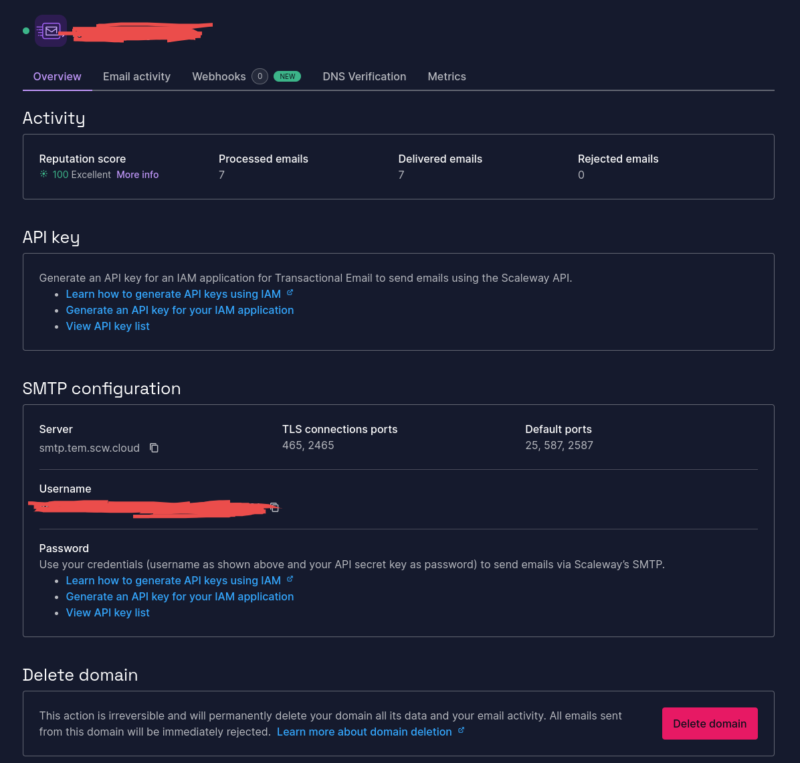

## Table of contents

<div class="toc">

{}

</div>

## Introduction

New year, new budget, new hardware. I've upgraded my home Raspberry Pi cluster with a new storage node, a new router, new OSes and new services.

If you read my [last article on my home Raspberry Pi cluster](/blog/2024-06-19-home-raspi), you may know that I was looking to upgrade the storage node and router. Well that's what I did, and did a lot more since then.

## Hardware overhaul

### Replacing the router

The setup of my cluster was the following:

- Nodes are interconnected with each other via one switch to use the whole 1Gbps bandwidth.
- To connect the nodes to the internet, I've used a wireless "router"... but in reality this is a Raspberry Pi 3+ which acts as a router.

Small issue: the wireless bandwidth of the Raspberry Pi is **very** limited.

Luckily, the whole house network has been upgraded to Wi-Fi 6E using a dual TP Link Deco XE75 setup, which replaced the old repeater and gave me a new wireless router: a D-Link router with OpenWRT.

I managed to replace the RPi router by using the ["Wi-Fi Extender/Repeater with relayd"](https://openwrt.org/docs/guide-user/network/wifi/relay_configuration) setup, without the repeater feature (disabled Access-Point):

```shell {title="root@router:/etc/config/network (extract)"}
config interface 'lan' # Management interface
	option device 'br-lan'
	option proto 'static'
	option ipaddr '192.168.2.1'
	option netmask '255.255.255.0'
	option ip6assign '60'

config interface 'wwan' # Use to connect to the modem
	option proto 'dhcp'

config interface 'repeater_bridge' # Relay interface
	option proto 'relay'
	option network 'lan wwan'
```

```shell {title="root@router:/etc/config/wireless"}
config wifi-device 'radio0' # 5GHz band, used to connect to the modem.
	option type 'mac80211'
	option path 'pci0000:00/0000:00:00.0'
	option band '5g'
	option htmode 'VHT80'
	option disabled '0'
	option country 'FR' # This is important! Based on the country, the wrong band might be used.

config wifi-iface 'default_radio0'
	option device 'radio0'
	option network 'wwan'
	option mode 'sta'
	option ssid '[REDACTED]'
	option encryption 'psk2'
	option key '[REDACTED]'

config wifi-device 'radio1' # 2.4 GHz band, which can be used as AP.
	option disabled '1'

config wifi-iface 'default_radio1'
	option device 'radio1'
	# Interface is disabled.
```

```shell {title="root@router:/etc/config/firewall (extract)"}
config zone
	option name 'lan'
	option network 'lan repeater_bridge wwan'
	option input 'ACCEPT'
	option output 'ACCEPT'
	option forward 'ACCEPT'
```

The setup gave me the following results with iperf3:

- Around 160Mbps in download speed (cluster ← world).
- Around 70Mbps in upload speed (world → cluster).

Which seems small, but considering it's wireless and faster than the old setup, it's pretty good.

### Adding the storage node

My old storage node is an ODroid XU4. It doesn't have enough RAM to cache data over NFS. So, I need to set up a new storage node. To avoid also sending a lot of data over a small "channel", I will prefer to have some computing power on the storage node to only exposed processed data. Therefore, I will use a two tier storage setup.

The reason being that I will prefer a two tier storage setup:

- The `slow` tier: the ODroid XU4, running on SATA SSDs, which is good for archiving, hosting videos, etc.
- The `fast` tier: the new storage node, a Rapsberry Pi 5 with NVME SSDs, which is good for storage, but also for computing, giving me the power to host PostgreSQL databases, LDAP, etc.

Therefore, I'm **replacing** CockroachDB with a simple PostgreSQL setup (especially since [CockroachDB decided to close the free tier](https://www.cockroachlabs.com/blog/enterprise-license-announcement/)). And this also means I'm installing k3s on the new node, but without k3os.

### Replacing k3os with simple RaspiOS with k3s

K3OS is dead, but it's been [dead for a long time (2 years at least)](https://github.com/rancher/k3os). However, I tried to maintain a fork of k3os, but it is at that moment I saw some issues.

At the very beginning, I used this project: [picl-k3os-image-generator](https://github.com/sgielen/picl-k3os-image-generator), which is a way to generate k3os images with Busybox as base.

This project added these issues:

- Busybox is not updated during k3os upgrade. In fact, k3os upgrades were simply k3s upgrades.
- The kernel didn't also update and used the initial kernel that was installed with the image generator.

Basically, the OS of the Raspberry Pi didn't update during the last 3 years. But, obviously, I tried to update them, however the manipulation isn't worth it:

1. You need to eject the SD cards of the Raspberry Pi.
2. Download the latest RaspiOS image and extract the kernel and firmware.
3. Install the new kernel and firmware.
4. Reinstall the SD card and boot.

The simple fact that I have to manually install the kernel negates the whole point of k3os: to have an immutable OS.

Therefore, I will use a simple RaspiOS image with k3s, which permits kernel and firmware updates via `apt`. The installation process was the following:

1. Cordon and drain every nodes.
2. Remove any plan from the `system-upgrade-controller`.
3. Backup `/var/lib/rancher/k3s/server/token` and `/var/lib/rancher/k3s/server/db/` (I recommend to back up files and also use the sqlite3 backup utility).
4. Install RaspiOS.
5. (controller) Restore `/var/lib/rancher/k3s/server/token` and `/var/lib/rancher/k3s/server/db/`.
6. Install k3s.
7. It's good to go!

By the way, you may need to vacuum the sqlite database (make sure to backup before that). The commands are:

```shell {title="root@controller:/var/lib/rancher/k3s/server/"}
sqlite3 state.db

sqlite> delete from kine where id in (select id from (select id, name from kine where id not in (select max(id) as id from kine group by name)));
sqlite> vacuum;
sqlite> .quit
```

This could repair some issues with the database and k3s. After the migration, I come back to the old style of infrastructure management: mutable OSes... which means I need to setup Ansible.

## Software overhaul

### Ansible

*Wait what? There wasn't ansible before?*

Yes, in fact, when you setup an immutable infrastructure, the idea is that everything is declarative, including the OS configuration like Kernel version, installed software.

If you declaratively deploy a Kubernetes cluster (like using Terraform on Google Cloud, or K0sctl with K0s on your own infrastructure), the only tools needed is your deployment software (Terraform or K0sctl) and Kubectl.

But since we switched to using a mutable infrastructure (mutable OSes), we need to configure the software installed on the nodes.

Therefore, I've setup Ansible with simply two roles:

- `roles/storage` to format the storage node.
- `roles/upgrade_and_reboot` to upgrade the OS and reboot the node.

And that's it! We can also add the k3s install process in the cluster, however, I setup the k3s upgrade controller on Kubernetes which can self-upgrade the cluster.

Basically, my rules are:

- If it can be handled with Kubernetes (like CronJobs), use Kubernetes.
- If it is at almost infrastructure level, use Ansible.

### Migrating CockroachDB to PostgreSQL

Since, CockroachDB is no more free, I will simply switch to PostgreSQL with backups. CockroachDB uses too many CPUs and RAM while I expected a low usage, especially when using the Raft consensus. CockroachDB not being fully PostgreSQL-API compatible means that its implementation is certainly doubtful.

So... during my search I was looking for a method to migrate CockroachDB data to PostgreSQL... in which, none work.

So here's my method, which is a lot of work, but it works **with certainty**.

The method is the following. Let's say you want to migrate the data of Service A:

1. Deploy PostgreSQL on the production cluster.
2. To avoid any downtime, deploy Service A locally and connect it to PostgreSQL. This will run proper DB migrations, and therefore, fix any issues with the SQL schema.
3. Then, use DBeaver to export data:

   

   !!!warning WARNING

   **Don't forget to also export the sequences!**

   !!!

4. And finally, reconnect the production Service A to PostgreSQL.

That's all, do note I don't have many services running on CockroachDB, only Grafana and VaultWarden. But now, I'm running a lot of services!

### New services, and death to some

#### FluxCD

I've talked about it in an [older article](https://blog.mnguyen.fr/blog/2024-09-11-fluxcd-argocd-gitops), but didn't really *officialize* it. That's because I was still doubting of FluxCD's capabilities.

Today, I can finally say that **FluxCD is the best lightweight and fully-featured GitOps solution**. I had **zero** issues with it during the 4 past months.


<center><i>The actual "UI".</i></center>

The issues I've talked about in the past were:

- FluxCD is not clever about Helm Chart. But in reality, this is because I used the subchart pattern which works with ArgoCD. What I've done instead is simply using the chart with the release tag, and if I need to patch it, I can simply write manifests alongside the Helm release thanks to FluxCD capabilities. (It's difficult to explain, but let's say simply there is no need for `kustomized-helm` with FluxCD.)
- Capacitor is slow. And it is still slow, but with the notifications setup and Flux CLI installed, I'm simply not using capacitor anymore.

#### LLDAP

I've always hated LDAP and the existing implementations:

- OpenLDAP: too complex to configure, too many "runtime" configuration.
- FreeIPA: too complex and fat.
- 389ds: actually pretty damn good, but there are also runtime configuration issues.

However, there is now [LLDAP](https://github.com/lldap/lldap), a lightweight LDAP implementation which does exactly what you need: a user database with preconfigured schemas.

LLDAP can use PostgreSQL as DB and has a small UI:


<center><i>The UI. You can see it supports groups too!</i></center>

I will be using LLDAP to unify the authentication layer of my services, especially since I want to use that as user DB for Authelia.

#### Authelia

[Authelia](https://www.authelia.com) is lightweight authentication server. It is an OIDC provider and is also able to handle ForwardAuth requests.

It does NOT support sign up, so it is mainly used for internal authentication. It uses Postgres as DB for Authentication method storage, and LDAP as user DB.

And that's it. It's simple, stateless and highly scalable. It doesn't have any admin UI, but has a personal user page:


Authelia can be configured with a simple YAML file.

#### Crowdsec

To ban bots and use crowdsourced blocklists, I've setup [Crowdsec](https://www.crowdsec.net).

The setup is the following:

- Parsers are installed alongside Traefik to parse the logs.
- The Local API fetch the information from the parsers and make decisions.
- Bouncers are installed on Traefik (or on Linux, but I didn't do that since the only entrypoint to my cluster is through HTTP, and not SSH and cie.).


I've also configured Traefik to give [JSON](https://doc.traefik.io/traefik/observability/logs/) logs so that I can analyze it on Grafana.

#### VictoriaLogs and Vectors

Now that I have computing power on my storage node, not only did I migrate my VictoriaMetrics instance on it, but I've also added VictoriaLogs.

VictoriaLogs is an alternative to Grafana Loki and Elasticsearch, but it highly-optimised for logs and doesn't use a lot of memory, CPU and storage. It doesn't need any custom index and it's super fast.

Here's its usage with ~80 services running on the cluster, all of them logged on VictoriaLogs:


It doesn't go above 384 MiB of RAM, and certainly doesn't use above 100m of CPU!

Now, about the agents. I use [Vectors](https://vector.dev) to fetch Kubernetes logs. Its configuration is dead simple:

```yaml {title="vector.yaml"}
data_dir: /vector-data-dir
api:
  enabled: false
  address: 0.0.0.0:8686
  playground: true
enrichment_tables:
  gip:
    type: geoip
    path: /geoip/GeoLite2-City.mmdb
sources:
  k8s:
    type: kubernetes_logs
  internal_metrics:
    type: internal_metrics
transforms:
  parser:
    type: remap
    inputs: [k8s]
    source: |
      structured, err = parse_json(.message)
      if err == null {
        . = merge!(., structured)
      }
  routes:
    type: route
    inputs: [parser]
    route:
      traefik: '.kubernetes.container_name == "tail-accesslogs" && contains(to_string(.kubernetes.pod_name) ?? "", "traefik")'
    reroute_unmatched: true # Send unmatched logs to routes._unmatched stream
  traefik:
    type: remap
    inputs: [routes.traefik]
    source: |
      # Enrich with geoip data
      geoip, err = get_enrichment_table_record("gip", { "ip": .ClientHost }, ["country_code","latitude","longitude"] )
      if err == null {
        if is_array(geoip){
          geoip = geoip[0]
        }
        if geoip != null {
          .geoip = geoip
        }
      }
sinks:
  exporter:
    type: prometheus_exporter
    address: 0.0.0.0:9090
    inputs: [internal_metrics]
  vlogs:
    type: elasticsearch
    inputs: [routes._unmatched, traefik]
    endpoints: << include "vlogs.es.urls" . >>
    mode: bulk
    api_version: v8
    compression: gzip
    healthcheck:
      enabled: false
    request:
      headers:
        VL-Time-Field: timestamp
        VL-Stream-Fields: stream,kubernetes.pod_name,kubernetes.container_name,kubernetes.pod_namespace
        VL-Msg-Field: message,msg,_msg,log.msg,log.message,log
        AccountID: '0'
        ProjectID: '0'

```

With this configuration, logs are collected from Kubernetes, parsed as JSON (if compatible), and routed based on conditions (e.g., logs from Traefik). GeoIP enrichment is applied to Traefik logs using a GeoLite2 database to add geolocation data. Unmatched logs and enriched Traefik logs are sent to VictoriaLogs, while internal metrics are exported to Prometheus for monitoring.

Parsing these logs on Grafana give these results:


Pretty great, yeah? Also it's over 30 days of data, and the query is instant.

It can give a pretty precise insight:


#### ArchiSteamFarm

Lastly, I'm selfhosting [ArchiSteamFarm](https://github.com/JustArchiNET/ArchiSteamFarm). Hey! I need have a lot of games, okay? I could sells those useless cards and buy games that I actually want.


#### Tried self-hosting a mail server with Maddy, using Scaleway Transactional mail instead

I tried to selfhost my own mailserver since Authelia requires to setup SMTP for "Password reset" mails.

However, residential IPs are banned, there this was useless (it still worked though).

Instead, I switched to [Scaleway Transactional Mails](https://www.scaleway.com/en/transactional-email-tem/) since it's free for the first 300 mails and I have my domain there. Also, due to SMTP constraints, I'v also enabled DNSSEC, so, basically, everything was optimized to use Scaleway.




<center><i>It also has mail logging.</i></center>

It also has **autoconfiguration**. Life is great.

#### Backups and AWS mountpoint S3 CSI Driver

Lastly, I've setup backups **everywhere** and used Scaleway S3 offering. Obviously, I have encrypted the backups.

Something that I didn't know, but helped like *hell*, is using [mountpoint-s3](https://github.com/awslabs/mountpoint-s3) (like s3fuse) as CSI driver.

With this, I can upload backups to S3 without the need to install awscli or s3cli, and simply use `cp`.

<article class="component">

<details>

<summary>Postgres backup</summary>

```yaml {title="cronjob.yaml"}
apiVersion: batch/v1
kind: CronJob
metadata:
  name: postgresql-read-pgdumpall
  namespace: postgresql
  labels:
    app.kubernetes.io/component: pg_dumpall
    app.kubernetes.io/instance: postgresql
    app.kubernetes.io/managed-by: Helm
    app.kubernetes.io/name: postgresql
    app.kubernetes.io/version: 17.2.0
    helm.sh/chart: postgresql-16.4.5
    helm.toolkit.fluxcd.io/name: postgresql
    helm.toolkit.fluxcd.io/namespace: flux-system
  annotations:
    meta.helm.sh/release-name: postgresql
    meta.helm.sh/release-namespace: postgresql
spec:
  schedule: '@daily'
  concurrencyPolicy: Allow
  suspend: false
  jobTemplate:
    metadata:
    spec:
      template:
        metadata:
          labels:
            app.kubernetes.io/component: pg_dumpall
            app.kubernetes.io/instance: postgresql
            app.kubernetes.io/managed-by: Helm
            app.kubernetes.io/name: postgresql
            app.kubernetes.io/version: 17.2.0
            helm.sh/chart: postgresql-16.4.5
        spec:
          volumes:
            - name: raw-certificates
              secret:
                secretName: postgresql.internal.home-cert
                defaultMode: 420
            - name: datadir
              persistentVolumeClaim:
                claimName: postgres-backups-pvc
            - name: empty-dir
              emptyDir: {}
            - name: tmp
              emptyDir: {}
          containers:
            - name: postgresql-read-pgdumpall
              image: docker.io/bitnami/postgresql:17.2.0-debian-12-r8
              command:
                - /bin/sh
                - '-c'
                - >
                  DATE="$(date '+%Y-%m-%d-%H-%M')"

                  pg_dumpall --clean --if-exists --load-via-partition-root
                  --quote-all-identifiers --no-password
                  --file=/tmp/pg_dumpall-$DATE.pgdump

                  mv /tmp/pg_dumpall-$DATE.pgdump
                  ${PGDUMP_DIR}/pg_dumpall-$DATE.pgdump
              env:
                - name: PGUSER
                  value: postgres
                - name: PGPASSWORD
                  valueFrom:
                    secretKeyRef:
                      name: postgresql-secret
                      key: postgres-password
                - name: PGHOST
                  value: postgresql-read
                - name: PGPORT
                  value: '5432'
                - name: PGDUMP_DIR
                  value: /backup/pgdump
                - name: PGSSLROOTCERT
                  value: /tmp/certs/ca.crt
              resources:
                limits:
                  ephemeral-storage: 2Gi
                  memory: 192Mi
                requests:
                  cpu: 100m
                  ephemeral-storage: 50Mi
                  memory: 128Mi
              volumeMounts:
                - name: raw-certificates
                  mountPath: /tmp/certs
                - name: datadir
                  mountPath: /backup/pgdump
                - name: empty-dir
                  mountPath: /tmp
                  subPath: tmp-dir
              imagePullPolicy: IfNotPresent
              securityContext:
                capabilities:
                  drop:
                    - ALL
                privileged: false
                seLinuxOptions: {}
                runAsUser: 1001
                runAsGroup: 1001
                runAsNonRoot: true
                readOnlyRootFilesystem: true
                allowPrivilegeEscalation: false
                seccompProfile:
                  type: RuntimeDefault
          restartPolicy: OnFailure
          terminationGracePeriodSeconds: 30
          securityContext:
            fsGroup: 1001
  successfulJobsHistoryLimit: 3
  failedJobsHistoryLimit: 1
---
apiVersion: v1
kind: PersistentVolumeClaim
metadata:
  name: postgres-backups-pvc
  namespace: postgresql
spec:
  resources:
    requests:
      storage: 50Gi
  volumeMode: Filesystem
  accessModes:
    - ReadWriteMany
  storageClassName: ''
  volumeName: postgres-backups-pv
---
apiVersion: v1
kind: PersistentVolume
metadata:
  name: postgres-backups-pv
spec:
  capacity:
    storage: 50Gi
  accessModes:
    - ReadWriteMany
  storageClassName: ''
  mountOptions:
    - prefix postgres-backups/
    - endpoint-url https://s3.fr-par.scw.cloud
    - uid=1001
    - gid=1001
    - allow-other
  csi:
    driver: s3.csi.aws.com
    volumeHandle: postgres-backups-pv
    volumeAttributes:
      bucketName: REDACTED

```

</details>

<hr />

<details>

<summary>K3s backups</summary>

```yaml {title="cronjob.yaml"}
apiVersion: batch/v1
kind: CronJob
metadata:
  name: k3s-db-backup
spec:
  schedule: '0 0 * * *' # Runs every day at midnight
  jobTemplate:
    spec:
      template:
        spec:
          priorityClassName: system-cluster-critical
          tolerations:
            - key: 'CriticalAddonsOnly'
              operator: 'Exists'
            - key: 'node-role.kubernetes.io/control-plane'
              operator: 'Exists'
              effect: 'NoSchedule'
            - key: 'node-role.kubernetes.io/master'
              operator: 'Exists'
              effect: 'NoSchedule'
          nodeSelector:
            node-role.kubernetes.io/control-plane: 'true'
          containers:
            - name: k3s-db-backup
              image: alpine:latest
              imagePullPolicy: IfNotPresent
              volumeMounts:
                - name: gpg-passphrase
                  mountPath: /etc/backup
                  readOnly: true
                - name: backup-dir
                  mountPath: /tmp/backups # Directory for temporary backup files
                - name: db-dir
                  mountPath: /host/db # K3s database directory
                  readOnly: true
                - name: output
                  mountPath: /out
              command: ['/bin/ash', '-c']
              args:
                - |
                  set -ex

                  # Install dependencies
                  apk add --no-cache zstd gnupg sqlite

                  # Define backup file paths
                  BACKUP_DIR="/host/db"
                  SQLITE_DB="$BACKUP_DIR/state.db"
                  TIMESTAMP=$(date +"%Y-%m-%d_%H-%M-%S")
                  BACKUP_FILE="/tmp/backups/k3s_db_$TIMESTAMP.tar.zst"
                  BACKUP_SQLITE_FILE="/tmp/backups/state_$TIMESTAMP.db"
                  ENCRYPTED_FILE="$BACKUP_FILE.gpg"
                  ENCRYPTED_SQLITE_FILE="$BACKUP_SQLITE_FILE.gpg"

                  # Compress the database directory (File-based backup)
                  tar -cf - -C "$BACKUP_DIR" . | zstd -q -o "$BACKUP_FILE"

                  # Encrypt with GPG
                  gpg --batch --yes --passphrase-file /etc/backup/gpg-passphrase --cipher-algo AES256 -c -o "$ENCRYPTED_FILE" "$BACKUP_FILE"

                  # Change permissions for the encrypted file
                  chmod 600 "$ENCRYPTED_FILE"

                  # Upload to S3 using custom endpoint
                  cp "$ENCRYPTED_FILE" "/out/$(basename $ENCRYPTED_FILE)"

                  # Cleanup (remove the backup, compressed, and encrypted files)
                  rm -f "$BACKUP_FILE" "$ENCRYPTED_FILE"

                  # Do a sqlite3 backup
                  sqlite3 "$SQLITE_DB" ".backup '$BACKUP_SQLITE_FILE'"

                  # Encrypt the sqlite3 backup
                  gpg --batch --yes --passphrase-file /etc/backup/gpg-passphrase --cipher-algo AES256 -c -o "$ENCRYPTED_SQLITE_FILE" "$BACKUP_SQLITE_FILE"

                  # Change permissions for the encrypted sqlite3 file
                  chmod 600 "$ENCRYPTED_SQLITE_FILE"

                  # Upload to S3 using custom endpoint
                  cp "$ENCRYPTED_SQLITE_FILE" "/out/$(basename $ENCRYPTED_SQLITE_FILE)"

                  # Cleanup (remove the sqlite3 backup, compressed, and encrypted files)
                  rm -f "$BACKUP_SQLITE_FILE" "$ENCRYPTED_SQLITE_FILE"

          restartPolicy: OnFailure
          volumes:
            - name: gpg-passphrase
              secret:
                secretName: backup-secret
                defaultMode: 0400
                items:
                  - key: gpg-passphrase
                    path: gpg-passphrase
            - name: backup-dir
              emptyDir: {} # Empty directory to hold temporary files like backups
            - name: db-dir
              hostPath:
                path: /var/lib/rancher/k3s/server/db
                type: Directory
            - name: output
              persistentVolumeClaim:
                claimName: k3s-backups-pvc
---
apiVersion: v1
kind: PersistentVolumeClaim
metadata:
  name: k3s-backups-pvc
spec:
  accessModes:
    - ReadWriteMany
  resources:
    requests:
      storage: 50Gi
  storageClassName: ''
  volumeName: k3s-backups-pv
  volumeMode: Filesystem
---
apiVersion: v1
kind: PersistentVolume
metadata:
  name: k3s-backups-pv
spec:
  capacity:
    storage: 50Gi
  accessModes:
    - ReadWriteMany
  storageClassName: ''
  mountOptions:
    - prefix k3s-backups/
    - endpoint-url https://s3.fr-par.scw.cloud
    - uid=1001
    - gid=1001
    - allow-other
  csi:
    driver: s3.csi.aws.com
    volumeHandle: k3s-backups-pv
    volumeAttributes:
      bucketName: REDACTED

```

</details>

</article>

## Conclusion

CockroachDB and NFS were the main bottlenecks of my old infrastructure. With a storage node with compute power, my setup is now super efficient. Having also learned to clean my k3s DD, there is no more abnormal CPU usage.

Having my storage node also under Kubernetes, I can install monitoring agents super easily:

**Control node**


**Worker 0**


**Worker 1**


**Storage**


As you can see, I have a **lot** of resources even if my whole monitoring stack is installed, compared to last year when the Prometheus and Grafana Loki stack were installed.

Pretty happy how it turns out, and ready to install more stuff!
