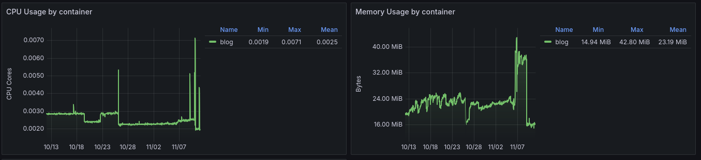
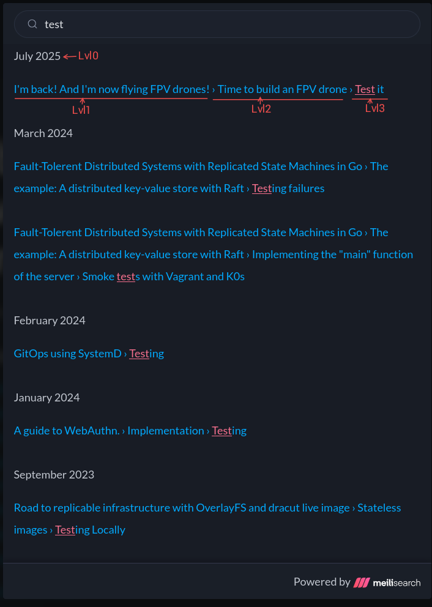
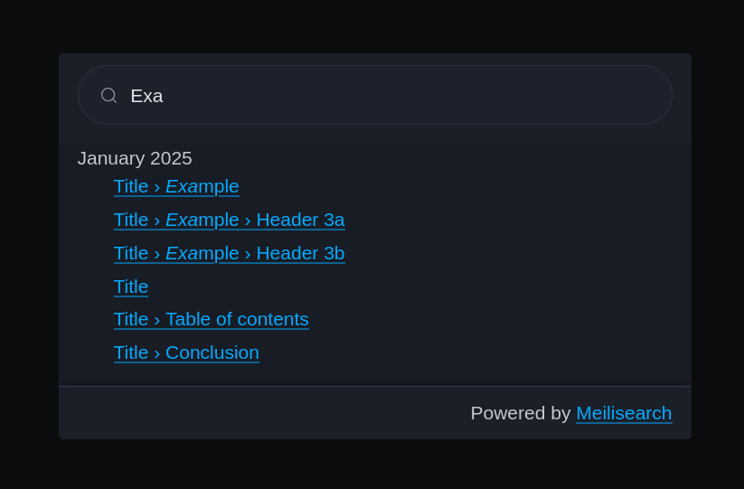

## Table of contents

<div class="toc">

{}

</div>

## Introduction

[Meilisearch](https://www.meilisearch.com) is a search engine that allows to index content and search it with a simple query. Compared to existing solutions, Meilisearch tries to be simple and easy to use while being highly performant. You can check their [comparison documentation](https://www.meilisearch.com/docs/learn/resources/comparison_to_alternatives).

The aim of this article is to present how to use Meilisearch as docsearch with Server-Side-Rendering. My blog has recently replaced the simple "Search via Duckduckgo" with a self-hosted Meilisearch instance.

Before getting into the details, I wanted to warn that my experience with other solution like Elasticsearch, Algolia and Typesense is very limited, so I won't be able to give you a proper state of the art. However, here's the problematic that I encountered with this very blog.

## A need for a search engine

Like any blog, every article must be referenced one way or another. A good solution is to simply put a search engine, which will index every article of the blog and make it discoverable. As said in the introduction, my first solution is to rely on [DuckDuckGo](https://duckduckgo.com) to index and offer a way to search.

The issues with this solution is that DuckDuckGo and Google are the one choosing how to index the content of the blog. And, sometimes, some article is shown over a more relevant one, or worse: the article is not indexed. The solution to these issues is clear: I need to use a search engine that I own in SaaS or via Self-hosted.

Therefore, here's my requirements:

- Free and secure, with a low probability of "rug-pull".
- If self-hosted, it needs not only to be highly performant, but also to have low CPU and Memory usage, with no risk of memory leaks.
- Support for highlighting.
- Doesn't hinder the availability of the blog.

Which is why is studied these competitors, and found these conclusions:

- **[Bleve](https://github.com/blevesearch/bleve)**: Bleve is a go library that allows to index and search content. It's simple and easy to use, but sadly, it requires to make my application stateful. This was, however, a pretty interesting solution.
- **[Elasticsearch](https://www.elastic.co/elasticsearch)** (and [OpenSearch](https://opensearch.org)): Elasticsearch is _distributed_ search engine, and it's the most popular one. Having used this one for logs, and since it is developed with Java, I know for a fact that this solution is heavy. This is why I didn't use it for my log storage, and use [VictoriaLogs](https://docs.victoriametrics.com/victorialogs/) instead.
- **[Algolia](https://www.algolia.com)**: Algolia is a SaaS solution that allows to index and search content. It's also a very popular solution and offer a free tier for open source projects. Having an excellent experience with Algolia, I still chose to NOT use it for the sake of learning. If you are looking for a quick solution, I recommend Algolia.
- **[Typesense](https://github.com/typesense/typesense)**: Typesense is a direct alternative to Algolia, and offers clustering too, so it's also as competitive as Elasticsearch. In the technical sense, Typesense is the right solution for people who need a self-hosted solution, highly performant and highly available.

As you can see, Algolia and Typesense are the best fit for my needs... so why didn't used it? For one simple reason: Meilisearch is used in other self-hosted projects. This includes:

- [Linkwarden](https://github.com/linkwarden/linkwarden): a solution to manage bookmarks, powered by AI.
- [OpenList](https://github.com/OpenListTeam/OpenList): a solution to manage files.

For the sake of avoiding having multiple self-hosted search engines, I decided to use Meilisearch.

!!!note NOTE

Even though this is the definitive argument for why _I_ chose Meilisearch. There is another reason why it is worth choosing Meilisearch over other solutions.

The index storage of Meilisearch is not stored on the RAM, but on disk. It uses memory mapping to work in the RAM. Meaning, Meilisearch is extremely lightweight when it isn't used, and is extremely performant when there is enough RAM to store the index.

!!!

## How to use Meilisearch as docsearch

Enough chit-chat, let's get to the code.

### Step 1: Indexing the website

#### Step 1.a: Before indexing the website, something you need to know

My blog is kind of special. While it is served over a Go application, it is actually serving static files and rendered HTML. A lot of "computation" like indexing is done at compile-time, and if not, it is done at initialization time, making my website extremely low in RAM and CPU usage.

<center>



_CPU and Memory usage over 30 days_

</center>

Here's compared to a SvelteKit application:

<center>


_SvelteKit CPU and Memory usage over 30 days_

</center>

I would like to point out that the SvelteKit application is a [simple website](https://train.mnguyen.fr/) that displays French train stations. SvelteKit is a full-stack solution, but most of the logic is delegated to another Go application.

Since my blog is already indexed at the time of compilation, all I have to do is fill in the missing data. But don't worry too much, this article covers the whole implementation, and running it at compile-time or at runtime is the same.

To implement Docsearch, the aim is to have an array of `Record` that will be sent to Meilisearch:

```go {title="record/record.go"}
package record

type Records []Record // We want this

type Record struct {
	ObjectID      string `json:"objectID"`
	HierarchyLvl0 string `json:"hierarchy_lvl0,omitempty"`
	HierarchyLvl1 string `json:"hierarchy_lvl1,omitempty"`
	HierarchyLvl2 string `json:"hierarchy_lvl2,omitempty"`
	HierarchyLvl3 string `json:"hierarchy_lvl3,omitempty"`
	HierarchyLvl4 string `json:"hierarchy_lvl4,omitempty"`
	HierarchyLvl5 string `json:"hierarchy_lvl5,omitempty"`
	HierarchyLvl6 string `json:"hierarchy_lvl6,omitempty"`
	Content       string `json:"content"`
	URL           string `json:"url"`
	Anchor        string `json:"anchor"`
}
```

Each `Record` is a document in Meilisearch, with `objectID` being the primary key. To do this, we need to:

1. Search every articles in the blog. Usually, Algolia and Typesense will give you a scraper to automatically find the articles.
2. Parse the articles and extract the data.
3. Index the data in Meilisearch.

#### Step 1.b: Search the articles in the blog

First, I list every articles of my blog by using simple `os.ReadDir` and `os.Open`:

```go {title="index/index.go"}
package index

// ... imports

func BuildIndex() (index Index, err error) {
	// First, read the directory that is supposed to hold articles
	//
	// In my blog, articles are stored in "pages" with the following pattern:
	//
	//   pages/YYYY-MM-DD-title/page.md
	entries, err := os.ReadDir("pages")
	if err != nil {
		return index, err
	}

	// Sort the files in reverse order
	sort.SliceStable(entries, func(i, j int) bool {
		return entries[i].Name() > entries[j].Name()
	})

	index = newIndex() // TODO: To be implemented
	for _, entry := range entries {
		// We are looking for directories (YYYY-MM-DD-title/)
		if !entry.IsDir() {
			continue
		}
		// It's a directory, so we expect a page.md.
		f, err := os.Open(filepath.Join("pages", entry.Name(), "page.md"))
		if err != nil {
			continue
		}
		finfo, err := f.Stat()
		if err != nil {
			log.Err(err).
				Str("entry", entry.Name()).
				Msg("ignored for index, failed to stat page.md")
			continue
		}
		if finfo.IsDir() {
			continue
		}
		b, err := io.ReadAll(f)
		if err != nil {
			// NB: I prefer to crash here since this is compile-time.
			// You would properly handle this error.
			log.Fatal().Err(err).Msg("read file failure")
		}

		// TODO: Parse document
	}

	return index, nil
}
```

#### Step 1.c: Parse the articles

My pages are in Markdown format, so I'll use a Markdown parser. If your pages are in HTML, you would use an HTML parser.

More precisely, my blog use Goldmark to build HTML pages from markdown pages at compile-time. By using Goldmark instead of an HTML parser, I'll be able to see more easily the information that I need.

For example, my articles are written like this:

```markdown {title="page.md"}
---
title: Modal dialog with Hyperscript and PicoCSS
description: Small article about a deadly combination.
tags: [dialog, modal, hyperscript, picocss, css, js, html, htmx]
---

## Table of contents

...
```

Metadata can be stored in these YAML metadata blocks. By using a Goldmark parser, I am able to extract these informations.

Looking at the algorithm at step 1.b, it's preferable to use a tree-like structure than a flattened array:

```go {title="index/index.go"}
func newIndex() Index {
	return Index{
		Pages: make([]Page, 0, 1), // We know there will be at least 1 page.
	}
}

type Index struct {
	Pages []Page
}

type Page struct {
	EntryName     string // 2025-11-10-dialog-hyperscript-picocss
	PublishedDate time.Time // 2025-11-10
	Title         string // Modal dialog with Hyperscript and PicoCSS
	Href          string // /blog/2025-11-10-dialog-hyperscript-picocss
	// We are not using Description for indexing. You can add it if you want it to be searchable.
	Description string
	Hierarchy   []*Header
}

type Header struct {
	Level  int
	Text   string
	Anchor string
	// We are also not using Content for indexing. But if you plan to use Meilisearch for docsearch,
	// I would heavily recommend using it.
	// This, however, drastically increase the difficulty of indexing, as you'll need to properly
	// Extract the content of each section, and clean it.
	Content  string
	Children []*Header
}
```

Let's start with the "smallest" object, the `Header`. To find headers in markdown, you'll need to walk the document to find `ast.Heading` elements. This would look like this:

```go {title="index/index.go"}
// headerInfo is used to track position of headers so we can extract their content
type headerInfo struct {
	header *Header
	node   *ast.Heading
	start  int // Start position after this heading
	end    int // End position (start of next heading or EOF)
}

// extractHeaders walks the AST and extracts all headers with their content
func extractHeaders(n ast.Node, source []byte) []*Header {
	var headers []*Header
	var headingInfos []headerInfo

	// First pass: collect all headings and their positions
	ast.Walk(n, func(node ast.Node, entering bool) (ast.WalkStatus, error) {
		if !entering {
			return ast.WalkContinue, nil
		}
		if heading, ok := node.(*ast.Heading); ok {
			text := extractHeaderText(heading, source)

			// Extract anchor (id attribute), this requires `parser.WithAutoHeadingID()`
			t, _ := heading.AttributeString("id")
			anchor := string(t.([]byte))

			header := &Header{
				Level:    heading.Level,
				Text:     text,
				Anchor:   anchor,
				Content:  "",
				Children: []*Header{},
			}

			headers = append(headers, header)

			// Track position info - content starts after this heading ends
			// Use the stop position of the last line of the heading
			lastLine := heading.Lines().At(heading.Lines().Len() - 1)
			headingInfos = append(headingInfos, headerInfo{
				header: header,
				node:   heading,
				start:  lastLine.Stop,
			})
		}
		return ast.WalkContinue, nil
	})

	// (Optional) If you need content parsing, this is the implementation.
	// You'll need to implement `cleanContent`.
	// // Second pass: determine content ranges and extract content
	// for i := range headingInfos {
	// 	// Find the end position (start of next heading at same or higher level)
	// 	endPos := len(source)
	// 	currentLevel := headingInfos[i].header.Level

	// 	for j := i + 1; j < len(headingInfos); j++ {
	// 		nextLevel := headingInfos[j].header.Level
	// 		// Stop at next heading of same or higher level (lower level number = higher in hierarchy)
	// 		if nextLevel <= currentLevel {
	// 			// Get the start of the next heading's first line
	// 			endPos = headingInfos[j].node.Lines().At(0).Start
	// 			break
	// 		}
	// 	}

	// 	headingInfos[i].end = endPos

	// 	// Extract content between start and end positions
	// 	contentBytes := source[headingInfos[i].start:headingInfos[i].end]
	// 	headingInfos[i].header.Content = cleanContent(contentBytes)
	// }

	return headers
}

// extractHeaderText extracts the text content from a heading node
func extractHeaderText(heading *ast.Heading, source []byte) string {
	var buf bytes.Buffer
	for child := heading.FirstChild(); child != nil; child = child.NextSibling() {
		if textNode, ok := child.(*ast.Text); ok {
			buf.Write(textNode.Segment.Value(source))
		}
	}
	return buf.String()
}

// buildHierarchy converts a flat list of headers into a hierarchical structure
func buildHierarchy(headers []*Header) []*Header {
	if len(headers) == 0 {
		return []*Header{}
	}

	var root []*Header
	var stack []*Header

	for _, header := range headers {
		// Pop stack until we find a parent with lower level
		for len(stack) > 0 && stack[len(stack)-1].Level >= header.Level {
			stack = stack[:len(stack)-1]
		}

		if len(stack) == 0 {
			// Top-level header
			root = append(root, header)
		} else {
			// Add as child to the parent
			parent := stack[len(stack)-1]
			parent.Children = append(parent.Children, header)
		}

		// Push current header onto stack
		stack = append(stack, header)
	}

	return root
}
```

The usage is the following:

```go {title="index/index.go"}
func BuildIndex() (index Index, err error) {
	// Initiliaze goldmark
	markdown := goldmark.New(
		// Required for proper anchor IDs. If you are NOT using Goldmark to render Markdown to HTML,
		// you'll need to implement your own solution by copying the implmentation of the Markdown-to-HTML renderer.
		goldmark.WithParserOptions(parser.WithAutoHeadingID()),
		goldmark.WithExtensions(
			meta.New(
				meta.WithStoresInDocument(),
			),
		),
	)

	// ...

	for _, entry := range entries {
		// ...

		b, err := io.ReadAll(f)
		if err != nil {
			// NB: I prefer to crash here since this is compile-time.
			// You would properly handle this error.
			log.Fatal().Err(err).Msg("read file failure")
		}

		document := markdown.Parser().Parse(text.NewReader(b))

		headers := extractHeaders(document, b)
		hierarchy := buildHierarchy(headers)
```

Then to fetch metadata, thanks to `goldmark-meta`, we can do the following:

```go {title="index/index.go"}
		// ...
		metaData := document.OwnerDocument().Meta()
		date, err := extractDate(entry.Name())
		if err != nil {
			log.Fatal().Err(err).Msg("failed to read date")
		}
		index.Pages = append(index.Pages, Page{
			EntryName:     entry.Name(),
			PublishedDate: date,
			Title:         fmt.Sprintf("%v", metaData["title"]),
			Description:   fmt.Sprintf("%v", metaData["description"]),
			Href: path.Join(
				"/blog",
				entry.Name(),
			), // NOTE: You'll need to change this to match your blog structure
			Hierarchy: hierarchy,
		})
	}// for _, entry := range entries

	return index, nil
} // func BuildIndex()

// extractDate extracts the date from the filename
func extractDate(filename string) (time.Time, error) {
	// Split the filename by "-"
	parts := strings.Split(filename, "-")

	// Check if there are enough parts in the filename
	if len(parts) < 3 {
		return time.Time{}, fmt.Errorf("invalid filename format: %s", filename)
	}

	// Extract the date part (YYYY-MM-DD)
	dateStr := strings.Join(parts[:3], "-")

	// Parse the date string into a time.Time object
	date, err := time.Parse("2006-01-02", dateStr)
	if err != nil {
		return time.Time{}, err
	}

	return date, nil
}
```

We can run some tests:

```go {title="main.go"}
package main

import (
	"example/index"
	"fmt"
)

func main() {
	index, err := index.BuildIndex()
	if err != nil {
		panic(err)
	}
	fmt.Printf("%v\n", index)
}

```

which works!

#### Step 1.d: Send documents to Meilisearch

We have the `Index` structure, and we want to convert it into `[]Record`. I'll instead convert to `iter.Seq[Record]` in case I need to prepare batches.

The `lvl0` will be groups, so I'll prefer to group by date. Usually, for a docsearch, you'll want set the hierarchy like this:

- Level 0: Documentation path
- Level 1: Documentation title (Header level 1/h1)
- Level 2: Header level 2 (h2)
- ...

But, in reality, you are free to choose any method for grouping records. The levels correspond to how you will display the hierarchy. I chose to proceed as follows:



- Level 0: Article date
- Level 1: Documentation title (Header level 1/h1)
- Level 2: Header level 2 (h2)
- ...

Which means, to convert the `Index` into a `[]Record`, my implementation is the following:

```go {title="record/record.go"}
// FromIndex converts an Index to a slice of search Records
func FromIndex(index index.Index) iter.Seq[Record] {

	return func(yield func(Record) bool) {
		for _, page := range index.Pages {
			// Base hierarchy levels
			lvl0 := page.PublishedDate.Format("January 2006")
			lvl1 := page.Title

			// 1. **Directly yield the Level 2 Record**
			lvl2Record := Record{
				ObjectID:      page.EntryName,
				HierarchyLvl0: lvl0,
				HierarchyLvl1: lvl1,
				HierarchyLvl2: "",
				HierarchyLvl3: "",
				HierarchyLvl4: "",
				HierarchyLvl5: "",
				HierarchyLvl6: "",
				Content:       "",
				URL:           page.Href,
				Anchor:        "",
			}

			if !yield(lvl2Record) {
				return
			}

			// 2. **Pass the yield function to processHeader**
			for _, header := range page.Hierarchy {
				// Check if we need to stop based on the return value of processHeader
				if !processHeader(
					header,
					page,
					lvl0,
					lvl1,
					"",
					"",
					"",
					"",
					"",
					yield, // Pass the yield function directly
				) {
					return // Stop the entire sequence
				}
			}
		}
	}
}

// processHeader recursively processes headers and creates records, yielding them directly.
func processHeader(
	h *index.Header,
	page index.Page, // Renamed 'index' to 'idx' to avoid shadowing the package name
	lvl0, lvl1, lvl2, lvl3, lvl4, lvl5, lvl6 string,
	yield func(Record) bool,
) bool { // Now returns a boolean to indicate continuance (true = continue, false = stop)

	switch h.Level {
	case 1:
		// Skip H1 headers (assuming the top-level article title is lvl2)
		log.Warn().Msg("Skipping H1 header: conflicts with article title")
		return true // Continue processing other headers
	case 2:
		lvl2 = h.Text
	case 3:
		lvl3 = h.Text
	case 4:
		lvl4 = h.Text
	case 5:
		lvl5 = h.Text
	case 6:
		lvl6 = h.Text
	default:
		// Ignore headers beyond H5
		return true // Continue processing other headers
	}

	// 1. Create record for this header
	record := Record{
		ObjectID:      page.EntryName + "-" + h.Anchor,
		HierarchyLvl0: lvl0,
		HierarchyLvl1: lvl1,
		HierarchyLvl2: lvl2,
		HierarchyLvl3: lvl3,
		HierarchyLvl4: lvl4,
		HierarchyLvl5: lvl5,
		HierarchyLvl6: lvl6,
		Content:       h.Content,
		URL:           page.Href + "#" + h.Anchor,
		Anchor:        h.Anchor,
	}

	// 2. **Directly yield the record**
	if !yield(record) {
		return false // Stop if the consumer doesn't want more records
	}

	// 3. Process children, passing down the **new** hierarchy levels
	for _, child := range h.Children {
		// If a child call returns false, stop everything and propagate the 'false'
		if !processHeader(
			child,
			page,
			lvl0,
			lvl1,
			lvl2,
			lvl3,
			lvl4,
			lvl5,
			lvl6,
			yield,
		) {
			return false
		}
	}

	return true // Continue to the next sibling header
}
```

After we've got our records, we can send them to Meilisearch. You can use [meilisearch-go](https://github.com/meilisearch/meilisearch-go) to quickly have a client. Otherwise, you can implement your own client using HTTP.

For the sake of the article, we'll use the library, but I would recommend using your own implementation to avoid adding dependencies to your project.

```go {title="main.go"}
package main

import (
	"example/index"
	"example/record"
	"fmt"
	"slices"
	"time"

	"github.com/meilisearch/meilisearch-go"
)

func main() {
	index, err := index.BuildIndex()
	if err != nil {
		panic(err)
	}
	records := slices.Collect(record.FromIndex(index)) // Collect and send everything all at once
	fmt.Printf("%v\n", records)

	client := meilisearch.New(
		"http://localhost:7700", // TODO: Replace this
		meilisearch.WithAPIKey("YK50yAklJnG13vz3TmyX1XKhJSkMo87p"),  // TODO: Replace this
	).Index("blog") // TODO: Replace this

	primaryKey := "objectID"
	tinfo, err := client.AddDocuments(records, &primaryKey)
	if err != nil {
		panic(err)
	}
	fmt.Printf("%v\n", tinfo)
	_, err = client.WaitForTask(tinfo.TaskUID, time.Second)
	if err != nil {
		panic(err)
	}
}
```

Congratulations! You've just indexed your website using Meilisearch! But this is not finished yet, we need to set a search bar.

### Step 2: Setting up the search engine

#### Step 2.a: Serving the index

We'll use [HTMX](https://htmx.org) to do the server side rendering. I'll be also be using [Hyperscript](https://hyperscript.org) and [PicoCSS](https://picocss.com) as helpers for the front-end (check the [previous article](/blog/2025-11-10-dialog-hyperscript-picocss)). The index file will be directly served by the server as static file:

```go {title="main.go"}
import _ "embed"

//go:embed index.html
var html string

func main() {
	// ...

	mux := http.NewServeMux()
	mux.Handle("GET /", http.HandlerFunc(func(w http.ResponseWriter, r *http.Request) {
		w.Write([]byte(html))
	}))

	http.ListenAndServe(":8080", mux)
}
```

!!!note NOTE

I won't be covering on how to render Markdown to HTML in this article as it is already covered in an [old article](/blog/2023-09-10-developing-blog).

!!!

The index HTML:

```html {title="index.html"}
<!DOCTYPE html>
<html>
  <head>
    <meta charset="utf-8" />
    <meta http-equiv="X-UA-Compatible" content="IE=edge" />
    <title>Page Title</title>
    <meta name="viewport" content="width=device-width, initial-scale=1" />
    <script
      hx-preserve="true"
      src="https://unpkg.com/htmx.org@2.0.6"
      integrity="sha384-Akqfrbj/HpNVo8k11SXBb6TlBWmXXlYQrCSqEWmyKJe+hDm3Z/B2WVG4smwBkRVm"
      crossorigin="anonymous"
    ></script>
    <script
      hx-preserve="true"
      src="https://unpkg.com/hyperscript.org@0.9.14"
      integrity="sha384-NzchC8z9HmP/Ed8cheGl9XuSrFSkDNHPiDl+ujbHE0F0I7tWC4rUnwPXP+7IvVZv"
      crossorigin="anonymous"
    ></script>
    <link
      hx-preserve="true"
      rel="stylesheet"
      href="https://unpkg.com/@picocss/pico@2.1.1/css/pico.classless.min.css"
      integrity="sha384-NZhm4G1I7BpEGdjDKnzEfy3d78xvy7ECKUwwnKTYi036z42IyF056PbHfpQLIYgL"
      crossorigin="anonymous"
    />
  </head>
  <body>
    <!-- TODO -->
  </body>
</html>
```

Like my previous article, we'll be setting up a button and a modal to display the search bar, like Docsearch-style.

```html
<button _="on click call #search-dialog.showModal()">Search</button>

<dialog id="search-dialog">
  <article
    _="on click[#search-dialog.open and event.target.matches('dialog')] from elsewhere call #search-dialog.close()"
  >
    <header style="margin-bottom: 0; height: 100px">
      <input
        type="search"
        placeholder="Search..."
        aria-label="Search"
        style="margin: 0"
        name="q"
        hx-get="/search"
        hx-trigger="keyup changed delay:100ms"
        hx-target="#search-results"
      />
    </header>
    <div
      id="search-results"
      style="
        display: block;
        scrollbar-width: thin;
        overflow-y: auto;
        overflow-x: hidden;
        max-height: calc(100vh - var(--pico-spacing) * 2 - 60px - 100px);
      "
    ></div>
    <footer
      style="
        height: 60px;
        margin-top: 0;
        box-shadow: rgba(73, 76, 106, 0.5) 0px 1px 0px 0px inset,
          rgba(0, 0, 0, 0.2) 0px -4px 8px 0px;
      "
    >
      <div>
        Powered by <a href="https://www.meilisearch.com/">Meilisearch</a>
      </div>
    </footer>
  </article>
</dialog>
```

Which makes this:

<button _="on click call #search-dialog-demo.showModal()">Search (click on me!)</button>

<dialog id="search-dialog-demo">
  <article
    _="on click[#search-dialog-demo.open and event.target.matches('dialog')] from elsewhere call #search-dialog-demo.close()"
  >
    <header style="margin-bottom: 0; height: 100px;">
      <input
        type="search"
        placeholder="Search"
        aria-label="Search"
        style="margin: 0;"
        name="q"
      />
    </header>
    <div
      id="search-results"
      style="display: block; scrollbar-width: thin; overflow-y: auto; overflow-x: hidden; max-height: calc(100vh - var(--pico-spacing) * 2 - 60px - 100px);"
    ></div>
    <footer
      style="height: 60px; margin-top: 0; box-shadow: rgba(73, 76, 106, 0.5) 0px 1px 0px 0px inset, rgba(0, 0, 0, 0.2) 0px -4px 8px 0px;"
    >
      <div>
        Powered by <a href="https://www.meilisearch.com/">Meilisearch</a>
      </div>
    </footer>
  </article>
</dialog>

If you haven't read the last article, here's a summary. By using Hyperscript, I'm able to write short code in the front-end, without javascript, to interact with the DOM. Here's the portion of code using Hyperscript:

- `_="on click call #search-dialog.showModal()"`: I'm calling the `showModal` method on the `search-dialog` element.
- `on click[#search-dialog-demo.open and event.target.matches('dialog')] from elsewhere call #search-dialog-demo.close()`: If the user click outside the dialog, I'm calling the `close` method on the `search-dialog` element.

That's it! For HTMX, the interesting component is:

```html
<input
  type="search"
  placeholder="Search"
  aria-label="Search"
  style="margin: 0"
  name="q"
  hx-get="/search"
  hx-trigger="keyup changed delay:100ms"
  hx-target="#search-results"
/>
```

which indicates to send a `GET /search?q=<value>` request to the server when typing in the input. The response will be rendered in the `#search-results` element by swapping the `innerHTML` of the element.

Now that we've got our search widget ready, it is now time to focus on the server-side.

#### Step 2.b: Serving the search results

Let's focus on the `/search` handler first:

```go {title="search/search.go"}
func Handler(meili meilisearch.SearchReader) http.HandlerFunc {
	return func(w http.ResponseWriter, r *http.Request) {
		ctx := r.Context()
		q := r.URL.Query().Get("q")

		if q == "" {
			return
		}

		// TODO: send the request to meilisearch and serve the result

		w.Header().Set("Content-Type", "text/html")
	}
}
```

```go {title="main.go"}
	// ...
	mux := http.NewServeMux()
	mux.Handle("GET /", http.HandlerFunc(func(w http.ResponseWriter, r *http.Request) {
		w.Write([]byte(html))
	}))
	mux.Handle("GET /search", search.Handler(client))  // Added

	http.ListenAndServe(":8080", mux)
}
```

We'll send a search request to Meilisearch with _highlighting_. Our result will be looking more like this:

```go {title="search/search.go"}
// ...
type RecordWithFormat struct {
	record.Record `json:",inline"`
	Formatted     record.Record `json:"_formatted"`
}
// ...
```

And we'll send the request like this:

```go {title="search/search.go"}
func Handler(meili meilisearch.SearchReader) http.HandlerFunc {
	return func(w http.ResponseWriter, r *http.Request) {
		// ...

		res, err := meili.SearchWithContext(ctx, q, &meilisearch.SearchRequest{
			AttributesToHighlight: []string{"*"},
			AttributesToCrop:      []string{"content"},
			CropLength:            30,
		})
		if err != nil {
			log.Err(err).Msg("Error searching")
			http.Error(w, err.Error(), http.StatusInternalServerError)
			return
		}
		var records []RecordWithFormat
		if err := res.Hits.DecodeInto(&records); err != nil {
			log.Err(err).Msg("Error decoding search results")
			http.Error(w, err.Error(), http.StatusInternalServerError)
			return
		}

		// TODO: render the records in HTML

		// ...

		w.Header().Set("Content-Type", "text/html")
	}
}
```

At this point, you're free to render the results in any way you want. I'll be grouping by `lvl0`:

```go {title="search/search.go"}
func recordsGroupByLvl0(
	records []RecordWithFormat,
) (m map[string][]RecordWithFormat, keys []string) {
	m = make(map[string][]RecordWithFormat)

	for _, r := range records {
		if _, ok := m[r.HierarchyLvl0]; !ok {
			keys = append(keys, r.HierarchyLvl0)
			m[r.HierarchyLvl0] = make([]RecordWithFormat, 0, 1)
		}
		m[r.HierarchyLvl0] = append(m[r.HierarchyLvl0], r)
	}
	return
}
```

I will use `html/template`, and since I use highlighting, I need to avoid escaping the HTML:

```go {title="search/search.go"}
import  _ "embed"

//go:embed search.tpl
var searchTemplate string

func funcsMap() template.FuncMap {
	m := sprig.HtmlFuncMap()
	m["noescape"] = func(s string) template.HTML { return template.HTML(s) }
	return m
}

func Handler(meili meilisearch.SearchReader) http.HandlerFunc {
	return func(w http.ResponseWriter, r *http.Request) {
		// ...

		groupedRecords, lvl0s := recordsGroupByLvl0(records)

		if err := template.Must(template.New("base").
			Funcs(funcsMap()).
			Parse(searchTemplate)).
			Execute(w, map[string]any{
				"Lvl0s":          lvl0s,
				"GroupedRecords": groupedRecords,
			}); err != nil {
			log.Err(err).Msg("template error")
			http.Error(w, err.Error(), http.StatusInternalServerError)
			return
		}

		w.Header().Set("Content-Type", "text/html")
	}
}
```

With `search.tpl` being:

```gotpl {title="search.tpl"}
{{- range .Lvl0s }}
{{ $records := index $.GroupedRecords . }}
<section>
  <div>{{ . }}</div>
  <ul role="listbox" style="flex-direction: column; justify-content: start; align-items: start;">
    {{- range $records }}
    <li style="display: flex; list-style: none;">
      <a class="search-result" aria-label="Link to the result" preload="mouseover" href="{{ .URL }}">
      {{ .Formatted.HierarchyLvl1 | noescape }}{{- if .HierarchyLvl2 }} &rsaquo; {{ .Formatted.HierarchyLvl2 | noescape }}{{- end }}{{- if .HierarchyLvl3 }} &rsaquo; {{ .Formatted.HierarchyLvl3 | noescape }}{{- end }}{{- if .HierarchyLvl4 }} &rsaquo; {{ .Formatted.HierarchyLvl4 | noescape }}{{- end }}{{- if .HierarchyLvl5 }} &rsaquo; {{ .Formatted.HierarchyLvl5 | noescape }}{{- end }}{{- if .HierarchyLvl6 }} &rsaquo; {{ .Formatted.HierarchyLvl6 | noescape }}{{- end }}
      </a>
    </li>
    {{- end }}
  </ul>
</section>
{{- end }}
```

At this point, we have a fully functional search widget.



## Conclusion

This is a very simple example of how to use Meilisearch as a docsearch, with HTMX.

I am quite happy on how it is implemented on my blog right now, and I hope it can be useful for you too.

Source code is available on [GitHub](https://github.com/Darkness4/meilisearch-htmx).
