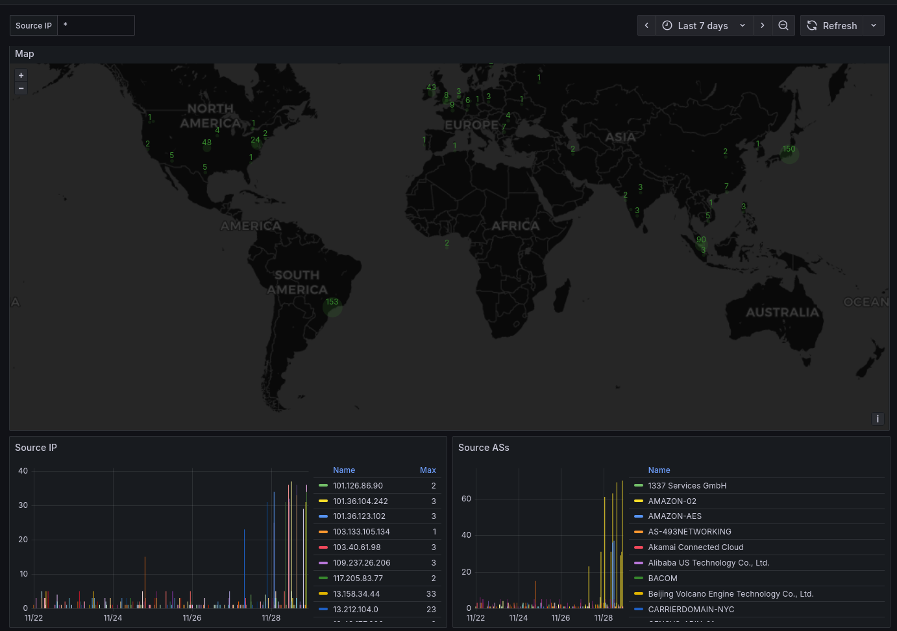
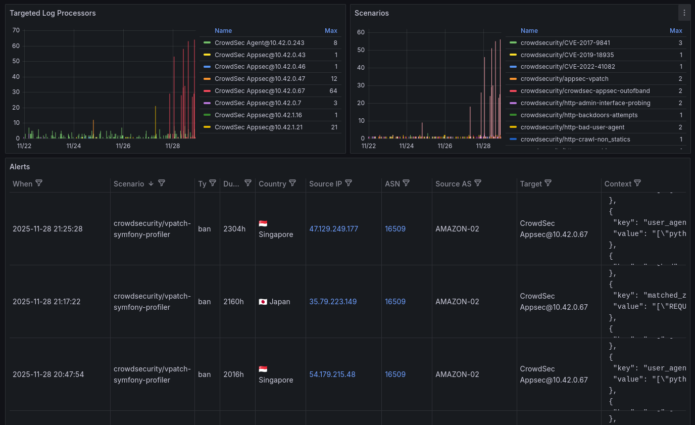

## Table of contents

<div class="toc">

{}

</div>

## Introduction

Usually, I don't write step-by-step guide on how to deploy things, but in this case, I will. In these times, it's almost impossible to open an HTTP port without getting spammed and attacked by botnets and other malicious actors.

One solution is the close the port and forward the traffic to a better, managed WAF (Web Application Firewall) by using Cloudflare Tunnel, delegating the security to Cloudflare.

However, adopting such a solution introduces a significant dependency on a centralized "lord" of the internet, compromising full infrastructure independence.

While absolute independence is debatable, given the necessity of root DNS for domain registration and Certificate Authorities for SSL, relying on a platform like Cloudflare presents a unique single point of failure. Unlike the decentralized nature of DNS and certificate management, Cloudflare's centralization means its outages directly translate to your downtime. In fact, [a major outage at Cloudflare last week demonstrated exactly this vulnerability](https://blog.cloudflare.com/18-november-2025-outage/).

This article explores an alternative path: preserving your infrastructure's autonomy while effectively securing your network from attacks. We will demonstrate how to achieve robust protection using CrowdSec, maintaining control and independence without using centralized services.

## Why would I publish a port on the home network ?

While the best practice is to use cloud providers to expose your service and avoid leaking your IP address, leveraging a home network connection offers distinct, often overlooked, advantages for certain projects:

- You're likely to get less attacked by bots, since ISP assigned IP addresses are typically less targeted by bots compared to IPs assigned by cloud providers.
- Your home IP address is less likely to be pre-emptively blocked or flagged due to the unrelated, malicious activities often hosted on shared cloud infrastructure.
- For users with high-quality fiber connections, hosting directly can offer surprisingly low latency, potentially rivaling or even surpassing the performance of services routed through distant cloud nodes or additional tunneling layers.
- Using a robust reverse proxy directly behind the public HTTP port ensures that most common web attacks are filtered before they ever reach your backend applications.

The major drawback is the exposure of your physical location, as your ISP-assigned IP address can be linked to your geographic data. Therefore, this approach is not suitable for professional or high-stakes services where anonymity and guaranteed uptime are critical.

However, for personal projects, small community sites, or low-stakes experiments, hosting on a home network offers a cost-effective, high-performing alternative that retains independence from large-scale cloud ecosystems.

## How to protect against attacks and spammers ?

A traditional solution against malicious traffic and brute-force attacks involves analyzing system logs to identify and block offenders. Tools like [Fail2ban](https://github.com/fail2ban/fail2ban) have long been the standard for this, parsing logs for failed login attempts and temporarily banning the source IP address.

However, Fail2ban suffers from a critical limitation: the reaction time. Since bans are applied only after the logs are written, read, and processed, there is an inherent delay. The malicious actor has already made several attempts before the block takes effect.

CrowdSec solves this issue in multiple manners:

- CrowdSec uses and builds a crowdsourced blocklist to block known attackers, allowing you to proactively block threats before they ever interact with your systems.
- Like Fail2ban, CrowdSec parses logs in real time, but it simplifies deployment by offering an extensive library of community-validated configurations (or "scenarios") designed to recognize and handle common attack patterns.
- Beyond simple spam or brute-force attempts, CrowdSec uses its log analysis to identify complex attack scenarios. This includes recognizing the initial stages of large-scale threats like [Distributed Denial of Service (DDoS)](https://en.wikipedia.org/wiki/Distributed_Denial_of_Service) attempts or application-specific attacks such as [SQL injection](https://en.wikipedia.org/wiki/SQL_injection).
- For defense against attacks aimed at your web applications, CrowdSec offers a [WAF](https://en.wikipedia.org/wiki/Web_application_firewall) component. This intercepts and inspects HTTP requests before they reach your reverse proxy or backend services, providing a critical layer of preventative security.

## How to deploy CrowdSec

This article is about deploying a **distributed setup** of CrowdSec on Kubernetes and protect against Web Application attacks. It can also handle SSH and many other types of attacks, but this won't be the focus of this article.

### Architecture

Here are the components that play a role in this setup:

- **The persistence**: Which is either SQLite on disk or a PostgreSQL instance (or any other database supported by CrowdSec). This is used to persist the state of CrowdSec Local API.
- **The CrowdSec Local API**:
  - Stores Alerts and Decisions to the database.
  - Is used to manage decisions, alerts, blocklists, and more.
- **The CrowdSec Agent (log processor)**: It's a daemon used to read logs, whether it's from files or from a log storage like Loki, Elasticsearch, etc.
- **The CrowdSec AppSec**: It's a daemon that looks like the CrowdSec Agent, with the difference of having an open port for the reverse proxy to send traffic to it and inspect it.
- **The reverse proxy (remediation component)**: Which will forward traffic to the AppSec component of CrowdSec, which will then inspect the traffic and block any malicious traffic. The reverse proxy logs will also be used to identify additional patterns of attacks.
- **The CrowdSec Central API**: This is used for metrics on [crowdsec.net](https://crowdsec.net) and contributing to the CrowdSec Community blocklist.

```d2 {layout="elk", title="CrowdSec Distributed Setup"}
user: User {
  shape: person
}
capi: CrowdSec\nCentral API\n(crowdsec.net) {
  shape: image
  icon: https://cdn.jsdelivr.net/gh/selfhst/icons/svg/crowdsec.svg
}
pn: Private Network {
  lapi: CrowdSec\nLocal API {
    shape: image
    icon: https://cdn.jsdelivr.net/gh/selfhst/icons/svg/crowdsec.svg
  }
  agent: CrowdSec\nAgent {
    shape: image
    icon: https://cdn.jsdelivr.net/gh/selfhst/icons/svg/crowdsec.svg
  }
  appsec: CrowdSec\nAppSec {
    shape: image
    icon: https://cdn.jsdelivr.net/gh/selfhst/icons/svg/crowdsec.svg
  }
  proxy: Reverse\nProxy\n(remediation component) {
    shape: image
    icon: https://cdn.jsdelivr.net/gh/selfhst/icons/svg/traefik.svg
  }
  persistence: Persistence {
    shape: image
    icon: https://icons.terrastruct.com/essentials%2F117-database.svg
  }

  lapi -> persistence: store
  proxy->agent: parse logs
  agent->lapi: alerts
  proxy->appsec: send traffic
  appsec->lapi: alerts
  lapi->proxy: remediate (ban)
}
user->pn.proxy: traffic
pn.lapi->capi: metrics
```

### CrowdSec pricing plan

The CrowdSec Central API is actually not free and has multiple setup available:

- **Free and no crowdsourcing**: which is not worth it, and you should prefer fail2ban instead.
- **Free and crowdsourcing**: which allows you to contribute to the CrowdSec community blocklist. CrowdSec also offers you 3 free blocklists maintained by third parties.
- **Paid with or without crowdsourcing**: which can be interesting if you want to use the CrowdSec community blocklist, but want to avoid leaking data to a third party like CrowdSec. The paid plan also removes the metrics limitation. There is many advantages in paying CrowdSec in which I won't cover here.

This article will cover an alternative solution to CrowdSec metrics limitation, so don't jump too soon on the Paid plan.

### Deploying CrowdSec on Kubernetes

#### 1. Register on CrowdSec.net and fetch the registration token

Go to [app.crowdsec.net](https://app.crowdsec.net/) and register an account. Then, fetch the registration token the [Security Engines](https://app.crowdsec.net/security-engines) page.

#### 2. Deploy an Ingress Controller on Kubernetes

This article will cover the [Traefik](https://github.com/traefik/traefik) ingress controller, but any other ingress controller will do as well. If you plan to use the [NGINX Ingress Controller](https://github.com/kubernetes/ingress-nginx), you will need to replace it with the fork maintained by CrowdSec: [crowdsec/ingress-nginx](https://github.com/crowdsecurity/ingress-nginx) which re-adds Lua support.

It's almost confirmed that the NGINX Ingress Controller will be deprecated for [InGate](https://github.com/kubernetes-sigs/ingate), so the fact they dropped support for Lua practically means that you should either migrate to a better ingress controller or use [CrowdSec's fork](https://github.com/crowdsecurity/ingress-nginx).

Anyway, you should deploy an Ingress Controller on your Kubernetes cluster if this isn't done yet. The Ingress Controller is the main reverse proxy and should be exposed to the external network through [MetalLB](https://metallb.universe.tf), or [ServiceLB](https://docs.k3s.io/networking/networking-services). You can also use a `NodePort` service, and do the port forwarding manually.

Note that if you've deployed Traefik, you'll need to send the logs to a volume and print it to the standard output so that Kubernetes can catch it.

For example, if you've used Helm to deploy Traefik:

```yaml {title="values.yaml"}
deployment:
  enabled: true

  additionalVolumes:
    - name: traefik-logs
      emptyDir: {}

  additionalContainers:
    - name: tail-accesslogs
      image: busybox
      imagePullPolicy: IfNotPresent
      args: ['/bin/sh', '-c', 'tail -n+1 -F /var/log/traefik/access.log']
      volumeMounts:
        - name: traefik-logs
          mountPath: /var/log/traefik

additionalVolumeMounts:
  - name: traefik-logs
    mountPath: /var/log/traefik

logs:
  general:
    level: INFO
  access:
    enabled: true
    format: json
    addInternals: false
    filePath: /var/log/traefik/access.log
    bufferingSize: 100
    fields:
      general:
        defaultmode: drop
        names:
          ClientHost: keep
          ClientAddr: keep
          ClientUsername: keep
          StartUTC: keep
          RequestHost: keep
          RequestAddr: keep
          RequestMethod: keep
          RequestPath: keep
          RequestProtocol: keep
          DownstreamStatus: keep
          DownstreamContentSize: keep
          RequestCount: keep
          ServiceAddr: keep
          RouterName: keep
          ServiceName: keep
          ServiceURL: keep
          Duration: keep
      headers:
        defaultmode: drop
        names:
          Authorization: redact
          Referer: keep
          User-Agent: keep
          Origin: keep
          Content-Type: keep
          Range: keep
          Cookie: redact
          Set-Cookie: redact
          Content-Security-Policy: drop
          Permissions-Policy: drop
```

#### 3. Deploy CrowdSec on Kubernetes

While CrowdSec offers a [Helm Chart](https://github.com/crowdsecurity/helm-charts), these are badly maintained, and their quality is not great (many variables that does nothing, many bugs, etc.).

This is why, we'll deploy and configure the deployment manually with [Kustomize](https://github.com/kubernetes-sigs/kustomize). Since deployments made by Kustomize can be very opinionated, feel free to adjust the deployment as you see fit.

For now, we'll consider the following:

- The Base will store generic and common configurations for all environments.
- The Overlays will store environment-specific configurations, like secrets, and PVCs.

##### Base - Kustomization

Let's start with the base:

```yaml {title="base/kustomization.yaml"}
labels:
  - pairs:
      app.kubernetes.io/name: crowdsec
      app.kubernetes.io/part-of: crowdsec
      app.kubernetes.io/managed-by: Kustomize
    includeSelectors: true
    includeTemplates: true

resources:
  - agent/daemonset.yaml
  - agent/service.yaml # Optional: is only used if you want to expose the metrics.
  - agent/certificate.yaml
  - appsec/deployment.yaml
  - appsec/service.yaml
  - appsec/certificate.yaml
  - lapi/deployment.yaml
  - lapi/service.yaml
  - lapi/certificate.yaml

namespace: crowdsec

configMapGenerator:
  - name: crowdsec-custom-start
    options:
      labels:
        app.kubernetes.io/component: lapi
    files:
      - docker_start.sh=lapi/files/docker_start.sh
  - name: crowdsec-lapi-config
    options:
      labels:
        app.kubernetes.io/component: lapi
    files:
      - profiles.yaml=lapi/files/profiles.yaml
  - name: crowdsec-lapi-notifications
    options:
      labels:
        app.kubernetes.io/component: lapi
    files:
      - notifications.yaml=lapi/files/notifications.yaml
  - name: crowdsec-agent-config
    options:
      labels:
        app.kubernetes.io/component: agent
    files:
      - acquis.yaml=agent/files/acquis.yaml
  - name: crowdsec-appsec-config
    options:
      labels:
        app.kubernetes.io/component: appsec
    files:
      - acquis.yaml=appsec/files/acquis.yaml
  - name: crowdsec-appsec-haproxy-config
    options:
      labels:
        app.kubernetes.io/component: appsec
    files:
      - haproxy.cfg=appsec/files/haproxy.cfg
```

We'll create each of these resources.

##### Base - Local API

Let's configure the deployment of the CrowdSec Local API, which is responsible for storing alerts, decisions and managing communication with the central API.

1. Write the `docker_start.sh` script. You'll need to fetch it in the [Helm Charts GitHub repository](https://github.com/crowdsecurity/helm-charts/blob/main/charts/crowdsec/files/docker-start-custom.sh):

   ```bash {title="base/lapi/files/docker_start.sh"}
   #!/bin/bash

   # shellcheck disable=SC2292      # allow [ test ] syntax
   # shellcheck disable=SC2310      # allow "if function..." syntax with -e

   set -e
   shopt -s inherit_errexit

   ...
   ```

2. Write the `profiles.yaml` file, which configure the behavior of CrowdSec when receiving an alert. Here's an example:

   ```yaml {title="base/lapi/files/profiles.yaml"}
   name: default_ip_remediation
   filters:
     - Alert.Remediation == true && Alert.GetScope() == "Ip"
   decisions:
     - type: ban
       duration: 72h
   duration_expr: Sprintf('%dh', (GetDecisionsCount(Alert.GetValue()) + 1) * 72)
   notifications:
     #- slack_default
     - file_default
   on_success: break
   ---
   name: default_range_remediation
   filters:
     - Alert.Remediation == true && Alert.GetScope() == "Range"
   decisions:
     - type: ban
       duration: 72h
   duration_expr: Sprintf('%dh', (GetDecisionsCount(Alert.GetValue()) + 1) * 72)
   notifications:
     #- slack_default
     - file_default
   on_success: break
   ---
   name: vpatch_remediation
   filters:
     - Alert.GetScenario() contains "vpatch"
   decisions:
     - type: ban
       duration: 72h
   duration_expr: Sprintf('%dh', (GetDecisionsCount(Alert.GetValue()) + 1) * 72)
   notifications:
     #- slack_default
     - file_default
   on_success: break
   ```

3. Write the `notifications.yaml` file, which configure the notification channels. Usually, this is stored in a `Secret`, but since we'll be simply outputting it to a file, we'll use a `ConfigMap` as declared in the `kustomization.yaml`:

   ```yaml {title="base/lapi/files/notifications.yaml"}
   type: file
   name: file_default
   log_level: info
   format: |
     {{range . -}}
     { "time": "{{.StopAt}}", "program": "crowdsec", "alert": {{. | toJson }} }
     {{ end -}}
   log_path: '/crowdsec-logs/crowdsec_alerts.json'
   rotate:
     enabled: true # Change to false if you want to handle log rotate on system basis
     max_size: 10 # in MB
     max_files: 5 # Number of files to keep
     max_age: 5 # in days but may remove files before this if max_files is reached
     compress: true # Compress rotated files using gzip
   ```

4. Write the `deployment.yaml`:

   ```yaml {title="base/lapi/deployment.yaml"}
   apiVersion: apps/v1
   kind: Deployment
   metadata:
     name: crowdsec-lapi
     labels:
       app.kubernetes.io/component: lapi
   spec:
     replicas: 1
     selector:
       matchLabels:
         app.kubernetes.io/component: lapi
     strategy:
       type: Recreate # Only if using a SQLite database
     template:
       metadata:
         labels:
           app.kubernetes.io/component: lapi
       spec:
         automountServiceAccountToken: false
         terminationGracePeriodSeconds: 30
         containers:
           - name: crowdsec-lapi
             image: 'crowdsecurity/crowdsec:v1.7.3'
             imagePullPolicy: IfNotPresent
             command:
               - sh
               - '-c'
               - >-
                 cp -nR /staging/etc/crowdsec/* /etc/crowdsec_data/ && bash /docker_start.sh
             env:
               - name: LOCAL_API_URL
                 value: https://localhost:8080
               - name: DISABLE_AGENT
                 value: 'true'
               - name: USE_TLS
                 value: 'true'
               - name: LAPI_CERT_FILE
                 value: /certs/server/tls.crt
               - name: LAPI_KEY_FILE
                 value: /certs/server/tls.key
               - name: CACERT_FILE
                 value: /certs/server/ca.crt
               - name: CLIENT_CERT_FILE
                 value: /certs/client/tls.crt
               - name: CLIENT_KEY_FILE
                 value: /certs/client/tls.key
               - name: INSECURE_SKIP_VERIFY
                 value: 'false'
               - name: CUSTOM_HOSTNAME
                 valueFrom:
                   fieldRef:
                     fieldPath: metadata.name
               # CrowdSec uses Organisation Units (OUs) to validate certificates.
               - name: AGENTS_ALLOWED_OU
                 value: agent-ou,appsec-ou
             resources:
               limits:
                 memory: 293Mi
               requests:
                 cpu: 10m
                 memory: 293Mi
             livenessProbe:
               failureThreshold: 3
               periodSeconds: 10
               successThreshold: 1
               timeoutSeconds: 5
               httpGet:
                 path: /health
                 port: lapi
                 scheme: HTTPS
             readinessProbe:
               failureThreshold: 3
               periodSeconds: 10
               successThreshold: 1
               timeoutSeconds: 5
               httpGet:
                 path: /health
                 port: lapi
                 scheme: HTTPS
             startupProbe:
               failureThreshold: 30
               periodSeconds: 10
               successThreshold: 1
               timeoutSeconds: 5
               httpGet:
                 path: /health
                 port: lapi
                 scheme: HTTPS
             securityContext:
               allowPrivilegeEscalation: false
               privileged: false
               readOnlyRootFilesystem: true
             ports:
               - name: lapi
                 containerPort: 8080
                 protocol: TCP
               - name: metrics
                 containerPort: 6060
                 protocol: TCP
             volumeMounts:
               - name: tls
                 mountPath: /certs/server
                 readOnly: true
               - name: client-tls
                 mountPath: /certs/client
                 readOnly: true
               - mountPath: /etc/crowdsec_data
                 name: persistence # Only if using a SQLite database
                 subPath: crowdsec-etc
               - name: config
                 mountPath: /etc/crowdsec/profiles.yaml
                 subPath: profiles.yaml
                 readOnly: true
               - mountPath: /etc/crowdsec/config.yaml.local
                 name: config
                 subPath: config.yaml.local
                 readOnly: true
               - mountPath: /var/lib/crowdsec/data
                 name: persistence # Only if using a SQLite database
                 subPath: crowdsec-data
               - name: persistence # Only if using a SQLite database
                 mountPath: /etc/crowdsec
                 subPath: crowdsec-etc
               - name: tmp
                 mountPath: /tmp
                 subPath: tmp
               - name: custom-start
                 mountPath: /docker_start.sh
                 subPath: docker_start.sh
               - mountPath: /etc/crowdsec/notifications
                 name: notifications
           - name: tail-crowdsec-logs # We need this sidecar container to forward Crowdsec Alerts to Kubernetes logs.
             image: busybox
             imagePullPolicy: IfNotPresent
             command:
               ['tail', '-n+1', '-F', '/crowdsec-logs/crowdsec_alerts.json']
             volumeMounts:
               - mountPath: /crowdsec-logs
                 name: crowdsec-logs
         volumes:
           - name: persistence # Only if using a SQLite database
           - name: notifications
             configMap:
               name: crowdsec-lapi-notifications
           - name: config
             configMap:
               name: crowdsec-lapi-config
           - name: tls
             secret:
               secretName: crowdsec-lapi-tls
           - name: client-tls
             secret:
               secretName: crowdsec-appsec-tls
           - name: tmp
             emptyDir: {}
           - name: custom-start
             configMap:
               name: crowdsec-custom-start
           - name: crowdsec-logs
             emptyDir: {}
   ```

   If you look closely, you'll notice that `persistence` is missing a configuration. This will be patched in a Kustomize overlay later.

   However, do note that the persistence volume might not be required if you plan to use PostgreSQL as database. You'll still need to mount an `emptyDir` at the `/etc/crowdsec` and `/var/lib/crowdsec/data` locations.

   !!!note NOTE

   <small>

   The containerized CrowdSec can use multiple environment variables to configure itself. This also applies to the Agent and Appsec components.

     - `CONFIG_FILE`: The path to the configuration file. Defaults to `/etc/crowdsec/config.yaml`.
     - `NO_HUB_UPGRADE=true`: Disables the automatic upgrade of the CrowdSec Hub.
     - `DEBUG=true`: Enables debug mode for the start script.
     - `COLLECTIONS`/`DISABLE_COLLECTIONS`: Comma-separated list of collections to enable/disable.
     - `PARSERS`/`DISABLE_PARSERS`: Comma-separated list of parsers to enable/disable.
     - `SCENARIOS`/`DISABLE_SCENARIOS`: Comma-separated list of scenarios to enable/disable.
     - `POSTOVERFLOWS`/`DISABLE_POSTOVERFLOWS`: Comma-separated list of postoverflows to enable/disable.
     - `CONTEXTS`/`DISABLE_CONTEXTS`: Comma-separated list of contexts to enable/disable.
     - `APPSEC_CONFIGS`/`DISABLE_APPSEC_CONFIGS`: Comma-separated list of AppSec configurations to enable/disable.
     - `APPSEC_RULES`/`DISABLE_APPSEC_RULES`: Comma-separated list of AppSec rules to enable/disable.
     - `METRICS_PORT`: The port to expose the metrics on.
     - `DISABLE_LOCAL_API=true`: Disables the Local API role.
     - `DISABLE_AGENT=true`: Disables the Agent role.

   Local API specific:

     - `DISABLE_ONLINE_API=true`: Do not connect to the Central API (crowdsec.net).
     - `ENROLL_KEY`: Enroll the Local API to the Central API.
     - `USE_WAL=true`: Set `.db_config.use_wal` to the set value. Only applies to SQLite databases.
     - `LAPI_CERT_FILE`: The path to the Local API certificate file. Defaults to `/certs/server/tls.crt`.
     - `LAPI_KEY_FILE`: The path to the Local API key file. Defaults to `/certs/server/tls.key`.
     - `AGENTS_ALLOWED_OU`: The allowed Organizational Units for certificates given by the Agent/AppSec components during TLS client authentication. Defaults to `agent-ou`.
     - `BOUNCER_ALLOWED_OU`: The allowed Organizational Units for certificates given by the Bouncer component during TLS client authentication. Defaults to `bouncer-ou`.
     - `BOUNCER_KEY_<ID>` (`ID` is case-insensitive): Shared secret between the Local API and the Bouncer component.
     - `ENABLE_CONSOLE_MANAGEMENT`: Use the Central API to manage the Local API (Premium feature).
     - `CAPI_WHITELISTS_PATH`: Path to the CAPI whitelists file. Avoid IPs and CIDRs getting registered in the community blocklist. Deprecated by [Allowlists](https://docs.crowdsec.net/docs/next/local_api/centralized_allowlists).
     - `DSN`: The database connection string.
     - `TYPE`: The database type.
     - `TEST_MODE=true`: Enable the test mode.
     - `LEVEL_[TRACE|DEBUG|INFO|WARN|ERROR]=true`: Set the logging level of a specific log level.

   </small>

   !!!

5. Write the `service.yaml`:

   ```yaml {title="base/lapi/service.yaml"}
   apiVersion: v1
   kind: Service
   metadata:
     name: crowdsec-lapi
     labels:
       app.kubernetes.io/component: lapi
   spec:
     type: ClusterIP
     ports:
       - port: 6060
         targetPort: metrics
         protocol: TCP
         name: metrics
       - port: 8080
         targetPort: lapi
         protocol: TCP
         name: lapi
     selector:
       app.kubernetes.io/component: lapi
   ```

6. Write the `certificate.yaml`. We'll cert-manager to generate the certificate for us.

   ```yaml {title="base/lapi/certificate.yaml"}
   apiVersion: cert-manager.io/v1
   kind: Certificate
   metadata:
     name: crowdsec-lapi
   spec:
     secretName: crowdsec-lapi-tls
     duration: 2160h
     renewBefore: 720h
     subject:
       organizationalUnits: [lapi-ou]
     commonName: crowdsec-lapi
     dnsNames:
       - crowdsec-lapi.crowdsec # Make sure to match the namespace
       - crowdsec-lapi.crowdsec.svc.cluster.local # Make sure to match the namespace
       - localhost
     issuerRef:
       name: private-cluster-issuer
       kind: ClusterIssuer
   ```

   `private-cluster-issuer` is a `ClusterIssuer` that generates private certificates for the CrowdSec LAPI. It has a self-signed root CA and a private key that looks like this:

   ```yaml
   # THIS IS PURELY AN EXAMPLE, DO NOT DEPLOY IT
   apiVersion: cert-manager.io/v1
   kind: ClusterIssuer
   metadata:
     name: selfsigned-cluster-issuer
     namespace: cert-manager
   spec:
     selfSigned: {}
   ---
   apiVersion: cert-manager.io/v1
   kind: Certificate
   metadata:
     name: my-root-ca
     namespace: cert-manager
   spec:
     isCA: true
     duration: 43800h # 5 year
     renewBefore: 720h # 30 days before expiry
     secretName: my-root-ca
     isCA: true
     privateKey:
       algorithm: RSA
       encoding: PKCS1
       size: 2048
     subject:
       organizations: [Me]
     commonName: My Root CA
     issuerRef:
       name: selfsigned-cluster-issuer
       kind: ClusterIssuer
   ---
   apiVersion: cert-manager.io/v1
   kind: ClusterIssuer
   metadata:
     name: private-cluster-issuer
   spec:
     ca:
       secretName: my-root-ca
   ```

That's it for the LAPI. We'll be applying environment specific patches later. If you plan to monitor Crowdsec with Prometheus, you can add a `ServiceMonitor` resource targeting the `metrics` port.

##### Base - Agent

We'll now configure the deployment the CrowdSec Agent. The CrowdSec agent is a log processor similar to Promtail and Filebeat. It should be deployed as a DaemonSet to fetch the container logs on each host of the Kubernetes cluster. Knowing that the Ingress Controller will output its logs to `/var/log/containers`, we can do the following:

1. First write the acquisition configuration at `base/agent/files/acquis.yaml`. (This can be moved to a Kustomize overlay if the configuration differs between environments.)

   ```yaml {title="base/agent/files/acquis.yaml"}
   filenames:
     - /var/log/containers/ingress-traefik-*_<REPLACE_ME: namespace>_*access*.log
   labels: # These labels will trigger parsers
     program: traefik
     type: containerd
   poll_without_inotify: true
   source: file
   ```

   If you use NGINX, replace `traefik` with `nginx` instead. Make sure the log filename matches the Ingress Controller container logs on the Kubernetes node. We'll be mounting Kubernetes logs at `/var/log/containers` in the container.

2. Write the `daemonset.yaml`:

   ```yaml {title="base/agent/daemonset.yaml"}
   apiVersion: apps/v1
   kind: DaemonSet
   metadata:
     name: crowdsec-agent
     labels:
       app.kubernetes.io/component: agent
   spec:
     selector:
       matchLabels:
         app.kubernetes.io/component: agent
     template:
       metadata:
         labels:
           app.kubernetes.io/component: agent
       spec:
         automountServiceAccountToken: false
         terminationGracePeriodSeconds: 30
         initContainers:
           - name: wait-for-lapi
             image: busybox
             imagePullPolicy: IfNotPresent
             command:
               [
                 'sh',
                 '-c',
                 'until nc "$LAPI_HOST" "$LAPI_PORT" -z; do echo waiting for lapi to start; sleep 5; done',
               ]
             resources:
               limits:
                 memory: 50Mi
               requests:
                 cpu: 1m
                 memory: 10Mi
             securityContext:
               allowPrivilegeEscalation: false
               privileged: false
               readOnlyRootFilesystem: true
               runAsUser: 1000
               runAsGroup: 2000
               runAsNonRoot: true
               capabilities:
                 drop: [ALL]
             env:
               - name: MY_NAMESPACE
                 valueFrom:
                   fieldRef:
                     fieldPath: metadata.namespace
               - name: LAPI_HOST
                 value: 'crowdsec-lapi.$(MY_NAMESPACE)'
               - name: LAPI_PORT
                 value: '8080'
         containers:
           - name: crowdsec-agent
             image: 'crowdsecurity/crowdsec:v1.7.3'
             imagePullPolicy: IfNotPresent
             env:
               - name: MY_NAMESPACE
                 valueFrom:
                   fieldRef:
                     fieldPath: metadata.namespace
               - name: DISABLE_LOCAL_API
                 value: 'true'
               - name: DISABLE_ONLINE_API
                 value: 'true'
               - name: CROWDSEC_BYPASS_DB_VOLUME_CHECK
                 value: 'true'
               - name: USE_TLS
                 value: 'true'
               - name: CLIENT_CERT_FILE
                 value: /certs/tls.crt
               - name: CLIENT_KEY_FILE
                 value: /certs/tls.key
               - name: CACERT_FILE
                 value: /certs/ca.crt
               - name: LOCAL_API_URL
                 value: 'https://crowdsec-lapi.$(MY_NAMESPACE):8080'
               - name: COLLECTIONS # This is used to download a bunch of scenarios, parsers, enrichers, etc...
                 value: crowdsecurity/traefik crowdsecurity/linux # This should cover basic HTTP scenarios and enrich logs with GeoIP data. This also covers SSH.
               - name: UNREGISTER_ON_EXIT
                 value: 'true'
             resources:
               limits:
                 memory: 189Mi
               requests:
                 cpu: 10m
                 memory: 189Mi
             ports:
               - name: metrics
                 containerPort: 6060
                 protocol: TCP
             livenessProbe:
               failureThreshold: 3
               httpGet:
                 path: /metrics
                 port: metrics
                 scheme: HTTP
               periodSeconds: 10
               successThreshold: 1
               timeoutSeconds: 5
             readinessProbe:
               failureThreshold: 3
               httpGet:
                 path: /metrics
                 port: metrics
                 scheme: HTTP
               periodSeconds: 10
               successThreshold: 1
               timeoutSeconds: 5
             startupProbe:
               failureThreshold: 30
               httpGet:
                 path: /metrics
                 port: metrics
                 scheme: HTTP
               periodSeconds: 10
               successThreshold: 1
               timeoutSeconds: 5
             securityContext:
               allowPrivilegeEscalation: false
               privileged: false
               readOnlyRootFilesystem: true
               capabilities:
                 drop: [ALL]
             volumeMounts:
               - name: varlog
                 mountPath: /var/log
                 readOnly: true
               - name: config
                 mountPath: /etc/crowdsec/acquis.yaml
                 subPath: acquis.yaml
                 readOnly: true
               - name: tls
                 mountPath: /certs
                 readOnly: true
               - mountPath: /var/lib/crowdsec/data
                 name: tmp
                 subPath: crowdsec-data
               - mountPath: /etc/crowdsec
                 name: tmp
                 subPath: crowdsec-etc
               - name: tmp
                 mountPath: /tmp
                 subPath: tmp
         volumes:
           - name: varlog
             hostPath:
               path: /var/log
               type: Directory
           - name: config
             configMap:
               name: crowdsec-agent-config
           - name: tls
             secret:
               secretName: crowdsec-agent-tls
           - name: tmp
             emptyDir: {}
   ```

   !!!note NOTE

   <small>

   The containerized CrowdSec can use multiple environment variables to configure itself. This also applies to the Agent and Appsec components.

     - `CONFIG_FILE`: The path to the configuration file. Defaults to `/etc/crowdsec/config.yaml`.
     - `NO_HUB_UPGRADE=true`: Disables the automatic upgrade of the CrowdSec Hub.
     - `DEBUG=true`: Enables debug mode for the start script.
     - `COLLECTIONS`/`DISABLE_COLLECTIONS`: Comma-separated list of collections to enable/disable.
     - `PARSERS`/`DISABLE_PARSERS`: Comma-separated list of parsers to enable/disable.
     - `SCENARIOS`/`DISABLE_SCENARIOS`: Comma-separated list of scenarios to enable/disable.
     - `POSTOVERFLOWS`/`DISABLE_POSTOVERFLOWS`: Comma-separated list of postoverflows to enable/disable.
     - `CONTEXTS`/`DISABLE_CONTEXTS`: Comma-separated list of contexts to enable/disable.
     - `APPSEC_CONFIGS`/`DISABLE_APPSEC_CONFIGS`: Comma-separated list of AppSec configurations to enable/disable.
     - `APPSEC_RULES`/`DISABLE_APPSEC_RULES`: Comma-separated list of AppSec rules to enable/disable.
     - `METRICS_PORT`: The port to expose the metrics on.
     - `DISABLE_LOCAL_API=true`: Disables the Local API role.
     - `DISABLE_AGENT=true`: Disables the Agent role.

   AppSec/Agent specific:

     - `CUSTOM_HOSTNAME`: The login and machine ID of the Agent when adding it to the Local API. Defaults to `localhost`.
     - `USE_TLS=true`: Enables TLS to connect to the Local API.
     - `CACERT_FILE`: Specifies the path to the CA certificate file, to check against the Local API certificate.
     - `CLIENT_CERT_FILE`: For client authentication to the Local API, the path to the Client certificate file.
     - `CLIENT_KEY_FILE`: For client authentication to the Local API, the path to the Client key file.
     - `AGENT_USERNAME`: Similar to `CUSTOM_HOSTNAME`, but used by password-based authentication to the Local API.
     - `AGENT_PASSWORD`: For password-based authentication to the Local API.
     - `INSECURE_SKIP_VERIFY=true`: Disables the verification of the Local API certificate.

   </small>

   !!!

   You can see we've mounted `/var/log` from the host using `hostPath`. The container is required to run as root to be able to read the logs. You should customize `COLLECTIONS` to match your needs, but, usually, `crowdsecurity/traefik` and `crowdsecurity/linux` should be enough.

3. (Optional) Write the `service.yaml`:

   ```yaml {title="base/agent/service.yaml"}
   apiVersion: v1
   kind: Service
   metadata:
     name: crowdsec-agent
     labels:
       app.kubernetes.io/component: agent
   spec:
     type: ClusterIP
     ports:
       - port: 6060
         targetPort: metrics
         protocol: TCP
         name: metrics
     selector:
       app.kubernetes.io/component: agent
   ```

4. Write the `certificate.yaml`.

   ```yaml {title="base/agent/certificate.yaml"}
   apiVersion: cert-manager.io/v1
   kind: Certificate
   metadata:
     name: crowdsec-agent
   spec:
     secretName: crowdsec-agent-tls
     duration: 2160h
     renewBefore: 720h
     subject:
       organizationalUnits: [agent-ou]
     commonName: CrowdSec agent
     dnsNames:
       - crowdsec-agent.crowdsec
       - crowdsec-agent.crowdsec.svc.cluster.local
       - localhost
     issuerRef:
       name: private-cluster-issuer
       kind: ClusterIssuer
   ```

That's it for the Agent. There won't be any overlay for the agents as there is nothing environment specific.

##### Base - AppSec

As said in previous parts, the deployment of the AppSec component is very similar to the Agent. One difference is that it's not a DaemonSet, but a Deployment since it will be receiving traffic and not fetch logs for each node. Based on the in-bound or out-of-bound traffic, AppSec is able to detect attack scenarios.

1. Write the `acquis.yaml`:

   ```yaml {title="base/appsec/files/acquis.yaml"}
   # In old guides, you may see "appsec_config". You should use "appsec_configs" instead.
   # appsec_config: crowdsecurity/appsec-default
   appsec_configs:
     - crowdsecurity/appsec-default # This includes base-config, vpatch and generic rules.
     - crowdsecurity/crs # This includes OWASP CRS, which is used in most WAF, including Cloudflare.
   labels:
     type: appsec
   listen_addr: 0.0.0.0:7422
   path: /
   source: appsec
   ```

   `crowdsecurity/crs` can trigger many false positives, so I recommend that you should write your own AppSec configuration. You can follow this [guide to know more](https://docs.crowdsec.net/docs/appsec/configuration/#appsec-configuration-files).

2. Write the `haproxy.cfg`:

   ```ini {title="base/appsec/files/haproxy.cfg"}
   defaults
     mode http
     balance roundrobin
     log global
     timeout connect 5s
     timeout client 50s
     timeout server 50s

   crt-store web
     crt-base /certs/
     key-base /certs/
     load crt "tls.crt" key "tls.key"

   frontend front
     bind :7423 ssl crt "@web/tls.crt"
     capture request header Host len 64
     option forwardfor
     default_backend back

   # Inherits mode and balance
   backend back
     mode http
     http-request set-header Host %[req.hdr(Host)]
     server s1 127.0.0.1:7422 check
   ```

3. Write the `deployment.yaml`:

   ```yaml {title="base/appsec/deployment.yaml"}
   apiVersion: apps/v1
   kind: Deployment
   metadata:
     name: crowdsec-appsec
     labels:
       app.kubernetes.io/component: appsec
   spec:
     replicas: 1
     strategy:
       type: RollingUpdate
       rollingUpdate:
         maxUnavailable: 1
     selector:
       matchLabels:
         app.kubernetes.io/component: appsec
     template:
       metadata:
         labels:
           app.kubernetes.io/component: appsec
       spec:
         automountServiceAccountToken: false
         terminationGracePeriodSeconds: 30
         securityContext:
           fsGroup: 2000
           runAsUser: 1000
           runAsGroup: 2000
           runAsNonRoot: true
         initContainers:
           - name: wait-for-lapi
             image: busybox
             imagePullPolicy: IfNotPresent
             command:
               [
                 'sh',
                 '-c',
                 'until nc "$LAPI_HOST" "$LAPI_PORT" -z; do echo waiting for lapi to start; sleep 5; done',
               ]
             resources:
               limits:
                 memory: 50Mi
               requests:
                 cpu: 1m
                 memory: 10Mi
             securityContext:
               allowPrivilegeEscalation: false
               privileged: false
               readOnlyRootFilesystem: true
               runAsUser: 1000
               runAsGroup: 2000
               runAsNonRoot: true
               capabilities:
                 drop: [ALL]
             env:
               - name: MY_NAMESPACE
                 valueFrom:
                   fieldRef:
                     fieldPath: metadata.namespace
               - name: LAPI_HOST
                 value: 'crowdsec-lapi.$(MY_NAMESPACE)'
               - name: LAPI_PORT
                 value: '8080'
           - name: init-perms
             image: crowdsecurity/crowdsec:v1.7.3
             imagePullPolicy: IfNotPresent
             securityContext:
               runAsUser: 0
               runAsGroup: 0
               runAsNonRoot: false
             command:
               - sh
               - -c
               - |-
                 cp -Rf /staging/var/lib/crowdsec/data/* /out
                 chown -R 1000:2000 /out
             volumeMounts:
               - name: crowdsec-default-data
                 mountPath: /out
         containers:
           - name: crowdsec-appsec
             image: 'crowdsecurity/crowdsec:v1.7.3'
             imagePullPolicy: IfNotPresent
             env:
               - name: MY_NAMESPACE
                 valueFrom:
                   fieldRef:
                     fieldPath: metadata.namespace
               - name: DISABLE_LOCAL_API
                 value: 'true'
               - name: DISABLE_ONLINE_API
                 value: 'true'
               - name: CROWDSEC_BYPASS_DB_VOLUME_CHECK
                 value: 'true'
               - name: LOCAL_API_URL
                 value: 'https://crowdsec-lapi.$(MY_NAMESPACE):8080'
               - name: USE_TLS
                 value: 'true'
               - name: CLIENT_CERT_FILE
                 value: /certs/tls.crt
               - name: CLIENT_KEY_FILE
                 value: /certs/tls.key
               - name: CACERT_FILE
                 value: /certs/ca.crt
               - name: COLLECTIONS # Download collections, which contains parsers, enrichers, etc...
                 value: >-
                   crowdsecurity/traefik crowdsecurity/linux
                   crowdsecurity/appsec-generic-rules crowdsecurity/appsec-virtual-patching
                   crowdsecurity/appsec-crs
               - name: APPSEC_CONFIGS # Download AppSec configurations
                 value: crowdsecurity/appsec-default
               - name: UNREGISTER_ON_EXIT
                 value: 'true'
             resources:
               limits:
                 memory: 250Mi
               requests:
                 cpu: 10m
                 memory: 250Mi
             ports:
               - name: appsec
                 containerPort: 7422
                 protocol: TCP
               - name: metrics
                 containerPort: 6060
                 protocol: TCP
             livenessProbe:
               failureThreshold: 3
               httpGet:
                 path: /metrics
                 port: metrics
                 scheme: HTTP
               periodSeconds: 10
               successThreshold: 1
               timeoutSeconds: 5
             readinessProbe:
               failureThreshold: 3
               httpGet:
                 path: /metrics
                 port: metrics
                 scheme: HTTP
               periodSeconds: 10
               successThreshold: 1
               timeoutSeconds: 5
             startupProbe:
               failureThreshold: 30
               httpGet:
                 path: /metrics
                 port: metrics
                 scheme: HTTP
               periodSeconds: 10
               successThreshold: 1
               timeoutSeconds: 5
             securityContext:
               allowPrivilegeEscalation: false
               privileged: false
               readOnlyRootFilesystem: true
               runAsUser: 1000
               runAsGroup: 2000
               runAsNonRoot: true
               capabilities:
                 drop: [ALL]
             volumeMounts:
               - name: config
                 mountPath: /etc/crowdsec/acquis.yaml
                 subPath: acquis.yaml
                 readOnly: true
               - name: tls
                 mountPath: /certs
                 readOnly: true
               - mountPath: /var/lib/crowdsec/data
                 name: tmp
                 subPath: crowdsec-data
               - mountPath: /etc/crowdsec
                 name: tmp
                 subPath: crowdsec-etc
               - name: tmp
                 mountPath: /tmp
                 subPath: tmp
               - name: crowdsec-default-data
                 mountPath: /staging/var/lib/crowdsec/data
           - name: haproxy
             image: registry-1.docker.io/library/haproxy:3.2.8-alpine
             imagePullPolicy: IfNotPresent
             ports:
               - name: appsec-secure
                 containerPort: 7423
             livenessProbe:
               tcpSocket:
                 port: appsec-secure
               initialDelaySeconds: 30
               periodSeconds: 30
             resources:
               limits:
                 memory: 250Mi
               requests:
                 cpu: 10m
                 memory: 128Mi
             volumeMounts:
               - name: haproxy-config
                 mountPath: /usr/local/etc/haproxy/haproxy.cfg
                 subPath: haproxy.cfg
                 readOnly: true
               - name: tls
                 mountPath: /certs
                 readOnly: true
               - name: tmp
                 mountPath: /tmp
                 subPath: tmp
         volumes:
           - name: config
             configMap:
               name: crowdsec-appsec-config
           - name: tls
             secret:
               secretName: crowdsec-appsec-tls
           - name: tmp
             emptyDir: {}
           - name: crowdsec-default-data
             emptyDir: {}
           - name: haproxy-config
             configMap:
               name: crowdsec-appsec-haproxy-config
   ```

   This section requires some explanation. Crowdsec Appsec does not open an HTTPS port, the only way to secure it is by using a lightweight L7 reverse proxy like HAProxy.

   Moreover, compared to the Crowdsec Agent that is running as root to fetch the logs, the Crowdsec Appsec component is running as rootless, therefore, we need to fix the permissions inside the container by using a sidecar container (`init-perms`) and a volume (`crowdsec-default-data`).

   !!!note NOTE

   <small>

   The containerized CrowdSec can use multiple environment variables to configure itself. This also applies to the Agent and Appsec components.

     - `CONFIG_FILE`: The path to the configuration file. Defaults to `/etc/crowdsec/config.yaml`.
     - `NO_HUB_UPGRADE=true`: Disables the automatic upgrade of the CrowdSec Hub.
     - `DEBUG=true`: Enables debug mode for the start script.
     - `COLLECTIONS`/`DISABLE_COLLECTIONS`: Comma-separated list of collections to enable/disable.
     - `PARSERS`/`DISABLE_PARSERS`: Comma-separated list of parsers to enable/disable.
     - `SCENARIOS`/`DISABLE_SCENARIOS`: Comma-separated list of scenarios to enable/disable.
     - `POSTOVERFLOWS`/`DISABLE_POSTOVERFLOWS`: Comma-separated list of postoverflows to enable/disable.
     - `CONTEXTS`/`DISABLE_CONTEXTS`: Comma-separated list of contexts to enable/disable.
     - `APPSEC_CONFIGS`/`DISABLE_APPSEC_CONFIGS`: Comma-separated list of AppSec configurations to enable/disable.
     - `APPSEC_RULES`/`DISABLE_APPSEC_RULES`: Comma-separated list of AppSec rules to enable/disable.
     - `METRICS_PORT`: The port to expose the metrics on.
     - `DISABLE_LOCAL_API=true`: Disables the Local API role.
     - `DISABLE_AGENT=true`: Disables the Agent role.

   AppSec/Agent specific:

     - `CUSTOM_HOSTNAME`: The login and machine ID of the Agent when adding it to the Local API. Defaults to `localhost`.
     - `USE_TLS=true`: Enables TLS to connect to the Local API.
     - `CACERT_FILE`: Specifies the path to the CA certificate file, to check against the Local API certificate.
     - `CLIENT_CERT_FILE`: For client authentication to the Local API, the path to the Client certificate file.
     - `CLIENT_KEY_FILE`: For client authentication to the Local API, the path to the Client key file.
     - `AGENT_USERNAME`: Similar to `CUSTOM_HOSTNAME`, but used by password-based authentication to the Local API.
     - `AGENT_PASSWORD`: For password-based authentication to the Local API.
     - `INSECURE_SKIP_VERIFY=true`: Disables the verification of the Local API certificate.

   </small>

   !!!

4. Write the `service.yaml`:

   ```yaml {title="base/appsec/service.yaml"}
   apiVersion: v1
   kind: Service
   metadata:
     name: crowdsec-appsec
     labels:
       app.kubernetes.io/component: appsec
   spec:
     type: ClusterIP
     ports:
       - port: 6060
         targetPort: metrics
         protocol: TCP
         name: metrics
       - port: 7422
         targetPort: appsec
         protocol: TCP
         name: appsec
       - port: 7423
         targetPort: appsec-secure
         protocol: TCP
         name: appsec-secure
     selector:
       app.kubernetes.io/component: appsec
   ```

5. Write the `certificate.yaml`:

   ```yaml {title="base/appsec/certificate.yaml"}
   apiVersion: cert-manager.io/v1
   kind: Certificate
   metadata:
     name: crowdsec-appsec
   spec:
     secretName: crowdsec-appsec-tls
     duration: 2160h
     renewBefore: 720h
     subject:
       organizationalUnits: [appsec-ou]
     commonName: CrowdSec Appsec
     dnsNames:
       - crowdsec-appsec.crowdsec
       - crowdsec-appsec.crowdsec.svc.cluster.local
       - localhost
     issuerRef:
       name: private-cluster-issuer
       kind: ClusterIssuer
   ```

At this point, the base is done! Now, let's patch the deployment to mount a PVC and push secrets to the cluster. You can validate the base by using `kubectl kustomize ./base`

##### Overlay - LAPI

1. Write the `secret.yaml`:

   !!!note NOTE

   Usually, the secret is not deployed as-is. You should use a secret manager or an external secret operator.

   !!!

   ```yaml {title="overlays/my-env/lapi/secret.yaml"}
   apiVersion: v1
   kind: Secret
   metadata:
     name: crowdsec-env-secret
   type: Opaque
   stringData:
     ENROLL_INSTANCE_NAME: my-env
     ENROLL_TAGS: 'k8s linux'
     ENROLL_KEY: <the enroll key you've fetched>
     # A random secret for secure communication with the remediation component.
     # You would replace `TRAEFIK` by `NGINX` if you were to use the NGINX Ingress Controller
     BOUNCER_KEY_TRAEFIK: <random secret>
     CS_LAPI_SECRET: <random secret>
     REGISTRATION_TOKEN: <random secret>
   ```

2. Write the `pvc.yaml`:

   ```yaml {title="overlays/my-env/lapi/pvc.yaml"}
   apiVersion: v1
   kind: PersistentVolumeClaim
   metadata:
     name: crowdsec-config-pvc
   spec:
     storageClassName: <replace me>
     resources:
       requests:
         storage: 100Mi
     volumeMode: Filesystem
     accessModes:
       - ReadWriteOnce
   ```

3. Write the `deployment.yaml` patch:

   ```yaml {title="overlays/my-env/lapi/deployment.yaml"}
   apiVersion: apps/v1
   kind: Deployment
   metadata:
     name: crowdsec-lapi
   spec:
     template:
       spec:
         containers:
           - name: crowdsec-lapi
             envFrom:
               - secretRef:
                   name: crowdsec-env-secret
         volumes:
           - name: persisted-config
             persistentVolumeClaim:
               claimName: crowdsec-config-pvc
   ```

4. Now, write the `kustomization.yaml`:

   ```yaml {title="overlays/my-env/kustomization.yaml"}
   resources:
     - ../../base
     - lapi/pvc.yaml
     - lapi/secret.yaml

   patches:
     - path: lapi/deployment.yaml

   namespace: crowdsec
   ```

Aaaand, we're done! You can deploy CrowdSec by running:

```shell
kubectl create namespace crowdsec
kubectl apply -n crowdsec -k overlays/my-env
```

You should see the services running with the following command:

```shell
kubectl get pods -n crowdsec
```

However, it's not fully done yet. We still need to configure the remediation component, also known as the bouncer, or simply, the reverse proxy.

#### 4. Configure the remediation component

I'll quickly cover the configuration of the remediation component. You should read the documentation given by CrowdSec to properly configure it.

In this guide, we assume we use the Traefik Ingress Controller, and more precisely, the Traefik Ingress Controller deployed by Helm Chart. The Traefik Ingress Controller supports plugins and middleware, and that's what we are going to use.

Configure the Traefik Ingress Controller to use the CrowdSec Bouncer, using the values in the Helm Chart:

```yaml {title="values.yaml"}
deployment:
  enabled: true

  additionalVolumes:
    - name: traefik-logs
      emptyDir: {}
    - name: crowdsec-certs
      secret:
        secretName: crowdsec-bouncer-cert
        defaultMode: 384
    - name: crowdsec-secret
      secret:
        secretName: crowdsec-secret
        defaultMode: 384
    - name: certs
      secret:
        # NB: You should use a CA bundle from trust-manager instead.
        # For the sake of the example, I'm just using the CA certificate of the bouncer.
        secretName: crowdsec-bouncer-cert
        items:
          - key: ca.crt
            path: ca-certificates.crt

  additionalContainers:
    ## You need this for the Agents to read the logs. See previous section.
    - name: tail-accesslogs
      image: busybox
      imagePullPolicy: IfNotPresent
      args: ['/bin/sh', '-c', 'tail -n+1 -F /var/log/traefik/access.log']
      volumeMounts:
        - name: traefik-logs
          mountPath: /var/log/traefik

additionalVolumeMounts:
  - name: traefik-logs
    mountPath: /var/log/traefik
  - name: crowdsec-certs
    mountPath: /crowdsec-certs
  - name: crowdsec-secret
    mountPath: /crowdsec-secret
  - name: certs
    mountPath: /etc/ssl/certs

logs:
  general:
    level: INFO
  access:
    enabled: true
    format: json
    addInternals: false
    filePath: /var/log/traefik/access.log
    bufferingSize: 100
    fields:
      general:
        defaultmode: drop
        names:
          ClientHost: keep
          ClientAddr: keep
          ClientUsername: keep
          StartUTC: keep
          RequestHost: keep
          RequestAddr: keep
          RequestMethod: keep
          RequestPath: keep
          RequestProtocol: keep
          DownstreamStatus: keep
          DownstreamContentSize: keep
          RequestCount: keep
          ServiceAddr: keep
          RouterName: keep
          ServiceName: keep
          ServiceURL: keep
          Duration: keep
      headers:
        defaultmode: drop
        names:
          Authorization: keep
          Referer: keep
          User-Agent: keep
          Origin: keep
          Content-Type: keep
          Range: keep
          Cookie: redact
          Set-Cookie: redact
          Content-Security-Policy: drop
          Permissions-Policy: drop

ports:
  # ...
  web:
    # ...
    forwardedHeaders:
      trustedIPs:
        - 10.0.0.0/8
        - 172.16.0.0/12
        - 192.168.0.0/16
        - fc00::/7
    proxyProtocol:
      trustedIPs:
        - 10.0.0.0/8
        - 172.16.0.0/12
        - 192.168.0.0/16
        - fc00::/7
    middlewares:
      - network-crowdsec@kubernetescrd
  websecure:
    # ...
    forwardedHeaders:
      trustedIPs:
        - 10.0.0.0/8
        - 172.16.0.0/12
        - 192.168.0.0/16
        - fc00::/7
    proxyProtocol:
      trustedIPs:
        - 10.0.0.0/8
        - 172.16.0.0/12
        - 192.168.0.0/16
        - fc00::/7
    middlewares:
      - network-crowdsec@kubernetescrd


extraObjects:
  # Add certificate
  - apiVersion: cert-manager.io/v1
    kind: Certificate
    metadata:
      name: crowdsec-bouncer-cert
    spec:
      secretName: crowdsec-bouncer-cert
      issuerRef:
        name: private-cluster-issuer
        kind: ClusterIssuer
      commonName: crowdsec-bouncer
      subject:
        organizationalUnits: [bouncer-ou]
      dnsNames:
        - crowdsec-bouncer
      usages:
        - server auth
        - client auth
        - key encipherment
        - digital signature
  - apiVersion: traefik.io/v1alpha1
    kind: Middleware
    metadata:
      name: crowdsec
    spec:
      plugin:
        crowdsec:
          enabled: true
          # none: No cache. Use Crowdsec LAPI. For each request.
          # live: With cache. Use Crowdsec LAPI. Cache updated for each request.
          # stream: With cache. Use Crowdsec LAPI. Cache updated every minutes.
          # alone: With cache. Use CrowdSec CAPI. Cache updated every minutes.
          # appsec: No cache. Use CrowdSec AppSec. For each request.
          # You want to use stream most of the time to avoid latency and support multiple Crowdsec Agents/AppSec.
          crowdsecMode: stream
          # crowdsecLapiScheme also affect how the bouncer connects to AppSec
          crowdsecLapiScheme: https
          crowdsecLapiHost: crowdsec-lapi.crowdsec:8080
          crowdsecLapiKeyFile: /crowdsec-secret/lapi-key
          crowdsecLapiTLSCertificateAuthorityFile: /crowdsec-certs/ca.crt
          crowdsecLapiTLSCertificateBouncerFile: /crowdsec-certs/tls.crt
          crowdsecLapiTLSCertificateBouncerKeyFile: /crowdsec-certs/tls.key
          crowdsecAppsecEnabled: true
          crowdsecAppsecHost: crowdsec-appsec.crowdsec:7423
          crowdsecAppsecPath: /
          crowdsecAppsecFailureBlock: false
          crowdsecAppsecUnreachableBlock: false
          crowdsecAppsecBodyLimit: 10485760
          forwardedHeadersTrustedIPs:
            ['10.0.0.0/8', '172.16.0.0/12', '192.168.0.0/16', 'fc00::/7']
          updateMaxFailure: -1 # Don't block traffic on failure
          # More info: https://plugins.traefik.io/plugins/6335346ca4caa9ddeffda116/crowdsec-bouncer-traefik-plugin
  - apiVersion: v1
    kind: Secret
    metadata:
      name: crowdsec-secret
    type: Opaque
    stringData:
      lapi-key: <lapi-key-here>
```

And with this! Everything is configured! Deploy everything with `helm install -f values.yaml <release-name> <traefik-repo>` or `kubectl apply -k overlays/my-env`.

## Monitoring

### Processing logs

For monitoring, you could use the Central API (crowdsec.net) as they have beautiful dashboards. This part of the article is about setting up in Grafana.

First, by enabling the collections `crowdsecurity/linux` in the Agent and AppSec, which enables GeoIP enrichment. Then, you want to configure a Log Processor with its Log Storage. Here's some configuration of stack:

- Log Processors:
  - [Vector](https://vector.dev)
  - [Promtail](https://grafana.com/docs/loki/latest/send-data/promtail/) (Deprecated)
  - [Grafana Alloy](https://github.com/grafana/alloy)
  - [Filebeat](https://www.elastic.co/guide/en/filebeat/current/index.html)
- Log Storage:
  - [VictoriaLogs](https://docs.victoriametrics.com/victorialogs/)
  - [Grafana Loki](https://grafana.com/docs/loki/latest/)
  - [Elasticsearch](https://www.elastic.co) (+[Logstash](https://www.elastic.co/products/logstash))

This guide does not cover the deployment of the Log Storage. My recommendation is to use [VictoriaLogs](https://docs.victoriametrics.com/victorialogs/), which is a self-hosted solution and lightweight.

For the example, I'll be using Vector, deployed as DaemonSet on the Kubernetes cluster with this configuration:

```yaml {title="vector.yaml"}
api:
  address: 0.0.0.0:8686
  enabled: false
  playground: true
data_dir: /vector-data-dir
sources:
  k8s:
    type: kubernetes_logs
transforms:
  parser:
    inputs:
    - k8s
    source: |
      structured, err = parse_json(.message)
      if err != null {
        structured = {}
      }
      . = merge!(., structured)
    type: remap
sinks:
  vlogs-0:
    api_version: v8
    compression: gzip
    endpoints:
    - http://victoria-logs-single-server-0.victoria-logs-single-server.victoria-metrics.svc.cluster.local.:9428/insert/elasticsearch
    healthcheck:
      enabled: false
    inputs:
    - parser
    mode: bulk
    request:
      headers:
        AccountID: "0"
        ProjectID: "0"
        VL-Msg-Field: message,msg,_msg,log.msg,log.message,log
        VL-Stream-Fields: stream,kubernetes.pod_name,kubernetes.container_name,kubernetes.pod_namespace
        VL-Time-Field: timestamp
    type: elasticsearch
```

The most important rule is the `transforms.parser.source` where I tell Vector to try parsing the JSON. Remember we've added:

```yaml {title="base/lapi/deployment.yaml"}
           - name: tail-crowdsec-logs # We need this sidecar container to forward Crowdsec Alerts to Kubernetes logs.
             image: busybox
             imagePullPolicy: IfNotPresent
             command:
               ['tail', '-n+1', '-F', '/crowdsec-logs/crowdsec_alerts.json']
             volumeMounts:
               - mountPath: /crowdsec-logs
                 name: crowdsec-logs
```

Thanks to that, Vector will find the logs of `tail-crowdsec-logs` and parse them, thanks to the rule specified at `sources.k8s.type: kubernetes_logs`.

### Setting up the dashboard

There won't be explanation for this, sorry. Having parsed the logs, it's all about transforming the data and configuring the charts.

<details>
    <summary><b>Dashboard JSON code (Click to expand!)</b></summary>


```json
{
  "__inputs": [
    {
      "name": "DS_VICTORIALOGS",
      "label": "VictoriaLogs",
      "description": "",
      "type": "datasource",
      "pluginId": "victoriametrics-logs-datasource",
      "pluginName": "VictoriaLogs"
    }
  ],
  "__elements": {},
  "__requires": [
    {
      "type": "panel",
      "id": "geomap",
      "name": "Geomap",
      "version": ""
    },
    {
      "type": "grafana",
      "id": "grafana",
      "name": "Grafana",
      "version": "12.2.1"
    },
    {
      "type": "panel",
      "id": "table",
      "name": "Table",
      "version": ""
    },
    {
      "type": "panel",
      "id": "timeseries",
      "name": "Time series",
      "version": ""
    },
    {
      "type": "datasource",
      "id": "victoriametrics-logs-datasource",
      "name": "VictoriaLogs",
      "version": "0.21.4"
    }
  ],
  "annotations": {
    "list": [
      {
        "builtIn": 1,
        "datasource": {
          "type": "grafana",
          "uid": "-- Grafana --"
        },
        "enable": true,
        "hide": true,
        "iconColor": "rgba(0, 211, 255, 1)",
        "name": "Annotations & Alerts",
        "type": "dashboard"
      }
    ]
  },
  "editable": true,
  "fiscalYearStartMonth": 0,
  "graphTooltip": 1,
  "id": null,
  "links": [],
  "panels": [
    {
      "datasource": {
        "type": "victoriametrics-logs-datasource",
        "uid": "${DS_VICTORIALOGS}"
      },
      "fieldConfig": {
        "defaults": {
          "color": {
            "mode": "thresholds"
          },
          "custom": {
            "hideFrom": {
              "legend": false,
              "tooltip": false,
              "viz": false
            }
          },
          "mappings": [],
          "thresholds": {
            "mode": "absolute",
            "steps": [
              {
                "color": "green",
                "value": 0
              },
              {
                "color": "red",
                "value": 80
              }
            ]
          }
        },
        "overrides": []
      },
      "gridPos": {
        "h": 16,
        "w": 24,
        "x": 0,
        "y": 0
      },
      "id": 8,
      "options": {
        "basemap": {
          "config": {},
          "name": "Layer 0",
          "noRepeat": false,
          "type": "default"
        },
        "controls": {
          "mouseWheelZoom": true,
          "showAttribution": true,
          "showDebug": false,
          "showMeasure": false,
          "showScale": false,
          "showZoom": true
        },
        "layers": [
          {
            "config": {
              "showLegend": false,
              "style": {
                "color": {
                  "fixed": "#37872d"
                },
                "opacity": 0.4,
                "rotation": {
                  "fixed": 0,
                  "max": 360,
                  "min": -360,
                  "mode": "mod"
                },
                "size": {
                  "field": "Count",
                  "fixed": 5,
                  "max": 15,
                  "min": 2
                },
                "symbol": {
                  "fixed": "img/icons/marker/circle.svg",
                  "mode": "fixed"
                },
                "symbolAlign": {
                  "horizontal": "center",
                  "vertical": "center"
                },
                "text": {
                  "field": "Count",
                  "fixed": "",
                  "mode": "field"
                },
                "textConfig": {
                  "fontSize": 12,
                  "offsetX": 0,
                  "offsetY": 0,
                  "textAlign": "center",
                  "textBaseline": "bottom"
                }
              }
            },
            "filterData": {
              "id": "byRefId",
              "options": "A"
            },
            "layer-tooltip": false,
            "location": {
              "latitude": "Latitude",
              "longitude": "Longitude",
              "mode": "coords"
            },
            "name": "Layer 1",
            "tooltip": true,
            "type": "markers"
          }
        ],
        "tooltip": {
          "mode": "details"
        },
        "view": {
          "allLayers": true,
          "id": "zero",
          "lat": 0,
          "lon": 0,
          "noRepeat": true,
          "zoom": 1
        }
      },
      "pluginVersion": "12.2.1",
      "targets": [
        {
          "datasource": {
            "type": "victoriametrics-logs-datasource",
            "uid": "${DS_VICTORIALOGS}"
          },
          "editorMode": "code",
          "expr": "program: \"crowdsec\" alert.source.ip:$source_ip | stats by(alert.source.latitude, alert.source.longitude, alert.source.cn) count()",
          "queryType": "stats",
          "refId": "A"
        }
      ],
      "title": "Map",
      "transformations": [
        {
          "id": "timeSeriesTable",
          "options": {
            "A": {
              "stat": "sum",
              "timeField": "Time"
            }
          }
        },
        {
          "id": "convertFieldType",
          "options": {
            "conversions": [
              {
                "destinationType": "number",
                "targetField": "alert.source.latitude"
              },
              {
                "destinationType": "number",
                "targetField": "alert.source.longitude"
              }
            ],
            "fields": {}
          }
        },
        {
          "id": "extractFields",
          "options": {
            "delimiter": ",",
            "source": "Trend #A"
          }
        },
        {
          "id": "organize",
          "options": {
            "excludeByName": {
              "@timestamp": true,
              "@version": true,
              "Trend #A": true,
              "__name__": true,
              "_id": true,
              "_index": true,
              "_source": true,
              "_type": true,
              "agent.ephemeral_id": true,
              "agent.id": true,
              "agent.name": true,
              "agent.type": true,
              "agent.version": true,
              "beat.ephemeral_id": true,
              "beat.id": true,
              "beat.name": true,
              "beat.type": true,
              "beat.version": true,
              "container.id": true,
              "container.image.name": true,
              "container.runtime": true,
              "creator": true,
              "ecs.version": true,
              "fields": true,
              "first": true,
              "highlight": true,
              "host.name": true,
              "id": true,
              "input.type": true,
              "k8s_crowdsec_alerts.alert.capacity": true,
              "k8s_crowdsec_alerts.alert.created_at": true,
              "k8s_crowdsec_alerts.alert.decisions": true,
              "k8s_crowdsec_alerts.alert.events": true,
              "k8s_crowdsec_alerts.alert.events_count": true,
              "k8s_crowdsec_alerts.alert.labels": true,
              "k8s_crowdsec_alerts.alert.leakspeed": true,
              "k8s_crowdsec_alerts.alert.message": true,
              "k8s_crowdsec_alerts.alert.meta": true,
              "k8s_crowdsec_alerts.alert.remediation": true,
              "k8s_crowdsec_alerts.alert.scenario_hash": true,
              "k8s_crowdsec_alerts.alert.scenario_version": true,
              "k8s_crowdsec_alerts.alert.simulated": true,
              "k8s_crowdsec_alerts.alert.source.range": true,
              "k8s_crowdsec_alerts.alert.source.scope": true,
              "k8s_crowdsec_alerts.alert.source.value": true,
              "k8s_crowdsec_alerts.alert.start_at": true,
              "k8s_crowdsec_alerts.alert.stop_at": true,
              "k8s_crowdsec_alerts.alert.uuid": true,
              "k8s_crowdsec_alerts.program": true,
              "kubernetes.container.name": true,
              "kubernetes.labels.app_kubernetes_io/component": true,
              "kubernetes.labels.app_kubernetes_io/managed-by": true,
              "kubernetes.labels.app_kubernetes_io/name": true,
              "kubernetes.labels.app_kubernetes_io/part-of": true,
              "kubernetes.labels.pod-template-hash": true,
              "kubernetes.namespace": true,
              "kubernetes.namespace_labels.kubernetes_io/metadata_name": true,
              "kubernetes.namespace_uid": true,
              "kubernetes.node.hostname": true,
              "kubernetes.node.labels.beta_kubernetes_io/arch": true,
              "kubernetes.node.labels.beta_kubernetes_io/instance-type": true,
              "kubernetes.node.labels.beta_kubernetes_io/os": true,
              "kubernetes.node.labels.failure-domain_beta_kubernetes_io/region": true,
              "kubernetes.node.labels.failure-domain_beta_kubernetes_io/zone": true,
              "kubernetes.node.labels.k8s_scaleway_com/kapsule": true,
              "kubernetes.node.labels.k8s_scaleway_com/managed": true,
              "kubernetes.node.labels.k8s_scaleway_com/node": true,
              "kubernetes.node.labels.k8s_scaleway_com/pool": true,
              "kubernetes.node.labels.k8s_scaleway_com/pool-name": true,
              "kubernetes.node.labels.k8s_scaleway_com/runtime": true,
              "kubernetes.node.labels.kubernetes_io/arch": true,
              "kubernetes.node.labels.kubernetes_io/hostname": true,
              "kubernetes.node.labels.kubernetes_io/os": true,
              "kubernetes.node.labels.node_kubernetes_io/instance-type": true,
              "kubernetes.node.labels.topology_csi_scaleway_com/zone": true,
              "kubernetes.node.labels.topology_kubernetes_io/region": true,
              "kubernetes.node.labels.topology_kubernetes_io/zone": true,
              "kubernetes.node.name": true,
              "kubernetes.node.uid": true,
              "kubernetes.pod.ip": true,
              "kubernetes.pod.name": true,
              "kubernetes.pod.uid": true,
              "kubernetes.replicaset.name": true,
              "kubernetes_cluster_name": true,
              "length": true,
              "log.file.device_id": true,
              "log.file.fingerprint": true,
              "log.file.inode": true,
              "log.offset": true,
              "log_type": true,
              "parsers": true,
              "sort": true,
              "source": true,
              "stream": true,
              "tags": true
            },
            "includeByName": {},
            "indexByName": {
              "Trend #A": 8,
              "__name__": 0,
              "alert.machine_id": 2,
              "alert.source.as_name": 3,
              "alert.source.as_number": 4,
              "alert.source.cn": 5,
              "alert.source.ip": 1,
              "alert.source.latitude": 6,
              "alert.source.longitude": 7,
              "creator": 12,
              "fields": 9,
              "first": 10,
              "length": 13,
              "parsers": 11,
              "value": 14
            },
            "renameByName": {
              "@timestamp": "",
              "Count": "",
              "alert.machine_id": "Target",
              "alert.source.as_name": "AS",
              "alert.source.as_number": "ASN",
              "alert.source.cn": "Country",
              "alert.source.ip": "IP",
              "alert.source.latitude": "Latitude",
              "alert.source.longitude": "Longitude",
              "fields": "",
              "first": "",
              "k8s_crowdsec_alerts.alert.decisions.scenario.keyword": "Scenario",
              "k8s_crowdsec_alerts.alert.machine_id": "Target",
              "k8s_crowdsec_alerts.alert.machine_id.keyword": "Target",
              "k8s_crowdsec_alerts.alert.scenario": "Scenario",
              "k8s_crowdsec_alerts.alert.source.as_name": "AS",
              "k8s_crowdsec_alerts.alert.source.as_name.keyword": "AS",
              "k8s_crowdsec_alerts.alert.source.as_number": "ASN",
              "k8s_crowdsec_alerts.alert.source.as_number.keyword": "ASN",
              "k8s_crowdsec_alerts.alert.source.cn": "Country",
              "k8s_crowdsec_alerts.alert.source.cn.keyword": "Country",
              "k8s_crowdsec_alerts.alert.source.ip": "IP",
              "k8s_crowdsec_alerts.alert.source.ip.keyword": "IP",
              "k8s_crowdsec_alerts.alert.source.latitude": "Latitude",
              "k8s_crowdsec_alerts.alert.source.longitude": "Longitude",
              "k8s_crowdsec_alerts.alert.source.range": "",
              "value": "Count"
            }
          }
        }
      ],
      "type": "geomap"
    },
    {
      "datasource": {
        "type": "victoriametrics-logs-datasource",
        "uid": "${DS_VICTORIALOGS}"
      },
      "fieldConfig": {
        "defaults": {
          "color": {
            "mode": "palette-classic"
          },
          "custom": {
            "axisBorderShow": false,
            "axisCenteredZero": false,
            "axisColorMode": "text",
            "axisLabel": "",
            "axisPlacement": "auto",
            "barAlignment": 0,
            "barWidthFactor": 0.6,
            "drawStyle": "bars",
            "fillOpacity": 100,
            "gradientMode": "opacity",
            "hideFrom": {
              "legend": false,
              "tooltip": false,
              "viz": false
            },
            "insertNulls": false,
            "lineInterpolation": "smooth",
            "lineWidth": 2,
            "pointSize": 5,
            "scaleDistribution": {
              "type": "linear"
            },
            "showPoints": "never",
            "showValues": false,
            "spanNulls": false,
            "stacking": {
              "group": "A",
              "mode": "none"
            },
            "thresholdsStyle": {
              "mode": "off"
            }
          },
          "mappings": [],
          "thresholds": {
            "mode": "absolute",
            "steps": [
              {
                "color": "green",
                "value": 0
              },
              {
                "color": "red",
                "value": 80
              }
            ]
          }
        },
        "overrides": []
      },
      "gridPos": {
        "h": 8,
        "w": 12,
        "x": 0,
        "y": 16
      },
      "id": 10,
      "options": {
        "legend": {
          "calcs": [
            "max"
          ],
          "displayMode": "table",
          "placement": "right",
          "showLegend": true
        },
        "tooltip": {
          "hideZeros": false,
          "mode": "single",
          "sort": "none"
        }
      },
      "pluginVersion": "12.2.1",
      "targets": [
        {
          "datasource": {
            "type": "victoriametrics-logs-datasource",
            "uid": "${DS_VICTORIALOGS}"
          },
          "editorMode": "code",
          "expr": "program: \"crowdsec\" alert.source.ip:$source_ip | stats by(alert.source.ip) count()",
          "legendFormat": "{{ alert.source.ip }}",
          "queryType": "statsRange",
          "refId": "A"
        }
      ],
      "title": "Source IP",
      "type": "timeseries"
    },
    {
      "datasource": {
        "type": "victoriametrics-logs-datasource",
        "uid": "${DS_VICTORIALOGS}"
      },
      "fieldConfig": {
        "defaults": {
          "color": {
            "mode": "palette-classic"
          },
          "custom": {
            "axisBorderShow": false,
            "axisCenteredZero": false,
            "axisColorMode": "text",
            "axisLabel": "",
            "axisPlacement": "auto",
            "barAlignment": 0,
            "barWidthFactor": 0.6,
            "drawStyle": "bars",
            "fillOpacity": 100,
            "gradientMode": "opacity",
            "hideFrom": {
              "legend": false,
              "tooltip": false,
              "viz": false
            },
            "insertNulls": false,
            "lineInterpolation": "smooth",
            "lineWidth": 2,
            "pointSize": 5,
            "scaleDistribution": {
              "type": "linear"
            },
            "showPoints": "never",
            "showValues": false,
            "spanNulls": false,
            "stacking": {
              "group": "A",
              "mode": "none"
            },
            "thresholdsStyle": {
              "mode": "off"
            }
          },
          "mappings": [],
          "thresholds": {
            "mode": "absolute",
            "steps": [
              {
                "color": "green",
                "value": 0
              },
              {
                "color": "red",
                "value": 80
              }
            ]
          }
        },
        "overrides": []
      },
      "gridPos": {
        "h": 8,
        "w": 12,
        "x": 12,
        "y": 16
      },
      "id": 3,
      "options": {
        "legend": {
          "calcs": [
            "max"
          ],
          "displayMode": "table",
          "placement": "right",
          "showLegend": true
        },
        "tooltip": {
          "hideZeros": false,
          "mode": "single",
          "sort": "none"
        }
      },
      "pluginVersion": "12.2.1",
      "targets": [
        {
          "datasource": {
            "type": "victoriametrics-logs-datasource",
            "uid": "${DS_VICTORIALOGS}"
          },
          "editorMode": "code",
          "expr": "program: \"crowdsec\" alert.source.ip:$source_ip | stats by(alert.source.as_name) count()",
          "legendFormat": "{{ alert.source.as_name }}",
          "queryType": "statsRange",
          "refId": "A"
        }
      ],
      "title": "Source ASs",
      "type": "timeseries"
    },
    {
      "datasource": {
        "type": "victoriametrics-logs-datasource",
        "uid": "${DS_VICTORIALOGS}"
      },
      "fieldConfig": {
        "defaults": {
          "color": {
            "mode": "palette-classic"
          },
          "custom": {
            "axisBorderShow": false,
            "axisCenteredZero": false,
            "axisColorMode": "text",
            "axisLabel": "",
            "axisPlacement": "auto",
            "barAlignment": 0,
            "barWidthFactor": 0.6,
            "drawStyle": "bars",
            "fillOpacity": 100,
            "gradientMode": "opacity",
            "hideFrom": {
              "legend": false,
              "tooltip": false,
              "viz": false
            },
            "insertNulls": false,
            "lineInterpolation": "smooth",
            "lineWidth": 2,
            "pointSize": 5,
            "scaleDistribution": {
              "type": "linear"
            },
            "showPoints": "never",
            "showValues": false,
            "spanNulls": false,
            "stacking": {
              "group": "A",
              "mode": "none"
            },
            "thresholdsStyle": {
              "mode": "off"
            }
          },
          "mappings": [],
          "thresholds": {
            "mode": "absolute",
            "steps": [
              {
                "color": "green",
                "value": 0
              },
              {
                "color": "red",
                "value": 80
              }
            ]
          }
        },
        "overrides": []
      },
      "gridPos": {
        "h": 8,
        "w": 12,
        "x": 0,
        "y": 24
      },
      "id": 4,
      "options": {
        "legend": {
          "calcs": [
            "max"
          ],
          "displayMode": "table",
          "placement": "right",
          "showLegend": true
        },
        "tooltip": {
          "hideZeros": false,
          "mode": "single",
          "sort": "none"
        }
      },
      "pluginVersion": "12.2.1",
      "targets": [
        {
          "datasource": {
            "type": "victoriametrics-logs-datasource",
            "uid": "${DS_VICTORIALOGS}"
          },
          "editorMode": "code",
          "expr": "program: \"crowdsec\" alert.source.ip:$source_ip | stats by(alert.machine_id) count()",
          "legendFormat": "{{ alert.machine_id }}",
          "queryType": "statsRange",
          "refId": "A"
        }
      ],
      "title": "Targeted Log Processors",
      "type": "timeseries"
    },
    {
      "datasource": {
        "type": "victoriametrics-logs-datasource",
        "uid": "${DS_VICTORIALOGS}"
      },
      "fieldConfig": {
        "defaults": {
          "color": {
            "mode": "palette-classic"
          },
          "custom": {
            "axisBorderShow": false,
            "axisCenteredZero": false,
            "axisColorMode": "text",
            "axisLabel": "",
            "axisPlacement": "auto",
            "barAlignment": 0,
            "barWidthFactor": 0.6,
            "drawStyle": "bars",
            "fillOpacity": 100,
            "gradientMode": "opacity",
            "hideFrom": {
              "legend": false,
              "tooltip": false,
              "viz": false
            },
            "insertNulls": false,
            "lineInterpolation": "smooth",
            "lineWidth": 2,
            "pointSize": 5,
            "scaleDistribution": {
              "type": "linear"
            },
            "showPoints": "never",
            "showValues": false,
            "spanNulls": false,
            "stacking": {
              "group": "A",
              "mode": "none"
            },
            "thresholdsStyle": {
              "mode": "off"
            }
          },
          "mappings": [],
          "thresholds": {
            "mode": "absolute",
            "steps": [
              {
                "color": "green",
                "value": 0
              },
              {
                "color": "red",
                "value": 80
              }
            ]
          }
        },
        "overrides": [
          {
            "__systemRef": "hideSeriesFrom",
            "matcher": {
              "id": "byNames",
              "options": {
                "mode": "exclude",
                "names": [
                  "crowdsecurity/crowdsec-appsec-outofband"
                ],
                "prefix": "All except:",
                "readOnly": true
              }
            },
            "properties": [
              {
                "id": "custom.hideFrom",
                "value": {
                  "legend": false,
                  "tooltip": true,
                  "viz": true
                }
              }
            ]
          }
        ]
      },
      "gridPos": {
        "h": 8,
        "w": 12,
        "x": 12,
        "y": 24
      },
      "id": 5,
      "options": {
        "legend": {
          "calcs": [
            "max"
          ],
          "displayMode": "table",
          "placement": "right",
          "showLegend": true
        },
        "tooltip": {
          "hideZeros": false,
          "mode": "single",
          "sort": "none"
        }
      },
      "pluginVersion": "12.2.1",
      "targets": [
        {
          "datasource": {
            "type": "victoriametrics-logs-datasource",
            "uid": "${DS_VICTORIALOGS}"
          },
          "editorMode": "code",
          "expr": "program:\"crowdsec\" alert.source.ip:$source_ip | by(alert.scenario) count()",
          "legendFormat": "{{ alert.scenario }}",
          "queryType": "statsRange",
          "refId": "A"
        }
      ],
      "title": "Scenarios",
      "type": "timeseries"
    },
    {
      "datasource": {
        "type": "victoriametrics-logs-datasource",
        "uid": "${DS_VICTORIALOGS}"
      },
      "fieldConfig": {
        "defaults": {
          "color": {
            "mode": "thresholds"
          },
          "custom": {
            "align": "auto",
            "cellOptions": {
              "type": "auto"
            },
            "filterable": true,
            "footer": {
              "reducers": []
            },
            "inspect": false,
            "wrapText": true
          },
          "mappings": [
            {
              "options": {
                "AD": {
                  "index": 0,
                  "text": "🇦🇩 Andorra"
                },
                "AE": {
                  "index": 1,
                  "text": "🇦🇪 United Arab Emirates"
                },
                "AF": {
                  "index": 2,
                  "text": "🇦🇫 Afghanistan"
                },
                "AG": {
                  "index": 3,
                  "text": "🇦🇬 Antigua and Barbuda"
                },
                "AI": {
                  "index": 4,
                  "text": "🇦🇮 Anguilla"
                },
                "AL": {
                  "index": 5,
                  "text": "🇦🇱 Albania"
                },
                "AM": {
                  "index": 6,
                  "text": "🇦🇲 Armenia"
                },
                "AN": {
                  "index": 7,
                  "text": "🇳🇱 Netherlands Antilles"
                },
                "AO": {
                  "index": 8,
                  "text": "🇦🇴 Angola"
                },
                "AQ": {
                  "index": 9,
                  "text": "🇦🇶 Antarctica"
                },
                "AR": {
                  "index": 10,
                  "text": "🇦🇷 Argentina"
                },
                "AS": {
                  "index": 11,
                  "text": "🇦🇸 American Samoa"
                },
                "AT": {
                  "index": 12,
                  "text": "🇦🇹 Austria"
                },
                "AU": {
                  "index": 13,
                  "text": "🇦🇺 Australia"
                },
                "AW": {
                  "index": 14,
                  "text": "🇦🇼 Aruba"
                },
                "AX": {
                  "index": 15,
                  "text": "🇦🇽 Åland"
                },
                "AZ": {
                  "index": 16,
                  "text": "🇦🇿 Azerbaijan"
                },
                "BA": {
                  "index": 17,
                  "text": "🇧🇦 Bosnia and Herzegovina"
                },
                "BB": {
                  "index": 18,
                  "text": "🇧🇧 Barbados"
                },
                "BD": {
                  "index": 19,
                  "text": "🇧🇩 Bangladesh"
                },
                "BE": {
                  "index": 20,
                  "text": "🇧🇪 Belgium"
                },
                "BF": {
                  "index": 21,
                  "text": "🇧🇫 Burkina Faso"
                },
                "BG": {
                  "index": 22,
                  "text": "🇧🇬 Bulgaria"
                },
                "BH": {
                  "index": 23,
                  "text": "🇧🇭 Bahrain"
                },
                "BI": {
                  "index": 24,
                  "text": "🇧🇮 Burundi"
                },
                "BJ": {
                  "index": 25,
                  "text": "🇧🇯 Benin"
                },
                "BL": {
                  "index": 26,
                  "text": "🇧🇱 Saint Barthélemy"
                },
                "BM": {
                  "index": 27,
                  "text": "🇧🇲 Bermuda"
                },
                "BN": {
                  "index": 28,
                  "text": "🇧🇳 Brunei"
                },
                "BO": {
                  "index": 29,
                  "text": "🇧🇴 Bolivia"
                },
                "BQ": {
                  "index": 30,
                  "text": "🇧🇶 Bonaire, Sint Eustatius and Saba"
                },
                "BR": {
                  "index": 31,
                  "text": "🇧🇷 Brazil"
                },
                "BS": {
                  "index": 32,
                  "text": "🇧🇸 Bahamas"
                },
                "BT": {
                  "index": 33,
                  "text": "🇧🇹 Bhutan"
                },
                "BV": {
                  "index": 34,
                  "text": "🇧🇻 Bouvet Island"
                },
                "BW": {
                  "index": 35,
                  "text": "🇧🇼 Botswana"
                },
                "BY": {
                  "index": 36,
                  "text": "🇧🇾 Belarus"
                },
                "BZ": {
                  "index": 37,
                  "text": "🇧🇿 Belize"
                },
                "CA": {
                  "index": 38,
                  "text": "🇨🇦 Canada"
                },
                "CC": {
                  "index": 39,
                  "text": "🇨🇨 Cocos (Keeling) Islands"
                },
                "CD": {
                  "index": 40,
                  "text": "🇨🇩 Congo (DRC)"
                },
                "CF": {
                  "index": 41,
                  "text": "🇨🇫 Central African Republic"
                },
                "CG": {
                  "index": 42,
                  "text": "🇨🇬 Congo (Republic)"
                },
                "CH": {
                  "index": 43,
                  "text": "🇨🇭 Switzerland"
                },
                "CI": {
                  "index": 44,
                  "text": "🇨🇮 Côte D'Ivoire"
                },
                "CK": {
                  "index": 45,
                  "text": "🇨🇰 Cook Islands"
                },
                "CL": {
                  "index": 46,
                  "text": "🇨🇱 Chile"
                },
                "CM": {
                  "index": 47,
                  "text": "🇨🇲 Cameroon"
                },
                "CN": {
                  "index": 48,
                  "text": "🇨🇳 China"
                },
                "CO": {
                  "index": 49,
                  "text": "🇨🇴 Colombia"
                },
                "CR": {
                  "index": 50,
                  "text": "🇨🇷 Costa Rica"
                },
                "CU": {
                  "index": 51,
                  "text": "🇨🇺 Cuba"
                },
                "CV": {
                  "index": 52,
                  "text": "🇨🇻 Cape Verde"
                },
                "CW": {
                  "index": 53,
                  "text": "🇨🇼 Curaçao"
                },
                "CX": {
                  "index": 54,
                  "text": "🇨🇽 Christmas Island"
                },
                "CY": {
                  "index": 55,
                  "text": "🇨🇾 Cyprus"
                },
                "CZ": {
                  "index": 56,
                  "text": "🇨🇿 Czech Republic"
                },
                "DE": {
                  "index": 57,
                  "text": "🇩🇪 Germany"
                },
                "DJ": {
                  "index": 58,
                  "text": "🇩🇯 Djibouti"
                },
                "DK": {
                  "index": 59,
                  "text": "🇩🇰 Denmark"
                },
                "DM": {
                  "index": 60,
                  "text": "🇩🇲 Dominica"
                },
                "DO": {
                  "index": 61,
                  "text": "🇩🇴 Dominican Republic"
                },
                "DZ": {
                  "index": 62,
                  "text": "🇩🇿 Algeria"
                },
                "EC": {
                  "index": 63,
                  "text": "🇪🇨 Ecuador"
                },
                "EE": {
                  "index": 64,
                  "text": "🇪🇪 Estonia"
                },
                "EG": {
                  "index": 65,
                  "text": "🇪🇬 Egypt"
                },
                "EH": {
                  "index": 66,
                  "text": "🇪🇭 Western Sahara"
                },
                "ER": {
                  "index": 67,
                  "text": "🇪🇷 Eritrea"
                },
                "ES": {
                  "index": 68,
                  "text": "🇪🇸 Spain"
                },
                "ET": {
                  "index": 69,
                  "text": "🇪🇹 Ethiopia"
                },
                "FI": {
                  "index": 70,
                  "text": "🇫🇮 Finland"
                },
                "FJ": {
                  "index": 71,
                  "text": "🇫🇯 Fiji"
                },
                "FK": {
                  "index": 72,
                  "text": "🇫🇰 Falkland Islands (Malvinas)"
                },
                "FM": {
                  "index": 73,
                  "text": "🇫🇲 Micronesia"
                },
                "FO": {
                  "index": 74,
                  "text": "🇫🇴 Faroe Islands"
                },
                "FR": {
                  "index": 75,
                  "text": "🇫🇷 France"
                },
                "GA": {
                  "index": 76,
                  "text": "🇬🇦 Gabon"
                },
                "GB": {
                  "index": 77,
                  "text": "🇬🇧 United Kingdom"
                },
                "GD": {
                  "index": 78,
                  "text": "🇬🇩 Grenada"
                },
                "GE": {
                  "index": 79,
                  "text": "🇬🇪 Georgia"
                },
                "GF": {
                  "index": 80,
                  "text": "🇬🇫 French Guiana"
                },
                "GG": {
                  "index": 81,
                  "text": "🇬🇬 Guernsey"
                },
                "GH": {
                  "index": 82,
                  "text": "🇬🇭 Ghana"
                },
                "GI": {
                  "index": 83,
                  "text": "🇬🇮 Gibraltar"
                },
                "GL": {
                  "index": 84,
                  "text": "🇬🇱 Greenland"
                },
                "GM": {
                  "index": 85,
                  "text": "🇬🇲 Gambia"
                },
                "GN": {
                  "index": 86,
                  "text": "🇬🇳 Guinea"
                },
                "GP": {
                  "index": 87,
                  "text": "🇬🇵 Guadeloupe"
                },
                "GQ": {
                  "index": 88,
                  "text": "🇬🇶 Equatorial Guinea"
                },
                "GR": {
                  "index": 89,
                  "text": "🇬🇷 Greece"
                },
                "GS": {
                  "index": 90,
                  "text": "🇬🇸 South Georgia"
                },
                "GT": {
                  "index": 91,
                  "text": "🇬🇹 Guatemala"
                },
                "GU": {
                  "index": 92,
                  "text": "🇬🇺 Guam"
                },
                "GW": {
                  "index": 93,
                  "text": "🇬🇼 Guinea-Bissau"
                },
                "GY": {
                  "index": 94,
                  "text": "🇬🇾 Guyana"
                },
                "GZ": {
                  "index": 95,
                  "text": "🇵🇸 Gaza Strip"
                },
                "HK": {
                  "index": 96,
                  "text": "🇭🇰 Hong Kong"
                },
                "HM": {
                  "index": 97,
                  "text": "🇭🇲 Heard Island and McDonald Islands"
                },
                "HN": {
                  "index": 98,
                  "text": "🇭🇳 Honduras"
                },
                "HR": {
                  "index": 99,
                  "text": "🇭🇷 Croatia"
                },
                "HT": {
                  "index": 100,
                  "text": "🇭🇹 Haiti"
                },
                "HU": {
                  "index": 101,
                  "text": "🇭🇺 Hungary"
                },
                "ID": {
                  "index": 102,
                  "text": "🇮🇩 Indonesia"
                },
                "IE": {
                  "index": 103,
                  "text": "🇮🇪 Ireland"
                },
                "IL": {
                  "index": 104,
                  "text": "🇮🇱 Israel"
                },
                "IM": {
                  "index": 105,
                  "text": "🇮🇲 Isle of Man"
                },
                "IN": {
                  "index": 106,
                  "text": "🇮🇳 India"
                },
                "IO": {
                  "index": 107,
                  "text": "🇮🇴 British Indian Ocean Territory"
                },
                "IQ": {
                  "index": 108,
                  "text": "🇮🇶 Iraq"
                },
                "IR": {
                  "index": 109,
                  "text": "🇮🇷 Iran"
                },
                "IS": {
                  "index": 110,
                  "text": "🇮🇸 Iceland"
                },
                "IT": {
                  "index": 111,
                  "text": "🇮🇹 Italy"
                },
                "JE": {
                  "index": 112,
                  "text": "🇯🇪 Jersey"
                },
                "JM": {
                  "index": 113,
                  "text": "🇯🇲 Jamaica"
                },
                "JO": {
                  "index": 114,
                  "text": "🇯🇴 Jordan"
                },
                "JP": {
                  "index": 115,
                  "text": "🇯🇵 Japan"
                },
                "KE": {
                  "index": 116,
                  "text": "🇰🇪 Kenya"
                },
                "KG": {
                  "index": 117,
                  "text": "🇰🇬 Kyrgyzstan"
                },
                "KH": {
                  "index": 118,
                  "text": "🇰🇭 Cambodia"
                },
                "KI": {
                  "index": 119,
                  "text": "🇰🇮 Kiribati"
                },
                "KM": {
                  "index": 120,
                  "text": "🇰🇲 Comoros"
                },
                "KN": {
                  "index": 121,
                  "text": "🇰🇳 Saint Kitts and Nevis"
                },
                "KP": {
                  "index": 122,
                  "text": "🇰🇵 North Korea"
                },
                "KR": {
                  "index": 123,
                  "text": "🇰🇷 South Korea"
                },
                "KW": {
                  "index": 124,
                  "text": "🇰🇼 Kuwait"
                },
                "KY": {
                  "index": 125,
                  "text": "🇰🇾 Cayman Islands"
                },
                "KZ": {
                  "index": 126,
                  "text": "🇰🇿 Kazakhstan"
                },
                "LA": {
                  "index": 127,
                  "text": "🇱🇦 Laos"
                },
                "LB": {
                  "index": 128,
                  "text": "🇱🇧 Lebanon"
                },
                "LC": {
                  "index": 129,
                  "text": "🇱🇨 Saint Lucia"
                },
                "LI": {
                  "index": 130,
                  "text": "🇱🇮 Liechtenstein"
                },
                "LK": {
                  "index": 131,
                  "text": "🇱🇰 Sri Lanka"
                },
                "LR": {
                  "index": 132,
                  "text": "🇱🇷 Liberia"
                },
                "LS": {
                  "index": 133,
                  "text": "🇱🇸 Lesotho"
                },
                "LT": {
                  "index": 134,
                  "text": "🇱🇹 Lithuania"
                },
                "LU": {
                  "index": 135,
                  "text": "🇱🇺 Luxembourg"
                },
                "LV": {
                  "index": 136,
                  "text": "🇱🇻 Latvia"
                },
                "LY": {
                  "index": 137,
                  "text": "🇱🇾 Libya"
                },
                "MA": {
                  "index": 138,
                  "text": "🇲🇦 Morocco"
                },
                "MC": {
                  "index": 139,
                  "text": "🇲🇨 Monaco"
                },
                "MD": {
                  "index": 140,
                  "text": "🇲🇩 Moldova"
                },
                "ME": {
                  "index": 141,
                  "text": "🇲🇪 Montenegro"
                },
                "MF": {
                  "index": 142,
                  "text": "🇲🇫 Saint Martin"
                },
                "MG": {
                  "index": 143,
                  "text": "🇲🇬 Madagascar"
                },
                "MH": {
                  "index": 144,
                  "text": "🇲🇭 Marshall Islands"
                },
                "MK": {
                  "index": 145,
                  "text": "🇲🇰 Macedonia"
                },
                "ML": {
                  "index": 146,
                  "text": "🇲🇱 Mali"
                },
                "MM": {
                  "index": 147,
                  "text": "🇲🇲 Myanmar"
                },
                "MN": {
                  "index": 148,
                  "text": "🇲🇳 Mongolia"
                },
                "MO": {
                  "index": 149,
                  "text": "🇲🇴 Macao"
                },
                "MP": {
                  "index": 150,
                  "text": "🇲🇵 Northern Mariana Islands"
                },
                "MQ": {
                  "index": 151,
                  "text": "🇲🇶 Martinique"
                },
                "MR": {
                  "index": 152,
                  "text": "🇲🇷 Mauritania"
                },
                "MS": {
                  "index": 153,
                  "text": "🇲🇸 Montserrat"
                },
                "MT": {
                  "index": 154,
                  "text": "🇲🇹 Malta"
                },
                "MU": {
                  "index": 155,
                  "text": "🇲🇺 Mauritius"
                },
                "MV": {
                  "index": 156,
                  "text": "🇲🇻 Maldives"
                },
                "MW": {
                  "index": 157,
                  "text": "🇲🇼 Malawi"
                },
                "MX": {
                  "index": 158,
                  "text": "🇲🇽 Mexico"
                },
                "MY": {
                  "index": 159,
                  "text": "🇲🇾 Malaysia"
                },
                "MZ": {
                  "index": 160,
                  "text": "🇲🇿 Mozambique"
                },
                "NA": {
                  "index": 161,
                  "text": "🇳🇦 Namibia"
                },
                "NC": {
                  "index": 162,
                  "text": "🇳🇨 New Caledonia"
                },
                "NE": {
                  "index": 163,
                  "text": "🇳🇪 Niger"
                },
                "NF": {
                  "index": 164,
                  "text": "🇳🇫 Norfolk Island"
                },
                "NG": {
                  "index": 165,
                  "text": "🇳🇬 Nigeria"
                },
                "NI": {
                  "index": 166,
                  "text": "🇳🇮 Nicaragua"
                },
                "NL": {
                  "index": 167,
                  "text": "🇳🇱 Netherlands"
                },
                "NO": {
                  "index": 168,
                  "text": "🇳🇴 Norway"
                },
                "NP": {
                  "index": 169,
                  "text": "🇳🇵 Nepal"
                },
                "NR": {
                  "index": 170,
                  "text": "🇳🇷 Nauru"
                },
                "NU": {
                  "index": 171,
                  "text": "🇳🇺 Niue"
                },
                "NZ": {
                  "index": 172,
                  "text": "🇳🇿 New Zealand"
                },
                "OM": {
                  "index": 173,
                  "text": "🇴🇲 Oman"
                },
                "PA": {
                  "index": 174,
                  "text": "🇵🇦 Panama"
                },
                "PE": {
                  "index": 175,
                  "text": "🇵🇪 Peru"
                },
                "PF": {
                  "index": 176,
                  "text": "🇵🇫 French Polynesia"
                },
                "PG": {
                  "index": 177,
                  "text": "🇵🇬 Papua New Guinea"
                },
                "PH": {
                  "index": 178,
                  "text": "🇵🇭 Philippines"
                },
                "PK": {
                  "index": 179,
                  "text": "🇵🇰 Pakistan"
                },
                "PL": {
                  "index": 180,
                  "text": "🇵🇱 Poland"
                },
                "PM": {
                  "index": 181,
                  "text": "🇵🇲 Saint Pierre and Miquelon"
                },
                "PN": {
                  "index": 182,
                  "text": "🇵🇳 Pitcairn"
                },
                "PR": {
                  "index": 183,
                  "text": "🇵🇷 Puerto Rico"
                },
                "PS": {
                  "index": 184,
                  "text": "🇵🇸 Palestinian Territory"
                },
                "PT": {
                  "index": 185,
                  "text": "🇵🇹 Portugal"
                },
                "PW": {
                  "index": 186,
                  "text": "🇵🇼 Palau"
                },
                "PY": {
                  "index": 187,
                  "text": "🇵🇾 Paraguay"
                },
                "QA": {
                  "index": 188,
                  "text": "🇶🇦 Qatar"
                },
                "RE": {
                  "index": 189,
                  "text": "🇷🇪 Réunion"
                },
                "RO": {
                  "index": 190,
                  "text": "🇷🇴 Romania"
                },
                "RS": {
                  "index": 191,
                  "text": "🇷🇸 Serbia"
                },
                "RU": {
                  "index": 192,
                  "text": "🇷🇺 Russia"
                },
                "RW": {
                  "index": 193,
                  "text": "🇷🇼 Rwanda"
                },
                "SA": {
                  "index": 194,
                  "text": "🇸🇦 Saudi Arabia"
                },
                "SB": {
                  "index": 195,
                  "text": "🇸🇧 Solomon Islands"
                },
                "SC": {
                  "index": 196,
                  "text": "🇸🇨 Seychelles"
                },
                "SD": {
                  "index": 197,
                  "text": "🇸🇩 Sudan"
                },
                "SE": {
                  "index": 198,
                  "text": "🇸🇪 Sweden"
                },
                "SG": {
                  "index": 199,
                  "text": "🇸🇬 Singapore"
                },
                "SH": {
                  "index": 200,
                  "text": "🇸🇭 Saint Helena"
                },
                "SI": {
                  "index": 201,
                  "text": "🇸🇮 Slovenia"
                },
                "SJ": {
                  "index": 202,
                  "text": "🇸🇯 Svalbard and Jan Mayen"
                },
                "SK": {
                  "index": 203,
                  "text": "🇸🇰 Slovakia"
                },
                "SL": {
                  "index": 204,
                  "text": "🇸🇱 Sierra Leone"
                },
                "SM": {
                  "index": 205,
                  "text": "🇸🇲 San Marino"
                },
                "SN": {
                  "index": 206,
                  "text": "🇸🇳 Senegal"
                },
                "SO": {
                  "index": 207,
                  "text": "🇸🇴 Somalia"
                },
                "SR": {
                  "index": 208,
                  "text": "🇸🇷 Suriname"
                },
                "SS": {
                  "index": 209,
                  "text": "🇸🇸 South Sudan"
                },
                "ST": {
                  "index": 210,
                  "text": "🇸🇹 São Tomé and Príncipe"
                },
                "SV": {
                  "index": 211,
                  "text": "🇸🇻 El Salvador"
                },
                "SX": {
                  "index": 212,
                  "text": "🇸🇽 Sint Maarten"
                },
                "SY": {
                  "index": 213,
                  "text": "🇸🇾 Syria"
                },
                "SZ": {
                  "index": 214,
                  "text": "🇸🇿 Swaziland"
                },
                "TC": {
                  "index": 215,
                  "text": "🇹🇨 Turks and Caicos Islands"
                },
                "TD": {
                  "index": 216,
                  "text": "🇹🇩 Chad"
                },
                "TF": {
                  "index": 217,
                  "text": "🇹🇫 French Southern Territories"
                },
                "TG": {
                  "index": 218,
                  "text": "🇹🇬 Togo"
                },
                "TH": {
                  "index": 219,
                  "text": "🇹🇭 Thailand"
                },
                "TJ": {
                  "index": 220,
                  "text": "🇹🇯 Tajikistan"
                },
                "TK": {
                  "index": 221,
                  "text": "🇹🇰 Tokelau"
                },
                "TL": {
                  "index": 222,
                  "text": "🇹🇱 Timor-Leste"
                },
                "TM": {
                  "index": 223,
                  "text": "🇹🇲 Turkmenistan"
                },
                "TN": {
                  "index": 224,
                  "text": "🇹🇳 Tunisia"
                },
                "TO": {
                  "index": 225,
                  "text": "🇹🇴 Tonga"
                },
                "TR": {
                  "index": 226,
                  "text": "🇹🇷 Turkey"
                },
                "TT": {
                  "index": 227,
                  "text": "🇹🇹 Trinidad and Tobago"
                },
                "TV": {
                  "index": 228,
                  "text": "🇹🇻 Tuvalu"
                },
                "TW": {
                  "index": 229,
                  "text": "🇹🇼 Taiwan"
                },
                "TZ": {
                  "index": 230,
                  "text": "🇹🇿 Tanzania"
                },
                "UA": {
                  "index": 231,
                  "text": "🇺🇦 Ukraine"
                },
                "UG": {
                  "index": 232,
                  "text": "🇺🇬 Uganda"
                },
                "UM": {
                  "index": 233,
                  "text": "🇺🇲 U.S. Minor Outlying Islands"
                },
                "US": {
                  "index": 234,
                  "text": "🇺🇸 United States"
                },
                "UY": {
                  "index": 235,
                  "text": "🇺🇾 Uruguay"
                },
                "UZ": {
                  "index": 236,
                  "text": "🇺🇿 Uzbekistan"
                },
                "VA": {
                  "index": 237,
                  "text": "🇻🇦 Vatican City"
                },
                "VC": {
                  "index": 238,
                  "text": "🇻🇨 Saint Vincent and The Grenadines"
                },
                "VE": {
                  "index": 239,
                  "text": "🇻🇪 Venezuela"
                },
                "VG": {
                  "index": 240,
                  "text": "🇻🇬 British Virgin Islands"
                },
                "VI": {
                  "index": 241,
                  "text": "🇻🇮 U.S. Virgin Islands"
                },
                "VN": {
                  "index": 242,
                  "text": "🇻🇳 Vietnam"
                },
                "VU": {
                  "index": 243,
                  "text": "🇻🇺 Vanuatu"
                },
                "WF": {
                  "index": 244,
                  "text": "🇼🇫 Wallis and Futuna"
                },
                "WS": {
                  "index": 245,
                  "text": "🇼🇸 Samoa"
                },
                "XK": {
                  "index": 246,
                  "text": "🇽🇰 Kosovo"
                },
                "YE": {
                  "index": 247,
                  "text": "🇾🇪 Yemen"
                },
                "YT": {
                  "index": 248,
                  "text": "🇾🇹 Mayotte"
                },
                "ZA": {
                  "index": 249,
                  "text": "🇿🇦 South Africa"
                },
                "ZM": {
                  "index": 250,
                  "text": "🇿🇲 Zambia"
                },
                "ZW": {
                  "index": 251,
                  "text": "🇿🇼 Zimbabwe"
                }
              },
              "type": "value"
            }
          ],
          "thresholds": {
            "mode": "absolute",
            "steps": [
              {
                "color": "green",
                "value": 0
              },
              {
                "color": "red",
                "value": 80
              }
            ]
          }
        },
        "overrides": [
          {
            "matcher": {
              "id": "byName",
              "options": "alert.machine_id"
            },
            "properties": [
              {
                "id": "displayName",
                "value": "Target"
              }
            ]
          },
          {
            "matcher": {
              "id": "byName",
              "options": "alert.scenario"
            },
            "properties": [
              {
                "id": "displayName",
                "value": "Scenario"
              }
            ]
          },
          {
            "matcher": {
              "id": "byName",
              "options": "alert.source.cn"
            },
            "properties": [
              {
                "id": "displayName",
                "value": "Country"
              },
              {
                "id": "custom.width",
                "value": 100
              }
            ]
          },
          {
            "matcher": {
              "id": "byName",
              "options": "alert.source.ip"
            },
            "properties": [
              {
                "id": "displayName",
                "value": "Source IP"
              },
              {
                "id": "custom.width",
                "value": 150
              },
              {
                "id": "links",
                "value": [
                  {
                    "targetBlank": true,
                    "title": "Crowdsec CTI",
                    "url": "https://app.crowdsec.net/cti/${__value.raw}"
                  },
                  {
                    "targetBlank": true,
                    "title": "Shodan",
                    "url": "https://www.shodan.io/host/${__value.text}"
                  },
                  {
                    "targetBlank": true,
                    "title": "Censys",
                    "url": "https://search.censys.io/hosts/${__value.text}"
                  },
                  {
                    "targetBlank": true,
                    "title": "Criminal IP",
                    "url": "https://www.criminalip.io/asset/report/${__value.text}"
                  }
                ]
              }
            ]
          },
          {
            "matcher": {
              "id": "byName",
              "options": "alert.source.as_name"
            },
            "properties": [
              {
                "id": "displayName",
                "value": "Source AS"
              }
            ]
          },
          {
            "matcher": {
              "id": "byName",
              "options": "alert.meta"
            },
            "properties": [
              {
                "id": "displayName",
                "value": "Context"
              },
              {
                "id": "custom.inspect",
                "value": true
              },
              {
                "id": "custom.cellOptions",
                "value": {
                  "type": "json-view"
                }
              }
            ]
          },
          {
            "matcher": {
              "id": "byName",
              "options": "Type"
            },
            "properties": [
              {
                "id": "custom.width",
                "value": 50
              }
            ]
          },
          {
            "matcher": {
              "id": "byName",
              "options": "Decision Duration"
            },
            "properties": [
              {
                "id": "custom.width",
                "value": 70
              },
              {
                "id": "displayName",
                "value": "Duration"
              }
            ]
          },
          {
            "matcher": {
              "id": "byName",
              "options": "alert.source.as_number"
            },
            "properties": [
              {
                "id": "custom.width",
                "value": 100
              },
              {
                "id": "displayName",
                "value": "ASN"
              },
              {
                "id": "links",
                "value": [
                  {
                    "targetBlank": true,
                    "title": "RIPE",
                    "url": "https://apps.db.ripe.net/db-web-ui/query?bflag=true&dflag=false&rflag=false&source=GRS&searchtext=AS${__value.text}"
                  },
                  {
                    "targetBlank": true,
                    "title": "RIPEstats",
                    "url": "https://stat.ripe.net/AS${__value.text}"
                  },
                  {
                    "targetBlank": true,
                    "title": "APNIC",
                    "url": "https://wq.apnic.net//static/search.html?query=AS${__value.text}"
                  },
                  {
                    "targetBlank": true,
                    "title": "NetOX",
                    "url": "https://netox.apnic.net/apnic-at-a-glance/AS${__value.text}"
                  }
                ]
              }
            ]
          },
          {
            "matcher": {
              "id": "byName",
              "options": "Time"
            },
            "properties": [
              {
                "id": "displayName",
                "value": "When"
              },
              {
                "id": "custom.width",
                "value": 200
              }
            ]
          }
        ]
      },
      "gridPos": {
        "h": 16,
        "w": 24,
        "x": 0,
        "y": 32
      },
      "id": 6,
      "options": {
        "cellHeight": "sm",
        "showHeader": true,
        "sortBy": [
          {
            "desc": true,
            "displayName": "Scenario"
          }
        ]
      },
      "pluginVersion": "12.2.1",
      "targets": [
        {
          "datasource": {
            "type": "victoriametrics-logs-datasource",
            "uid": "${DS_VICTORIALOGS}"
          },
          "editorMode": "code",
          "expr": "program:crowdsec alert.source.ip:$source_ip",
          "queryType": "instant",
          "refId": "A"
        }
      ],
      "title": "Alerts",
      "transformations": [
        {
          "id": "extractFields",
          "options": {
            "delimiter": ",",
            "format": "json",
            "source": "labels"
          }
        },
        {
          "id": "filterFieldsByName",
          "options": {
            "byVariable": false,
            "include": {
              "names": [
                "Time",
                "alert.decisions",
                "alert.machine_id",
                "alert.meta",
                "alert.scenario",
                "alert.source.as_name",
                "alert.source.as_number",
                "alert.source.cn",
                "alert.source.ip"
              ]
            }
          }
        },
        {
          "id": "extractFields",
          "options": {
            "delimiter": ",",
            "format": "json",
            "jsonPaths": [
              {
                "alias": "Type",
                "path": "[0].type"
              },
              {
                "alias": "Decision Duration",
                "path": "[0].duration"
              }
            ],
            "source": "alert.decisions"
          }
        },
        {
          "id": "organize",
          "options": {
            "excludeByName": {
              "alert.decisions": true,
              "k8s_crowdsec_alerts.alert.decisions": true
            },
            "includeByName": {},
            "indexByName": {
              "Decision Duration": 3,
              "Time": 0,
              "Type": 2,
              "alert.decisions": 8,
              "alert.machine_id": 9,
              "alert.meta": 14,
              "alert.scenario": 1,
              "alert.source.as_name": 7,
              "alert.source.as_number": 6,
              "alert.source.cn": 4,
              "alert.source.ip": 5,
              "alert.source.latitude": 10,
              "alert.source.longitude": 11,
              "alert.source.range": 12,
              "kubernetes.node_labels.kubernetes.io/arch": 13
            },
            "renameByName": {}
          }
        }
      ],
      "type": "table"
    }
  ],
  "schemaVersion": 42,
  "tags": [],
  "templating": {
    "list": [
      {
        "current": {
          "text": "192.168.1.254",
          "value": "192.168.1.254"
        },
        "label": "Source IP",
        "name": "source_ip",
        "options": [
          {
            "selected": true,
            "text": "192.168.1.254",
            "value": "192.168.1.254"
          }
        ],
        "query": "192.168.1.254",
        "type": "textbox"
      }
    ]
  },
  "time": {
    "from": "now-7d",
    "to": "now"
  },
  "timepicker": {},
  "timezone": "browser",
  "title": "Crowdsec v2",
  "uid": "f6af44ea-b378-461a-a4db-2085f235e581",
  "version": 14,
  "weekStart": ""
}
```

</details>
<hr />





## Conclusion

If you want to self-host your own Application Firewall instead of using Cloudflare, CrowdSec is a great choice. Not only it is Open Source, it is extensible and community-driven, making your infrastructure up-to-date security-wise.

By subscribing to scenarios, you don't need to maintain the rules by yourself. CrowdSec will do it for you, so you can focus on your application logic.
