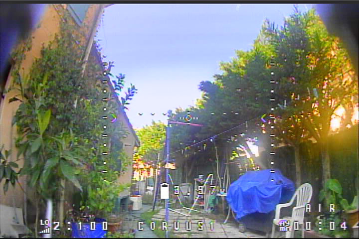
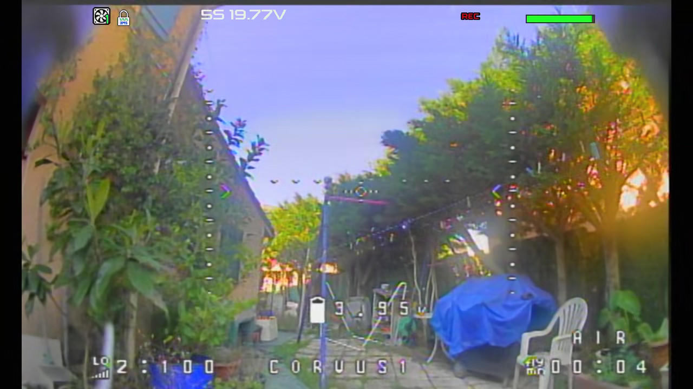
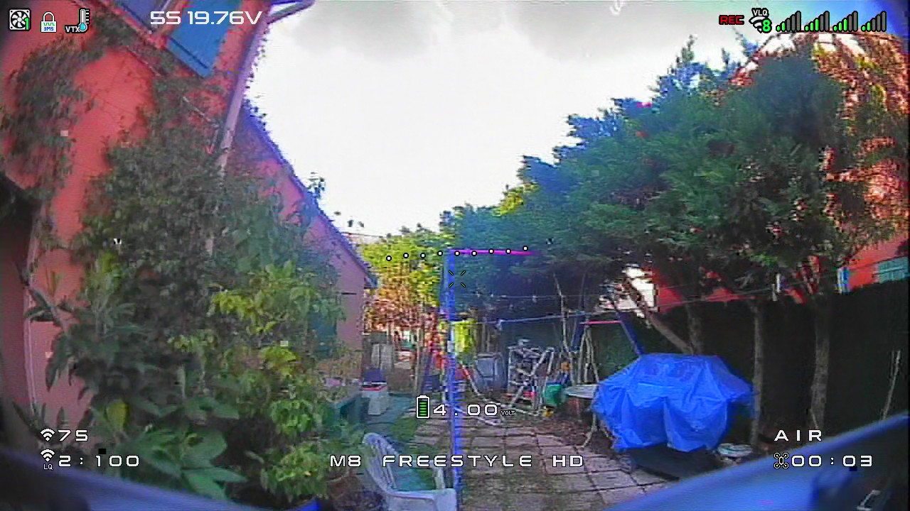

## Introduction

I've recently upgraded from the [Eachine EV800D](https://www.eachine.com/Eachine-EV800D-5_8G-40CH-Diversity-FPV-Goggles-5-Inch-800-480-Video-Headset-HD-DVR-Build-in-Battery-p-859.html?bid=29) to the [HDZero BoxPro](https://www.hd-zero.com/product-page/hdzero-boxpro-boxpro), which can do analog and HDZero at the same time. Both are box goggles, which makes them worth comparing as they are considered budget-friendly for their category.

I've also bought a [Mobula 8 Freestyle HD](https://www.happymodel.cn/index.php/2025/06/20/m8-freestyle-hdzero-80mm-digital-hd-micro-fpv-whoop/) to compare the best camera for freestyle micro-drones.

## Comparison between HDZero BoxPro and Eachine EV800D goggles for Analog

### Digital Video Recorder (DVR)

First, we need to talk about the DVR as it is your main recording option when using a micro-drone. You could technically mount a [RunCam Thumb Pro](https://shop.runcam.com/runcam-thumb-pro-w/) (don't use the version 2, it's too heavy) and have a high quality recording, but this heavily hinders the freestyle capabilities of the drone.

Camera is configured NTSC and 16:9.

The DVR has a worse quality in the Eachine EV800D (Camera is [Caddx FPV Baby Ratel 2](https://caddxfpv.com/products/caddxfpv-baby-ratel2-analog-camera), which is considered the best analog camera for micro-drone):



Here's the report from FFprobe:

```shell
Input #0, avi, from 'PICT0006.AVI':
  Duration: 00:03:55.37, start: 0.000000, bitrate: 14113 kb/s
  Stream #0:0: Video: mjpeg (Baseline) (MJPG / 0x47504A4D), yuvj422p(pc, bt470bg/unknown/unknown), 720x480, 14046 kb/s, 30 fps, 30 tbr, 30 tbn
  Stream #0:1: Audio: adpcm_ima_wav ([17][0][0][0] / 0x0011), 16160 Hz, 1 channels, s16p, 64 kb/s
```

Do note that, **it doesn't look like this at all in the Eachine EV800D**. In the goggles, it actually looks way better.

Here's compared to HDZero BoxPro DVR:



This is the same drone.

```shell
Input #0, mpegts, from 'hdz_0025.ts':
  Duration: 00:05:22.04, start: 0.000000, bitrate: 23051 kb/s
  Program 1
    Metadata:
      service_name    : hdz_0025.ts
      service_provider: FFmpeg
  Stream #0:0[0x100]: Video: hevc (Main) (HEVC / 0x43564548), yuvj420p(pc, bt470bg/bt470bg/smpte170m), 1280x720, 28315 kb/s, 60 fps, 60 tbr, 90k tbn
  Stream #0:1[0x101]: Audio: aac (LC) ([15][0][0][0] / 0x000F), 48000 Hz, stereo, fltp, 125 kb/s
```

By comparing the format, we can tell that:

- The **HDZero BoxPro uses a better and modern compression algorithm** (HEVC vs MJPG, AAC vs ADPCM IMA WAV), which make the recording lighter.
- The **HDZero BoxPro has higher FPS** (60fps vs 30fps).
- The **HDZero BoxPro can record an MPEG stream** (MPEGTS) make corruption unlikely.

Visually speaking, the HDZero BoxPro looks a little blurry, but this can be customized.

The audio in the Eachine EV800D is too loud and can easily peak. It's basically unusable. The HDZero BoxPro uses its internal microphone, which is obviously much better.

### Video/Screen Quality

Now, that you know the DVR in the Eachine EV800D is pretty bad, this is why almost no user of the goggles will judge it based on the DVR recording. I'll say again: **it doesn't look like this at all in the Eachine EV800D**. So, for this section, I'll focus based on my senses.

About the comparison when using analog:

- The **screen is bigger and closer in the Eachine EV800D** than the HDZero BoxPro. And this might be a big factor since you can see more easily for analog systems.
- **Because the screen is also closer in the Eachine EV800D, I don't need to wear glasses.**
- However, **in the HDZero BoxPro, you can put your glasses inside the goggles**. Do note that **not all glasses can fit inside the goggles**. Mine is 14cm wide, and I'd say it's the maximum size as it is a perfect fit.
- The **contrast is more pronounced in the Eachine EV800D**, though, the **contrast in the HDZero BoxPro can be configured**. However, it is still higher in the Eachine EV800D, which I prefer.

### Worth mentioning

Additional advantages of HDZero BoxPro:

- The battery is **drastically** worse in the Eachine EV800D. The HDZero BoxPro can only support externally battery, but, supports 2S-6S battery, making **it compatible with a power bank.**
  - I always walk around with a power bank in my bag, which makes it very convenient.
- There is **auto-recording** for the HDZero BoxPro, which I consider a big plus.
- The weight is **heavier** in the Eachine EV800D.
- (Many stuff linked to the OS, unrelated to FPV.)

Additional advantages of Eachine EV800D:

- Can be **used as monitor** to share with friends !
- It can be tinkered pretty easily.

And some differences:

- The Eachine EV800D **has antenna diversity** while the **HDZero BoxPro** doesn't and only use one antenna for analog. However, I do want to note that the antenna of the HDZero is still incredible, and I wasn't able to find differences in term of noises.

## Comparison between HDZero and Analog video systems

I'll be using the HDZero BoxPro for recording as the video literally reflect what I see.

### Compared hardware

The compared cameras are:

- [HDZero Lux Camera](https://www.hd-zero.com/product-page/hdzero-lux-camera):

  - ```
    DVR Resolution: 1280x720@60fps
    FOV: D:170°  H:145°  V:82°(16:9)
    Weight: 2.3 g
    ```

- [Caddx Ratel Baby 2](https://caddxfpv.com/products/caddxfpv-baby-ratel2-analog-camera) (This time it is configured for 16:9, 60FPS):

  - ```
    DVR Resolution: 720x480@60fps (NTSC)
    FOV: D:165° (16:9)
    Weight: 3g
    ```

The compared drones are:

|             | DIY APEX 2in Drone                                    | Mobula 8 Freestyle HD                  |
| ----------- | ----------------------------------------------------- | -------------------------------------- |
| FC+ESC      | AIO GEP-TAKER F411 12 E1 - GERPC<br />1S-2S<br />4.2g | HDZero AIO15<br />2S-3S<br />7.2g      |
| Motors      | T-Motor M1104 7500KV                                  | Happymodel RS1102-13500KV              |
| Props       | HQProp TR2X2.2X4 (4 blades)                           | HQProp 18X10X3 45MMX3 (3 blades)       |
| VTX         | Zeus Nano VTX                                         | HDZero AIO15                           |
| VTX Antenna | Omnidirectional RUSH Cherry RHCP                      | Omnidirectional FlyFish RC Osprey RHCP |

The antenna of the Mobula 8 Freestyle HD has been customized. It's normally a RHCP Monopole antenna.
Betteries are the same: GNB 2S 550mAh 100C/200C LIVH

In my experience, both drones can be used for freestyle.

Battery-life wise, they both last **around 4 minutes doing tricks**. Probably **8 minutes when cruising**, with newer batteries (in my experience).

### Comparing the Video Quality

DIY APEX 2in Drone:


Mobula 8 Freestyle HD:



By comparing both video by feeling:

- **HDZero has better contrast/vibrance**. The HDZero Lux Camera is really great for automatically adapt to the environment. Colors are more flushed with analog. It gives a better "Awe" experience with HDZero.
- Resolution-wise, HDZero technically wins, however, the **differences aren't easily notable on the small HDZero BoxPro screen.** Though, based on the images above, we can clearly see horizontal wires that can't be seen with analog. (Yes, my garden is pretty difficult to fly in...)
- Latency-wise, **there is no difference.**
- Penetration-wise, due to the god-like RUSH Cherry RHCP antenna, **analog wins by far**, and makes flying a lot of fun and less stress-inducing. However, **after adding the FlyFish RC Osprey RHCP antenna to the HDZero drone, the penetration improves drastically,** and I was able to go behind walls.

## Conclusion

Here's how I would choose based on use-cases:

- Racing: HDZero by far. The contrast and resolution will give advantages.
- Freestyle in open area: HDZero. The contrast will give a better experience and more fun. The HDZero BoxPro DVR is also better than the EV800D, making reviewing easier.
- Freestyle in close area with obstables: Analog with HDZero BoxPro. The penetration of analog and the cost of analog will make you a lot less stress-induced. Combined with the HDZero BoxPro DVR, it will give you a very good experience.
- Cinematic: Analog/HDZero + Runcam Thumb, or probably DJI. Both DVR of the analog and HDZero systems are unusable for cinematic.
- Long range: Not tested, but I'm sure HDZero and analog would work great for long range.

Basically, the HDZero BoxPro is worth buying for freestyle and future investment. The EV800D is only worth buying if you are getting started. The fact that the EV800D can be used as a monitor for friends also make it a great investment for beginners. So, in general, getting both wouldn't be a bad idea.

## Bonus Part: A review on the Mobula 8 Freestyle HD

There are **many videos** on Youtube reviewing this drone, but since I bought it, better reviewing it myself.

I'm going to be quick:

- It's **light, meaning a small throttle can make it jump super high**. It's unsuitable for indoor use unless your put a lot of throttle limit.
- Because it's light, **the battery life is around 4 minutes MINIMUM when used for freestyle, around 8 minutes when used for cruising.**
- **Not all battery fit on the drone**. For example, Tattu 2S 550mAh does NOT fit. GNB 2S 550mAh does fit.
- It's a **lot more fun for freestyle and is comparable to the Liftoff micro-drones simulator**. It moves also a lot better than my DIY 2in or my BetaFPV Air65, when used outdoors. I'd recommend it for training.
- The **camera is kind of bad**, making it comparable to analog systems, so if you want to truly test HDZero, I'd recommend a 3.5in drone. It is still slightly better than analog.
- The **canopy doesn't allow for antenna customization**, so you will need to use zip ties or a 3D printer.
- The **linear antenna** is bad, and I'd recommend an omni antenna.
- The frame is **durable**. At least more durable than the Air65.
- **The motor (13500KV) has pretty good quality**.
- **The cost (208.63€ on Banggood) might not be worth it**, and you'd consider having a 3.5in drone, instead.

In one sentence, I'd say it's a pretty fun drone for training and freestyle.
