## Introduction

It's now months since my last article, as I've been soldering a lot of stuff,
especially drones and other electronics. I've started with a pretty bad
soldering kit, and now, I've found not only the cheapest, but the best soldering
tools required for proper soldering and desoldering.

N.B.: This article is for people in Europe.

Also, this article is not sponsored by any company. If one of the tools I
recommend sucks at the end, I'll edit this article and trash talk about it.
Sorry for any inconvenience.

## Soldering 101

### Heat the pad, not the solder

Before recommending anything, it's a good idea to start with how to solder.
Technique is important as it avoids breaking stuff. Here's a pretty standard
procedure on how to solder. This image is shared across the whole soldering
subreddit:

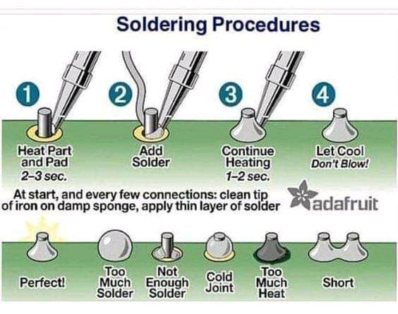

It's important to **heat the pad** (and the part if through-hole), and not
heating the solder. **You do not deposit solder on the iron, but on the pad!**

The heat will make the solder flow through the pad to the hottest part: the
soldering iron. Otherwise, you'll get a solder blob on the iron before the pad
is hot enough to catch the solder.

### Tinning the tip, tinning the pads

"Tinning" is the process of applying a small amount of solder to the tip of the
soldering iron, or to the pads.

There are multiples reason on why you want to tin the tip and the pads:

- A contact metal to metal is not conductive enough due to micro air gaps
  between the iron and the pads. This is due to small imperfections on the metal
  surfaces:

  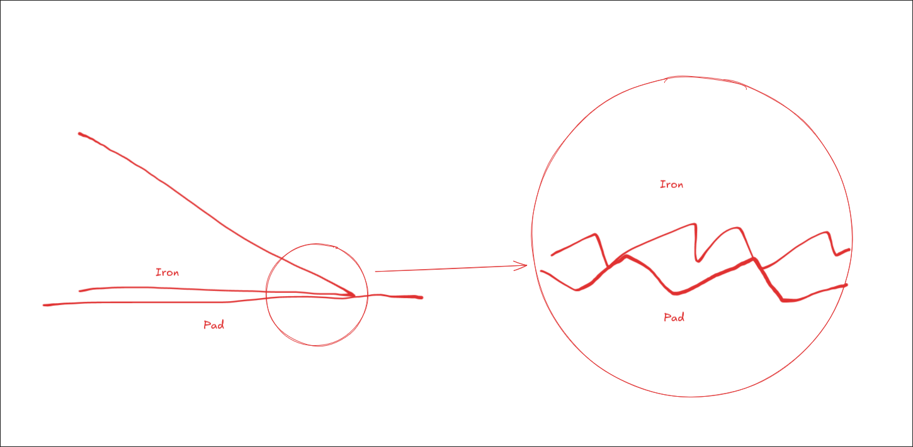

  The same reason we apply thermal paste to a CPU, we apply use the liquid
  solder to improve the contact between the soldering iron and the pads.

- Tinning the iron avoids the soldering iron to get oxidized:

  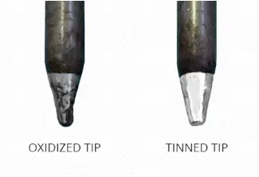

  On a clean tip, the more heat, the more oxidation. To avoid this "corrosion",
  we can simply use a passive corrosion protection, i.e., coat the sensitive
  part with a protection layer by adding a small amount of solder to the tip.

  

- Tinning the pads help even more the contact between the pads and the
  soldering iron. This is because when trying to solder the pad to the part, it's
  very possible that the thermal mass of the pad is too big for the soldering iron to heat
  up. By tinning the pad, it's like preparing the pad to flow against the part.

  

### Use flux to decontaminate and make life easier

Among every stuff you need to buy in order to solder, flux is something you
might forget as a beginner.

In electronics soldering, flux is a liquid that removes the oxidized layer on
the metal surface by heating it up. Upon evaporation, the dust and debris are removed.

However, flux is also used to reduce the surface tension of the solder since the
molten solder often wants to "bead up" into balls. In other, it makes the solder
"flows" more easily.

Also, for the same reason we tin the pad, the liquid aspect of the flux helps
the contact between the pads and the soldering iron by creating a thermal
bridge.

**The more sticky and persistent is the flux, the more time you have to
efficiently solder.**

  <video autoplay loop muted playsinline>
    <source src="/blog/2026-06-17-beginner-soldering-kit/page.assets/flux.mp4" type="video/mp4">
    Your browser does not support the video tag.
  </video>

The smoke coming out of the flux is slightly toxic, so ventilating the room or
having a fume extractor is recommended.

Soldering flux being generally rosin, it can be conductive. It's important to
clean up the flux with isopropyl alcohol.

## Soldering tools

At this point, I won't talk about desoldering, but I'll still recommend some
tools.

### Soldering iron

You're looking for a **temperature controlled soldering iron compatible with
C245 tips**. You should buy it on AliExpress.

#### USB-C Soldering iron

If you have a charger that can deliver 100W with a proper USB-C cable (not all
cable are rated the same), you can use a USB-C soldering iron.

In 2026, you're looking for cheap, calibrated soldering irons compatible with
C245 soldering tips.

The **Alientek T90B** is a good choice. The cost is around 45€.
While there are cheaper ones, **you need a cheap AND good quality soldering
iron**. Otherwise, what you are trying to repair will cost more than the iron.

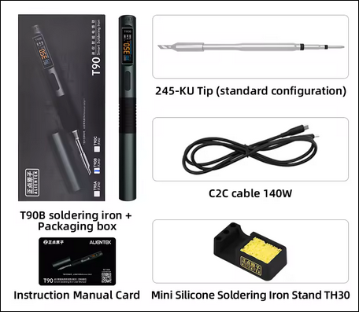

#### Soldering iron station

Not my speciality since I use the USB-C soldering iron. However, Reddit's
recommendation is often the **Geeboon TC22** with C245 handle and tips. The cost
is around 65€.

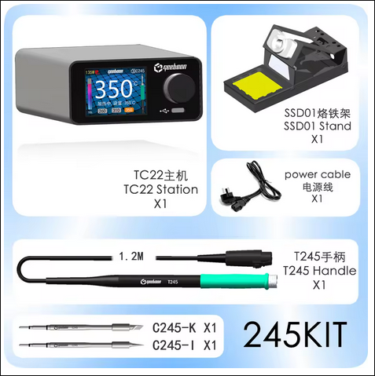

You should avoid the Pinecil and any non-C245 soldering iron.

### Solder

**DO NOT BUY NO NAME SOLDER!**

There is only ONE brand in China that sells good quality solder. It's called
**Mechanic**.

As a beginner, you're looking for a **37% leaded solder**. While lead is toxic,
you're very unlikely to ingest it.

Leaded solder is a mixture of tin and lead. The lead is used to decrease the
melting point of the tin, reducing the difficulty of soldering. It's also used
**everytime** to desolder. For any hobbyist, leaded solder is a must-have.

As for the ratio, 37% leaded solder is eutectic, which means that the solder
melt and solidify at the same temperature, causing the solder to have a very
short plastic phase.

You'd prefer to 40% leaded for desoldering though as it stays in liquid form a
little longer.

As for the diameter of the wire, I'd recommend between 0.5 and 1 mm.

#### Leaded

In europe, if possible, buy the **Mechanic HX-T100** which is a proper 37%
leaded solder.

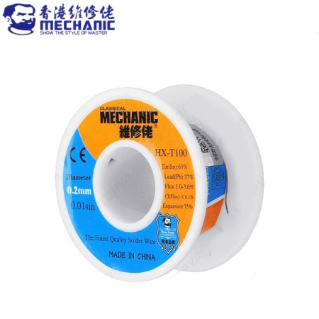

The 100g 0.5 mm costs around 8€.

If not found, you can check out [Eleshop](https://eleshop.eu/) (not sponsored
and maybe not your best choice), and buy a Broquetas solder 60/40 or 63/37 (100g, 0.7
mm) for around 11€.

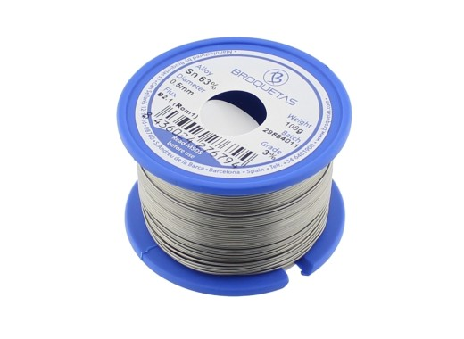

Kester is also a good choice, but it is known to be pricey.

#### Non-leaded

Easy to find. Look for the cheapest and be disappointed.

### Flux

#### Sticky/tacky flux

I'm not an expert in flux, but based on
[nanofix](https://www.youtube.com/@nanofixca), I believe the Amaoe M53 10cc flux
is a good choice. It costs around 2,70€.

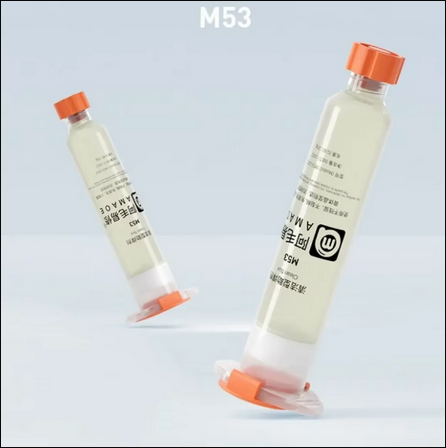

You'll need to buy a RELIFE RL-062D "gun syringe" to dispense the flux. It costs
around 3€.

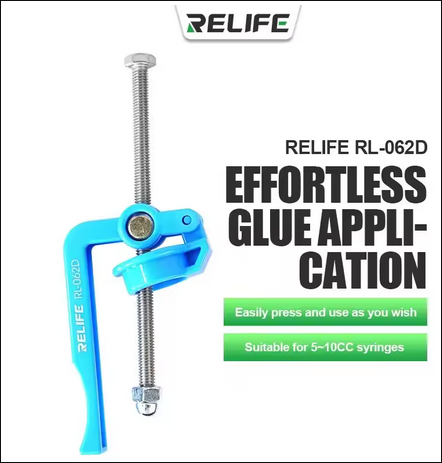

#### Liquid flux, no clean

Not an expert in flux again, but I've used the Termopasty NoClean RF8000. It
costs around 6€.

It's good enough for small pads when working on drones. Otherwise, I would
always recommend the sticky flux.

### Fume extractor (optional)

As a beginner, most people would recommend to use the window. However, if you
need a portable one, you can buy the 2UUL Aiolos fume extractor.

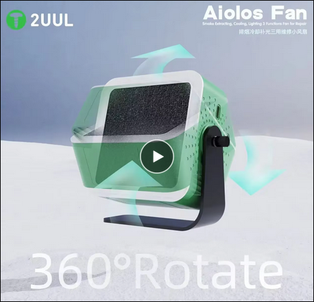

Thanks to being powered by battery, the fume extractor is very powerful. You'll
need a powerful one to have a big working area.

I recommend a battery-powered one, because most of the time, USB powered fume
extractor tends to run at 12V with 5V in input. Meaning, the current is greatly
reduced to increase the voltage for the fans. With a weak current, the fans
won't be powerful enough to have a correct working area.

If you don't care about the light and the filter, portable fans should be pretty
good (and you'll be able to use them in the summer).

### Cleaning tools

You'll need to buy:

- Isopropyl alcohol
- Brass wool to clean the soldering iron (BUY ON AMAZON, DO NOT BUY ON
  ALIEXPRESS, YOU WILL GET SCAMMED WITH AN IRON WOOL).
- Cotton buds

None of the above are optional. You HAVE to buy them.

### Desoldering braid/wick

You need to buy braid with flux inside. My recommendation is the SUPERWICK fine
braid, which costs around 32€.

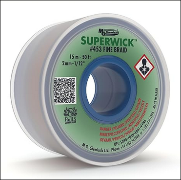

### Desoldering pump

Normally, I would recommend an ENGINEER SS-03 desoldering pump. But, there are
now Chinese alternatives.

You're looking for a desoldering pump with a replaceable silicon tip. It costs
around 6 euros, and I'll probably recommend the one from RELIFE:

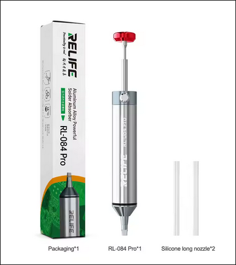

### Additional tools

Here's a list of tools you might need to buy based on your needs:

- Tweezers
- Screwdrivers
- Multimeter
- Low Melt solder alloy (for desoldering ONLY)
- Third hand (the one from toolour might be good). This is heavily recommended
  when soldering wires.

## Conclusion

Here's the cost of the soldering kit (excluding optional and additional tools):

| Item                        | Cost                   |
| --------------------------- | ---------------------- |
| **Alientek T90B**           | 45.00€                 |
| **Mechanic HX-T100 Solder** | 8.00€                  |
| **Amaoe M53 Flux**          | 2.70€                  |
| **RELIFE RL-062D Gun**      | 3.00€                  |
| **Termopasty RF8000**       | 6.00€                  |
| **Isopropyl Alcohol (IPA)** | 7.00€                  |
| **Brass Wool**              | 6.00€                  |
| **Cotton Buds**             | 2.00€                  |
| **SUPERWICK Fine Braid**    | 13.00€ (the small one) |
| **RELIFE RL084 Pump**       | 6.00€                  |

**Total: 98.7€**

I've included the desoldering tools anyway since it's a good idea to have them
in case of "bad" soldering.

I'd say this is the **minimum required** to start soldering and make your life
easy. You **SHOULD NOT** buy any cheap soldering kit, or you'll be very sorry.

Among every thing I've included, only the **soldering iron** and the **solder**
shouldn't be cheap out.
