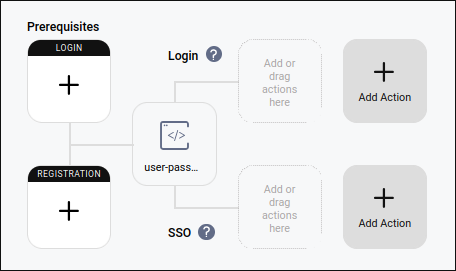
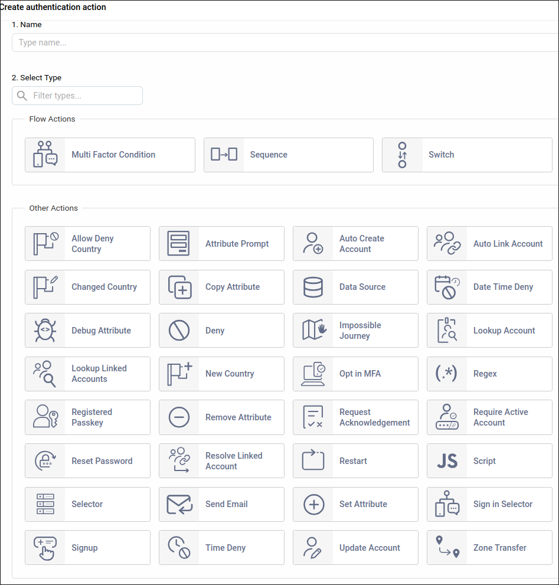
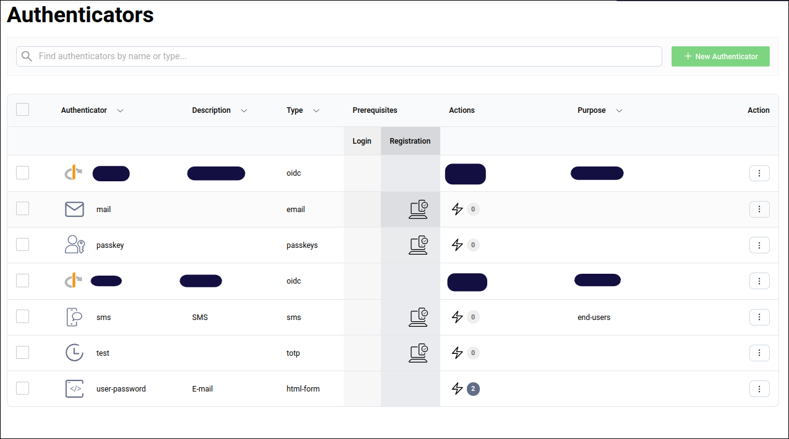
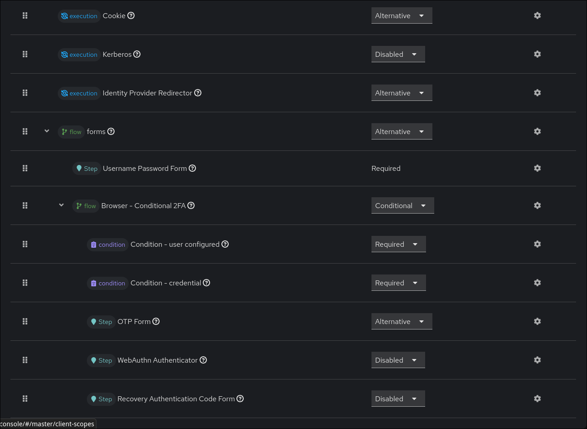

## Table of contents

<div class="toc">

{}

</div>

## Introduction

Over the past few years I've worked with many identity providers. I thought
it would be useful to provide an in-depth comparison, since they differ
significantly yet aim to achieve the same goal: identity and
authentication.

These providers differ primarily in their OAuth2 capabilities and
extensibility. Some offer multi-tenancy/profile/realm capabilities, while
others rely solely on LDAP.

## Criteria of comparison

Based on my R&D at work and at home, here are the criteria I used:

- **Deployment**
  - Architecture (standalone, distributed, controller-workers, etc.)
  - High availability
  - Load balancing
- **Configuration**
  - Configuration management (declarative, GitOps, etc.)
  - **OAuth2 clients**
    - Capabilities (client credentials, PKCE, etc.)
    - Logout (front-channel, back-channel, etc.)
    - Scopes
    - JWT, access tokens, refresh tokens
    - OIDC (ID token, userinfo, introspection, discovery document, revocation, etc.)
  - **User management**
    - Database and federation
    - Credentials storage (hash algorithms, etc.)
    - Admin UI
    - Admin API
  - **Authentication**
    - Flows
    - Actions/steps and MFA
    - Policies and defenses (brute-force, password policies, etc.)
    - Miscellaneous (email as username, forwarded authentication, etc.)
  - **Identity providers**
    - OIDC
    - SAML2
    - Others (GitHub, etc.)
- **Maintenance**
  - Audits & Events
  - Metrics & Logs
  - Backup & Restore
- **Documentation**
  - SDK Availability, Open source & licensing
  - Vulnerability disclosure
  - User guide
  - API reference
- **Extensibility**
  - Theming & Customization
  - Custom flows
  - Custom steps (scripts)
  - Custom mappers/scopes
  - APIs

There are, of course, additional criteria depending on your use case, but for
my needs I chose an identity provider based on the criteria above.

## A quick comparison

Before we start the in-depth comparison, here's a quick look at the identity
providers I plan to compare.

| Name     | Age as of 2026 | Complexity | License     |
| -------- | -------------- | ---------- | ----------- |
| Dex      | 10y            | Low        | Apache-2.0  |
| Authelia | 10y            | Medium     | Apache-2.0  |
| Curity   | ~11y           | High       | Proprietary |
| Keycloak | 13y            | High       | Apache-2.0  |

It's worth noting that the OAuth2 standard is 14 years old and OIDC is 12
years old. Keycloak adapted to the OIDC standard during its development.

## In-depth comparison

### Deployment

#### Dex & Authelia

Dex and Authelia share a similar deployment architecture. They both focus on
stateless deployments, delegating persistence to an external database. They can:

- Use a static user-password database stored in a file.
- Delegate session/cache storage to a key-value database (Redis for Authelia,
  etcd/Kubernetes/SQL for Dex).
- Use LDAP as a user-password database.

```d2
auth: Dex & Authelia
auth.style.multiple: true
cache: Cache
db: User-password DB
db.style.stroke: red
cache.style.multiple: true
auth -> cache
auth -> db
```

This deployment architecture is a common, sound approach and avoids many
weaknesses thanks to service replicability. One remaining weakness is the
user-password database itself. But, this is common to all identity providers.

One notable limitation of Authelia is that its configuration is static. For
example, it lacks dynamic client registration and APIs to manage
configuration.

Dex does not have this limitation and provides an API to manage
configuration, although it's largely limited to configuring OAuth2 clients.

In summary, **Dex and Authelia are naturally highly available thanks to their
stateless design.** You'd deploy them using a Kubernetes `Deployment`.

#### Curity

Curity uses a controller-worker architecture: the controller is the "admin"
node, and the workers are the "runtime" nodes.

Curity can use a local database, although a remote database is preferred. It
supports many databases via JDBC, and also supports LDAP, SCIM, DynamoDB, and
MongoDB.

The cache can be stored in the remote database (depending on its capabilities)
or distributed across the workers. In other words, Curity is **topology-aware**
and **stateful**.

Note that the **configuration database is stored locally** and uses
`com.tailf.cdb`.

```d2
admin: Curity Admin
admin.style.stroke: red
db: User-password DB
db.style.stroke: red
runtime: Curity Runtime
runtime.style.multiple: true
admin -> runtime
runtime -> db
```

Curity has a major weakness: **the configuration database is stored locally,
and the controller is a single node with no automatic failover or election.**
If the configuration database becomes corrupted, the entire cluster can go
down.

Curity offers a **GitOps-based** deployment mode that eliminates the need for
the local configuration database. However, if you use the Curity Admin API to
dynamically configure the cluster, the single controller remains a potential
single point of failure.

In summary, **Curity is not highly available, but does allow some load
balancing**. Its topology-awareness simplifies cache deployment. The overall
deployment is complex: you need the controller (typically a single-replica
Kubernetes `StatefulSet` with a `Recreate` update strategy, and a persistent
volume) and the workers (a Kubernetes `Deployment`) deployed separately.

#### Keycloak

Keycloak is as stateless as Dex and Authelia, but it is also **topology-aware**.
Specifically, it has multiple levels of caching:

- A distributed local cache (powered by Infinispan).
- An optional but recommended distributed remote cache (also Infinispan).
- The remote database (MySQL, Oracle, MSSQL, or Postgres).

```d2
auth: Keycloak
auth.style.multiple: true
db: User-password DB
db.style.stroke: red
cache: Cache
cache.style.multiple: true
auth -> cache
auth -> db
```

Infinispan is not just a simple cache. You can configure different caching
strategies:

- Distributed: Infinispan will distribute to X nodes.
- Replicated: Infinispan will distribute all nodes.
- Local: Infinispan will only a single node (which doesn't make any sense, so,
  no one will use it).
- And more... (see [the documentation](https://infinispan.org/docs/stable/titles/configuring/configuring.html#cache-mode-comparison_caches))

In summary, **Keycloak is highly available thanks to its stateless design**.
Compared to Dex and Authelia, Keycloak is slightly more complex to deploy due
to its topology-awareness; you'll typically need stable identities (for
example, a `StatefulSet` in Kubernetes).

### Configuration

#### Configuration management

Dex and Authelia are configured before the deployment, through a file.

Curity and Keycloak can also be configured before the deployment, also through a
file, using the import feature. But, only Curity supports a **merging**
strategy.

Curity and Keycloak offers **dynamic configuration** via the Admin API. Curity
uses a standard RESTCONF API, while Keycloak uses a REST API, documented through
OpenAPI.

However, thanks to the community, Keycloak can be configured with Terraform and
Ansible.

In conclusion, all four of them can be configured using GitOps:

- Dex, Authelia, and Curity through files.
- Keycloak through Terraform or Ansible.

#### OAuth2 clients

##### Grant types

| Grant type                                                                 | Dex    | Authelia | Curity | Keycloak |
| -------------------------------------------------------------------------- | ------ | -------- | ------ | -------- |
| **Authorization Code/Standard** _(RFC 6749 4.1)_ (+ **PKCE** _(RFC 7636)_) | Yes    | Yes      | Yes    | Yes      |
| **Implicit Code** (deprecated) _(RFC 6749 4.2)_                            | Yes    | Yes      | Yes    | Yes      |
| **Hybrid Flow** _(OIDC Core 1.0 3.3)_                                      | Yes    | Yes      | Yes    | Yes      |
| **Refresh Token** _(RFC 6749 1.5)_                                         | Yes    | Yes      | Yes    | Yes      |
| **Client Credentials/Service Accounts** _(RFC 6749 4.4)_                   | Yes    | Yes      | Yes    | Yes      |
| **Client Credentials with JWT Assertion** _(RFC 7523 2.2)_                 | **No** | **No**   | Yes    | Yes      |
| **Device Code** _(RFC 8628)_                                               | Yes    | Yes      | Yes    | Yes      |
| **Password/ROPC/Direct Access** (deprecated) _(RFC 6749 4.3)_              | Yes    | Yes      | Yes    | Yes      |
| **Token Exchange** _(RFC 8693)_                                            | Yes    | **No**   | Yes    | Yes      |
| **JWT Authorization Grant** _(RFC 7523 2.1)_                               | **No** | **No**   | Yes    | Yes      |

If you're not familiar with these grant types, here's a quick summary:

- Machine-to-human (requires human interaction such as 2FA and entering a password):
  - Authorization code flow: the standard flow used by end users with a
    login page. Implicit and Hybrid are variants of the authorization code flow.
  - Refresh token: used to refresh an access token via a refresh token; a way
    to manage end-user sessions.
  - Device code: used when an application lacks a proper login UI and
    delegates the code exchange to a browser.
- Machine-to-machine:
  - Client credentials (+ JWT assertion): user-password authentication between
    machines. A JWT assertion is a signed payload used in addition to client
    credentials.
  - Token exchange: exchanges a token for another (for example, to change
    scopes).
  - JWT Authorization Grant: a signed payload is sent and often mapped into
    the access token (for example, mapping the `sub` field for impersonation).

In summary, only Curity and Keycloak can handle signed payloads. (Keycloak
recently added support for the JWT Authorization Grant.)

##### Logout

| Capability                              | Dex    | Authelia | Curity | Keycloak |
| --------------------------------------- | ------ | -------- | ------ | -------- |
| **RP-initiated logout**                 | **No** | **No**   | Yes    | Yes      |
| **IdP-initiated logout (SAML2) as IdP** | **No** | **No**   | Yes    | Yes      |
| **IdP-initiated logout (SAML2) as SP**  | **No** | **No**   | **No** | Yes      |
| **Front-channel logout**                | **No** | **No**   | Yes    | Yes      |
| **Back-channel logout**                 | **No** | **No**   | Yes    | Yes      |

If you're not familiar with these logout types, here's a quick summary:

- RP-initiated logout: the standard way for a user to end an application's
  session (the logout button).
- IdP-initiated logout: the identity provider ends a session for an
  application (for example, a portal forcing the application to revoke the
  session).
- Front-channel logout: all applications where the user is logged in are
  logged out simultaneously using a browser mechanism such as an iframe.
- Back-channel logout: all applications where the user is logged in are
  logged out simultaneously using a server-side request.
  - As SP: the service provider receives a logout request from an upstream
    identity provider.
  - As IdP: the identity provider sends the logout request to a downstream
    service provider.

In summary, **Dex and Authelia lack a critical feature to end sessions:** there
is no `end_session_endpoint` in their OIDC configuration. Keycloak is the only
one that properly supports IdP-initiated logout (see the dedicated identity
provider chapter). This feature is not always critical, but it is useful.

##### JWT, Access Tokens and Refresh tokens

| Feature                                                       |  Dex   | Authelia | Curity | Keycloak |
| :------------------------------------------------------------ | :----: | :------: | :----: | :------: |
| **Configure token lifetime** _(access & refresh)_             |  Yes   |   Yes    |  Yes   |   Yes    |
| **Controlled rolling/rotation lifespan** _(absolute refresh)_ |  Yes   |  **No**  |  Yes   |   Yes    |
| **External JWKS handling allowed**                            | **No** |   Yes    |  Yes   |   Yes    |
| **Internal JWKS endpoint**                                    |  Yes   |   Yes    |  Yes   |   Yes    |
| **Automatic JWT signer generator** _(no admin interaction)_   |  Yes   |  **No**  | **No** |   Yes    |
| **Admin can configure JWT signer**                            | **No** |   Yes    |  Yes   |   Yes    |

In my experience, the missing features are not critical for standard usage.
However, Keycloak is the easiest to manage, concerning the JWT life-cycle.

##### OIDC additional capabilities

| Capability                                                        | Dex    | Authelia | Curity | Keycloak |
| :---------------------------------------------------------------- | :----- | :------- | :----- | :------- |
| **UserInfo Endpoint**                                             | Yes    | Yes      | Yes    | Yes      |
| **Discovery Document**                                            | Yes    | Yes      | Yes    | Yes      |
| **Token Introspection** _(RFC 7662)_                              | **No** | Yes      | Yes    | Yes      |
| **Token Introspection with JWT output (deopaque)** (non-standard) | **No** | **No**   | Yes    | Yes      |
| **Token Revocation** _(RFC 7009)_                                 | **No** | Yes      | Yes    | Yes      |

In summary, **Dex is unsuitable if you plan to use it with a token manager.**

I've used Curity and Keycloak with opaque tokens and used introspection to
de-opaque them. Because this is non-standard, I wouldn't recommend introspection
for opaque tokens. Keycloak recommends using the Token Exchange grant to
upgrade an opaque token.

#### User management

| Feature                                      |        Dex         |                   Authelia                    |                          Curity                          |                     Keycloak                      |
| :------------------------------------------- | :----------------: | :-------------------------------------------: | :------------------------------------------------------: | :-----------------------------------------------: |
| **Can create user**                          |       **No**       |                    **No**                     |                           Yes                            |                        Yes                        |
| **Manage user over API**                     |       **No**       |                    **No**                     | **GraphQL API behind paywall**. <br /> Only via SCIM API | Yes via REST API <br /> also via SCIM (extension) |
| **Manage user over UI**                      |       **No**       |                    **No**                     |                          **No**                          |                        Yes                        |
| **LDAP sync/Federation**                     | **LDAP Read only** |                    **No**                     |                      As primary DB                       |                        Yes                        |
| **Supported credentials hashing algorithms** |       Bcrypt       | Argon2, Scrypt/Yescrypt, PBKDF2, SAH2, Bcrypt |        Argon2, Bcrypt, PBKDF2, Scrypt, SSHA, MD5         |                  Argon2, PBKDF2                   |

As you can see, Dex and Authelia are limited. The recommendation is to use
LDAP for user management. That approach is not ideal for self-registration but
works for internal identity providers.

Keycloak is the most convenient for user management. It supports fewer
credential hashing algorithms out of the box, which can complicate migrations.
However, Keycloak supports extensions (including credential providers) to add
support for more hashing algorithms.

#### Authentication flows

##### Dex & Authelia

Their flows are not customizable.

##### Curity

Curity provides multiple authenticators, but many are behind a paywall. In
the free offering you may only have Google (OIDC) and username-password
authenticators.

**Curity does not provide SAML2 and full OIDC support in the community edition.**

Curity supports:

- Pre-login steps
- Pre-registration steps
- Post-login steps
- SSO (user already connected) steps



Curity offers quite a lot of type of steps, including custom scripts:



However, Curity lacks a comprehensive user profile UI, which makes managing
features like 2FA more awkward.

As a result, much user-side management happens **during** the authentication
flow.

Second-factor methods such as SMS and TOTP are treated similarly to the
primary authenticator:



When you invoke the "user-password" authenticator, you must "jump" to the
second authenticator (for example via an "Opt-in MFA" step) to trigger a
second factor.

It makes sense conceptually: SMS, password, email, and TOTP are all "factors"
for authentication... but the lack of a user profile page complicates the
experience.

In summary, Curity flows are powerful and customizable, but the missing user
profile and the absence of many standard authenticators in the community
edition limit its suitability for self-hosted home use.

##### Keycloak

Oooh boy, it's time.

Let's start first with this: Keycloak has **multiple roles** that can be
assigned to an authentication flow:

- Browser flow
  - The typical flow with a login form. We'll see more details below.
- Registration flow
  - The self-registration form used to register a new user.
- Direct grant flow
  - Used by OAuth2 clients with the direct grant type. Username-password
    validation with optional 2FA.
- Reset credentials flow
  - The password reset form.
- Client authentication flow
  - Client credentials/service accounts flow: client ID and secret, signed
    JWTs, etc.
- First broker login flow
  - After the first login on an identity provider (a broker), this flow is
    executed to link the internal Keycloak user to the external identity
    provider user.
- Post-login flow (assignable in the identity provider panel settings)

In a flow, there are:

- Executions: scripts that are executed during the flow. Executions can have two types:
  - Step: A script that is executed.
  - Condition: A logical condition that is evaluated for "Conditional" sub-flows.
- Sub-flows: A list of sub-flows or executions.
- Requirement states of the executions or sub-flows.
  - **Required**: All executions and sub-flows marked as "Required" within the sub-flow must succeed.
  - **Alternative**: At least one of the executions or sub-flows marked as "Alternative"
    within that flow must succeed. If one succeeds, the rest are skipped.
    - Setting "Required" in an "Alternative" sub-flow will cause the
      "Alternative" elements to be ignored. You shouldn't use any "Required"
      elements in an "Alternative" sub-flow.
  - **Disabled**: The execution or sub-flow is skipped.
  - **Conditional (only for sub-flows)**: If all "condition" executions within
    the flow evaluate to "true", the sub-flow is executed as _Required_.
    Otherwise, the sub-flow is _Disabled_.

These rules can be quite confusing, so here's a simplified explanation:

- **Alternative** executions and sub-flows:
  - At the same level they can only be used with other **Alternative** (and
    **Disabled**) executions or sub-flows. (**Required** "condition"
    executions can be used if the whole flow is **Conditional**.)
  - At the same level, **only one Alternative execution or sub-flow must
    succeed for the whole flow to succeed**.
- **Required** and **Disabled** executions and sub-flows:
  - At the same level, **all Required executions and sub-flows must succeed
    for the flow to succeed.**
- **Conditional sub-flows**:
  - Act as **Required** (i.e., the flow is enabled) **only if all "condition"
    executions within the sub-flow evaluate to "true"**. Otherwise, the
    sub-flow is _Disabled_.

Here's an example: the classic "browser" flow used to log in as an end user:



- The first level is the flow itself. There are only "Alternative"
  executions or sub-flows.
  - **Cookie**:
    - _Execution_: If there is a valid SSO cookie, the execution succeeds.
    - _Alternative_: On success the whole flow succeeds, and the user is
      redirected to the callback URI.
  - **Kerberos**:
    - _Execution_: Initiates SPNEGO authentication.
    - _Disabled_: Kerberos is disabled.
  - **Identity Provider Redirector**:
    - _Execution_: If `kc_idp_hint=<idp alias>` is set as a query parameter
      during the login flow, the user is redirected to the specified
      identity provider and the execution succeeds.
    - _Alternative_: On success the whole flow succeeds, and the user is
      redirected to the callback URI.
  - **Forms** sub-flow:
    - _Alternative_: On success, the whole flow succeeds, and the
      user is redirected to the callback URI.
    - **Username Password Form**:
      - _Execution_: The user is presented with a username-password form. The
        execution succeeds when the user successfully authenticates.
      - _Required_: On success the next execution is checked.
    - **Browser - Conditional 2FA** sub-flow:
      - _Conditional_: The sub-flow becomes **Required** if the condition
        executions evaluate to "true".
      - **Condition - user configured**:
        - _Execution_: Returns "true" if the user is properly configured
          (valid email, valid first name, etc.).
      - **Condition - credential**:
        - _Execution_: Returns "true" if the user has a valid credential in
          the authentication flow.
      - **OTP Form**:
        - _Execution_: The user is presented with an OTP form. The execution
          succeeds when the user successfully authenticates.
        - _Alternative_: On success the whole flow succeeds.
      - **WebAuthn Authenticator**:
        - _Execution_: The user is presented with a WebAuthn form and the
          execution succeeds on successful authentication.
        - _Disabled_: WebAuthn is disabled. To enable it, mark it as
          **Alternative**.
      - **Recovery Codes Form**:
        - _Execution_: The user is presented with a recovery codes form. The
          execution succeeds on successful authentication.
        - _Disabled_: Recovery codes are disabled. To enable them, mark the
          execution as **Alternative**.

The Keycloak flow system is mature, but the usage of requirement states can
be ambiguous.

##### Summary

- Dex & Authelia: No customization.
- Curity: Has only one customizable flow and shows limitations due to the
  software's restrictions.
- Keycloak: Has multiple customizable flows per use case. It's complex, but
  offers significant advantages once mastered.

#### Miscellaneous authentication settings

| Feature                                           | Dex                | Authelia                                      | Curity Identity Server | Keycloak |
| :------------------------------------------------ | :----------------- | :-------------------------------------------- | :--------------------- | :------- |
| **Brute force protection**                        | **No**             | Yes                                           | Yes                    | Yes      |
| **Password policies**                             | **Not applicable** | **Not applicable**                            | Yes                    | Yes      |
| **Password blacklist**                            | **Not applicable** | **Not applicable**                            | Yes                    | Yes      |
| **Email as username**                             | **Not applicable** | **Not applicable**                            | Yes                    | Yes      |
| **Self registration**                             | **Not applicable** | **Not applicable**                            | Yes                    | Yes      |
| **Email verification**                            | **Not applicable** | **Not applicable**                            | Yes                    | Yes      |
| **Multi-tenancy/profile**                         | **No**             | **No**                                        | Yes                    | Yes      |
| **User profile management**                       | **Not applicable** | Yes (for 2FA)                                 | **No**                 | Yes      |
| **ForwardAuth support** (No = needs oauth2-proxy) | **No**             | **Yes but non-configurable response headers** | **No**                 | **No**   |
| **Session management**                            | **No**             | **No**                                        | **No**                 | Yes      |

#### Identity providers support and settings

**Identity providers support**

| Identity Provider / Connection | Dex    | Authelia | Curity         | Keycloak |
| :----------------------------- | :----- | :------- | :------------- | :------- |
| **Generic OIDC**               | Yes    | Yes      | **Commercial** | Yes      |
| **Generic SAML 2.0**           | Yes    | **No**   | **Commercial** | Yes      |
| **LinkedIn**                   | Yes    | Yes      | **Commercial** | Yes      |
| **Google**                     | Yes    | Yes      | Yes            | Yes      |
| **Microsoft / Entra ID**       | Yes    | Yes      | **Commercial** | Yes      |
| **LDAP / Active Directory**    | Yes    | Yes      | **Commercial** | Yes      |
| **GitHub**                     | Yes    | **No**   | **Commercial** | Yes      |
| **Facebook**                   | **No** | **No**   | **Commercial** | Yes      |
| **Twitter**                    | **No** | **No**   | **Commercial** | Yes      |

Keycloak is the only one that supports everything. Dex supports many
providers but lacks some social identity providers. Authelia supports only
standard OIDC identity providers.

Curity is the worst in this regard, with many features behind a paywall.

**Identity providers settings**

Only Curity and Keycloak can map inbound attributes to other attributes.

### Maintenance

| Feature / Operation      | Dex                | Authelia            | Curity              | Keycloak            |
| :----------------------- | :----------------- | :------------------ | :------------------ | :------------------ |
| **Audit logs**           | **No**             | **No**              | Yes                 | Yes                 |
| **Structured logging**   | Yes                | Yes                 | Yes                 | Yes                 |
| **Events system**        | **No**             | **No**              | Yes                 | Yes                 |
| **Metrics**              | Yes                | Yes                 | Yes                 | Yes                 |
| **Configuration backup** | **Not applicable** | **Not applicable**  | Yes                 | Yes                 |
| **User data backup**     | **Not applicable** | **Upstream backup** | **Upstream backup** | **Upstream backup** |

As expected, heavy software has proper maintenance tooling for long-term
operations.

### Documentation

| Documentation / Legal Category     | Dex         | Authelia           | Curity                                                       | Keycloak                                  |
| :--------------------------------- | :---------- | :----------------- | :----------------------------------------------------------- | :---------------------------------------- |
| **Open Source**                    | Yes         | Yes                | No                                                           | Yes                                       |
| **Vulnerability Disclosure (CVD)** | Yes         | Yes                | **No**                                                       | Yes                                       |
| **User Guide Quality**             | **Minimal** | **Comprehensive**  | **Comprehensive**                                            | **Use-case driven**                       |
| **API Reference (for API users)**  | **No**      | **Not applicable** | **GraphQL schema**, **SCIM standard**, **RESTCONF standard** | **Ambiguous OpenAPI spec**                |
| **API Reference (for developers)** | **No**      | **No**             | **Partial**                                                  | **No, but open source and Java standard** |

Because Curity is closed source, its documentation is exceptional and detailed.
Its use of standards for APIs helps API users interact with and configure the
system.

However, Curity does not sufficiently document the APIs used for scripting.
Keycloak's API documentation is lacking in places, but its open source nature
allows you to inspect the source code to find the interfaces.

Dex and Authelia focus their documentation on administration and
configuration rather than extensibility.

### Extensibility

Regarding extensibility, Keycloak and Curity are the only ones that support:

- Custom flows
- Custom steps
- Theming and customization (including localizations and emails)
- A management API
- Custom mappers and scopes

Dex lacks these features, and Authelia only supports custom claims (with limitations).

## Conclusion

If you've read my in-depth comparison, you should be able to draw your own
conclusions. If you want a summary of this comparison, here it is:

- **Dex** shows its ability to connect to multiple upstream identity providers,
  while being lightweight and stateless. However, it lacks in everything else:
  security, extensibility, documentation, etc. It's a great choice for
  development or quick OIDC connectivity, but less suitable for production in
  many cases.
- **Authelia** shines by trying to strictly follow the OIDC and LDAP standards.
  The project still misses some OIDC features, and has no self-registration,
  which limits enterprise or customer- facing use. However, it is well suited to
  self-hosted home environments and can be a good long-term at-home solution.
- **Curity** is similar to Keycloak, but everything worse: it's not open source, it has
  availability issues, security issues, extensibility documentation issues, etc.
  It is also too expensive for a self-hosted environment.
- **Keycloak** is the most feature-complete option. If it lacks something, you
  can extend it. It's secure, extensible, open source, and battle-tested in
  multi-AZ, multi-tenant enterprise environments.

This comparison is based on my experience in production and home environments.

Considering the criteria above, I believe **Keycloak** is the best free,
open-source, self-hostable identity provider available today. If you have a
powerful server, choose Keycloak. Otherwise, consider **Authelia** (or
possibly **Kanidm**, although Kanidm's HA is challenging).

I would not recommend **Dex** for production, and I do not recommend **Curity**
for self-hosting. There is little reason to pay for Curity when Keycloak is free
and open source.

Even if you consider paying for Curity support and ease of use, I would still
recommend Keycloak.
