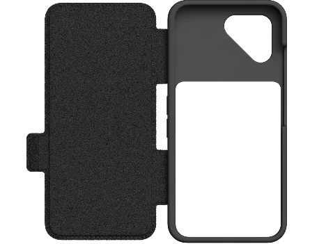
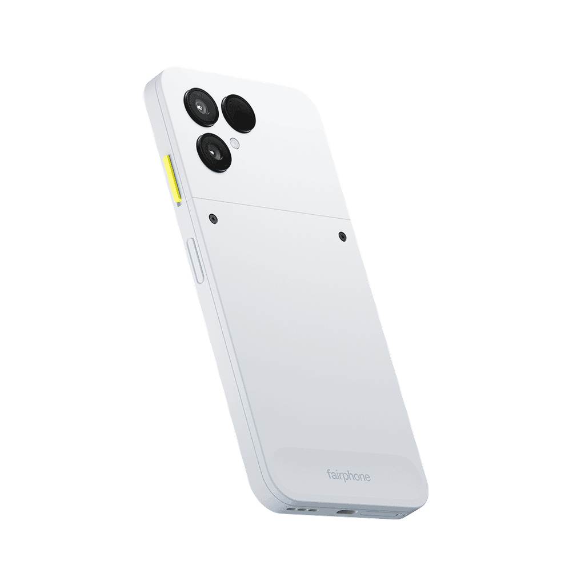

## Introduction

I thought it would be interesting about doing a review on the Fairphone 6, since it's
pretty difficult to judge it from the outside.

I'll talk about my experience as a tinkerer. However, I'll judge longevity and
freedom of use very seriously.

I'll start with the issues, before talking about the good things about the phone.

## The issues

### The cost

I'll start harsh: the cost is high. The phone costs 549,00€ (without shipping).

Its cost is even higher with Murena /e/OS: 599,00€ (without shipping).

At this price point, it is very much possible to not only get a **high-end**
phone, but also an "almost" **repair-friendly** phone.

The accessories are also very expensive:

- 24,95€ for the screen protector.
- 27,95€ for the case with the ring.

I didn't buy the case-wallet, because its price is absurdly high (44,95€) while having a
big hole in the middle.

Knowing that the phone is also non-upgradable like a framework laptop, **you are
not investing on the phone**. You're buying a phone like any other.

The parts are also super-expensive:

- 39,95€ for the battery.
- 89,95€ for the screen.
- 19,95€ for the USB-C port.
- 44,95€ for the front camera.
- ...

In comparison, you can buy the whole charging board, speakers (top and bottom),
volume buttons, SIM tray, for 20€ (for the Poco F3).

Basically, if you never break your phone, there is no reason to buy this phone.

### USB 2.0 on the USB-C port

Meaning, no desktop mode, slow transfers, no external display, ...

This sucks hard as a drone pilot who want to use OpenIPC on their phone.

### No jack port

I don't use the jack port, but if you do, you'll have to buy an adapter.

### The quality of the accessories

The build quality is excellent. It doesn't feel cheap... but among the two
accessories, all of them had an issue.

- The screen protector causes touch failures.
- The ring-case is actually not unconfortable: the "ring" isn't big enough.

### Custom ROMs availability

Custom ROMs allow longer lives for the phone. By buying a Fairphone, the
hardware being very much non-standard, custom ROMs developers aren't excited to
build upon the Fairphone ecosystem.

Here's the list of ROMs available as of today:

- Standard Android OS
- Murena /e/OS
- LineageOS (very recently, which is great!)

Not a lot of choice (though, with LineageOS now available, we're pretty much
assured for long term support).

I'm using Murena /e/OS right now, but wished LineageOS was available sooner.

### Play Integrity

Using a degoogled phone, means we are not just ignoring Google, we are
fighting against it.

Any application using Play Integrity will not be able to run on the phone.

The most a\*\*hole being **Revolut**. Luckily, you've got Wise, which seems to
have better ethics.

Boursorama used also to fail running on the phone, but they fixed it.

### Google Maps API

With microG, some applications **that aren't Google Maps** fails to run properly on the
phone:

- Citymapper
- Transit

They both shows weird bugs like the path not rendering, or the app simply
crashing.

This is because both applications use the Google Maps API, and microG tries to
emulate it.

### Find my phone

Obviously, since we are not using Google, we can't use the Find my phone
feature.

If you bought a Pebblebee, this won't work.

### The heat spots

Charging the phone will cause heat spots, causing touch issues.

### Murena e/OS bloatware and non-standard design

I'm gonna be real: I don't like Murena e/OS **at all**.

Here's a list of bloat installed:

- [Magic Earth](https://doc.e.foundation/maps): Not open-source, not better than
  either OsmAnd and Google Maps.
- BlissLauncher: An ugly launcher.
- /e/ Mail: An outdated fork of K-9 Mail.
- /e/ Notes: A useless note taking app.
- /e/ Tasks: A useless task manager.
- /e/ Drive: A file manager requiring a Murena account (which is not free).
- Music: Default music app from LineageOS.
- With more to come:
  - Murena Meet
  - Murena Vault
  - Murena Passwords
  - Murena Sign

The only bloat I tolerated:

- /e/ Browser, a fork of Cromite. Which I only use it for some SPAs, otherwise I
  use Fennec.
- App Lounge, the replacement for the play store. Which I actually loved it. I
  usually used F-Droid.

Like Google, Murena is shoving bloatware in the phone. I do appreciate some
features like the privacy settings and anti-tracking, but I wished they wouldn't
include anything that requires their services.

## The good things

### The bulkiness doesn't require a case

With a phone this bulky, you actually don't need an additional case. Actually,
the case is pretty thick: around 2 mm thick.

Because of this, it is not necessary to buy a case. The phone being easily
repairable, you actually don't mind that much of the missing protection.

(sorry, can make a photo of my phone, using my phone, but please believe it)

### The SD card

There is one. Meaning, easy migration from one phone to another.

### The design of the case

Among their phones, only the Fairphone 6 has such a unique design.

### De-googling works

I can finally tell it's possible to de-google your phone:

- You can still install Youtube, Google Photos, Google Maps and Google Translate.
- The /e/ Browser is actually way better than Google Chrome (but, I would still
  recommend Fennec and a Firefox account for syncing).
- Gemini shut up.
- Google Keyboard stop lagging.

By the way, I recommend the FUTO keyboard, because there is Japanese support.

### Murena Advanced Privacy is excellent

Knowing all the trackers is blocked for free, makes you truly free.

You can also hide your IP for free using TOR. Truly great.

### Easy boootloader unlock, easy root

!!!warning WARNING

By unlocking the bootloader, you will always fail integrity. If you plan to use
the Googled-version of the Fairphone, then flash Murena /e/OS, you'll lose
integrity.

With the Murena /e/OS edition, the bootloader stays locked, and you might have a
chance to preserve integrity.

**However**, for the sake of freedom, you shouldn't care about Play Integrity.

!!!

Like old phones, the Fairphone is pretty easy to unlock bootloader and root.
Using APatch, you can at least preserve the basic integrity.

Here's the guide to unlock the bootloader:
https://www.fairphone.com/fr/bootloader-unlocking-code-for-fairphone

There is also a guide to re-lock the bootloader (with high risks of bricking the
phone):
https://support.fairphone.com/hc/en-us/articles/10492476238865-How-to-unlock-and-re-lock-the-bootloader

### The switch gimmick

There is a switch on the side of the phone. Normally, it is used to enable the
Fairphone Moments. But, I use it to enable the camera flash.

Actually, let me reiterate: **I LOVE THAT SWITCH GIMMICK! I DON'T NEED TO TURN
ON MY PHONE TO ENABLE THE FLASH AT NIGHT!**

Truly awesome. Seems weird, but I think I used this feature more than I used
the camera itself.

### The fingerprint reader on the power button

So, reviewers are pretty divided on this feature. Because you can inadvertently
unlock the phone.

Honestly, I pretty like this feature because I just have to hold the phone to
unlock it. To avoid the issue above, you can enable "Double tab on the status
back to lock". It's less comfortable, though.

### The ethics

The Fairphone is not only European, but also holds sustainable values:

- Made with more than 50% fair and recycled materials.
- Made by workers in a safe environment.
- Lowest carbon footprint as possible.

Well, it's just words based on an article, but it alleviates my mind a bit.

## Conclusion

Before I finish this review, you can notice I didn't talk about the camera or
the performance. The reason is simple: I don't judge "high quality" camera or
SOCs.

However, as a previous avid mobile gamer, I can tell you its hardware is below
today's average. Here's my conclusion about this phone, there is only one reason to buy it: **you
value ethics more than your money.**

Everything from hardware to software, is subpar to a modded or manually
de-googled phone.

But, I don't regret it. Like I said in the introduction, I judge longevity and
freedom of use very seriously. I believe the phone ecosystem right now is filled
with bloated phones, and unsustainable phones. My bet is that a repairable phone
like the Fairphone 6 will beat every phone out there in terms of longevity.

My last phone was the Pocophone F1, which was a flagship-killer. It was not only
performant, but also repairable: I replaced the battery of my old phone, and
replaced the charging port, and it's still working. But having tried to repair
the Xiaomi Poco F3, I can tell you the build quality and the repairability is no
more there.

I believe we also reached the point where phones are not only performant, but
can do already excellent photos. It's no more about the specs, it's about being
free. By allowing freedom, we allow the Android ecosystem to transcend above
Google's limits.

Any way, would I recommend the Fairphone to a friend? Probably not. Maybe get
the Xiaomi Poco F8 Ultra if you value repairability AND performance.
